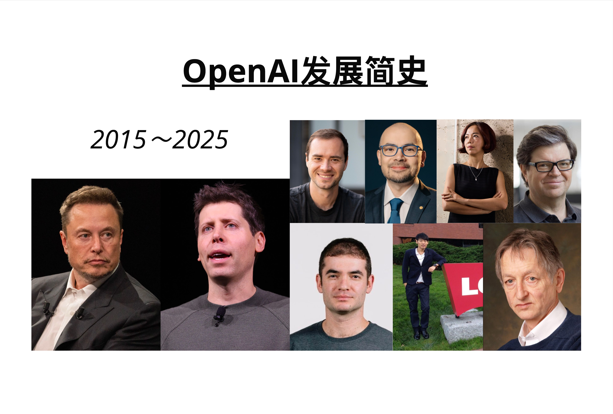
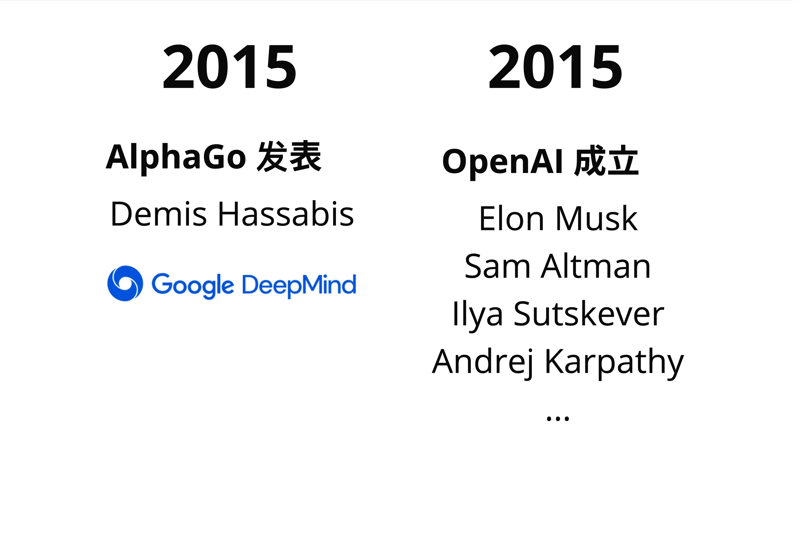
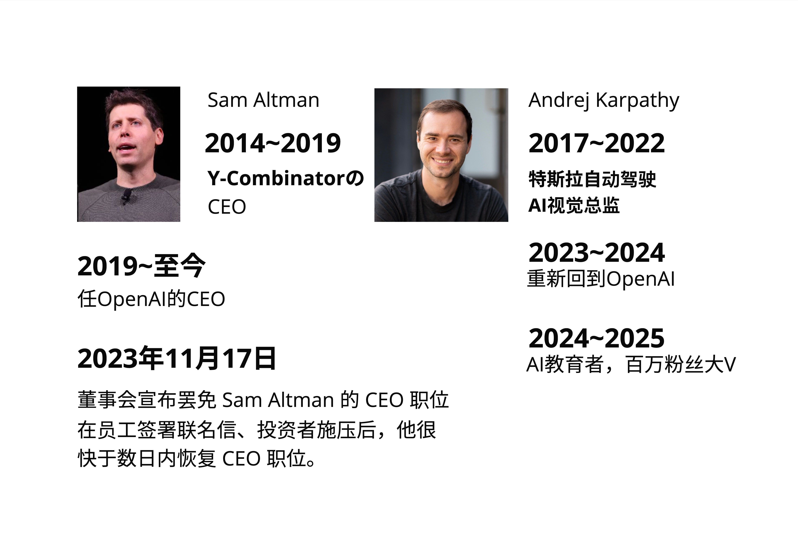
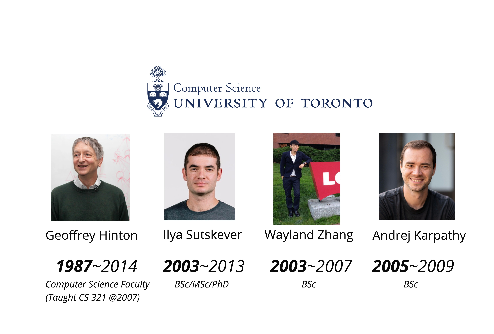
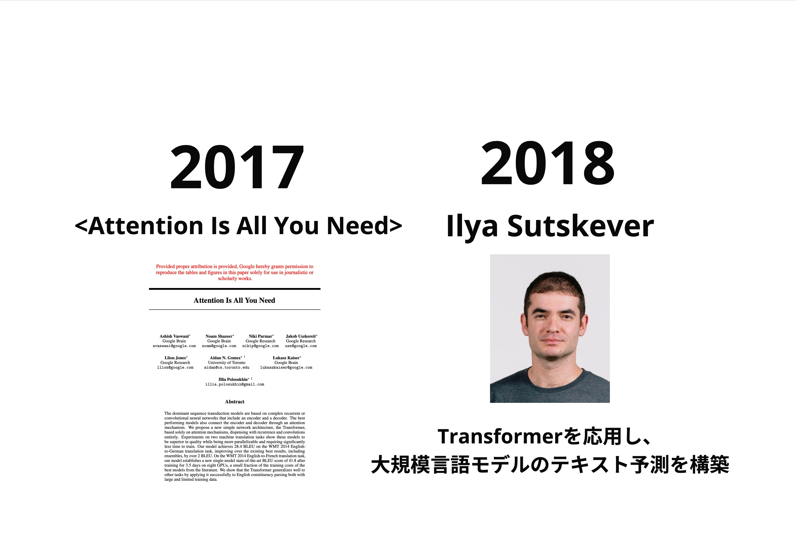
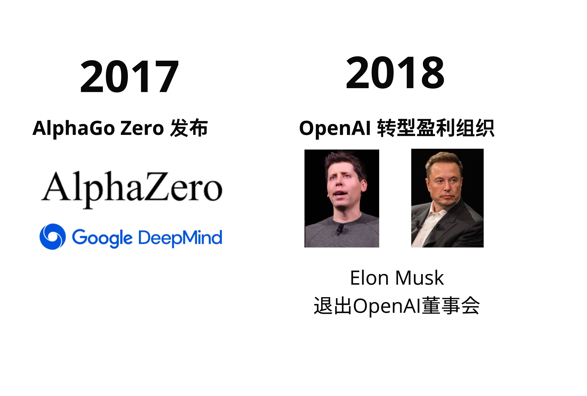
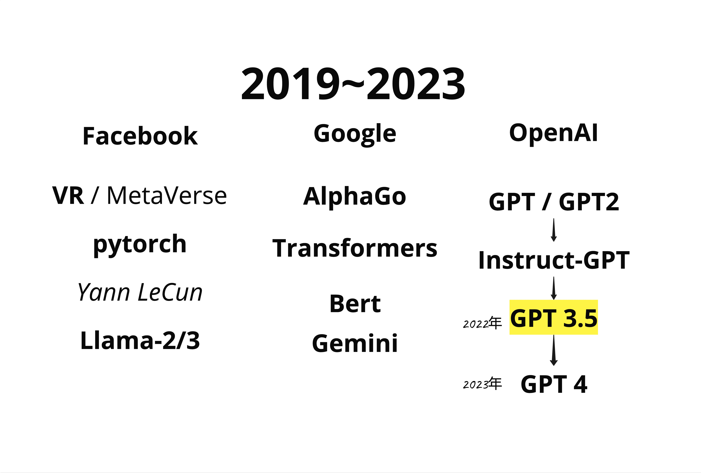
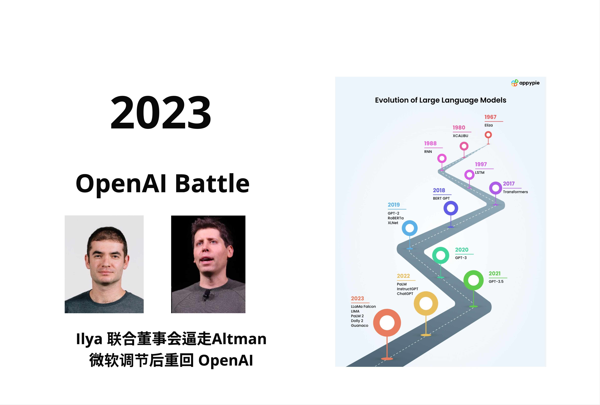
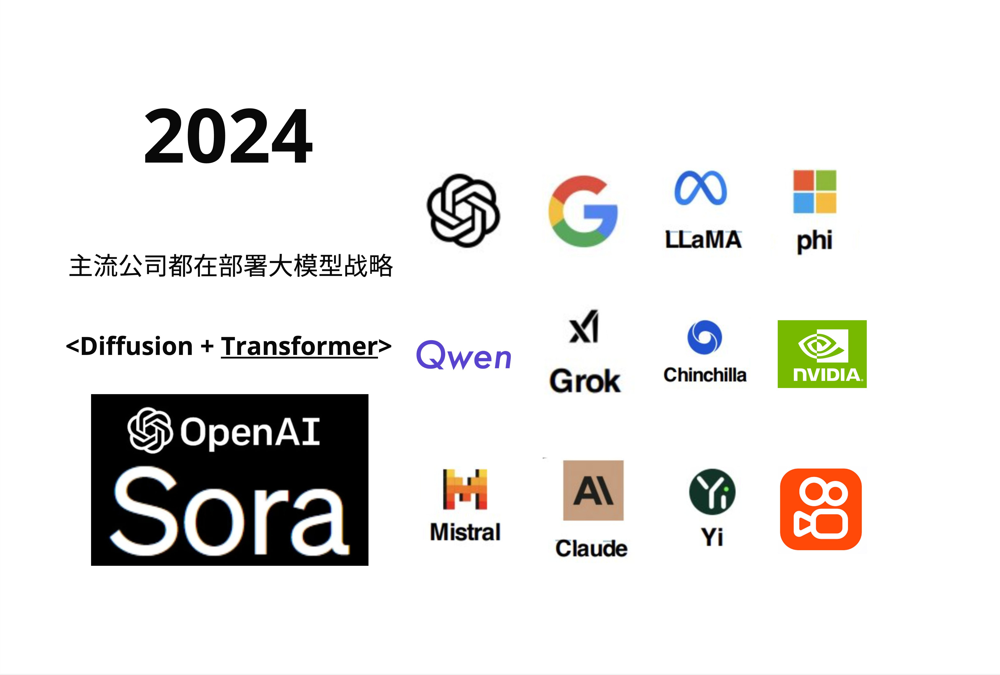
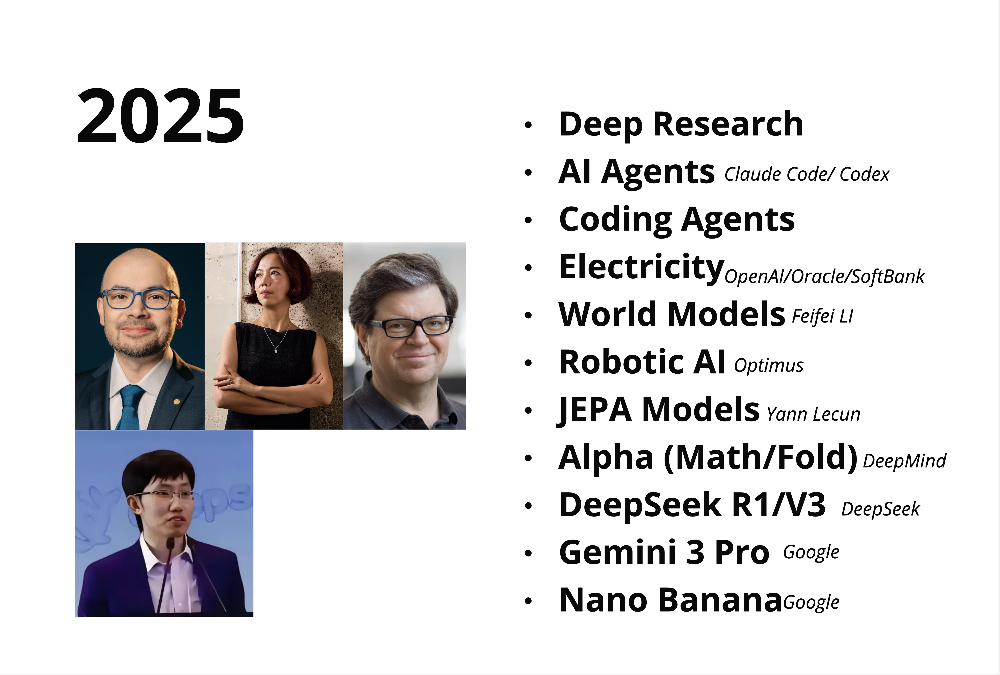

# 第 1 章：GPT 是什么 - LLM 发展简史与核心思想

> **一句话总结**：GPT 不是凭空出现的，它是十年 AI 发展的结晶——理解这段历史，才能真正理解 Transformer 为什么重要。

---

## 1.1 今天这一章非常轻松

今天这节课非常轻松，也是非常重要的一节概念课。

我们不讲任何数学，不写任何代码。我们来聊一聊：**GPT 到底是怎么来的？**

很多人第一次接触 ChatGPT 的时候，觉得这东西太神奇了，像是突然从天上掉下来的。但实际上，GPT 背后的技术——Transformer 架构——已经酝酿了将近十年。

了解这段历史有什么用？

1. **建立直觉**：知道为什么 Transformer 会取代 RNN、LSTM
2. **理解人物关系**：OpenAI、Google、Meta 这些公司之间的恩怨情仇
3. **看懂趋势**：2025 年的 AI Agent、World Model 是怎么演进过来的

我们先过一下这十年的关键节点，然后再深入每个阶段。

---

## 1.2 2015年：一切的起点

2015 年发生了两件大事，直接奠定了今天 AI 的格局。

### 1.2.1 AlphaGo 横空出世

第一件事是 **AlphaGo**。

Google 旗下的 DeepMind（由 Demis Hassabis 创立）做出了 AlphaGo，在围棋上击败了人类顶尖选手。这件事震惊了整个科技界——围棋的复杂度是 10^170，比宇宙中的原子数量还多，人们原本以为 AI 至少还要 10 年才能攻克。

AlphaGo 的成功证明了一件事：**深度学习 + 强化学习的组合威力巨大**。

### 1.2.2 OpenAI 成立

第二件事是 **OpenAI 的成立**。

2015 年底，一群硅谷大佬聚在一起，决定成立一个非营利的 AI 研究机构。创始人包括：

- **Elon Musk**：特斯拉、SpaceX 的老板
- **Sam Altman**：当时是 Y-Combinator 的 CEO
- **Ilya Sutskever**：Geoffrey Hinton 的学生，深度学习的核心人物
- **Andrej Karpathy**：后来成为特斯拉 AI 总监

他们的初衷是：**AI 太重要了，不能让一家公司（比如 Google）垄断。**

> 这个概念是很多人不清晰的：OpenAI 最初是非营利组织，目标是"确保 AI 造福全人类"。后来的商业化转型，引发了很多争议。

---

## 1.3 关键人物：他们为什么这么厉害？

在继续讲历史之前，我们来认识几个关键人物。这个是很多人忽略的——理解这些人的背景，能帮助我们理解很多技术决策。

### 1.3.1 Sam Altman

Sam Altman 在 2014-2019 年担任 Y-Combinator 的 CEO。Y-Combinator 是硅谷最著名的创业孵化器，孵化过 Airbnb、Dropbox、Stripe 这些独角兽。

Sam 不是技术出身，但他有一个超能力：**识人用人**。他知道该把什么样的人放在什么位置上。

### 1.3.2 Andrej Karpathy

Andrej Karpathy 在 2017-2022 年担任特斯拉的 AI 视觉总监，负责自动驾驶的视觉系统。

他有一个特点：**特别会讲课**。他在斯坦福开的深度学习课程（CS231n）是全球最受欢迎的 AI 课程之一。2023-2024 年他短暂回到 OpenAI，现在又出来创业了。

### 1.3.3 多伦多大学的传承

这张图很有意思。多伦多大学计算机系是深度学习的圣地：

- **Geoffrey Hinton**：深度学习之父，2024 年诺贝尔物理学奖得主
- **Ilya Sutskever**：Hinton 的博士生（2007-2013），OpenAI 联合创始人
- Wayland Zhang：作者本尊😁，与 Ilya 同期，计算机科学专业，没继续深造就回国创业了
- **Andrej Karpathy**：U of T 本科生（2005-2009），后在 Stanford 读博

包括我第一次学的时候也不明白，为什么 AI 圈子这么小？其实就是因为这几个关键的师承关系。Hinton 培养出来的学生，分散到了 Google、OpenAI、特斯拉，然后各自开枝散叶。

---

## 1.4 2017-2018年：Transformer 诞生

这是整本书最重要的时间节点。

### 1.4.1 那篇改变一切的论文

2017 年，Google 的研究团队发表了一篇论文：**"Attention Is All You Need"**。

这篇论文提出了 **Transformer** 架构。它的核心思想是：

> **不需要 RNN，不需要 CNN，只用 Attention 机制就够了。**

当时很多人不以为然——RNN 和 LSTM 已经统治了 NLP 领域好几年，凭什么一个新架构就能取代它们？

但事实证明，Transformer 不仅能取代，而且效果好得多。原因我们后面的章节会详细讲，这里先记住结论：

- **并行计算**：Transformer 可以并行处理整个序列，RNN 只能一个一个处理
- **长距离依赖**：Transformer 天然擅长捕捉长距离的关系

### 1.4.2 Ilya Sutskever 的关键洞察

2018 年，OpenAI 的 Ilya Sutskever 做了一个关键决定：**用 Transformer 来做语言模型**。

这听起来很简单，但当时并不是显而易见的选择。Transformer 最初是为机器翻译设计的，用它来做"预测下一个词"的语言模型，需要一些改造。

Ilya 的团队做出了 GPT-1（Generative Pre-trained Transformer），证明了这条路是可行的。

> GPT 的全称是 **Generative Pre-trained Transformer**：
> - **Generative**：生成式，能生成新内容
> - **Pre-trained**：预训练，先在大量数据上训练
> - **Transformer**：用的是 Transformer 架构

---

## 1.5 2017-2018年：OpenAI 的转型

同一时期，OpenAI 内部发生了巨大的变化。

### 1.5.1 从非营利到营利

2018 年，OpenAI 宣布转型为"有限营利"公司。原因很简单：**训练大模型太烧钱了**。

非营利组织很难筹集到足够的资金来购买 GPU、支付电费、招聘顶尖人才。Sam Altman 推动了这次转型，引入了商业投资。

### 1.5.2 Elon Musk 离开

也是在 2018 年，Elon Musk 退出了 OpenAI 的董事会。

官方说法是"避免与特斯拉的利益冲突"（特斯拉也在做 AI）。但很多人猜测，真正的原因是 Musk 对 OpenAI 的商业化方向不满。

这埋下了后来很多故事的伏笔。

---

## 1.6 2019-2023年：大模型竞赛

接下来的几年，是大模型疯狂发展的时期。

### 1.6.1 三大阵营

到 2023 年，AI 领域形成了三大阵营：

| 公司 | 代表产品 | 特点 |
|------|---------|------|
| **OpenAI** | GPT-2 → GPT-3 → GPT-3.5 → GPT-4 | 闭源，商业化最成功 |
| **Google** | BERT, Transformers, Gemini | 发明了 Transformer，但商业化慢 |
| **Meta (Facebook)** | PyTorch, LLaMA | 开源策略，PyTorch 成为主流框架 |

### 1.6.2 GPT 的进化路线

OpenAI 的 GPT 系列经历了这样的进化：

1. **GPT-1 (2018)**：证明 Transformer 可以做语言模型
2. **GPT-2 (2019)**：参数量扩大到 15 亿，效果惊艳到 OpenAI 不敢公开
3. **GPT-3 (2020)**：1750 亿参数，展现了"涌现能力"
4. **InstructGPT (2022)**：加入人类反馈强化学习（RLHF）
5. **GPT-3.5 / ChatGPT (2022.11)**：面向大众的对话产品，引爆全球
6. **GPT-4 (2023)**：多模态，能理解图片

> 2022 年 11 月 ChatGPT 发布，是 AI 历史上的分水岭。它让普通人第一次感受到"AI 真的能聊天"。

---

## 1.7 2023年：OpenAI 的宫斗大戏

2023 年 11 月，发生了一件震惊科技圈的事。

### 1.7.1 Sam Altman 被解雇

OpenAI 董事会突然宣布解雇 CEO Sam Altman，理由是"他在与董事会的沟通中不够坦诚"。

Ilya Sutskever 是推动这次解雇的关键人物之一。

### 1.7.2 微软介入，Sam 回归

接下来的 5 天像电影一样精彩：

- 微软（OpenAI 最大投资人）宣布邀请 Sam 加入
- OpenAI 超过 90% 的员工签署联名信，要求 Sam 回归
- 董事会妥协，Sam 重新担任 CEO
- Ilya 从董事会出局，后来离开 OpenAI 创办了自己的公司

这场宫斗的深层原因，至今众说纷纭。有人说是关于 AI 安全的理念分歧，有人说是关于商业化速度的争论。

> 这件事告诉我们：**AI 公司的治理结构很重要**。技术再强，如果内部分裂，也会出大问题。

---

## 1.8 2024年：百花齐放

经历了 2023 年的动荡，2024 年 AI 领域进入了百花齐放的阶段。

### 1.8.1 主流玩家

现在的 AI 领域，主要玩家包括：

- **OpenAI**：GPT-4, Sora（视频生成）
- **Google**：Gemini
- **Meta**：LLaMA 系列（开源）
- **Microsoft**：phi 系列（小模型）
- **Anthropic**：Claude
- **Mistral**：欧洲的开源力量
- **中国厂商**：Qwen（阿里）、Yi（零一万物）

### 1.8.2 Diffusion + Transformer

2024 年的一个重要趋势是 **Diffusion + Transformer** 的结合。

OpenAI 的 Sora 就是这个思路：用 Transformer 来理解视频的语义，用 Diffusion 来生成高质量的画面。这代表了 AI 从"文字"走向"多模态"的方向。

---

## 1.9 2025年：我们正在这里

2025 年，AI 正在往几个方向演进：

### 1.9.1 AI Agents（智能体）

不只是聊天，而是能**自主完成任务**。比如 Claude Code、OpenAI Codex，可以帮你写代码、改 Bug、提交 PR。

### 1.9.2 Deep Research（深度研究）

AI 能够自主搜索、阅读、总结大量资料，完成复杂的研究任务。

### 1.9.3 World Models（世界模型）

Fei-Fei Li（李飞飞）在推动的方向：让 AI 理解物理世界的规律，不只是语言。

### 1.9.4 Robotic AI（机器人 AI）

Tesla 的 Optimus 人形机器人，结合了视觉 AI 和运动控制。

### 1.9.5 JEPA Models

Yann LeCun（Meta 首席科学家）提出的 Joint Embedding Predictive Architecture，是他认为通往 AGI 的正确路线。

---

## 1.10 本章总结

我们来总结一下这十年的 AI 发展：

### 1.10.1 关键时间线

| 年份 | 事件 | 意义 |
|------|------|------|
| 2015 | AlphaGo + OpenAI 成立 | AI 复兴的起点 |
| 2017 | "Attention Is All You Need" | Transformer 诞生 |
| 2018 | GPT-1 + OpenAI 转型 | 语言模型新范式 |
| 2020 | GPT-3 | 大模型涌现能力 |
| 2022 | ChatGPT | AI 走进大众视野 |
| 2023 | GPT-4 + OpenAI 宫斗 | 多模态 + 治理问题 |
| 2024 | Sora + 百花齐放 | 多模态 + 开源崛起 |
| 2025 | Agents + World Models | 从聊天到自主行动 |

### 1.10.2 两个核心观点

所以说这一章的内容，核心就两点：

1. **Transformer 是核心**：不管是 GPT、BERT、LLaMA、Gemini，底层都是 Transformer 架构。理解了 Transformer，就理解了当代 AI 的基础。

2. **规模是关键**：从 GPT-1 到 GPT-4，参数量从 1 亿涨到了上万亿。"大力出奇迹"虽然简单粗暴，但确实有效。

---

## 本章交付物

学完这一章，你应该能够：

- [ ] 向朋友解释 GPT 是怎么来的（用 3 分钟讲清楚）
- [ ] 说出 OpenAI、Google、Meta 在 AI 领域的定位差异
- [ ] 理解为什么 Transformer 这么重要

---

## 下一章预告

下一章我们来聊一个很有意思的话题：**大模型的本质是什么？**

Andrej Karpathy 说过一句很经典的话："大模型就是两个文件"。这句话是什么意思？我们下一章来详细拆解。

好了，这一章就到这里，拜拜！
