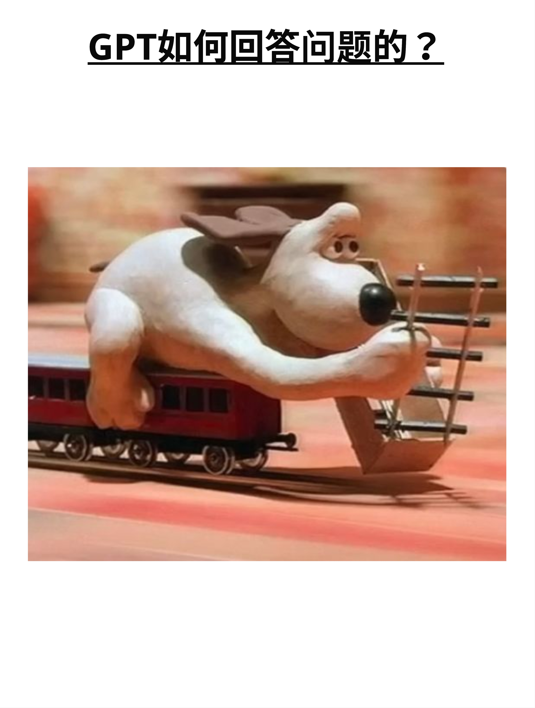
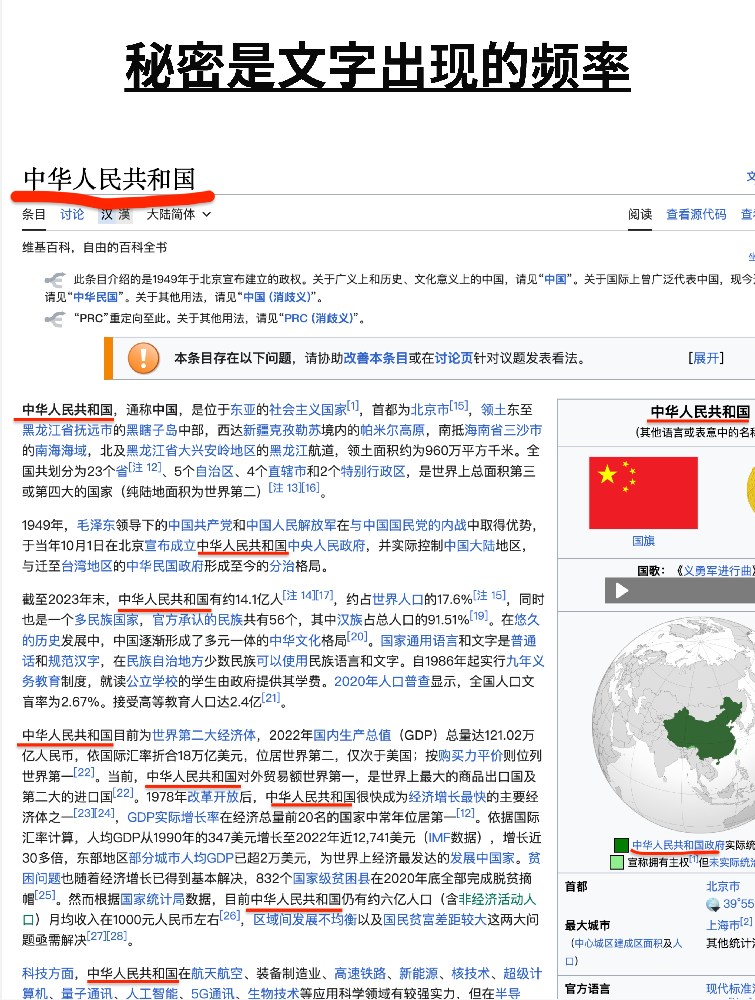
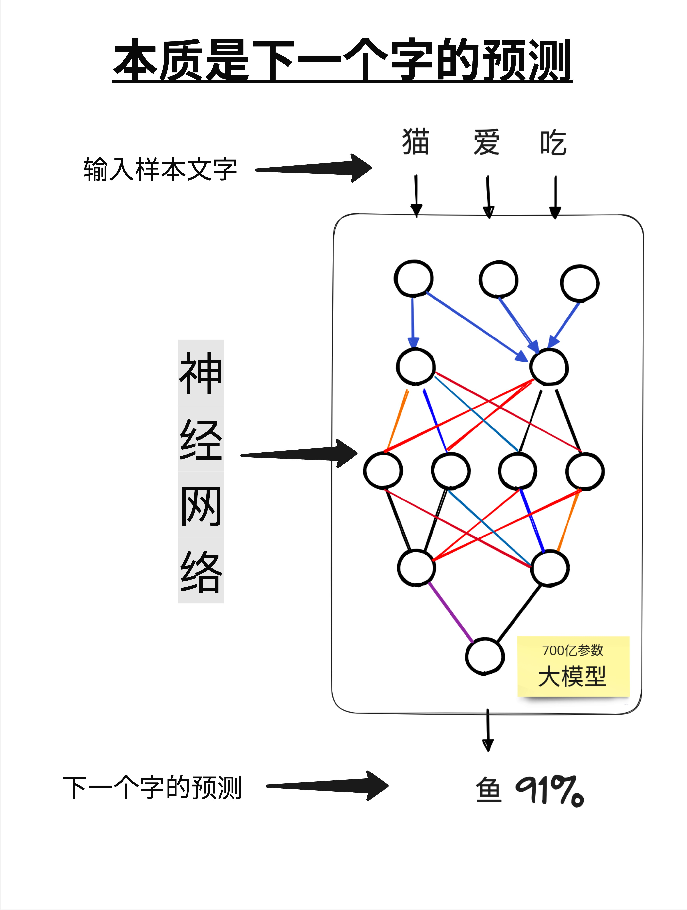
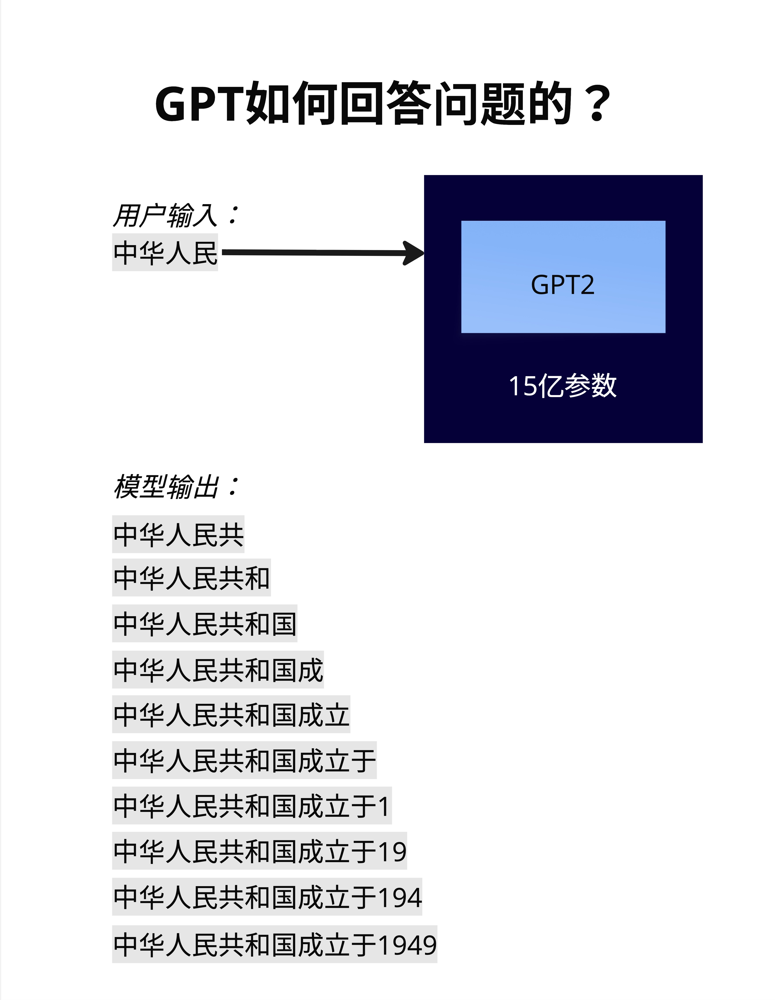
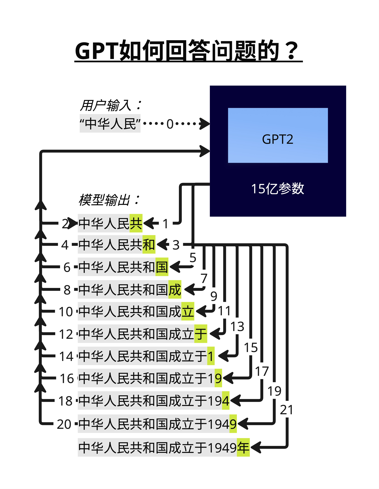
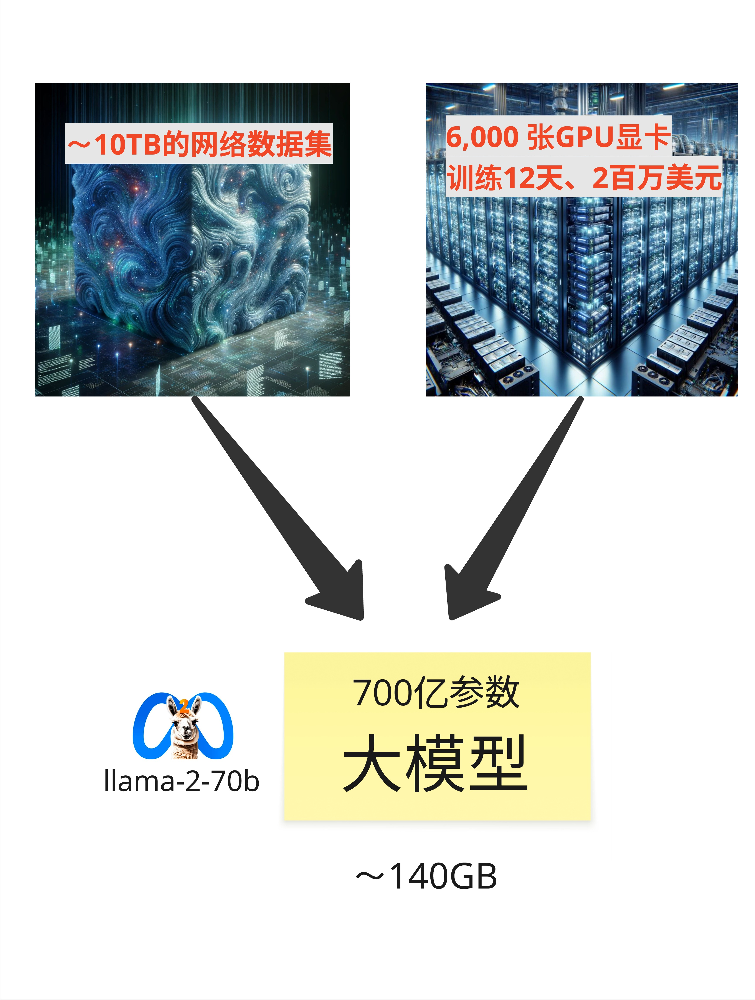
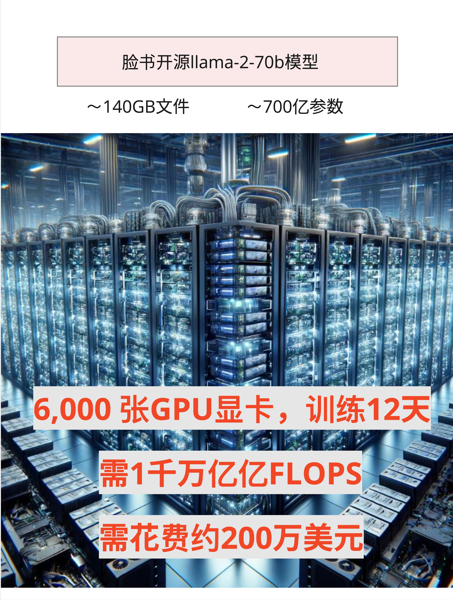
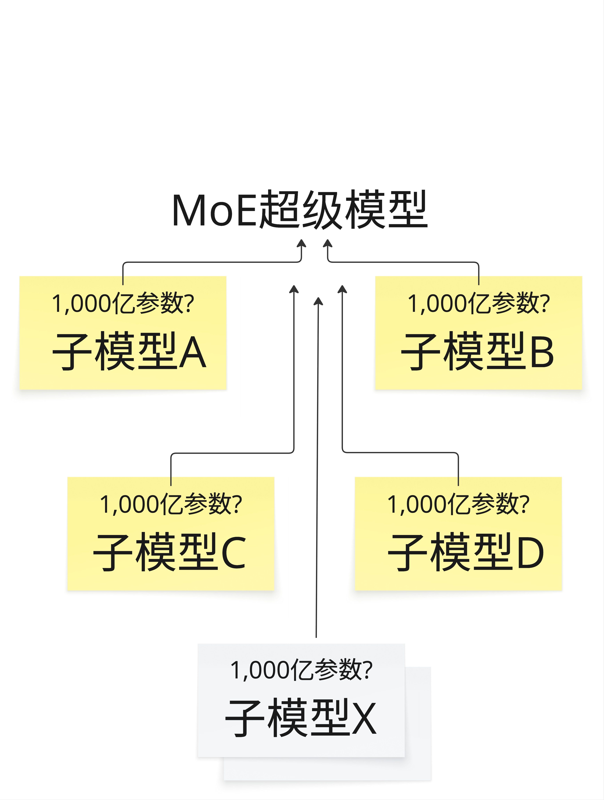
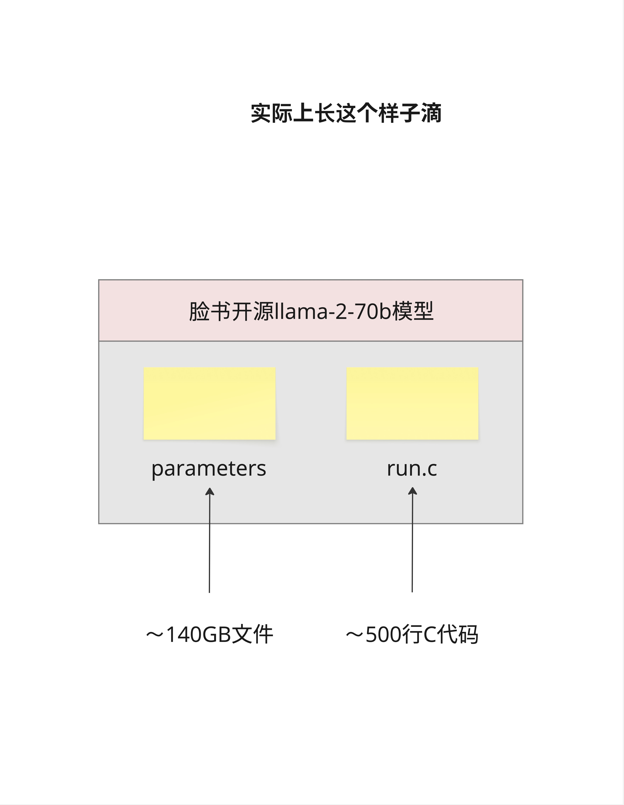

# 第 2 章：大模型的本质 - 就是两个文件

> **一句话总结**：不管模型有多大、训练花了多少钱，最终大模型就是两个文件——一个存参数，一个跑推理。理解这一点，你就抓住了 LLM 的本质。

---

## 2.1 GPT 是怎么回答问题的？

上一章我们聊了 GPT 的发展历史，这一章我们来回答一个更本质的问题：

**GPT 到底是怎么一个字一个字生成回答的？**

### 2.1.1 史努比铺铁轨

我特别喜欢用一个类比来解释这件事：**史努比铺铁轨**。

还记得那个经典的动画场景吗？史努比坐在一辆行驶中的火车上，火车前面没有铁轨。史努比要做的事情是：**一边开火车，一边在火车前面铺铁轨**。

铺一节，开一节。铺一节，开一节。

GPT 生成文字的方式，跟这个几乎一模一样：

- 火车 = GPT 模型
- 铁轨 = 生成的文字
- 铺铁轨的动作 = 预测下一个字

GPT 不是一次性把整个答案想好再输出，而是**一个字一个字地往外"蹦"**。每生成一个字，它都要重新思考：基于目前已经生成的所有内容，下一个字应该是什么？

这就是为什么你在用 ChatGPT 的时候，能看到它的回答是一个字一个字出现的，而不是一整段话突然蹦出来。

### 2.1.2 为什么是"预测下一个字"？

你可能会问：为什么要这么麻烦？为什么不能直接输出完整的句子？

原因很简单：**语言太复杂了**。

一个问题可能有无数种合理的回答。如果让模型一次性输出完整答案，它需要同时考虑所有可能的组合——这个计算量是天文数字。

但如果我们把问题简化成"给定前面的内容，下一个字是什么"，问题就变得可控了。每一步只需要从几万个候选字里选一个最合适的。

> 这种"一步一步来"的生成方式，有个专业术语叫 **Autoregressive（自回归）**。"Auto"是自己的意思，"regressive"是回归、返回的意思——模型不断地把自己刚生成的内容作为输入，来预测下一个输出。

---

## 2.2 秘密藏在文字频率里

好，现在我们知道 GPT 是一个字一个字预测的。但它怎么知道下一个字应该是什么呢？

### 2.2.1 一个有趣的实验

让我们做一个思想实验。

假设你看到这样一段开头："中华人民共..."

你觉得下一个字是什么？

大多数人会说"和"。因为"中华人民共和国"是一个非常常见的词组。

再往下，"中华人民共和..."，下一个字是什么？"国"。

这不是魔法，这是**统计规律**。

如果你统计整个中文互联网上所有的文字，你会发现：

- 在"中华人民共"后面，"和"出现的概率最高
- 在"中华人民共和"后面，"国"出现的概率最高
- 在"中华人民共和国"后面，"成"或"是"出现的概率很高

GPT 本质上就是在做这件事：**基于大量文本数据，学习"在什么上下文之后，什么字出现的概率最高"**。

### 2.2.2 从统计到神经网络

当然，GPT 不是简单地做词频统计。如果只是统计词频，你需要存储所有可能的上下文组合——这是不可能的。

GPT 的聪明之处在于：它用一个**神经网络**来"压缩"这些统计规律。

看这张图：

- **输入**：一段文字，比如"猫爱吃"
- **神经网络**：一个有 700 亿参数的超大网络
- **输出**：下一个字的概率分布

模型会告诉你："鱼"的概率是 91%，"肉"的概率是 5%，"草"的概率是 0.1%...

然后我们选概率最高的那个字作为输出。

> 这里的"参数"是什么？你可以把它理解成神经网络的"记忆"。700 亿个参数就是 700 亿个数字，这些数字编码了模型从训练数据中学到的所有语言规律。

---

## 2.3 自回归生成：一步一步来

现在让我们看一个完整的例子，理解 GPT 是怎么一步一步生成答案的。

### 2.3.1 简单版流程

假设用户输入："中华人民"

GPT 的工作流程是这样的：

1. 输入"中华人民" → 输出"共"
2. 输入"中华人民共" → 输出"和"
3. 输入"中华人民共和" → 输出"国"
4. 输入"中华人民共和国" → 输出"成"
5. 输入"中华人民共和国成" → 输出"立"
6. ...一直到输出完整的句子

每一步，模型都把**之前所有的内容**（用户输入 + 已生成的内容）作为输入，来预测下一个字。

### 2.3.2 详细版流程

这张图展示了更详细的流程。注意那些编号的箭头：

- 第 0 步：用户输入"中华人民"
- 第 1 步：模型输出"共"，追加到序列末尾
- 第 2 步：把"中华人民共"作为新输入，输出"和"
- 第 3 步：把"中华人民共和"作为新输入，输出"国"
- ...

这个过程会一直持续，直到：
1. 模型输出一个特殊的"结束符号"
2. 或者达到最大长度限制

最终，"中华人民"变成了"中华人民共和国成立于1949年"。

### 2.3.3 为什么这么慢？

看到这里，你可能理解了为什么 GPT 的回答有时候会比较慢——因为它**真的是一个字一个字生成的**。

生成 100 个字的回答，模型需要运行 100 次前向传播。每次传播都要处理之前所有的内容，所以越到后面，计算量越大。

> 这也是为什么后面我们会讲 **KV Cache** 这个优化技术——它的作用就是避免重复计算之前已经处理过的内容。

---

## 2.4 训练大模型需要什么？

了解了 GPT 的工作原理，你可能会好奇：训练这样一个模型需要什么？

答案是：**海量数据 + 海量算力 + 海量资金**。

### 2.4.1 数据规模

以 Meta 的 LLaMA-2-70B 为例：

- **训练数据**：约 10TB 的网络文本数据
- **数据来源**：互联网网页、书籍、论文、代码...

10TB 是什么概念？大约相当于 5000 亿个中文字，或者 2 万亿个英文单词。

这些数据经过清洗、去重、过滤，才能用于训练。数据质量直接决定了模型的质量——garbage in, garbage out。

### 2.4.2 算力需求

LLaMA-2-70B 的训练规模：

- **GPU 数量**：6,000 张 NVIDIA A100
- **训练时间**：12 天
- **总计算量**：约 1 千万亿亿次浮点运算（10^21 FLOPS）

6000 张 A100 是什么概念？每张 A100 的价格大约是 1-2 万美元，光 GPU 的硬件成本就是 6000-12000 万美元。

### 2.4.3 资金成本

综合下来，训练一个 70B 参数的模型：

- **电费**：几十万美元
- **GPU 租用/折旧**：约 200 万美元
- **人力成本**：另算

所以你经常听到的"训练一个大模型要几百万美元"，这是真的。

而且这只是 70B 的模型。GPT-4 据传有上万亿参数，训练成本可能是 1 亿美元级别。

### 2.4.4 MoE：更大的模型

那么问题来了：如果想要更大的模型怎么办？

一种方案是 **MoE（Mixture of Experts，混合专家）** 架构。

基本思路是：不是训练一个超大的模型，而是训练多个"专家"子模型，每个专家负责不同类型的任务。推理时，根据输入内容选择性地激活部分专家。

这样可以在总参数量很大（比如上万亿）的情况下，保持推理时的计算量在可控范围内。

GPT-4 和 Gemini 据传都采用了类似的架构。

---

## 2.5 ChatGPT 长什么样？

聊了这么多技术细节，让我们回到用户视角。

### 2.5.1 用户界面

这是 ChatGPT 的界面。对于普通用户来说，它就是一个聊天框：

- 你输入问题
- 它输出回答
- 支持多轮对话
- 可以理解上下文

看起来很简单，对吧？

### 2.5.2 表面 vs 本质

但现在你知道了，在这个简洁的界面背后：

- 有一个几千亿参数的神经网络
- 它在一个字一个字地生成回答
- 每个字都是基于概率分布选出来的
- 整个模型是用几百万美元、几千张 GPU 训练出来的

理解这个差距，是理解 AI 的第一步。

---

## 2.6 核心观点：大模型就是两个文件

终于来到这一章最重要的部分了。

Andrej Karpathy（前 Tesla AI 总监、OpenAI 研究员）说过一句很有名的话：

> **"大模型实际上就是两个文件。"**

什么意思？

### 2.6.1 两个文件

看这张图，以 LLaMA-2-70B 为例：

**文件一：parameters（参数文件）**
- 大小：约 140GB
- 内容：700 亿个浮点数
- 作用：存储模型学到的所有"知识"

**文件二：run.c（推理代码）**
- 大小：约 500 行 C 代码
- 内容：如何加载参数、如何做推理
- 作用：让参数"动起来"

就这两个东西。

没有神秘的"人工智能引擎"，没有复杂的"思维系统"。大模型本质上就是：

1. 一堆数字（参数）
2. 一段程序（告诉计算机怎么用这些数字）

### 2.6.2 llama2.c 项目

Karpathy 为了证明这一点，专门写了一个项目叫 **llama2.c**。

这个项目用纯 C 语言（不依赖任何深度学习框架）实现了 LLaMA 2 的推理代码。核心代码只有大约 500 行。

这意味着什么？

**如果你有参数文件，你可以用 500 行代码让它"说话"。**

当然，这 500 行代码浓缩了 Transformer 架构的精髓：Attention 机制、位置编码、LayerNorm、前馈网络... 后面的章节我们会逐一拆解。

但从宏观上看，大模型真的就是这么简单：**参数 + 代码**。

### 2.6.3 这个认知为什么重要？

理解"大模型就是两个文件"，可以帮助你：

1. **祛魅**：AI 不是魔法，是数学和工程
2. **理解部署**：部署大模型就是把参数文件加载到 GPU 上，然后运行推理代码
3. **理解量化**：所谓"量化"就是把 140GB 的参数文件压缩成 40GB 甚至更小
4. **理解微调**：所谓"微调"就是在原有参数基础上，修改一小部分参数

后面这些概念我们都会详细讲。但核心思想不变：**都是在操作那两个文件**。

---

## 2.7 本章总结

这一章我们回答了一个核心问题：**大模型的本质是什么？**

### 2.7.1 关键概念回顾

| 概念 | 解释 |
|------|------|
| **自回归生成** | GPT 一个字一个字地生成答案，每次基于之前的内容预测下一个字 |
| **下一个字预测** | 模型的核心任务：给定上下文，预测下一个字的概率分布 |
| **参数** | 神经网络的"记忆"，编码了从训练数据中学到的语言规律 |
| **两个文件** | 大模型 = 参数文件 + 推理代码 |

### 2.7.2 数字记忆

| 指标 | LLaMA-2-70B |
|------|-------------|
| 参数量 | 700 亿 |
| 参数文件大小 | ~140GB |
| 训练数据 | ~10TB |
| 训练 GPU | 6,000 张 A100 |
| 训练时间 | 12 天 |
| 训练成本 | ~200 万美元 |

### 2.7.3 核心认知

> **大模型不是魔法，它就是两个文件：一个存参数，一个跑推理。理解这一点，是理解后续所有内容的基础。**

---

## 本章交付物

学完这一章，你应该能够：

- [ ] 用"史努比铺铁轨"向朋友解释 GPT 是怎么生成回答的
- [ ] 解释什么是"自回归生成"和"下一个字预测"
- [ ] 说出训练一个 70B 模型大概需要多少 GPU、多少钱、多少数据
- [ ] 理解"大模型就是两个文件"的含义

---

## 下一章预告

现在我们知道了大模型的本质。下一章，我们要鸟瞰整个 Transformer 架构：

- 输入是怎么进去的？
- 中间经过了哪些处理？
- 输出是怎么出来的？

我们会用一张图讲清楚 Transformer 的全貌，为后面深入每个组件做准备。

好了，这一章就到这里，拜拜！
