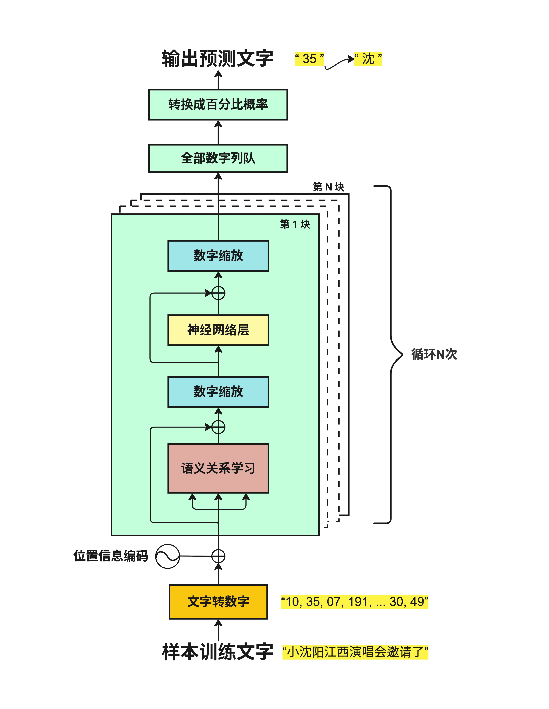
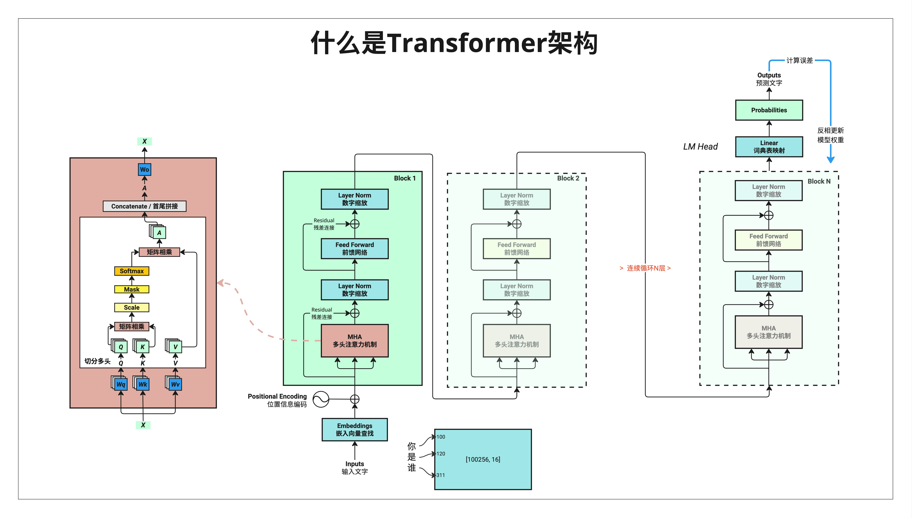

# 第 3 章：Transformer 全景图

> **一句话总结**：在深入细节之前，先鸟瞰整个 Transformer——知道数据从哪进、经过什么、从哪出，后面学每个组件时就不会迷路。

---

## 3.1 为什么需要全景图？

上一章我们知道了大模型的本质：**参数 + 推理代码**。

但那 500 行推理代码里到底写了什么？数据是怎么一步步变成预测结果的？

这一章，我们不深入任何一个组件的细节，而是**站在高处看全貌**。就像看地图一样——先知道北京在哪、上海在哪，再去研究每个城市的街道。

学完这一章，你会对 Transformer 有一个清晰的心理模型：

- 输入是什么？
- 中间经过哪些处理？
- 输出是什么？
- 每个组件大概是干什么的？

有了这个全景图，后面学习每个组件时，你就知道它在整体中的位置和作用。

---

## 3.2 从直觉开始：一张简化图

让我们先看一张最简化的流程图，用中文来理解整个过程。



### 3.2.1 数据流动的六个阶段

从下往上看，数据经过了这些阶段：

**第一步：样本训练文字**

输入就是一段文字，比如"小沈阳江西演唱会邀请了"。

**第二步：文字转数字**

计算机不认识汉字，只认识数字。所以第一件事是把文字转换成数字序列：
```
"小沈阳江西演唱会邀请了" → "10, 35, 07, 191, ... 30, 49"
```

每个字（或词）对应一个数字编号。这个过程叫 **Tokenization（分词/编码）**，我们在第 4 章会详细讲。

**第三步：位置信息编码**

文字的顺序很重要。"我爱你"和"你爱我"意思完全不同。

但是数字序列本身不包含位置信息，所以我们需要额外添加一些数字来表示"这是第 1 个字"、"这是第 2 个字"...

这就是 **Positional Encoding（位置编码）**，第 5 章会详细讲。

**第四步：循环 N 次的核心处理**

这是 Transformer 的核心！数据会经过 N 个相同结构的"块"（Block），每个块包含：

- **语义关系学习**：让每个字"看到"其他字，理解它们之间的关系（这就是著名的 **Attention 机制**）
- **数字缩放**：把数字调整到合适的范围（**Layer Normalization**）
- **神经网络层**：进一步处理信息（**Feed Forward Network**）

这个循环会重复 N 次（N 通常是 12、24、32 甚至更多）。每循环一次，模型对文字的"理解"就深一层。

**第五步：全部数字列队**

经过 N 层处理后，我们得到一堆数字。

**第六步：转换成百分比概率**

最后，把这些数字转换成概率分布——每个可能的下一个字都有一个概率。

比如：
- "沈" → 35%
- "阳" → 25%
- "了" → 15%
- ...

选概率最高的那个，就是模型预测的下一个字。

### 3.2.2 记住这个流程

简化版流程可以概括为：

```
文字 → 数字 → 加位置 → [理解关系 → 缩放 → 神经网络] × N → 概率 → 预测
```

这就是 Transformer 的全部！后面所有的章节，都是在解释这个流程中的某一步。

---

## 3.3 标准架构图：行业通用版本

现在让我们看一张更"正式"的架构图，这是论文和教材里常见的形式。


### 3.3.1 从下往上的数据流

**Inputs（输入）**

用户输入的文字。

**Input Embeddings（输入嵌入）**

把文字转换成向量（一组数字）。每个字用一个几百维的向量来表示。

> 为什么要用向量？因为向量可以表示"意思的相近程度"。比如"国王"和"王后"的向量会比较接近，而"国王"和"苹果"的向量会比较远。

**Positional Encoding（位置编码）**

给每个位置添加独特的位置信息。用一个圆圈加号（⊕）表示"相加"。

**Masked Multi-Head Attention（带掩码的多头注意力）**

这是 Transformer 的核心组件。它让每个位置的字能"看到"前面所有字的信息，从而理解上下文。

- **Masked**：遮住后面的内容，防止"作弊"（预测时不能看到未来的字）
- **Multi-Head**：从多个角度去理解关系
- **Attention**：注意力机制，决定关注哪些内容

**Layer Norm（层归一化）**

把数字调整到稳定的范围，防止数值太大或太小。注意图中有个"⊕"——这是残差连接，我们后面会讲。

**Feed Forward（前馈网络）**

一个简单的神经网络，对每个位置的信息做进一步处理。

**再一个 Layer Norm**

又一次归一化。

**Nx**

上面这一整块（Attention + LayerNorm + FFN + LayerNorm）重复 N 次。

**Linear（线性层）**

把处理后的向量映射到词表大小。如果词表有 5 万个词，这一层的输出就是 5 万维的向量。

**Softmax**

把 5 万维的数字转换成概率分布，所有概率加起来等于 1。

**Output Probability（输出概率）**

最终的预测结果：每个词的概率是多少。

### 3.3.2 关键洞察

看这张图，你会发现几个重要的点：

1. **数据流是线性的**：从下到上，一路向前，没有复杂的分支
2. **重复结构**：核心处理块重复 N 次，结构完全相同
3. **两种主要操作**：Attention（理解关系）+ FFN（处理信息）

---

## 3.4 详细架构图：完整技术版

最后，让我们看一张最详细的架构图，包含所有组件。



### 3.4.1 这张图的信息量很大

别被吓到！这张图虽然复杂，但每个部分我们后面都会详细讲。现在只需要建立一个大概印象。

**左侧红色区域：Attention 的内部结构**

这是 Multi-Head Attention 的详细展开：

- **X**：输入
- **Wq, Wk, Wv**：三个权重矩阵，用来生成 Query、Key、Value
- **Q, K, V**：查询、键、值——Attention 的核心概念
- **切分多头**：把向量切成多份，从多个角度理解
- **矩阵相乘**：Q 和 K 相乘得到注意力分数
- **Scale**：缩放，防止数值太大
- **Mask**：遮罩，防止看到未来的信息
- **Softmax**：转换成概率
- **矩阵相乘**：用注意力分数加权 V
- **Concatenate**：把多个头的结果拼接起来
- **Wo**：输出权重矩阵

这一块是整本书最核心的部分，我们会用好几章来讲清楚。

**中间绿色区域：Block 结构**

一个 Block 包含：
- MHA（Multi-Head Attention，多头注意力机制）
- Layer Norm（数字缩放）
- Feed Forward（前馈网络）
- 残差连接（图中的 ⊕）

这个 Block 会重复 N 次（Block 1, Block 2, ... Block N）。

**右上角蓝色区域：LM Head**

最后的输出层：
- Linear（词典表映射）：把向量映射到词表大小
- Probabilities：输出每个词的概率

**最下方：输入处理**

- Inputs（输入文字）："你是谁"
- Embeddings（嵌入向量查找）
- 每个字对应一个 token ID：[100, 120, 311]
- 词表大小示例：[100256, 16] 表示词表有 100256 个词，每个词用 16 维向量表示

### 3.4.2 不需要现在全懂

这张图的目的不是让你现在就理解每个细节，而是：

1. **建立整体印象**：知道 Transformer 大概长什么样
2. **创建心理锚点**：后面学到某个概念时，知道它在整体中的位置
3. **作为参考**：可以随时回来查看

---

## 3.5 三张图的关系

让我们把三张图的关系理清楚：

| 图 | 详细程度 | 适合场景 |
|---|---------|---------|
| **简化流程图** | ★☆☆ | 建立直觉，向非技术人员解释 |
| **标准架构图** | ★★☆ | 理解整体结构，论文阅读 |
| **详细架构图** | ★★★ | 深入学习，代码实现 |

它们描述的是**同一个东西**，只是详细程度不同。

用一个类比：

- 简化图 = 中国地图（只有省份）
- 标准图 = 省级地图（有城市和主要公路）
- 详细图 = 城市地图（有街道和建筑）

---

## 3.6 组件预览：后续章节地图

为了让你对后续内容有所期待，这里简单预览一下每个组件：

### 3.6.1 Part 2：核心组件

| 章节 | 组件 | 一句话解释 |
|-----|------|-----------|
| 第 4 章 | **Tokenization** | 把文字变成数字编号 |
| 第 5 章 | **Positional Encoding** | 给每个位置加上独特标记 |
| 第 6 章 | **LayerNorm & Softmax** | 数字缩放和概率转换 |
| 第 7 章 | **神经网络层** | 简单的信息处理单元 |

### 3.6.2 Part 3：Attention 机制

| 章节 | 组件 | 一句话解释 |
|-----|------|-----------|
| 第 8 章 | **线性变换** | 理解矩阵乘法的几何意义 |
| 第 9 章 | **Attention 几何逻辑** | 为什么用点积来计算相似度 |
| 第 10 章 | **Q、K、V** | 查询、键、值到底是什么 |
| 第 11 章 | **Multi-Head Attention** | 为什么要多个"头" |
| 第 12 章 | **QKV 输出的本质** | Attention 到底在做什么 |

### 3.6.3 Part 4：完整架构

| 章节 | 组件 | 一句话解释 |
|-----|------|-----------|
| 第 13 章 | **残差连接 & Dropout** | 为什么要"绕路"和"随机丢弃" |
| 第 14 章 | **词嵌入 + 位置信息** | 更深入理解输入表示 |
| 第 15 章 | **完整前向传播** | 把所有组件串起来 |
| 第 16 章 | **训练 vs 推理** | 两个阶段有什么不同 |

---

## 3.7 本章总结

这一章我们鸟瞰了整个 Transformer 架构。

### 3.7.1 核心流程

```
输入文字
    ↓
Tokenization（文字转数字）
    ↓
Embedding（数字转向量）
    ↓
Positional Encoding（加位置信息）
    ↓
┌─────────────────────────────┐
│  Multi-Head Attention       │
│         ↓                   │
│  Layer Norm + 残差          │
│         ↓                   │  × N 次
│  Feed Forward               │
│         ↓                   │
│  Layer Norm + 残差          │
└─────────────────────────────┘
    ↓
Linear（映射到词表）
    ↓
Softmax（转概率）
    ↓
预测下一个字
```

### 3.7.2 记住这些名词

| 英文 | 中文 | 作用 |
|------|------|------|
| Tokenization | 分词/编码 | 文字 → 数字 |
| Embedding | 嵌入 | 数字 → 向量 |
| Positional Encoding | 位置编码 | 添加位置信息 |
| Multi-Head Attention | 多头注意力 | 理解词之间的关系 |
| Layer Norm | 层归一化 | 稳定数值范围 |
| Feed Forward | 前馈网络 | 信息处理 |
| Residual Connection | 残差连接 | 跳跃连接 |
| Softmax | - | 转换为概率 |

### 3.7.3 核心认知

> **Transformer 的结构其实很简单：输入处理 → 重复 N 次核心块 → 输出预测。核心块只有两个主要操作：Attention（理解关系）和 FFN（处理信息）。**

---

## 本章交付物

学完这一章，你应该能够：

- [ ] 画出 Transformer 的简化流程图（6 个步骤）
- [ ] 说出 Transformer 中的主要组件名称
- [ ] 解释数据是如何从输入流动到输出的
- [ ] 知道后续每个章节在整体架构中的位置

---

## 下一章预告

从下一章开始，我们正式进入 Part 2——**核心组件**。

第 4 章我们来聊 **Tokenization**：文字是怎么变成数字的？"我爱你"会被切成几个 token？为什么 GPT 算 token 数而不是字数？

这是理解 Transformer 的第一个具体组件，让我们开始吧！
