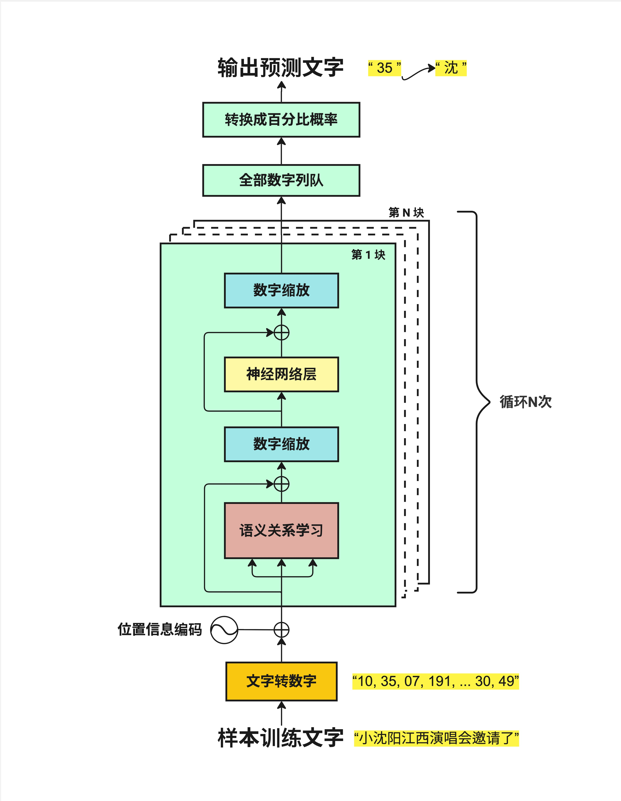
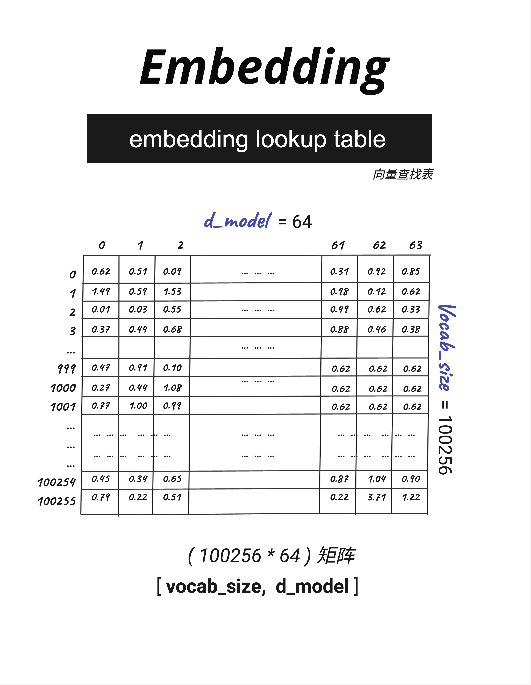
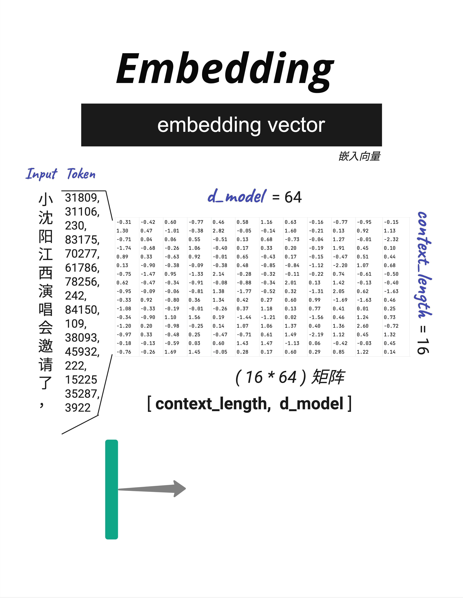

# 第 4 章：Tokenization - 文字如何变成数字

> **一句话总结**：计算机只认识数字，不认识文字。Tokenization 就是把文字转换成数字序列的过程——这是 Transformer 处理语言的第一步。

---

## 4.1 为什么需要 Tokenization？

在第 3 章的全景图中，我们看到 Transformer 的第一步是"文字转数字"。这一章，我们来详细聊聊这个过程。

### 4.1.1 计算机的语言是数字

这是一个非常基础但重要的事实：**计算机不认识汉字，也不认识英文字母**。它只认识 0 和 1。

所以，当我们输入"你好世界"时，计算机看到的不是这四个汉字，而是一串数字。

把文字转换成数字的过程，就叫做 **Tokenization（分词/编码）**。转换后的每个数字单元，叫做 **Token**。

### 4.1.2 在架构中的位置



看这张图，"文字转数字"（黄色框）是整个流程的起点：

```
样本训练文字 → 文字转数字 → 位置信息编码 → 语义关系学习 → ...
```

没有这一步，后面的一切都无从谈起。

---

## 4.2 Tokenization 的两种方法


把文字转成数字，最直观的想法是：**给每个字一个编号**。但实际情况比这复杂一些。

### 4.2.1 方法一：简单字符匹配

最简单的方案是：给每个字符一个固定的编号。

比如输入"小沈阳江西演唱会邀请"：

```
小 → 1
沈 → 2
阳 → 3
江 → 4
西 → 5
演 → 6
唱 → 7
会 → 8
邀 → 9
请 → 10
```

每个字对应一个数字，简单直接。

如果用这种方法，我们需要一个"字典"来存储所有字符和它们的编号。这个字典的大小叫做 **Vocab Size（词表大小）**。

对于中文来说，常用汉字大约 3000-5000 个，加上标点符号、数字、英文字母，vocab_size 可能是 10000 左右。

### 4.2.2 方法一的问题

简单字符匹配有几个问题：

1. **效率不高**：每个字都是一个 token，一篇文章会产生大量 token
2. **无法处理新词**：如果出现字典里没有的字，就无法处理
3. **缺乏语义信息**：把"小沈阳"拆成"小"、"沈"、"阳"三个字，丢失了它是一个人名的信息

### 4.2.3 方法二：BPE / tiktoken（GPT 的方法）

GPT 使用的是一种更聪明的方法，叫做 **BPE（Byte Pair Encoding，字节对编码）**。

OpenAI 的实现叫做 **tiktoken**，它的特点是：

- **子词分割**：不是按字分割，而是按"子词"分割
- **更大的词表**：vocab_size = 100256（GPT-4）
- **更高效**：常见词组用一个 token 表示

看同样的输入"小沈阳江西演唱会邀请"，tiktoken 的处理结果：

```
小   → 31809
沈   → 31106, 230（"沈"被拆成两部分）
阳   → 83175
江   → 70277
西   → 61786
演   → 78256, 242
唱   → 84150, 109
会   → 38093
邀   → 45932, 222
请   → 15225
```

你会发现：
- 有些字（如"小"、"江"）用一个 token 表示
- 有些字（如"沈"、"演"）被拆成了多个 token

这是因为 tiktoken 是基于字节级别的编码，对于不常见的汉字，会拆分成多个字节来表示。

### 4.2.4 Context Length

还有一个重要概念：**Context Length（上下文长度）**。

上图显示 `context_length = 16`，这意味着这个输入被转换成了 16 个 token。

Context Length 决定了模型一次能处理多少个 token：
- GPT-3：4096 tokens
- GPT-4：8192 / 32768 / 128000 tokens
- Claude：200000 tokens

> 这就是为什么 GPT 按 token 计费，而不是按字数计费。同样的文字，中文通常会产生比英文更多的 token。

---

## 4.3 从 Token 到 Embedding

有了 Token ID 之后，下一步是把它转换成向量。这个过程叫做 **Embedding（嵌入）**。

### 4.3.1 Embedding Lookup Table



模型里有一个巨大的"查找表"，叫做 **Embedding Lookup Table（嵌入查找表）**。

这个表的大小是 `[vocab_size, d_model]`：
- **vocab_size**：词表大小（有多少个不同的 token）
- **d_model**：每个 token 用多少维的向量表示

以图中为例：
- vocab_size = 100256（有 100256 个不同的 token）
- d_model = 64（每个 token 用 64 维向量表示）

表中每一行对应一个 token，每一列是向量的一个维度。比如：
- Token 0 的向量是 [0.62, 0.51, 0.09, ..., 0.31, 0.92, 0.85]
- Token 1 的向量是 [1.49, 0.59, 1.53, ..., 0.98, 0.12, 0.62]
- ...

整个表有 100256 × 64 ≈ 640 万个数字。这些数字就是模型的参数，是在训练过程中学习得到的。

### 4.3.2 查找过程



有了查找表，把 Token ID 转换成向量就很简单了：**直接按行号查找**。

以输入"小沈阳江西演唱会邀请了，"为例：

1. 首先 Tokenization：得到 Token ID 序列 [31809, 31106, 230, 83175, 70277, 61786, 78256, 242, 84150, 109, 38093, 45932, 222, 15225, 35287, 3922]

2. 然后查表：每个 Token ID 对应一行向量
   - Token 31809（"小"）→ 查第 31809 行 → [-0.31, -0.42, 0.60, ..., -0.95, -0.15]
   - Token 31106（"沈"的一部分）→ 查第 31106 行 → [1.30, 0.47, -1.01, ..., 0.92, 1.13]
   - ...

3. 最终得到一个矩阵：`[context_length, d_model]` = `[16, 64]`

这个 16×64 的矩阵，就是输入文字的"数字表示"，可以送入后续的神经网络处理了。

### 4.3.3 为什么用向量表示？

你可能会问：为什么要把 Token ID 转换成向量？直接用 ID 不行吗？

向量表示有几个关键优势：

1. **语义相似度**：向量可以表示"意思的接近程度"。"国王"和"王后"的向量会比较接近，而"国王"和"苹果"的向量会比较远。

2. **数学运算**：向量可以做加减乘除。著名的例子：`king - man + woman ≈ queen`

3. **连续空间**：ID 是离散的（1, 2, 3...），向量是连续的，更适合神经网络处理。

> Embedding 向量不是人工设计的，而是模型在训练过程中自己学习的。训练结束后，语义相近的词会自然地聚集在向量空间的相近位置。

---

## 4.4 实际操作：用 tiktoken 试试

如果你想亲自体验 Tokenization，可以用 OpenAI 的 tiktoken 库：

```python
# 代码示例
import tiktoken

# 使用 GPT-4 的编码器
enc = tiktoken.get_encoding("cl100k_base")

# 编码
text = "小沈阳江西演唱会邀请了"
tokens = enc.encode(text)
print(f"Token IDs: {tokens}")
print(f"Token 数量: {len(tokens)}")

# 解码（把 Token ID 转回文字）
decoded = enc.decode(tokens)
print(f"解码结果: {decoded}")

# 查看每个 Token 对应的文字
for token_id in tokens:
    print(f"  {token_id} → '{enc.decode([token_id])}'")
```

运行结果大概是：

```
Token IDs: [31809, 31106, 230, 83175, ...]
Token 数量: 15
解码结果: 小沈阳江西演唱会邀请了
  31809 → '小'
  31106 → '沈'  (可能显示为部分字节)
  ...
```

---

## 4.5 关键数字：参数量计算

Embedding 层是模型参数的重要组成部分。让我们算一下它有多少参数。

### 4.5.1 计算公式

```
Embedding 参数量 = vocab_size × d_model
```

### 4.5.2 实际例子

| 模型          | vocab_size | d_model | Embedding 参数量 |
| ----------- | ---------- | ------- | ------------- |
| GPT-2 Small | 50257      | 768     | 3860 万        |
| GPT-2 Large | 50257      | 1280    | 6433 万        |
| GPT-3       | 50257      | 12288   | 6.18 亿        |
| LLaMA-2-7B  | 32000      | 4096    | 1.31 亿        |

可以看到，Embedding 层的参数量相当可观。对于 GPT-3 来说，光是这个查找表就有 6 亿多个参数！

---

## 4.6 本章总结

这一章我们学习了 Transformer 的第一步：把文字转换成数字。

### 4.6.1 核心概念

| 概念 | 英文 | 解释 |
|------|------|------|
| **Tokenization** | 分词/编码 | 把文字切分成 token 并转换成数字 |
| **Token** | - | 分词后的基本单元 |
| **Vocab Size** | 词表大小 | 字典中有多少个不同的 token |
| **Embedding** | 嵌入 | 把 Token ID 转换成向量 |
| **d_model** | 模型维度 | 每个 token 的向量维度 |
| **Context Length** | 上下文长度 | 一次能处理的最大 token 数 |

### 4.6.2 数据变换过程

```
"小沈阳江西演唱会邀请了"          # 原始文字
        ↓ Tokenization
[31809, 31106, 230, 83175, ...]  # Token ID 序列 [context_length]
        ↓ Embedding Lookup
[[0.62, -0.51, ...],             # Embedding 矩阵 [context_length, d_model]
 [1.30,  0.47, ...],
 ...]
```

### 4.6.3 核心认知

> **Tokenization + Embedding 是 Transformer 理解文字的第一步：先把文字切成 token，再把每个 token 转换成一个高维向量。这个向量包含了词的语义信息，是后续所有计算的基础。**

---

## 本章交付物

学完这一章，你应该能够：

- [ ] 解释为什么需要 Tokenization
- [ ] 说出 BPE/tiktoken 相比简单字符分割的优势
- [ ] 理解 Embedding Lookup Table 的结构和作用
- [ ] 计算 Embedding 层的参数量

---

## 下一章预告

现在我们有了文字的向量表示。但还缺少一个关键信息：**位置**。

"我爱你"和"你爱我"包含完全相同的字，但意思完全不同。如何让模型知道每个字在句子中的位置？

下一章，我们来聊 **Positional Encoding（位置编码）**——给每个位置加上独特的"门牌号"。
