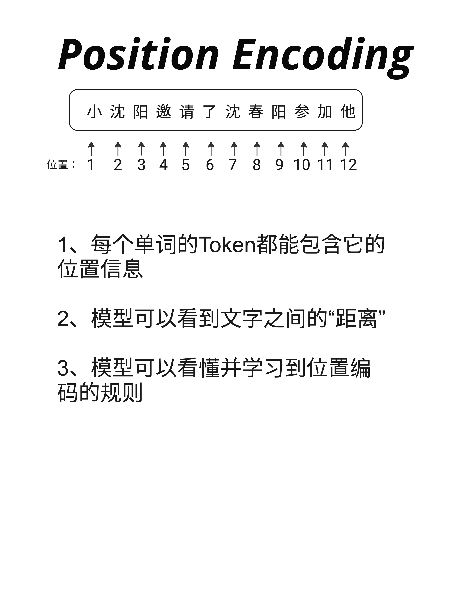
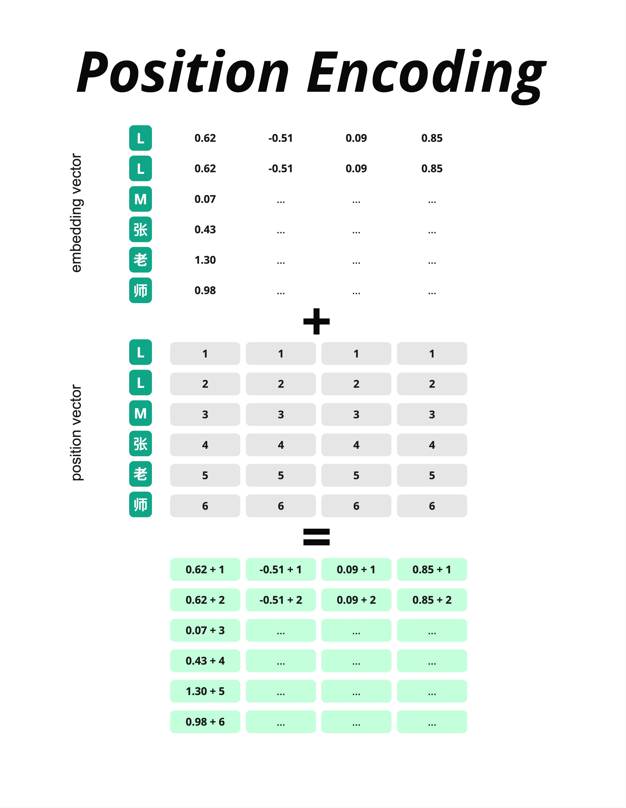
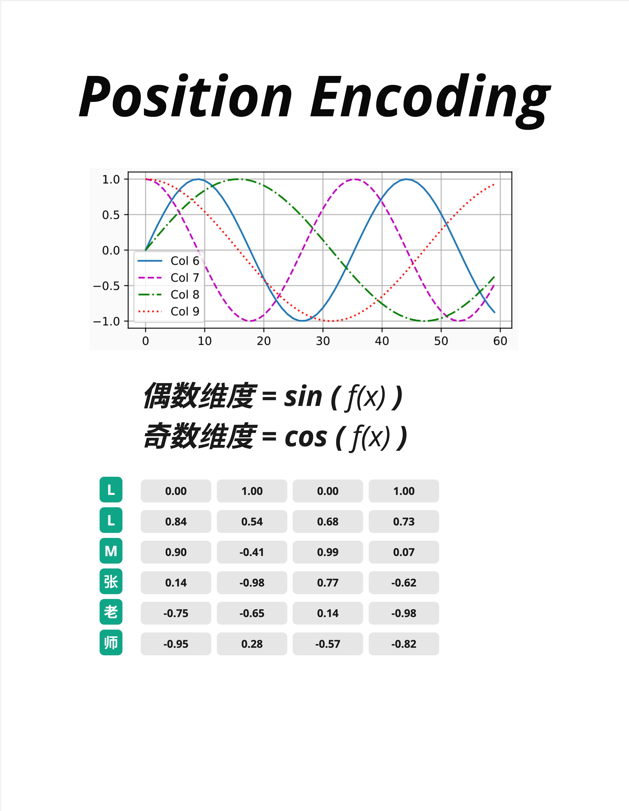
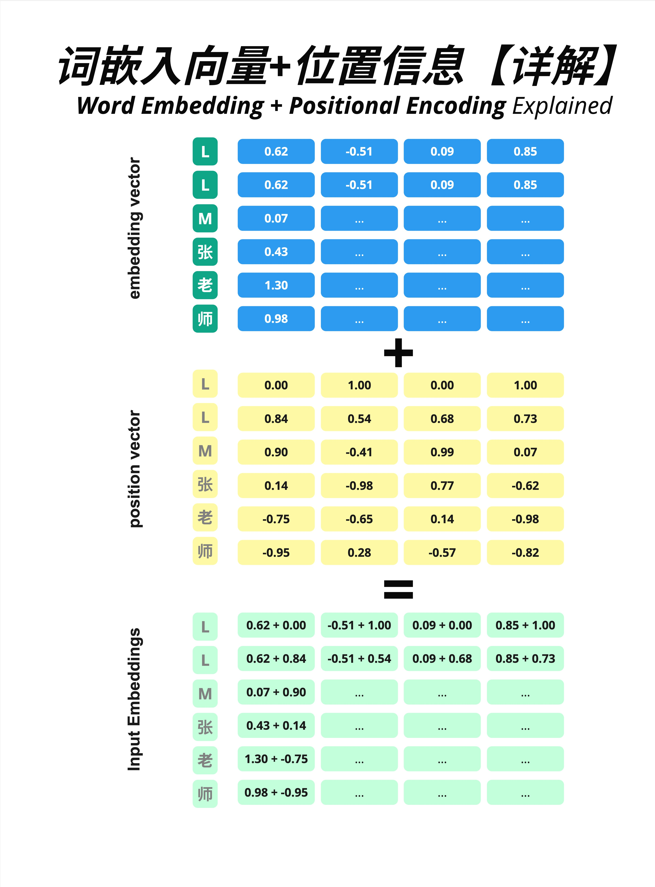
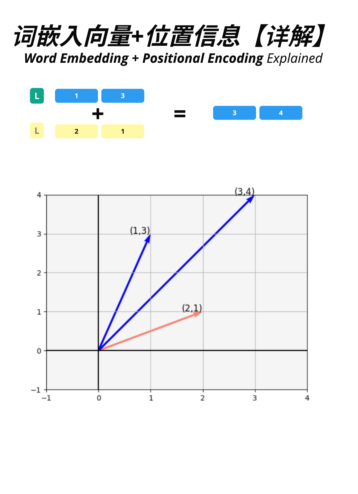
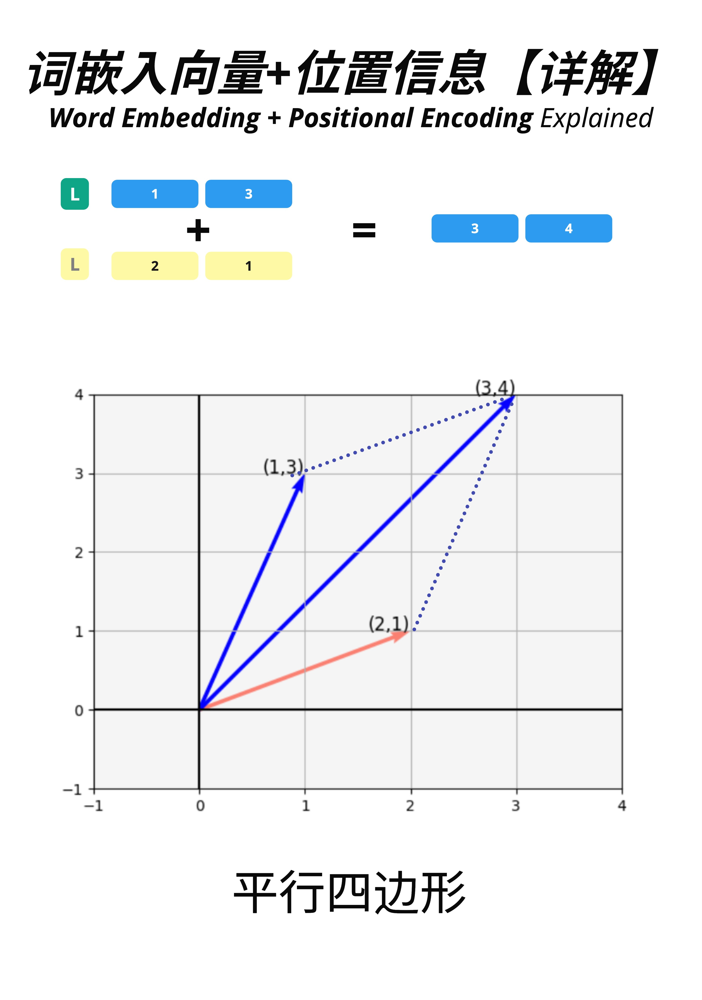
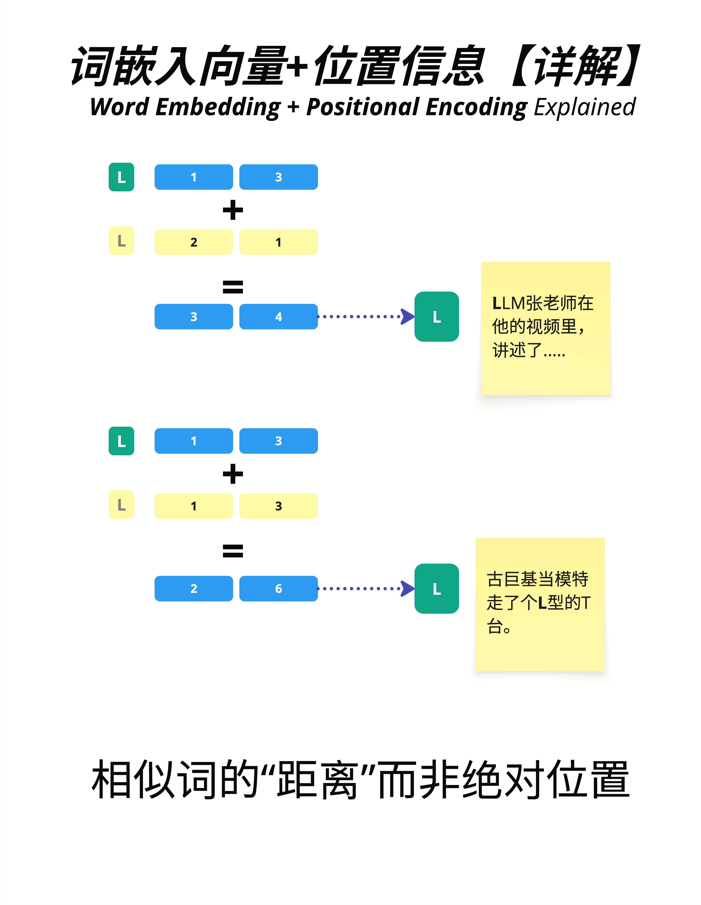
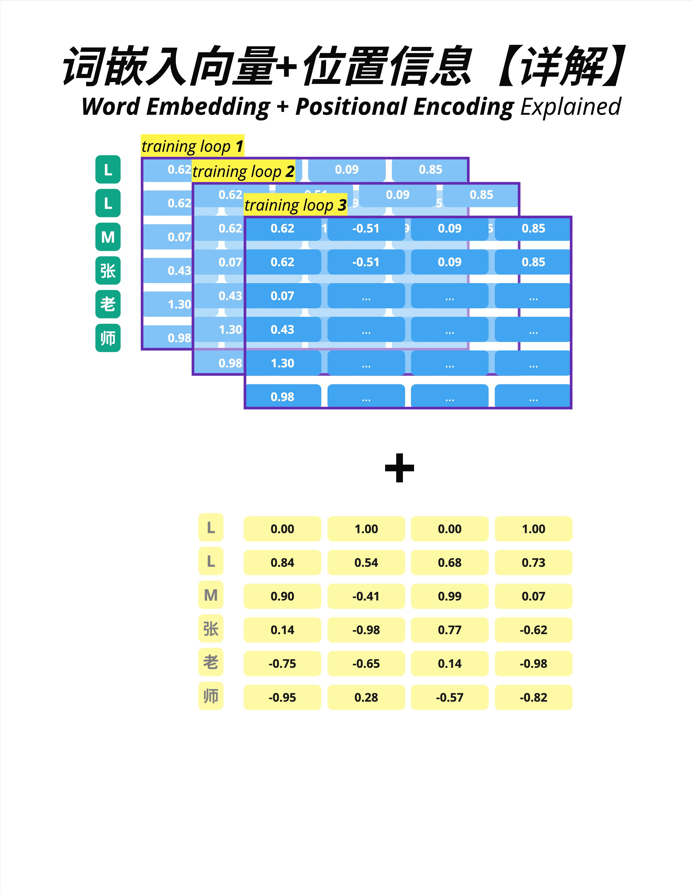
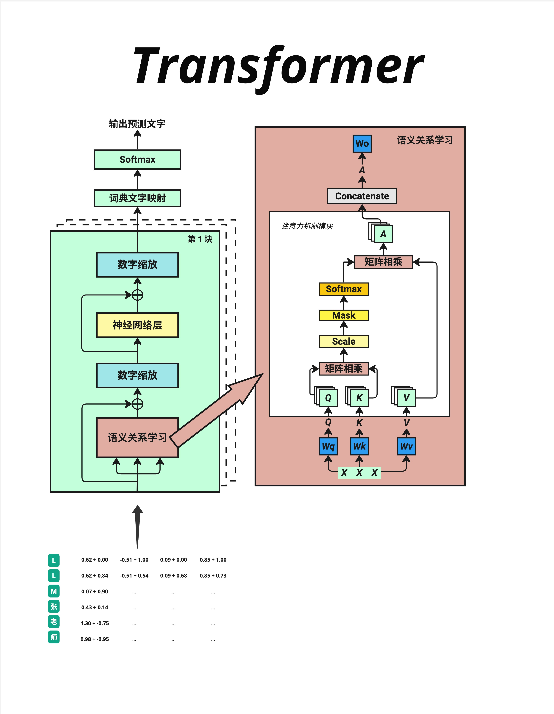

# 第 5 章：Positional Encoding - 给文字加位置

> **一句话总结**：Transformer 天生不知道文字的顺序，Positional Encoding 就是给每个位置加上独特的"门牌号"，让模型能够区分"我爱你"和"你爱我"。

---

## 5.1 为什么需要位置信息？

上一章我们把文字转换成了向量。但这里有一个严重的问题：**相同的字，不管在什么位置，Embedding 向量都是一样的**。

### 5.1.1 一个关键问题

考虑这两个句子：
- "我爱你"
- "你爱我"

如果只看 Embedding，"我"在两个句子中的向量完全相同，"爱"完全相同，"你"也完全相同。

但这两个句子的意思完全不同！

问题出在哪里？**缺少位置信息**。

### 5.1.2 位置信息的三个作用



Positional Encoding 解决了三个问题：

1. **每个 Token 都能包含它的位置信息**
   - 模型知道这是第 1 个字、第 2 个字、还是第 100 个字

2. **模型可以看到文字之间的"距离"**
   - "我"和"爱"相邻，"我"和"你"隔了一个字
   - 这种相对位置关系对理解语义很重要

3. **模型可以学习到位置编码的规则**
   - 通过训练，模型能理解位置编码的模式
   - 从而泛化到更长的序列

---

## 5.2 最简单的方案：直接用整数

在讲 Transformer 的方案之前，让我们先看最直观的方法。

### 5.2.1 整数位置编码



最简单的想法：**直接把位置编号加到向量上**。

假设输入是"LLM张老师"：

**Embedding 向量**（每个字的语义表示）：

| 字 | 维度1 | 维度2 | 维度3 | 维度4 |
|---|------|------|------|------|
| L | 0.62 | -0.51 | 0.09 | 0.85 |
| L | 0.62 | -0.51 | 0.09 | 0.85 |
| M | 0.07 | ... | ... | ... |
| 张 | 0.43 | ... | ... | ... |
| 老 | 1.30 | ... | ... | ... |
| 师 | 0.98 | ... | ... | ... |

**位置向量**（每个位置的编号）：

| 位置 | 维度1 | 维度2 | 维度3 | 维度4 |
|-----|------|------|------|------|
| 1 | 1 | 1 | 1 | 1 |
| 2 | 2 | 2 | 2 | 2 |
| 3 | 3 | 3 | 3 | 3 |
| 4 | 4 | 4 | 4 | 4 |
| 5 | 5 | 5 | 5 | 5 |
| 6 | 6 | 6 | 6 | 6 |

**相加结果**：

| 字 | 维度1 | 维度2 | 维度3 | 维度4 |
|---|------|------|------|------|
| L | 0.62+1 | -0.51+1 | 0.09+1 | 0.85+1 |
| L | 0.62+2 | -0.51+2 | 0.09+2 | 0.85+2 |
| ... | ... | ... | ... | ... |

### 5.2.2 整数方案的问题

这个方案简单直接，但有两个问题：

1. **数值范围不可控**：位置越靠后，加的数字越大。位置 1000 就要加 1000，这会让数值变得很大，影响训练稳定性。

2. **没有规律可学**：1, 2, 3, 4... 是线性增长的，模型很难从中学到有用的模式。

所以 Transformer 用了一个更聪明的方案：**正弦位置编码（Sinusoidal Positional Encoding）**。

---

## 5.3 Transformer 的方案：正弦位置编码

### 5.3.1 核心思想

Transformer 的位置编码使用 **sin 和 cos 函数** 来生成位置向量。



公式是：

```
偶数维度：PE(pos, 2i) = sin(pos / 10000^(2i/d_model))
奇数维度：PE(pos, 2i+1) = cos(pos / 10000^(2i/d_model))
```

别被公式吓到！核心思想很简单：

- **偶数维度用 sin 函数**
- **奇数维度用 cos 函数**
- **不同维度用不同频率的波**

### 5.3.2 波形可视化

看图中的波形：
- Col 6（蓝色实线）：频率最低，波长最长
- Col 7（紫色虚线）：频率稍高
- Col 8（绿色点划线）：频率更高
- Col 9（红色点线）：频率最高，波长最短

每个维度都是一个不同频率的波。把所有维度组合起来，每个位置就有了独特的"指纹"。

### 5.3.3 实际数值

图中下方的表格展示了具体数值：

| 位置 | 维度0 | 维度1 | 维度2 | 维度3 |
|-----|------|------|------|------|
| L (pos=0) | 0.00 | 1.00 | 0.00 | 1.00 |
| L (pos=1) | 0.84 | 0.54 | 0.68 | 0.73 |
| M (pos=2) | 0.90 | -0.41 | 0.99 | 0.07 |
| 张 (pos=3) | 0.14 | -0.98 | 0.77 | -0.62 |
| 老 (pos=4) | -0.75 | -0.65 | 0.14 | -0.98 |
| 师 (pos=5) | -0.95 | 0.28 | -0.57 | -0.82 |

> **注**：位置从 0 开始编号（pos=0, 1, 2...）。pos=0 时 sin(0)=0, cos(0)=1。

注意：
- 所有数值都在 [-1, 1] 范围内（sin/cos 的值域）
- 每个位置的向量都是独特的
- 数值变化有规律可循

### 5.3.4 为什么用 sin/cos？

正弦位置编码有几个优点：

1. **数值稳定**：永远在 [-1, 1] 范围内，不会爆炸

2. **可以外推**：模型在短序列上训练，理论上能泛化到更长序列

3. **相对位置可计算**：sin/cos 有一个数学性质——两个位置的编码可以通过线性变换得到它们的相对位置

> 后来的研究发现，正弦编码的外推能力其实有限。更新的方案如 RoPE、ALiBi 效果更好，我们在第 25 章会详细介绍。

---

## 5.4 Embedding + Position = Input

现在让我们看完整的过程：把 Embedding 向量和位置向量加起来。

### 5.4.1 向量相加



三个矩阵的关系：

**Embedding Vector（蓝色）**：词的语义信息
```
L:  [0.62, -0.51, 0.09, 0.85]
L:  [0.62, -0.51, 0.09, 0.85]  # 注意：两个 L 的 embedding 相同
M:  [0.07, ..., ..., ...]
张: [0.43, ..., ..., ...]
老: [1.30, ..., ..., ...]
师: [0.98, ..., ..., ...]
```

**Position Vector（黄色）**：位置信息
```
位置1: [0.00, 1.00, 0.00, 1.00]
位置2: [0.84, 0.54, 0.68, 0.73]
位置3: [0.90, -0.41, 0.99, 0.07]
位置4: [0.14, -0.98, 0.77, -0.62]
位置5: [-0.75, -0.65, 0.14, -0.98]
位置6: [-0.95, 0.28, -0.57, -0.82]
```

**Input Embeddings（绿色）**：相加结果
```
L(位置1): [0.62+0.00, -0.51+1.00, 0.09+0.00, 0.85+1.00]
L(位置2): [0.62+0.84, -0.51+0.54, 0.09+0.68, 0.85+0.73]
...
```

关键观察：**两个 L 虽然 Embedding 相同，但加上不同的位置编码后，结果不同了！**

这样模型就能区分"第一个 L"和"第二个 L"了。

### 5.4.2 几何直觉



让我们用 2D 简化例子来理解向量相加的几何意义。

假设：
- Embedding 向量 L = [1, 3]（蓝色箭头）
- Position 向量 = [2, 1]（红色箭头）

相加结果：
- Input = [1+2, 3+1] = [3, 4]（合成向量）



从几何上看，这就是**向量加法的平行四边形法则**：
- 两个向量首尾相接
- 结果是从原点到对角的向量

### 5.4.3 相对距离 vs 绝对位置



一个重要的洞察：**在许多任务中，模型更关心的是"相对距离"而不是"绝对位置"**。

> **注意**：这并非绝对——不同的位置编码方案（如学习式 vs RoPE vs ALiBi）对绝对/相对位置的处理方式不同，详见第 25 章。

看图中的例子：
- 同一个字"L"出现在不同位置
- 位置 1 的 L：[1, 3] + [2, 1] = [3, 4]
- 位置 2 的 L：[1, 3] + [1, 3] = [2, 6]（假设不同的位置编码）

虽然同一个词在不同位置的最终向量不同，但它们之间的"距离"是可以计算的。这让模型能够理解：

- "LLM张老师在他的视频里，讲述了..."——这里的"L"在句子开头
- "古巨基当模特走了个L型的T台"——这里的"L"在句子中间

同一个字，不同的位置，不同的上下文含义。

---

## 5.5 训练过程中的位置编码

### 5.5.1 Embedding 是可学习的，Position 是固定的



一个重要的区别：

- **Embedding 向量**：是模型参数，在训练过程中不断更新
- **Position 向量**（正弦版本）：是固定的，不参与训练

图中展示了多轮训练（training loop 1, 2, 3...）：
- Embedding 矩阵（蓝色）每轮都在变化
- Position 矩阵（黄色）始终不变

> 有些模型（如 BERT）使用"可学习的位置编码"，Position 向量也作为参数训练。但原始 Transformer 使用的是固定的正弦编码。

### 5.5.2 在完整架构中的位置



看这张详细的架构图：

1. 输入文字经过 **Embedding**（文字转数字 → 嵌入向量）
2. 加上 **Positional Encoding**（位置信息编码）
3. 得到 **Input Embeddings**，送入 Attention 层

位置编码发生在进入 Transformer Block 之前，是预处理的一部分。

---

## 5.6 深入理解：为什么是"相加"？

你可能会问：为什么是把 Embedding 和 Position **相加**？为什么不是拼接？

### 5.6.1 拼接 vs 相加

**拼接（Concatenation）**：
- 把两个向量接在一起
- [embedding] + [position] → 更长的向量
- 优点：信息完全独立
- 缺点：维度翻倍，计算量增加

**相加（Addition）**：
- 对应维度直接相加
- embedding + position → 相同维度的向量
- 优点：维度不变，计算高效
- 缺点：两种信息混合在一起

### 5.6.2 为什么相加可行？

关键洞察：**高维空间很"宽敞"**。

在 768 维或 4096 维的空间里，Embedding 信息和 Position 信息可以占据不同的"子空间"。相加后虽然混合了，但神经网络有足够的能力把它们分开。

这就像在一个巨大的房间里，放两套家具。虽然在同一个房间，但各自有各自的区域，不会混乱。

---

## 5.7 本章总结

这一章我们学习了 Transformer 如何处理位置信息。

### 5.7.1 核心概念

| 概念 | 解释 |
|------|------|
| **Positional Encoding** | 给每个位置添加独特的向量表示 |
| **正弦位置编码** | 用 sin/cos 函数生成位置向量 |
| **相加操作** | Embedding + Position = Input Embeddings |
| **相对位置** | 模型关心词之间的距离，而不只是绝对位置 |

### 5.7.2 数据变换过程

```
Embedding [seq_len, d_model]    # 词的语义信息
        +
Position  [seq_len, d_model]    # 位置信息（正弦编码）
        =
Input     [seq_len, d_model]    # 完整的输入表示
```

### 5.7.3 核心认知

> **Positional Encoding 解决了 Transformer 的"位置盲"问题。通过把位置向量加到 Embedding 上，模型能够区分同一个词在不同位置的含义，理解"我爱你"和"你爱我"的区别。**

---

## 本章交付物

学完这一章，你应该能够：

- [ ] 解释为什么 Transformer 需要位置编码
- [ ] 理解正弦位置编码的基本原理（sin/cos 函数）
- [ ] 说明 Embedding 和 Position 是如何结合的
- [ ] 区分"可学习位置编码"和"固定正弦编码"

---

## 下一章预告

现在我们的输入已经完整了：**语义信息（Embedding）+ 位置信息（Position）**。

下一章，我们来学习两个重要的数学工具：**LayerNorm（层归一化）** 和 **Softmax**。它们在 Transformer 中无处不在，理解它们是理解整个架构的基础。
