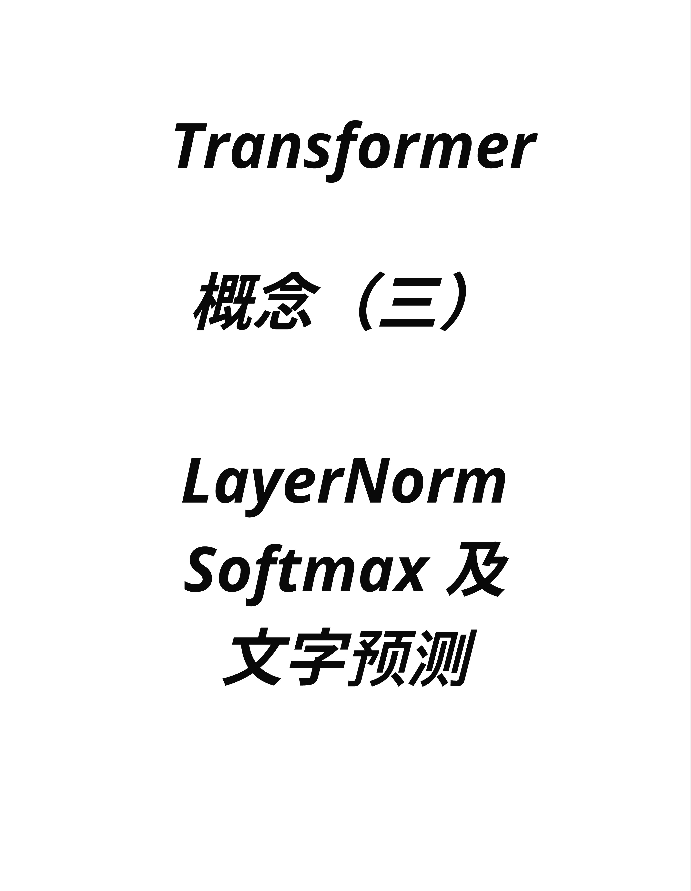
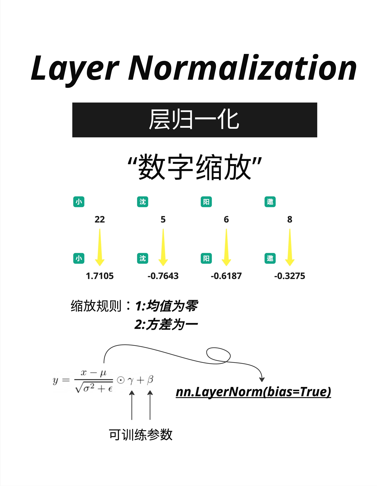
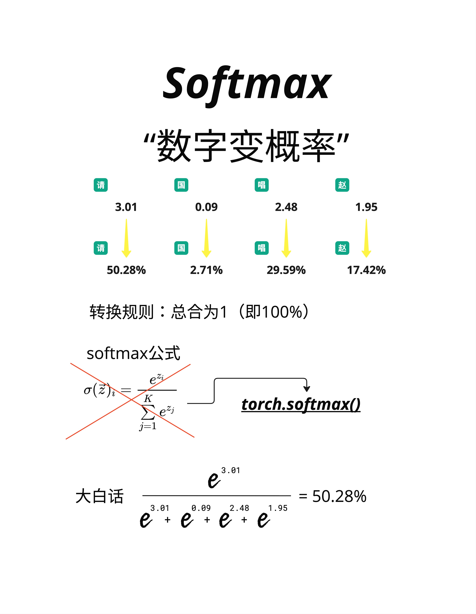
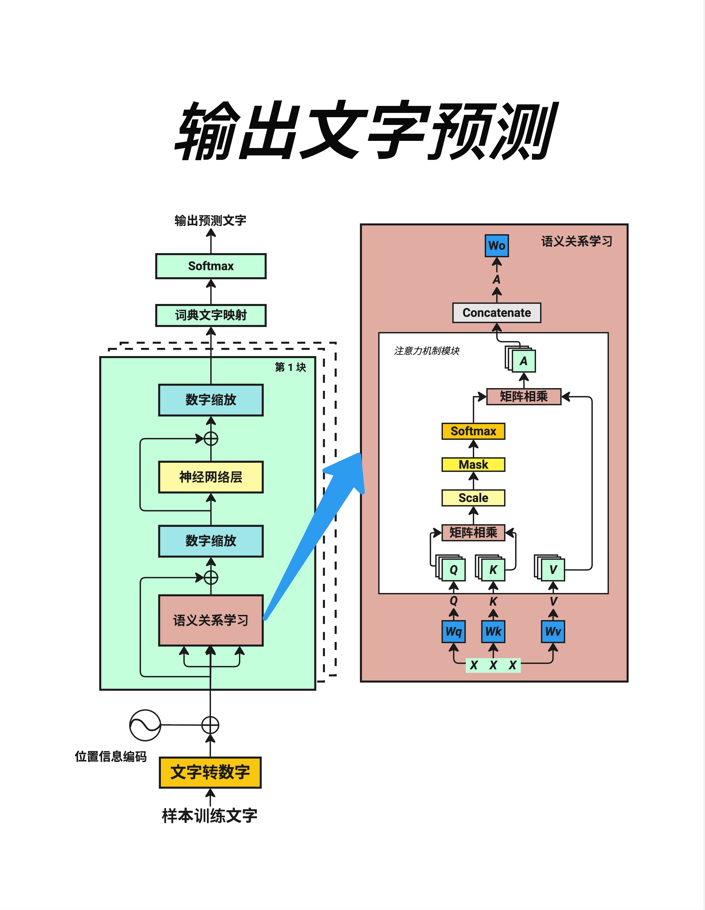

# 第 6 章：LayerNorm 与 Softmax - 数字的缩放与概率化

> **一句话总结**：LayerNorm 让数字保持在合理范围（均值为 0，方差为 1），Softmax 把任意数字变成概率分布（总和为 100%）。这两个工具在 Transformer 中无处不在。

---

## 6.1 为什么需要这两个工具？



在 Transformer 的架构中，有两个数学工具反复出现：

- **LayerNorm**：出现在每个 Block 中，负责"数字缩放"
- **Softmax**：出现在 Attention 计算和最终输出中，负责"数字变概率"

这一章，我们用最直观的方式理解它们的作用。

---

## 6.2 LayerNorm：数字缩放

### 6.2.1 问题：数字会"爆炸"

神经网络的计算过程中，数字会不断变化。经过多层计算后，数字可能变得非常大或非常小：

- 太大：比如 10000、100000，会导致计算溢出
- 太小：比如 0.0001、0.00001，会导致精度丢失

这就像一个人的体重记录：如果用克为单位，数字会很大（70000g）；如果用吨为单位，数字会很小（0.07t）。我们需要一个合适的"标尺"。

### 6.2.2 解决方案：归一化



**Layer Normalization（层归一化）** 的作用就是把数字"缩放"到一个标准范围。

看图中的例子：

**输入**：小=22, 沈=5, 阳=6, 邀=8

这些数字大小不一，范围从 5 到 22。

**输出**：小=1.7105, 沈=-0.7643, 阳=-0.6187, 邀=-0.3275

经过 LayerNorm 后，数字被缩放到一个更紧凑的范围。

### 6.2.3 缩放规则

LayerNorm 遵循两个简单的规则：

1. **均值为零**：所有数字的平均值变成 0
2. **方差为一**：数字的"分散程度"变成 1

用公式表示：

```
y = (x - μ) / √(σ² + ε) × γ + β
```

别被公式吓到，我们拆解一下：

- `x - μ`：每个数字减去平均值（让均值变成 0）
- `/ √(σ² + ε)`：除以标准差（让方差变成 1）
- `× γ + β`：可学习的参数，允许模型调整最终范围

### 6.2.4 手算示例

假设输入是 [22, 5, 6, 8]：

**第一步：计算均值**
```
μ = (22 + 5 + 6 + 8) / 4 = 41 / 4 = 10.25
```

**第二步：计算方差**
```
σ² = ((22-10.25)² + (5-10.25)² + (6-10.25)² + (8-10.25)²) / 4
   = (138.06 + 27.56 + 18.06 + 5.06) / 4
   = 47.19
```

**第三步：标准化**
```
小: (22 - 10.25) / √47.19 = 11.75 / 6.87 ≈ 1.71
沈: (5 - 10.25) / √47.19 = -5.25 / 6.87 ≈ -0.76
阳: (6 - 10.25) / √47.19 = -4.25 / 6.87 ≈ -0.62
邀: (8 - 10.25) / √47.19 = -2.25 / 6.87 ≈ -0.33
```

结果：[1.71, -0.76, -0.62, -0.33]，均值约为 0，方差约为 1。

### 6.2.5 PyTorch 实现

```python
# 代码示例
import torch
import torch.nn as nn

# 创建 LayerNorm 层
layer_norm = nn.LayerNorm(normalized_shape=4, bias=True)

# 输入数据
x = torch.tensor([[22.0, 5.0, 6.0, 8.0]])

# 应用 LayerNorm
y = layer_norm(x)
print(y)  # 输出接近 [1.71, -0.76, -0.62, -0.33]
```

### 6.2.6 为什么叫"Layer"Norm？

因为归一化是在**每一层的输出**上独立进行的。每个 token 的向量单独归一化，不同 token 之间不相互影响。

> 还有一种叫 **Batch Normalization**，是在 batch 维度上归一化。但 Transformer 主要使用 Layer Normalization，因为它更适合处理变长序列。

---

## 6.3 Softmax：数字变概率

### 6.3.1 问题：需要概率分布

在很多场景下，我们需要把一组数字转换成概率：

- **预测下一个词**：词表中每个词的概率是多少？
- **Attention 权重**：每个位置应该分配多少注意力？

概率有两个要求：
1. 每个值都在 0 到 1 之间
2. 所有值加起来等于 1（100%）

### 6.3.2 解决方案：Softmax



**Softmax** 函数可以把任意一组数字转换成概率分布。

看图中的例子：

**输入**（称为 logits）：请=3.01, 国=0.09, 唱=2.48, 赵=1.95

这些数字可正可负，大小不一。

**输出**（概率）：请=50.28%, 国=2.71%, 唱=29.59%, 赵=17.42%

转换后：
- 每个值都在 0-100% 之间
- 所有值加起来 = 50.28 + 2.71 + 29.59 + 17.42 = 100%

### 6.3.3 Softmax 公式

```
softmax(z)ᵢ = e^zᵢ / Σⱼ e^zⱼ
```

用大白话说：
1. 对每个数字取 e 的指数（e ≈ 2.718）
2. 除以所有指数的总和

### 6.3.4 手算示例

输入：[3.01, 0.09, 2.48, 1.95]

**第一步：计算 e 的指数**
```
e^3.01 = 20.29
e^0.09 = 1.09
e^2.48 = 11.94
e^1.95 = 7.03
```

**第二步：计算总和**
```
总和 = 20.29 + 1.09 + 11.94 + 7.03 = 40.35
```

**第三步：计算概率**
```
请: 20.29 / 40.35 = 0.5028 = 50.28%
国: 1.09 / 40.35 = 0.0271 = 2.71%
唱: 11.94 / 40.35 = 0.2959 = 29.59%
赵: 7.03 / 40.35 = 0.1742 = 17.42%
```

### 6.3.5 Softmax 的特点

1. **放大差异**：输入差异越大，输出的概率差距越明显
   - 输入 [3, 0, 2, 1] → 差异会被放大

2. **保持顺序**：最大的输入对应最大的概率
   - 3.01 最大 → 50.28% 最高

3. **平滑输出**：即使输入是负数，输出也是正的概率

### 6.3.6 PyTorch 实现

```python
# 代码示例
import torch
import torch.nn.functional as F

# 输入数据（logits）
logits = torch.tensor([3.01, 0.09, 2.48, 1.95])

# 应用 Softmax
probs = F.softmax(logits, dim=0)
print(probs)  # tensor([0.5028, 0.0271, 0.2959, 0.1742])
print(probs.sum())  # tensor(1.0000)
```

---

## 6.4 在架构中的位置

### 6.4.1 输出文字预测



看这张架构图，我们可以清楚地看到 LayerNorm 和 Softmax 的位置：

**LayerNorm 的位置**（蓝色框"数字缩放"）：
- 在 Attention 层之后
- 在 FFN 层之后
- 每个 Block 中出现两次

**Softmax 的位置**：
1. **Attention 内部**：计算注意力权重时使用
2. **最终输出**：词典文字映射后，转换成词的概率分布

### 6.4.2 完整的输出流程

从 Transformer Block 到最终预测：

```
Block 输出
    ↓
全部数字列队（所有位置的向量）
    ↓
词典文字映射（Linear 层，映射到词表大小）
    ↓
Softmax（转换成概率）
    ↓
输出预测文字（选择概率最高的词）
```

### 6.4.3 两者的配合

LayerNorm 和 Softmax 经常配合使用：

1. **LayerNorm** 先把数字稳定在合理范围
2. 经过各种计算（Attention、FFN）
3. **Softmax** 最后把结果转换成概率

这种配合保证了：
- 中间计算数值稳定（不会爆炸或消失）
- 最终输出是有效的概率分布

---

## 6.5 温度参数（Temperature）

在使用 Softmax 时，有一个重要的参数叫 **Temperature（温度）**。

### 6.5.1 温度的作用

```
softmax(z/T)ᵢ = e^(zᵢ/T) / Σⱼ e^(zⱼ/T)
```

温度 T 控制输出的"确定性"：

- **T < 1（低温）**：输出更"尖锐"，概率更集中在最大值
- **T = 1（标准）**：正常的 Softmax
- **T > 1（高温）**：输出更"平滑"，概率分布更均匀

### 6.5.2 例子

假设 logits = [3.0, 1.0, 0.5]

| 温度 | 输出概率（近似） | 特点 |
|------|---------|------|
| T=0.5 | [0.98, 0.02, 0.01] | 非常确定，几乎只选第一个 |
| T=1.0 | [0.82, 0.11, 0.07] | 标准分布 |
| T=2.0 | [0.60, 0.22, 0.17] | 更均匀，不太确定 |

> **注**：数值经 softmax(logits/T) 计算得出，四舍五入到两位小数。

### 6.5.3 在 LLM 中的应用

当你使用 ChatGPT 时，可以调整 temperature 参数：

- **temperature=0**：输出最确定，每次结果相同（确定性解码）
- **temperature=0.7**：平衡创造性和一致性（常用值）
- **temperature=1.0+**：更有创造性，但可能更随机

---

## 6.6 本章总结

### 6.6.1 核心概念对比

| 特性 | LayerNorm | Softmax |
|------|-----------|---------|
| **作用** | 数字缩放 | 数字变概率 |
| **输出范围** | 均值=0, 方差=1 | 0~1, 总和=1 |
| **目的** | 稳定训练 | 生成概率分布 |
| **位置** | 每个 Block 中 | Attention 内 + 最终输出 |

### 6.6.2 公式速记

**LayerNorm**：
```
y = (x - 均值) / 标准差 × γ + β
```

**Softmax**：
```
P(i) = e^xᵢ / Σ e^xⱼ
```

### 6.6.3 核心认知

> **LayerNorm 是 Transformer 的"稳定器"，让数字保持在合理范围；Softmax 是"概率转换器"，把任意数字变成概率分布。这两个简单的数学工具，是整个架构稳定运行的基础。**

---

## 本章交付物

学完这一章，你应该能够：

- [ ] 解释 LayerNorm 的作用（均值为 0，方差为 1）
- [ ] 手算简单的 Softmax（e 的指数除以总和）
- [ ] 说出 LayerNorm 和 Softmax 在 Transformer 中的位置
- [ ] 理解 Temperature 参数对输出的影响

---

## 下一章预告

LayerNorm 和 Softmax 是两个数学工具。下一章，我们来聊一个更核心的组件：**神经网络层（Feed Forward Network）**。

它是 Transformer Block 中除了 Attention 之外的另一个主角。好消息是——理解 Transformer 并不需要深入神经网络的细节，我们会用最直观的方式来解释。
