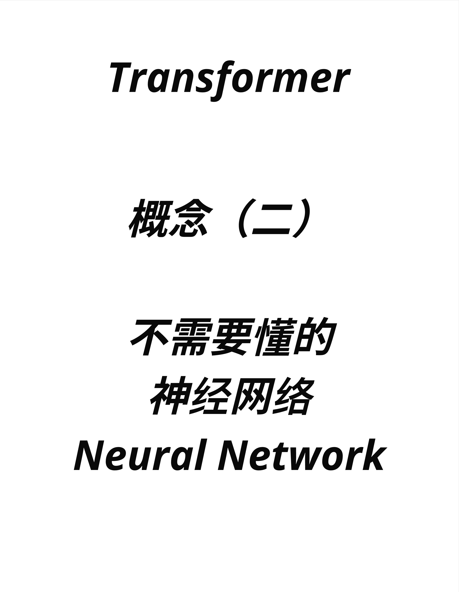
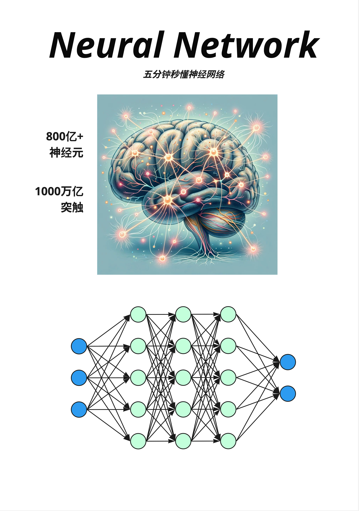
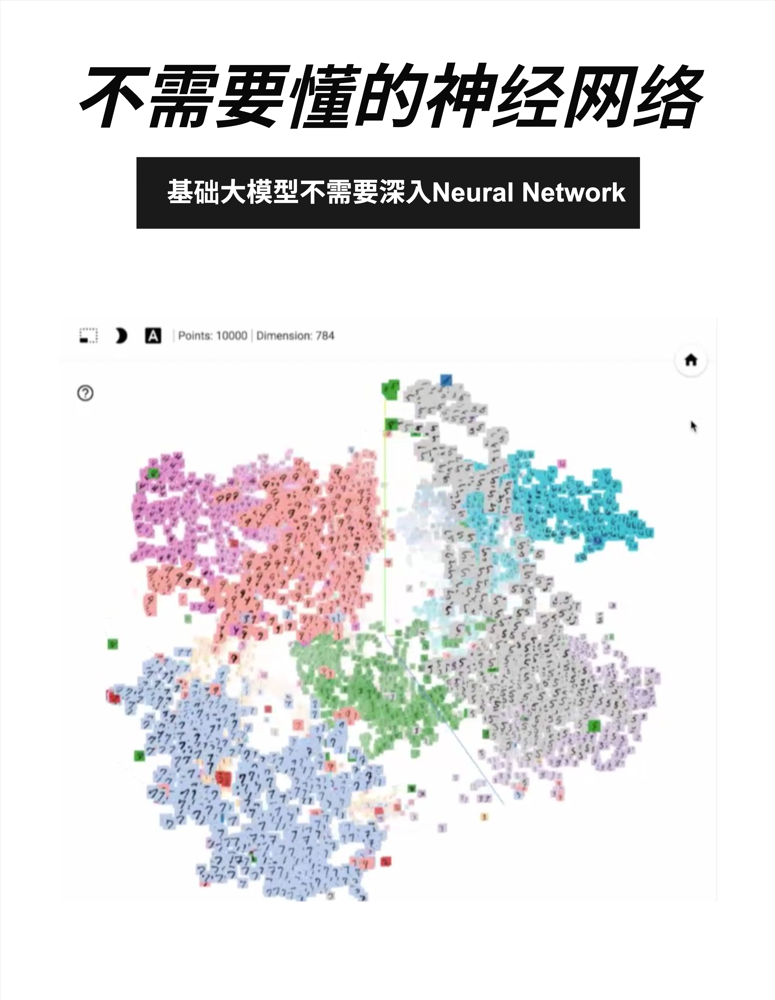
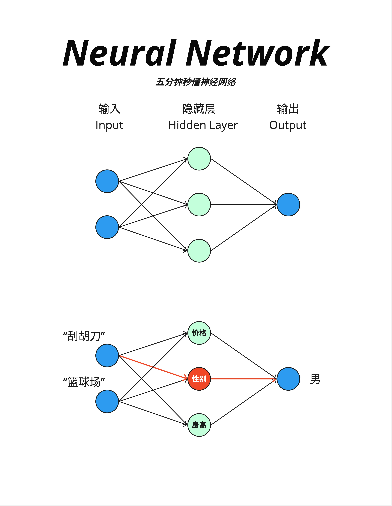
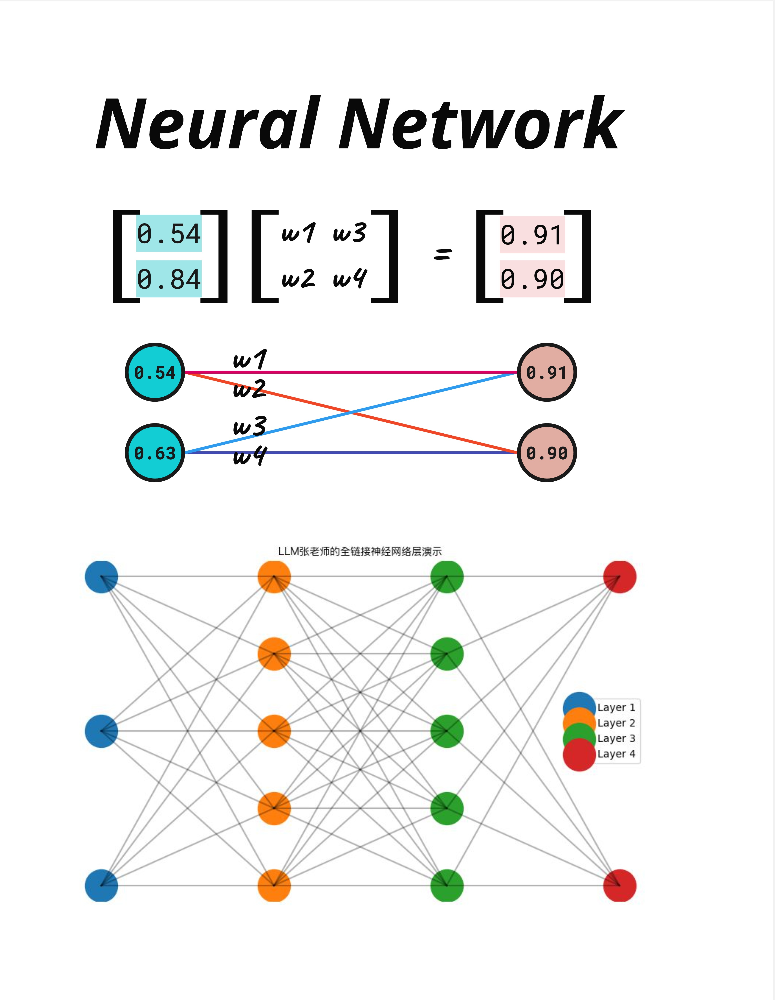
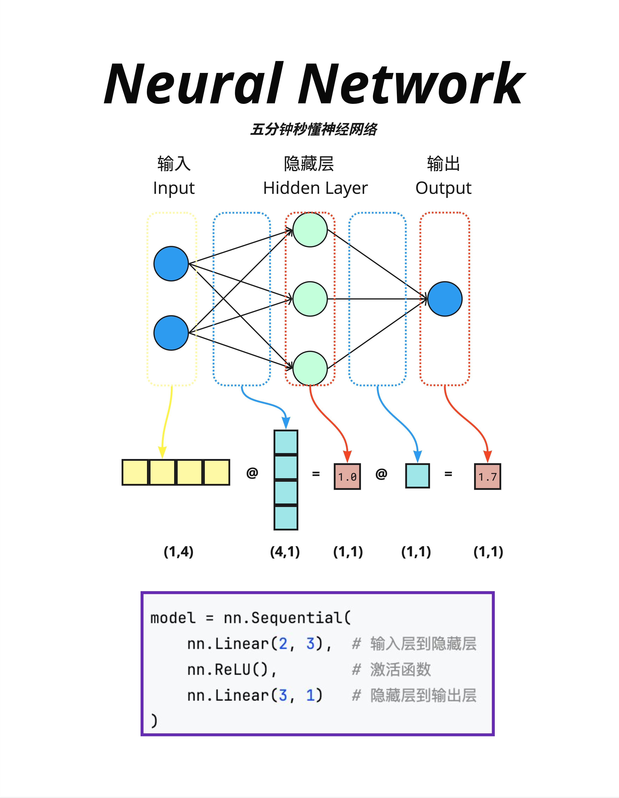
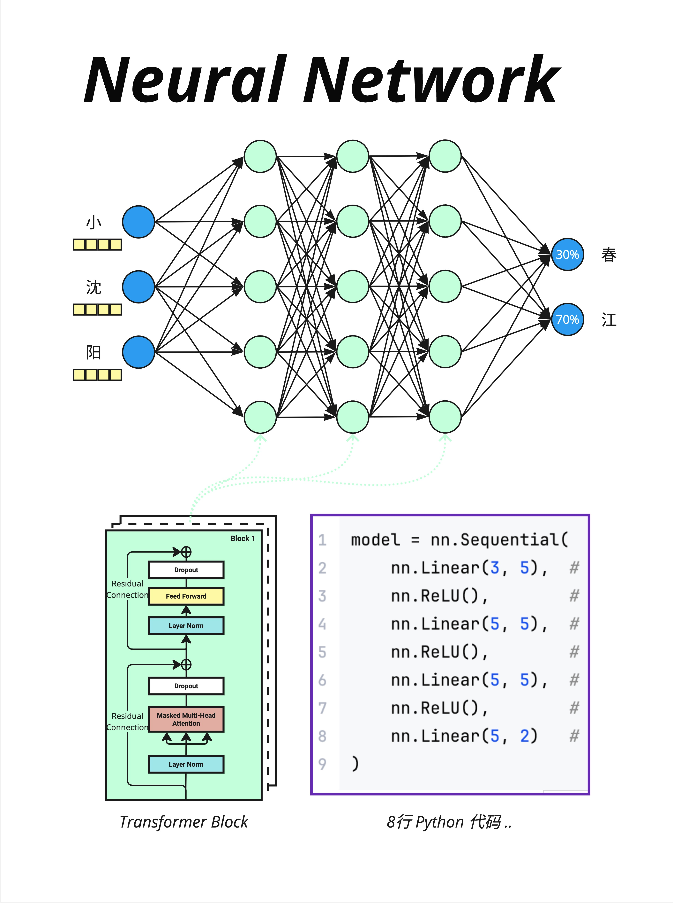
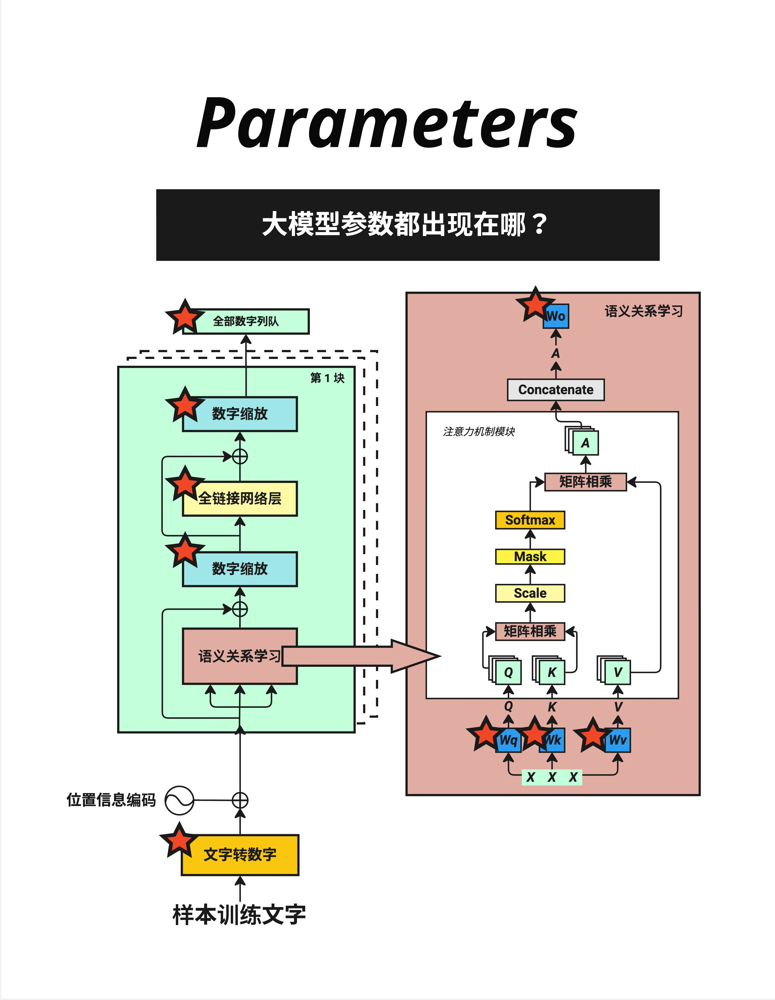

# 第 7 章：神经网络层 - 不需要懂也能理解 Transformer

> **一句话总结**：神经网络本质上就是矩阵乘法加激活函数。理解 Transformer 不需要深入神经网络细节，只需要知道它是一个"输入 → 处理 → 输出"的黑盒子。

---

## 7.1 先说结论：你不需要"懂"神经网络



在深入之前，我想先打消你的顾虑：

**理解 Transformer 和大模型，不需要成为神经网络专家。**

为什么？因为神经网络在 Transformer 中扮演的角色其实很简单——就是一个"处理器"，把输入变成输出。你需要知道的是：

1. 输入是什么形状
2. 输出是什么形状
3. 中间有一些可学习的参数

至于里面具体怎么算的？对于理解 Transformer 来说，可以当作黑盒子。

当然，如果你想深入了解，这一章也会给你足够的直觉。

---

## 7.2 神经网络的灵感：人脑



### 7.2.1 生物神经网络

人脑是世界上最复杂的"计算机"：

- **800 亿+神经元**：每个神经元都是一个小的处理单元
- **1000 万亿突触**：神经元之间的连接

神经元通过电信号相互传递信息。当一个神经元接收到足够多的输入信号时，它会"激活"并向下游神经元发送信号。

### 7.2.2 人工神经网络

人工神经网络（Artificial Neural Network）是对生物神经网络的**简化模拟**：

- **节点**：模拟神经元
- **连接**：模拟突触，每个连接有一个"权重"
- **激活**：当输入超过阈值时，节点被激活

但请注意：人工神经网络和真正的大脑差别很大。它只是借用了"神经网络"这个名字，实际上是一种数学模型。

---

## 7.3 神经网络能做什么？



### 7.3.1 学习"特征"

神经网络的神奇之处在于：它能自动学习数据的"特征"。

看这张图（MNIST 手写数字可视化）：
- 10000 个点，每个点是一张手写数字图片
- 784 维（28×28 像素）的图片被压缩到 2D 显示
- **相同的数字自动聚集在一起**！

0 聚在一起，1 聚在一起，2 聚在一起...

没有人告诉神经网络"0 长这样"、"1 长这样"。它通过训练数据**自己学会了**区分不同数字的特征。

### 7.3.2 这和 LLM 有什么关系？

同样的原理用在语言上：

- 神经网络学会了哪些词经常一起出现
- 学会了句子的语法结构
- 学会了词语的语义关系

最终，"国王"和"王后"的向量会很接近，而"国王"和"苹果"会很远——就像图中相同数字聚在一起一样。

---

## 7.4 神经网络的基本结构



### 7.4.1 三层结构

最简单的神经网络有三层：

1. **输入层（Input）**：接收原始数据
2. **隐藏层（Hidden Layer）**：进行计算处理
3. **输出层（Output）**：产生结果

### 7.4.2 一个直观的例子

图中下半部分展示了一个有趣的例子：

**输入**：
- "刮胡刀" → 一个向量
- "篮球场" → 一个向量

**隐藏层的特征**：
- 价格
- 性别（红色高亮）
- 身高

**输出**：
- "男"

神经网络学会了：刮胡刀和篮球场都和"男性"相关，所以输出"男"。

这就是神经网络的本质：**从输入中提取特征，然后做出判断**。

---

## 7.5 数学本质：矩阵乘法



### 7.5.1 一切都是矩阵乘法

神经网络的核心计算其实非常简单：**矩阵乘法**。

看图中的例子：

```
输入向量 × 权重矩阵 = 输出向量

[0.54]   [w1 w3]   [0.91]
[0.84] × [w2 w4] = [0.90]
```

就这么简单。输入是一个向量，乘以一个权重矩阵，得到输出向量。

### 7.5.2 可视化理解

图中下方展示了同样的过程用"网络图"表示：

- 左边两个蓝色节点（0.54, 0.63）是输入
- 右边两个粉色节点（0.91, 0.90）是输出
- 中间的线是权重（w1, w2, w3, w4）

每个输出节点的值 = 所有输入 × 对应权重的总和。

### 7.5.3 多层神经网络

图中最下方展示了一个多层网络（LLM张老师的全链接神经网络层演示）：

- Layer 1（蓝色）→ Layer 2（橙色）→ Layer 3（绿色）→ Layer 4（红色）
- 每一层到下一层，都是一次矩阵乘法
- 层数越多，网络越"深"（这就是"深度学习"名字的由来）

---

## 7.6 PyTorch 实现



### 7.6.1 代码示例

```python
# 代码示例
import torch.nn as nn

model = nn.Sequential(
    nn.Linear(2, 3),   # 输入层到隐藏层：2维 → 3维
    nn.ReLU(),         # 激活函数
    nn.Linear(3, 1)    # 隐藏层到输出层：3维 → 1维
)
```

这段代码定义了一个简单的神经网络：
- `nn.Linear(2, 3)`：一个线性层，把 2 维输入变成 3 维输出
- `nn.ReLU()`：激活函数，增加非线性
- `nn.Linear(3, 1)`：把 3 维变成 1 维输出

### 7.6.2 矩阵维度变化

图中展示了维度变化：

```
输入 (1,4) @ 权重 (4,1) = 中间结果 (1,1) @ 权重 (1,1) = 输出 (1,1)
```

理解维度变化是理解神经网络的关键：
- `(1,4)`：1 个样本，4 个特征
- `(4,1)`：权重矩阵，把 4 维变成 1 维
- 矩阵乘法规则：`(a,b) @ (b,c) = (a,c)`

### 7.6.3 激活函数

你可能注意到了 `nn.ReLU()`。这是**激活函数**，它的作用是增加"非线性"。

如果没有激活函数，多层矩阵乘法可以合并成一层（线性变换的组合还是线性变换）。激活函数让网络能学习更复杂的模式。

ReLU 是最常用的激活函数，规则很简单：
```
ReLU(x) = max(0, x)
```
正数不变，负数变成 0。

---

## 7.7 在 Transformer 中的神经网络



### 7.7.1 Feed Forward Network

在 Transformer 中，神经网络层被称为 **Feed Forward Network（FFN，前馈网络）** 或 **全链接网络层**。

看图中的例子：

**输入**：小、沈、阳（三个 token 的向量）
**FFN 输出**：每个 token 的新向量表示（维度不变）

> **注意**：图中显示的"春=30%、江=70%"概率分布，实际上是由**最后的 LM Head（线性层 + Softmax）**产生的，而不是 FFN 本身。FFN 只是在处理和转换向量表示。

### 7.7.2 Transformer Block 结构

图中左下角展示了 Transformer Block 的结构：

```
Layer Norm
    ↓
Masked Multi-Head Attention
    ↓
Dropout + 残差连接
    ↓
Layer Norm
    ↓
Feed Forward（神经网络层）← 就是这里！
    ↓
Dropout + 残差连接
```

**Feed Forward** 是每个 Block 的重要组成部分，和 Attention 交替出现。

### 7.7.3 简化的代码

图中右侧展示了简化的 PyTorch 代码：

```python
model = nn.Sequential(
    nn.Linear(3, 5),   # 第1层
    nn.ReLU(),
    nn.Linear(5, 5),   # 第2层
    nn.ReLU(),
    nn.Linear(5, 5),   # 第3层
    nn.ReLU(),
    nn.Linear(5, 2)    # 输出层
)
```

8 行代码，就定义了一个神经网络！这就是为什么我们说"大模型就是两个文件"——代码真的很简洁。

---

## 7.8 参数都在哪里？



### 7.8.1 哪些地方有参数？

看这张图，红色星星标注了所有有参数的地方：

1. **文字转数字（Embedding）**：词表大小 × 向量维度
2. **全链接网络层（FFN）**：输入维度 × 输出维度
3. **数字缩放（LayerNorm）**：γ 和 β 参数
4. **语义关系学习（Attention）**：Wq、Wk、Wv、Wo 四个权重矩阵
5. **全部数字列队（最终 Linear）**：向量维度 × 词表大小

### 7.8.2 参数量估算

对于一个典型的 Transformer：

| 组件 | 参数量公式 | LLaMA-7B 示例 |
|------|-----------|---------------|
| Embedding | vocab × d_model | 32000 × 4096 ≈ 1.3亿 |
| FFN（每层）| 3 × d_model × d_ff * | 3 × 4096 × 11008 ≈ 1.35亿 |
| Attention（每层）| 4 × d_model² | 4 × 4096² ≈ 0.67亿 |
| LayerNorm（每层）| 2 × d_model | 2 × 4096 ≈ 8K（很少）|

> *LLaMA 使用 SwiGLU 激活函数，需要 3 个矩阵（gate、up、down），而非传统 FFN 的 2 个矩阵。

**FFN 占了大部分参数！** 这是一个常被忽视的事实。

### 7.8.3 一个有趣的观察

很多人以为 Attention 是 Transformer 的"主角"，参数最多。但实际上：

- **FFN 的参数量通常是 Attention 的 2-3 倍**
- Attention 的强项是"理解关系"，FFN 的强项是"存储知识"

有研究认为，模型的"知识"主要存储在 FFN 的权重中。

---

## 7.9 本章总结

### 7.9.1 核心认知

| 概念 | 解释 |
|------|------|
| **神经网络** | 输入 → 矩阵乘法 → 激活函数 → 输出 |
| **层** | 每一次矩阵乘法 + 激活函数 |
| **参数** | 矩阵中的数字，通过训练学习 |
| **FFN** | Transformer 中的神经网络层 |

### 7.9.2 记住这个公式

神经网络的本质：

```
输出 = 激活函数(输入 × 权重 + 偏置)
```

用 PyTorch 表示：

```python
nn.Linear(in_features, out_features)  # 线性层
nn.ReLU()  # 激活函数
```

### 7.9.3 你只需要知道的

1. **形状变化**：神经网络改变向量的维度
2. **可学习参数**：权重矩阵是训练出来的
3. **FFN 的位置**：在每个 Transformer Block 中，和 Attention 交替出现
4. **FFN 很重要**：它存储了模型的大部分参数和"知识"

> **神经网络就是矩阵乘法的堆叠。理解 Transformer 不需要深入神经网络的细节，把它当作一个"处理器"就够了：输入向量进去，输出向量出来。**

---

## 本章交付物

学完这一章，你应该能够：

- [ ] 解释神经网络的基本结构（输入层、隐藏层、输出层）
- [ ] 理解神经网络本质是矩阵乘法
- [ ] 知道 FFN 在 Transformer Block 中的位置
- [ ] 了解参数主要分布在哪些组件中

---

## Part 2 总结

恭喜你完成了 **Part 2：核心组件**！

让我们回顾一下学到的内容：

| 章节 | 组件 | 核心作用 |
|------|------|----------|
| 第4章 | **Tokenization + Embedding** | 文字 → Token ID → 向量 |
| 第5章 | **Positional Encoding** | 给向量添加位置信息 |
| 第6章 | **LayerNorm + Softmax** | 数字缩放 + 数字变概率 |
| 第7章 | **神经网络层（FFN）** | 处理和存储知识 |

现在你已经理解了 Transformer 的所有"配件"。下一个 Part，我们将进入最核心的部分：**Attention 机制**——Transformer 真正的灵魂。

---

## 下一章预告

Part 3 的第一章（第 8 章），我们要先补一个数学基础：**线性变换的几何意义**。

这是理解 Attention 的关键。我们会用可视化的方式，让你真正"看懂"矩阵乘法在做什么。

准备好了吗？让我们进入 Attention 的世界！
