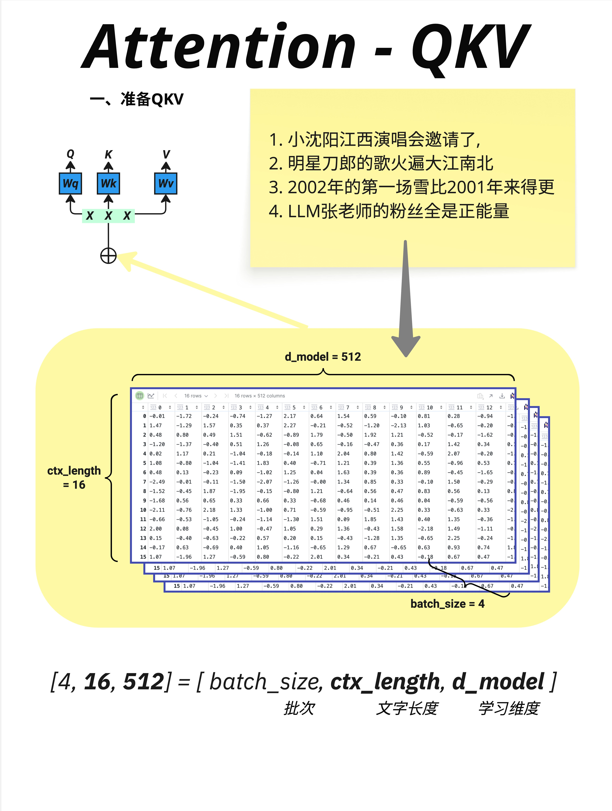
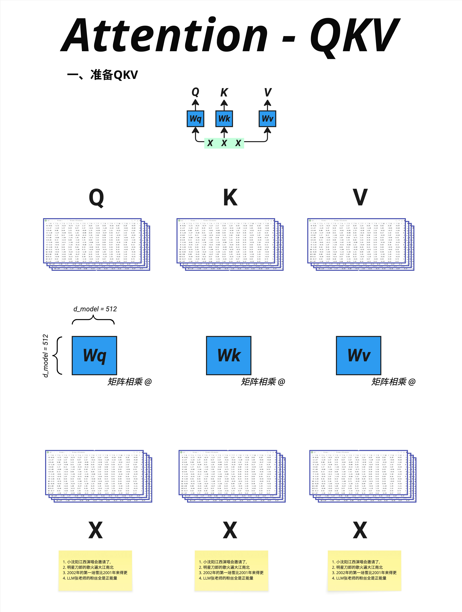
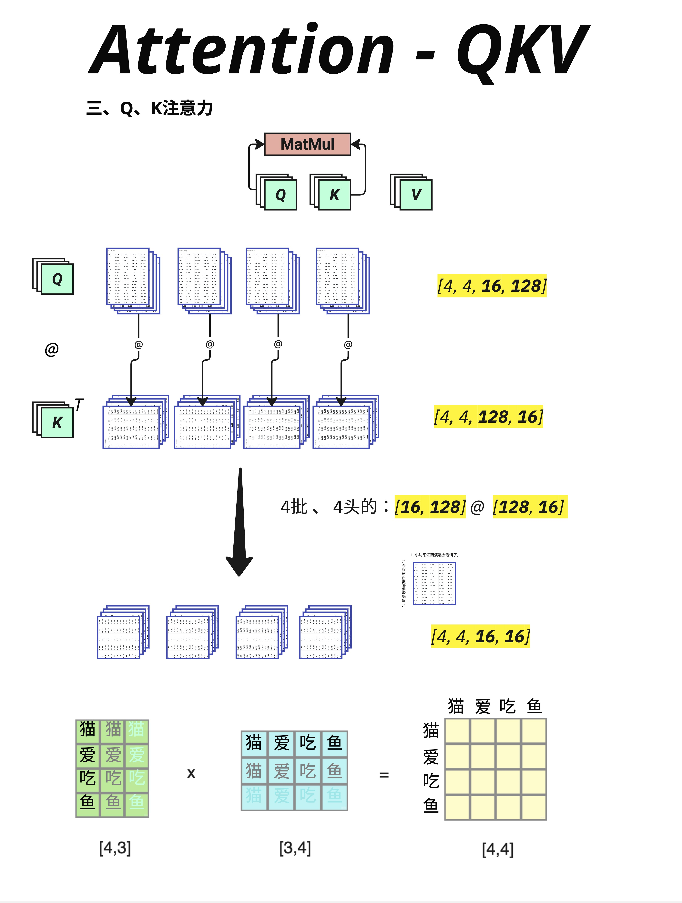
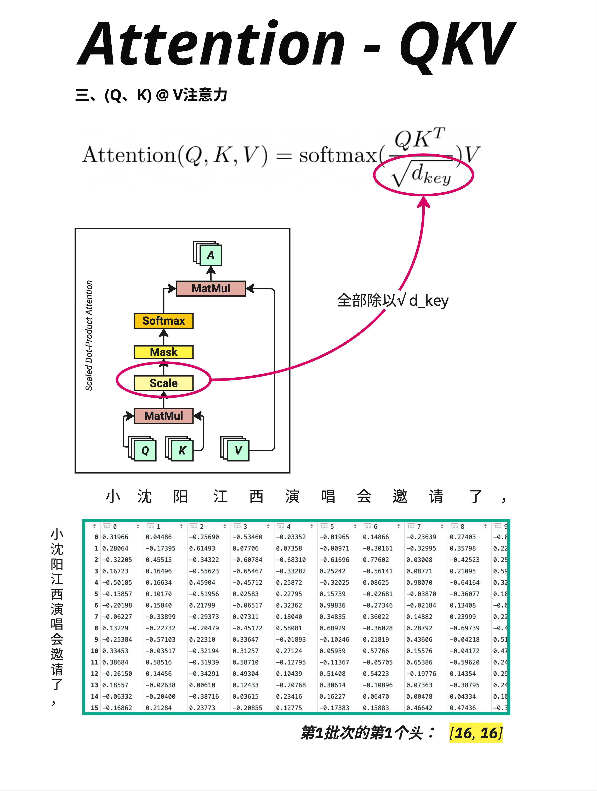
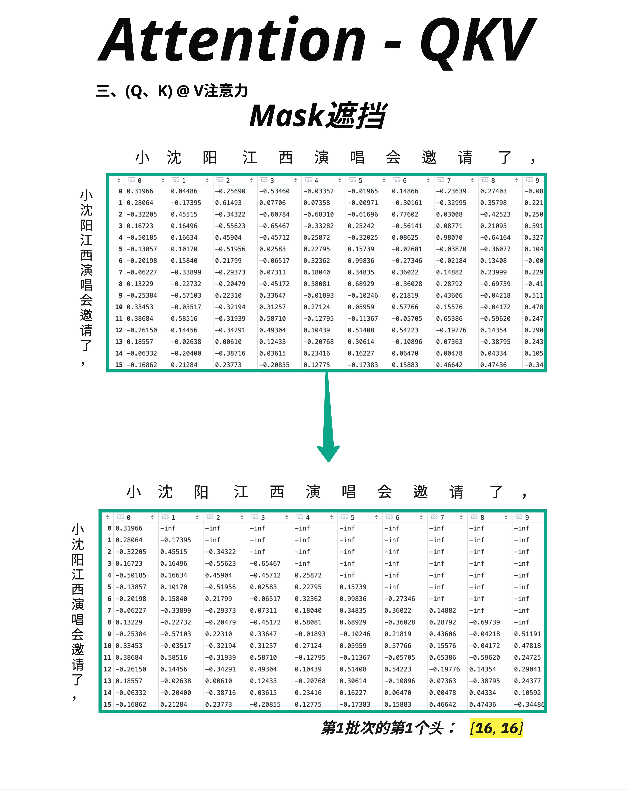
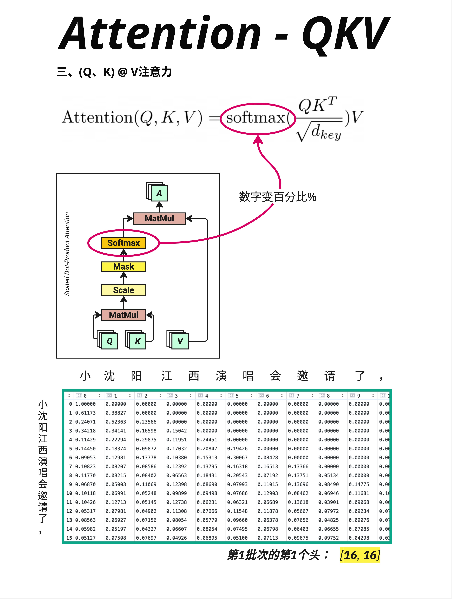
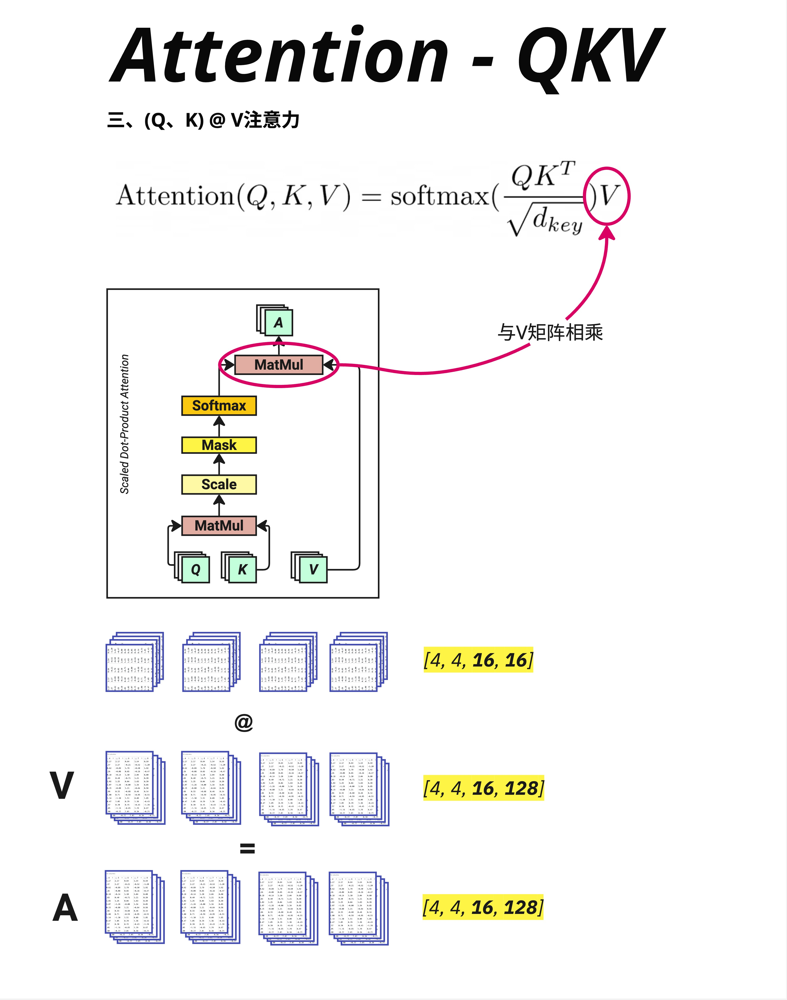
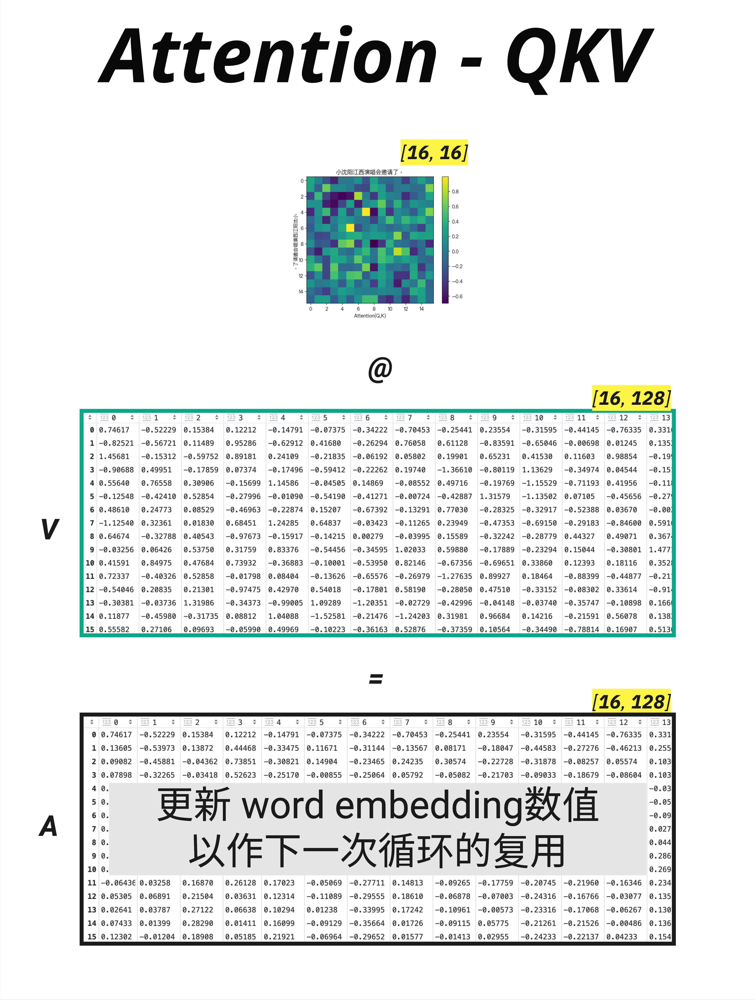
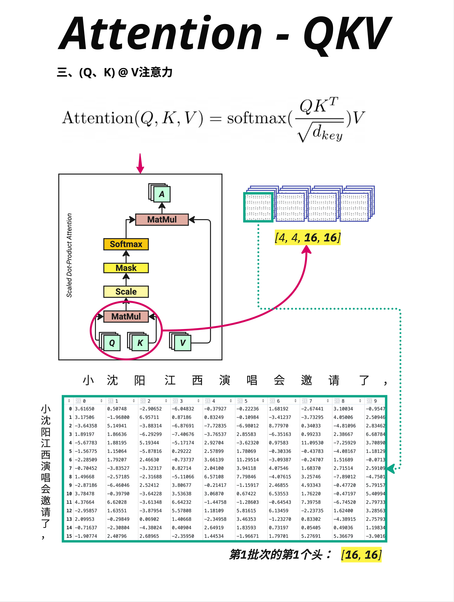

# 第 10 章：QKV 到底是什么 - Attention 的三个主角

> **一句话总结**：Q（Query）是"我在找什么"，K（Key）是"我有什么标签"，V（Value）是"我的实际内容"。Attention 就是用 Q 去匹配 K，找到相关的 V，然后加权求和得到输出。

---

## 10.1 本章目标

上一章我们建立了 Attention 的几何直觉：用点积计算相似度。

但还有几个关键问题没回答：
- Q、K、V 是什么意思？
- 它们是怎么从输入生成的？
- 整个 Attention 的维度变化是怎样的？

这一章，我们来**完整追踪** Attention 的计算过程，把每一步的维度变化都搞清楚。

---

## 10.2 输入数据的形状

### 10.2.1 理解输入维度



在实际训练中，我们会**批量处理**多个句子。输入数据的形状是：

```
X: [batch_size, ctx_length, d_model]
```

以图中为例：
- **batch_size = 4**：同时处理 4 个句子（批次大小）
- **ctx_length = 16**：每个句子有 16 个 token（上下文长度）
- **d_model = 512**：每个 token 用 512 维向量表示（模型维度）

### 10.2.2 具体例子

图中展示了 4 个句子：

```
1. 小沈阳江西演唱会邀请了，
2. 明星刀郎的歌火遍大江南北
3. 2002年的第一场雪比2001年来得更
4. LLM张老师的粉丝全是正能量
```

每个句子被切分成 16 个 token，每个 token 用 512 维向量表示。

所以总的输入形状是 **[4, 16, 512]**：
- 4 个句子
- 16 个位置
- 512 维向量

### 10.2.3 三个维度的含义

| 维度 | 英文 | 中文 | 含义 |
|------|------|------|------|
| batch_size | 批次 | 批次大小 | 同时处理多少个句子 |
| ctx_length | 上下文长度 | 序列长度 | 每个句子有多少个 token |
| d_model | 模型维度 | 学习维度 | 每个 token 的向量维度 |

---

## 10.3 生成 Q、K、V

### 10.3.1 核心思想



Q、K、V 都是从**同一个输入 X** 生成的，通过三个不同的权重矩阵：

```
Q = X @ Wq
K = X @ Wk
V = X @ Wv
```

这三个权重矩阵（Wq、Wk、Wv）是**可学习的参数**，在训练过程中不断调整。

### 10.3.2 维度计算


以生成 Q 为例：

```
X:  [4, 16, 512]  (batch_size, ctx_length, d_model)
Wq: [512, 512]    (d_model, d_model)
Q:  [4, 16, 512]  (batch_size, ctx_length, d_model)
```

矩阵乘法的维度规则：`[..., A, B] @ [B, C] = [..., A, C]`

所以：`[4, 16, 512] @ [512, 512] = [4, 16, 512]`

**Q、K、V 的形状和输入 X 完全相同！**

### 10.3.3 为什么需要三个不同的矩阵？

你可能会问：既然形状都一样，为什么要用三个不同的矩阵？

答案是：**Q、K、V 承担不同的角色**。

- **Q（Query，查询）**：代表"我在找什么信息"
- **K（Key，键）**：代表"我有什么信息可以被找到"
- **V（Value，值）**：代表"如果被找到，我提供什么内容"

通过学习不同的 Wq、Wk、Wv，模型可以学会：
- 把同一个词转换成不同的"角色"
- 在不同的"语义空间"中进行匹配

### 10.3.4 一个直观的类比

想象一个图书馆检索系统：

| 角色 | 类比 | 作用 |
|------|------|------|
| **Query (Q)** | 读者的搜索词 | "我想找关于机器学习的书" |
| **Key (K)** | 每本书的索引标签 | "机器学习, Python, 入门" |
| **Value (V)** | 书的实际内容 | 整本书的内容 |

当你搜索时：
1. 用你的 Query 和每本书的 Key 比较
2. 找到匹配度高的书
3. 返回这些书的 Value（内容）

---

## 10.4 第一次矩阵乘法：Q @ K^T

### 10.4.1 计算相似度矩阵



有了 Q 和 K，下一步是计算它们的相似度：

```
Q @ K^T
```

注意：K 需要**转置**（K^T），因为我们要让 Q 的每一行和 K 的每一行做点积。

### 10.4.2 维度变化

```
Q:   [4, 16, 128]  (batch_size, ctx_length, d_key)
K^T: [4, 128, 16]  (batch_size, d_key, ctx_length)
结果: [4, 16, 16]   (batch_size, ctx_length, ctx_length)
```

> 这里的 d_key = 128 是因为在 Multi-Head Attention 中，d_model 会被分成多个 head。每个 head 的维度是 d_key = d_model / num_heads = 512 / 4 = 128。这个我们下一章详细讲。

### 10.4.3 结果的含义

结果是一个 **[4, 16, 16]** 的矩阵：
- 4 个句子
- 每个句子有一个 16×16 的"注意力矩阵"
- 位置 (i, j) 表示：第 i 个 token 对第 j 个 token 的关注程度

图中下方用"猫爱吃鱼"做了一个简化示例：

```
       猫  爱  吃  鱼
猫    [            ]
爱    [            ]
吃    [            ]
鱼    [            ]
```

每个位置的值 = 对应 Q 行向量和 K 列向量的点积。

---

## 10.5 Scale：为什么除以 √d_key

### 10.5.1 缩放操作



Q @ K^T 的结果需要**缩放**：

```
Attention Scores = (Q @ K^T) / √d_key
```

图中显示的是除以 √d_key 后的结果，数值从原来的大范围（可能是几十上百）变成了更小的范围（大多在 -1 到 1 之间）。

### 10.5.2 为什么要缩放？

**问题**：当 d_key 很大时（比如 128），点积的结果会很大。

```
点积 = Σ(q_i × k_i)  # 128 个数相乘再相加
```

如果每个 q_i 和 k_i 的方差是 1，那么点积的方差大约是 d_key。

**后果**：数值太大会让 Softmax 变得极端。

```
Softmax([100, 1, 2]) ≈ [1.0, 0.0, 0.0]  # 极端分布
Softmax([1.0, 0.1, 0.2]) ≈ [0.4, 0.3, 0.3]  # 平滑分布
```

**解决方案**：除以 √d_key 把数值缩放回合理范围。

```
点积 / √128 ≈ 点积 / 11.3
```

### 10.5.3 公式中的位置

$$
\text{Attention}(Q, K, V) = \text{softmax}\left(\frac{QK^T}{\sqrt{d_{key}}}\right) V
$$

这个 √d_key 就是 Scale 操作。

---

## 10.6 Mask：防止"偷看"未来

### 10.6.1 为什么需要 Mask？



在 GPT 这样的自回归模型中，预测下一个词时**不能看到未来的词**。

比如预测"小沈阳江西演唱会邀请了____"，模型不能看到答案。

但是 Q @ K 会计算**所有位置**之间的相似度，包括未来的位置！

### 10.6.2 Mask 的实现

解决方案：用一个**三角形 Mask** 把未来的位置"遮住"。

```
原始注意力矩阵：          Mask 后：
[0.3, 0.2, 0.1, 0.4]     [0.3, -∞,  -∞,  -∞ ]
[0.2, 0.5, 0.2, 0.1]  →  [0.2, 0.5, -∞,  -∞ ]
[0.1, 0.3, 0.4, 0.2]     [0.1, 0.3, 0.4, -∞ ]
[0.2, 0.1, 0.3, 0.4]     [0.2, 0.1, 0.3, 0.4]
```

把右上角（未来的位置）设为负无穷（-inf）。

### 10.6.3 为什么用 -inf？

因为 Softmax 会把 -inf 变成 0：

```
Softmax([0.3, -∞, -∞, -∞]) = [1.0, 0.0, 0.0, 0.0]
```

这样，经过 Softmax 后，未来位置的注意力权重就变成 0 了——模型"看不到"未来。

### 10.6.4 图中的示例

图中展示了 Mask 前后的变化：
- 上方矩阵：原始的 Scale 后结果
- 下方矩阵：Mask 后结果，右上角变成了 -inf（图中可能显示为极小的数）

---

## 10.7 Softmax：变成概率分布

### 10.7.1 转换过程



Mask 之后，对每一行应用 Softmax：

```
Softmax 前：[0.32, 0.04, -inf, -inf, ...]
Softmax 后：[0.52, 0.48, 0.00, 0.00, ...]
```

### 10.7.2 Softmax 的作用

1. **归一化**：每一行的和变成 1
2. **放大差异**：大的值变得更大，小的值变得更小
3. **处理 -inf**：-inf 变成 0

### 10.7.3 图中的观察

看图中的数据：
- 第 0 行（"小"）：[1.00000, 0.00000, 0.00000, ...]
  - 只能看到自己，所以自己的权重是 100%
- 第 1 行（"沈"）：[0.61173, 0.38827, 0.00000, ...]
  - 可以看到"小"和"沈"，注意力分配为 61% 和 39%
- 后面的行可以看到更多位置，注意力分布更分散

### 10.7.4 这就是"注意力权重"

Softmax 的输出就是**注意力权重矩阵**——每个位置应该分配多少注意力给其他位置。

---

## 10.8 第二次矩阵乘法：Attention @ V

### 10.8.1 加权求和



有了注意力权重，下一步是用它对 V 进行**加权求和**：

```
Output = Attention_Weights @ V
```

### 10.8.2 维度变化

```
Attention_Weights: [4, 4, 16, 16]  (batch, heads, ctx_len, ctx_len)
V:                 [4, 4, 16, 128] (batch, heads, ctx_len, d_key)
Output:            [4, 4, 16, 128] (batch, heads, ctx_len, d_key)
```

注意：这里显示的是 Multi-Head 的情况，有 4 个 head。

### 10.8.3 这一步在做什么？

每个位置的输出 = 所有位置的 V 的加权平均，权重由注意力分数决定。

```
output[i] = Σ(attention_weight[i,j] × V[j])
```

如果第 i 个 token 对第 j 个 token 的注意力是 0.7，对第 k 个 token 的注意力是 0.3，那么：

```
output[i] = 0.7 × V[j] + 0.3 × V[k]
```

**输出是"根据注意力重新组合"的向量表示。**

---

## 10.9 Attention 输出的含义

### 10.9.1 输出维度



经过 Attention @ V，每个 token 得到一个新的向量表示：

```
输出: [batch_size, ctx_length, d_key] = [4, 16, 128]
```

（在 Multi-Head 情况下，还需要把多个 head 的输出合并，这是下一章的内容）

### 10.9.2 输出的语义

这个输出有什么特别之处？

**它融合了上下文信息！**

原始输入中，每个 token 的向量只包含**自己**的信息。

经过 Attention 后，每个 token 的向量变成了**整个上下文的加权组合**。

### 10.9.3 图中的说明

图中的黄色标注说得很清楚：

> **更新 word embedding 数值，以作下一次循环的复用**

Attention 的输出会：
1. 替代原来的 embedding
2. 作为下一层（FFN 或下一个 Block）的输入
3. 层层叠加，不断融合更多信息

---

## 10.10 完整的 Attention 计算流程

### 10.10.1 流程图



让我们把整个流程串起来：

```
步骤1：生成 Q, K, V
        Q = X @ Wq    [4, 16, 512]
        K = X @ Wk    [4, 16, 512]
        V = X @ Wv    [4, 16, 512]
              ↓
步骤2：计算相似度
        scores = Q @ K^T    [4, 16, 16]
              ↓
步骤3：缩放
        scores = scores / √d_key    [4, 16, 16]
              ↓
步骤4：Mask（可选，仅 Decoder）
        scores[mask] = -inf    [4, 16, 16]
              ↓
步骤5：Softmax
        weights = softmax(scores)    [4, 16, 16]
              ↓
步骤6：加权求和
        output = weights @ V    [4, 16, 512]
```

### 10.10.2 PyTorch 代码

```python
# 代码示例
import torch
import torch.nn.functional as F

def attention(Q, K, V, mask=None):
    """
    计算 Scaled Dot-Product Attention

    Args:
        Q: [batch, seq_len, d_k]
        K: [batch, seq_len, d_k]
        V: [batch, seq_len, d_v]
        mask: [batch, 1, seq_len] or [batch, seq_len, seq_len]

    Returns:
        output: [batch, seq_len, d_v]
        attention_weights: [batch, seq_len, seq_len]
    """
    d_k = Q.size(-1)

    # 步骤2: Q @ K^T
    scores = torch.matmul(Q, K.transpose(-2, -1))

    # 步骤3: Scale
    scores = scores / (d_k ** 0.5)

    # 步骤4: Mask
    if mask is not None:
        scores = scores.masked_fill(mask == 0, float('-inf'))

    # 步骤5: Softmax
    attention_weights = F.softmax(scores, dim=-1)

    # 步骤6: 加权求和
    output = torch.matmul(attention_weights, V)

    return output, attention_weights
```

---

## 10.11 Q、K、V 的深层理解

### 10.11.1 三者的关系

| 角色 | 生成方式 | 作用 | 参与的计算 |
|------|---------|------|-----------|
| **Q** | X @ Wq | 表示"我在找什么" | Q @ K^T |
| **K** | X @ Wk | 表示"我是什么"（标签） | Q @ K^T |
| **V** | X @ Wv | 表示"我有什么内容" | Attention @ V |

### 10.11.2 为什么 K 和 V 要分开？

你可能会问：K 和 V 都来自同一个输入，为什么要用两个不同的矩阵？

**答案：解耦"匹配"和"提取"。**

- K 负责"被匹配"：决定哪些位置应该被关注
- V 负责"被提取"：决定关注后提取什么信息

这给了模型更大的灵活性。

### 10.11.3 一个例子

考虑句子："The cat sat on the mat"

当处理 "sat" 时：
- Q("sat") 可能在找"谁做了这个动作"
- K("cat") 的表示可能包含"我是一个主语"
- V("cat") 的表示可能包含"我是一只猫"

Q 和 K 的匹配告诉我们：sat 应该关注 cat。
V 告诉我们：关注 cat 后，获取的是"猫"的语义信息。

---

## 10.12 本章总结

### 10.12.1 核心概念

| 概念 | 形状 | 含义 |
|------|------|------|
| **X** | [batch, seq, d_model] | 输入向量 |
| **Wq/Wk/Wv** | [d_model, d_model] | 可学习的投影矩阵 |
| **Q** | [batch, seq, d_model] | 查询向量，"我在找什么" |
| **K** | [batch, seq, d_model] | 键向量，"我是什么" |
| **V** | [batch, seq, d_model] | 值向量，"我有什么内容" |
| **Scores** | [batch, seq, seq] | 相似度矩阵 |
| **Weights** | [batch, seq, seq] | 注意力权重（概率分布） |
| **Output** | [batch, seq, d_model] | 融合上下文后的表示 |

### 10.12.2 计算流程

```
X → [Wq, Wk, Wv] → Q, K, V
              ↓
        Q @ K^T (相似度)
              ↓
        / √d_key (缩放)
              ↓
        Mask (遮挡未来)
              ↓
        Softmax (归一化)
              ↓
        @ V (加权求和)
              ↓
           Output
```

### 10.12.3 核心认知

> **Q、K、V 是 Attention 的三个主角。Q 代表"查询"，K 代表"键"，V 代表"值"。通过 Q @ K 找到相关的位置，用注意力权重对 V 加权求和，得到融合了上下文信息的新表示。这就是 Attention 让模型"理解"语言的方式。**

---

## 本章交付物

学完这一章，你应该能够：

- [ ] 说出 Q、K、V 各自的含义
- [ ] 解释它们是如何从输入 X 生成的
- [ ] 追踪 Attention 计算过程中的维度变化
- [ ] 理解 Mask 的作用（防止看到未来）
- [ ] 解释为什么要 Scale（除以 √d_key）

---

## 下一章预告

这一章我们学习了单头 Attention 的完整计算过程。

但实际的 Transformer 使用的是 **Multi-Head Attention（多头注意力）**——把 Attention 分成多个"头"，每个头关注不同的信息。

为什么要这样做？多个头是怎么工作的？下一章，我们来揭开 Multi-Head Attention 的神秘面纱！
