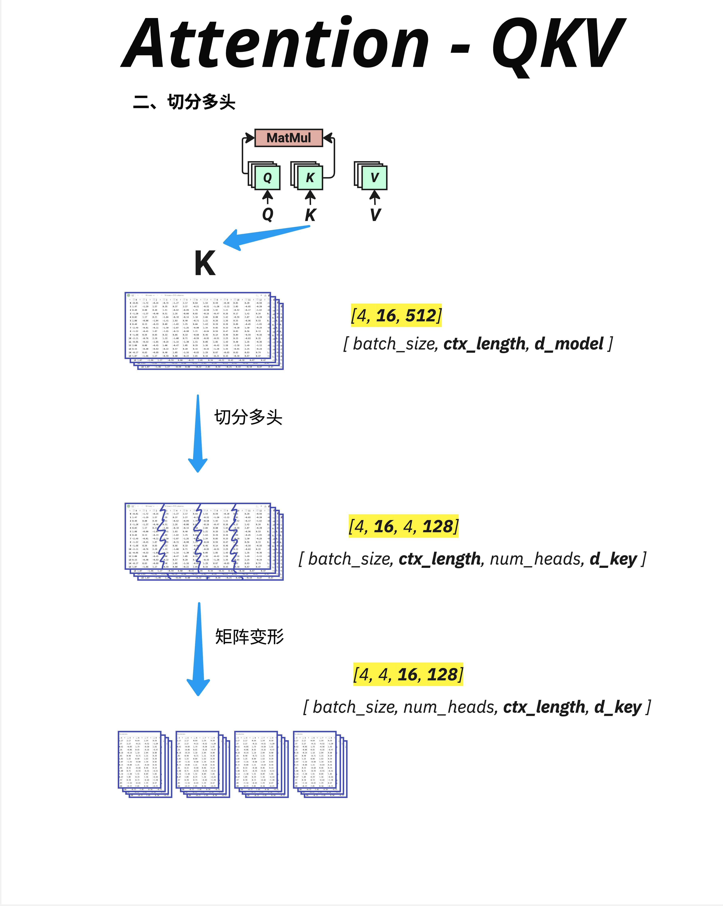
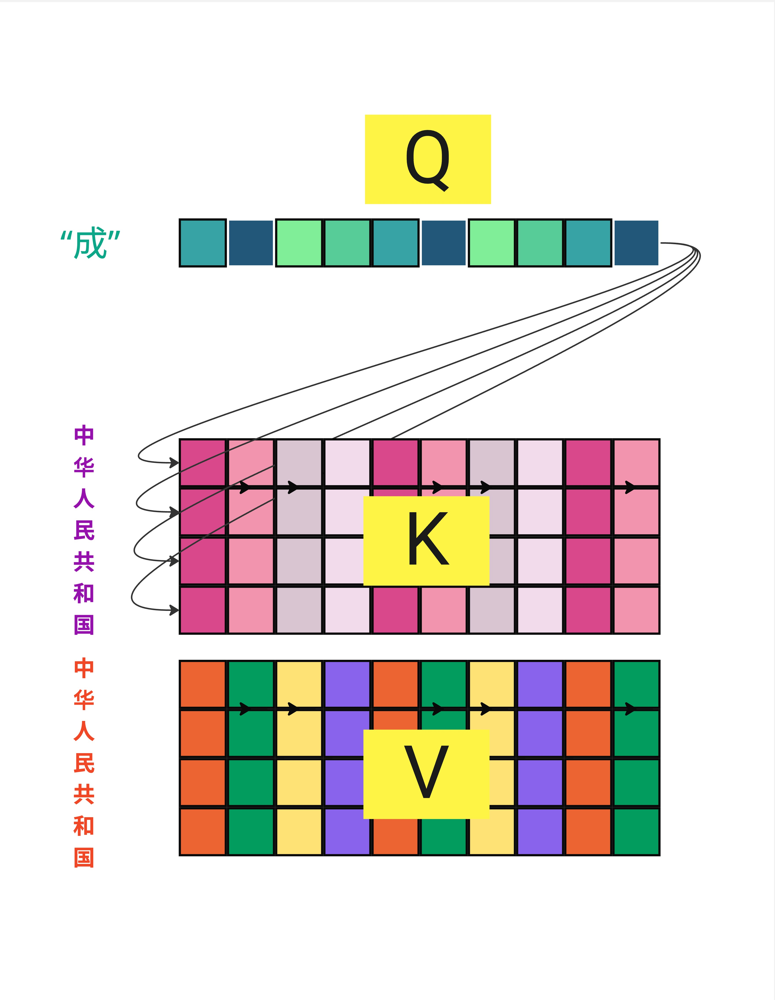
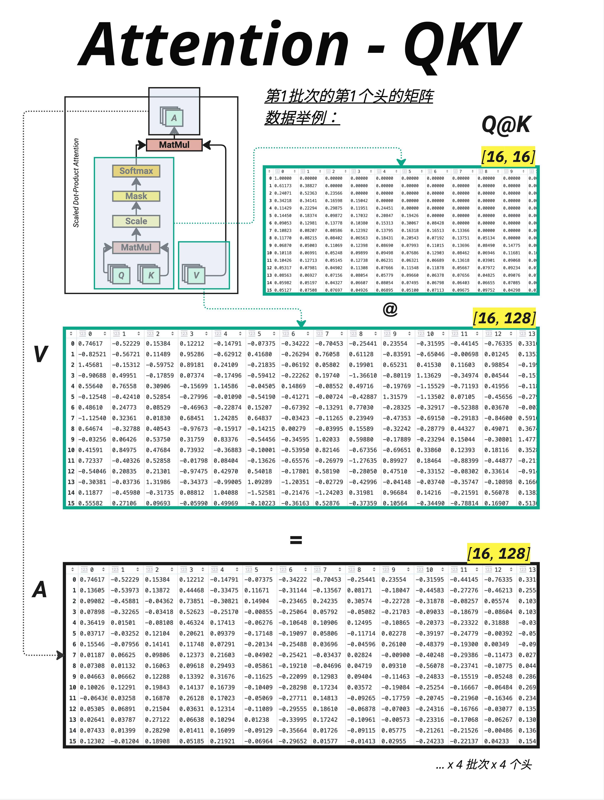
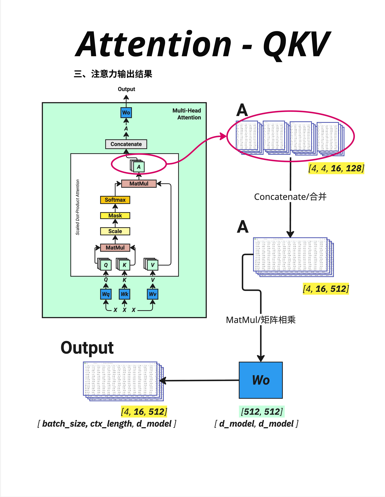
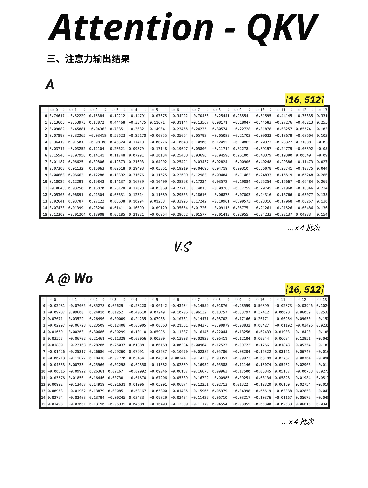

# 第 11 章：Multi-Head Attention - 多视角理解

> **一句话总结**：Multi-Head Attention 把 Attention 分成多个"头"，每个头关注不同的信息模式，就像用多双眼睛从不同角度观察同一个句子，最后把所有观察结果合并起来。

---

## 11.1 为什么需要多个头？

### 11.1.1 单头 Attention 的局限

在上一章，我们学习了 Attention 的完整计算流程。但那是**单头 Attention**——只有一组 Q、K、V。

单头 Attention 有一个问题：**只能学习一种注意力模式**。

但语言是多维度的！考虑这个句子：

> "The cat sat on the mat because it was tired."

理解这个句子需要关注多种关系：
- **语法关系**：sat 的主语是 cat
- **指代关系**：it 指的是 cat
- **位置关系**：on the mat 是 sat 的地点
- **因果关系**：because 连接原因和结果

一个头很难同时捕捉所有这些关系。

### 11.1.2 解决方案：多个头

Multi-Head Attention 的核心思想：**用多个 Attention 头，每个头学习不同的注意力模式**。

```
Head 1：可能关注语法结构（主谓宾）
Head 2：可能关注指代关系（代词和名词）
Head 3：可能关注位置信息（相邻的词）
Head 4：可能关注语义相似性（同义词）
...
```

最后把所有头的结果合并，得到更丰富的表示。

### 11.1.3 一个形象的类比

想象你在分析一幅画：
- **一双眼睛**：只能关注一个方面（比如颜色）
- **多双眼睛**：同时关注颜色、形状、纹理、构图...

Multi-Head Attention 就像给模型配了多双眼睛，每双眼睛专注于不同的特征。

---

## 11.2 切分多头：把 d_model 分成 num_heads 份

### 11.2.1 维度切分



Multi-Head 的核心操作是**切分维度**。

以 K（Key）为例，假设：
- d_model = 512
- num_heads = 4
- 则 d_key = d_model / num_heads = 512 / 4 = 128

切分过程：

```
原始 K: [batch_size, ctx_length, d_model]
      = [4, 16, 512]
              ↓
切分：  [batch_size, ctx_length, num_heads, d_key]
      = [4, 16, 4, 128]
              ↓
转置：  [batch_size, num_heads, ctx_length, d_key]
      = [4, 4, 16, 128]
```

### 11.2.2 为什么要转置？

转置是为了方便后续的矩阵运算。

转置后的形状 `[batch, num_heads, seq_len, d_key]` 可以理解为：
- 对于每个 batch 中的样本
- 有 num_heads 个独立的 Attention 头
- 每个头处理 seq_len 个位置
- 每个位置用 d_key 维向量表示

这样，**每个头可以独立计算 Attention**，互不干扰。

### 11.2.3 Q、K、V 都要切分

同样的切分操作应用于 Q、K、V：

```
Q: [4, 16, 512] → [4, 4, 16, 128]
K: [4, 16, 512] → [4, 4, 16, 128]
V: [4, 16, 512] → [4, 4, 16, 128]
```

现在我们有了 4 组 (Q, K, V)，可以进行 4 次独立的 Attention 计算。

### 11.2.4 两种切分实现方式



实际上，Multi-Head 的"切分"有两种等价的实现方式：

**方式一：在线性变换层进行多头"切分"**（左图）
- 概念上每个头有自己独立的 Wq、Wk、Wv 矩阵
- 每个头独立计算 Q = X @ Wq_h
- 这是**概念理解**的方式

**方式二：在向量上砍 N 刀均分"切分"**（右图）
- 用一个大的 Wq 矩阵生成完整的 Q
- 然后把 Q 沿着 d_model 维度切成 num_heads 份
- 这是**实际实现**的方式（更高效）

两种方式数学上是等价的！实际代码中通常使用方式二，因为：
- 一次大矩阵乘法比多次小矩阵乘法更高效
- GPU 更擅长处理大的连续矩阵运算

---

## 11.3 并行计算多个头

### 11.3.1 每个头独立计算



切分后，每个头独立执行 Attention 计算：

```
对于每个 head h = 1, 2, 3, 4：
    scores_h = Q_h @ K_h^T   [4, 16, 128] @ [4, 128, 16] = [4, 16, 16]
    weights_h = softmax(scores_h / √d_key)
    output_h = weights_h @ V_h   [4, 16, 16] @ [4, 16, 128] = [4, 16, 128]
```

### 11.3.2 维度追踪

让我们详细追踪一次计算：

**Q @ K^T**：
```
Q: [4, 4, 16, 128]
   batch heads seq d_key

K^T: [4, 4, 128, 16]
     batch heads d_key seq

Q @ K^T: [4, 4, 16, 16]
         batch heads seq seq
```

**Softmax(Q @ K^T) @ V**：
```
Attention Weights: [4, 4, 16, 16]
                   batch heads seq seq

V: [4, 4, 16, 128]
   batch heads seq d_key

Output: [4, 4, 16, 128]
        batch heads seq d_key
```

### 11.3.3 图中的数据示例

图中展示了第 1 批次的第 1 个头：
- Q @ K 结果是一个 [16, 16] 的注意力矩阵
- 乘以 V [16, 128] 得到 [16, 128] 的输出
- 这只是 4 个头中的一个！

---

## 11.4 合并多头输出

### 11.4.1 Concatenate：拼接所有头



计算完所有头后，需要把它们**合并**回去：

```
各头输出: [4, 4, 16, 128]
          batch heads seq d_key
              ↓
转置：     [4, 16, 4, 128]
          batch seq heads d_key
              ↓
合并：     [4, 16, 512]
          batch seq d_model
```

合并操作就是把最后两个维度"拼接"起来：
- 4 个头 × 128 维 = 512 维

### 11.4.2 Wo：输出投影

合并后还有一个**输出投影**：

```
A @ Wo
[4, 16, 512] @ [512, 512] = [4, 16, 512]
```

**Wo（Output Weight）** 是一个可学习的矩阵，作用是：
1. 融合不同头的信息
2. 把拼接的表示转换到统一的空间
3. 让模型学习如何组合各头的输出

### 11.4.3 为什么需要 Wo？

拼接后的向量是"机械地"把各头的输出放在一起，没有任何交互。

Wo 允许模型学习：
- 哪些头的输出更重要
- 不同头之间如何配合
- 最终输出应该是什么样的

---

## 11.5 输出对比

### 11.5.1 A vs A @ Wo



图中对比了两种输出：

**上方（A）**：合并后、Wo 之前的输出
- 形状：[16, 512]
- 是各头输出的简单拼接

**下方（A @ Wo）**：经过 Wo 投影后的最终输出
- 形状：[16, 512]
- 是经过混合和投影的结果

### 11.5.2 数值对比

虽然形状相同，但数值分布完全不同：
- A 的数值是各头独立计算的结果
- A @ Wo 的数值是所有头信息融合后的结果

这个最终输出会：
1. 替代原始的 token embedding
2. 进入下一层（LayerNorm → FFN）
3. 或者作为下一个 Block 的输入

---

## 11.6 Multi-Head Attention 完整流程

### 11.6.1 流程图

```
输入 X [batch, seq, d_model]
        ↓
   生成 Q, K, V（通过 Wq, Wk, Wv）
        ↓
   切分多头 [batch, num_heads, seq, d_key]
        ↓
   并行计算 Attention（每个头独立）
        ↓
   合并多头 [batch, seq, d_model]
        ↓
   输出投影（@ Wo）
        ↓
输出 [batch, seq, d_model]
```

### 11.6.2 PyTorch 代码

```python
# 代码示例
import torch
import torch.nn as nn
import torch.nn.functional as F

class MultiHeadAttention(nn.Module):
    def __init__(self, d_model, num_heads):
        super().__init__()
        self.d_model = d_model
        self.num_heads = num_heads
        self.d_key = d_model // num_heads

        # 四个可学习的权重矩阵
        self.Wq = nn.Linear(d_model, d_model)
        self.Wk = nn.Linear(d_model, d_model)
        self.Wv = nn.Linear(d_model, d_model)
        self.Wo = nn.Linear(d_model, d_model)

    def forward(self, x, mask=None):
        batch_size, seq_len, _ = x.shape

        # 1. 生成 Q, K, V
        Q = self.Wq(x)  # [batch, seq, d_model]
        K = self.Wk(x)
        V = self.Wv(x)

        # 2. 切分多头
        Q = Q.view(batch_size, seq_len, self.num_heads, self.d_key)
        K = K.view(batch_size, seq_len, self.num_heads, self.d_key)
        V = V.view(batch_size, seq_len, self.num_heads, self.d_key)

        # 转置: [batch, num_heads, seq, d_key]
        Q = Q.transpose(1, 2)
        K = K.transpose(1, 2)
        V = V.transpose(1, 2)

        # 3. 计算 Attention
        scores = torch.matmul(Q, K.transpose(-2, -1)) / (self.d_key ** 0.5)

        if mask is not None:
            scores = scores.masked_fill(mask == 0, float('-inf'))

        attention_weights = F.softmax(scores, dim=-1)
        attention_output = torch.matmul(attention_weights, V)

        # 4. 合并多头
        attention_output = attention_output.transpose(1, 2)  # [batch, seq, heads, d_key]
        attention_output = attention_output.contiguous().view(
            batch_size, seq_len, self.d_model
        )

        # 5. 输出投影
        output = self.Wo(attention_output)

        return output
```

---

## 11.7 关键数字

### 11.7.1 参数量计算

Multi-Head Attention 有四个权重矩阵：

| 矩阵 | 形状 | 参数量 |
|------|------|--------|
| Wq | [d_model, d_model] | d_model² |
| Wk | [d_model, d_model] | d_model² |
| Wv | [d_model, d_model] | d_model² |
| Wo | [d_model, d_model] | d_model² |

总参数量 = **4 × d_model²**

以 GPT-2 Small 为例（d_model = 768）：
- 每层 Attention 参数量 = 4 × 768² ≈ 236 万

### 11.7.2 常见配置

| 模型 | d_model | num_heads | d_key |
|------|---------|-----------|-------|
| GPT-2 Small | 768 | 12 | 64 |
| GPT-2 Medium | 1024 | 16 | 64 |
| GPT-2 Large | 1280 | 20 | 64 |
| GPT-3 | 12288 | 96 | 128 |
| LLaMA-7B | 4096 | 32 | 128 |

有趣的观察：
- d_key 通常是 64 或 128
- 不同模型通过调整 num_heads 来增加总维度

---

## 11.8 多头的可视化理解

### 11.8.1 每个头关注什么？

研究发现，不同的头确实会学习到不同的注意力模式：

| 头的类型 | 关注的模式 | 例子 |
|---------|-----------|------|
| **位置头** | 固定相对位置 | 总是关注前一个词 |
| **语法头** | 主谓宾关系 | 动词关注主语 |
| **语义头** | 相似含义 | 同义词互相关注 |
| **指代头** | 代词解析 | it 关注它指代的名词 |
| **分隔头** | 句子边界 | 关注标点符号 |

### 11.8.2 注意力模式示例

假设句子是 "The cat sat on the mat"：

```
Head 1（位置头）：
"sat" 主要关注 "cat"（前一个实词）

Head 2（语法头）：
"sat" 主要关注 "cat"（主语）

Head 3（语义头）：
"cat" 和 "mat" 互相有些关注（都是名词、押韵）

Head 4（指代头）：
暂时不活跃（没有代词）
```

### 11.8.3 头的冗余性

实际上，并非所有头都同等重要。研究表明：
- 有些头可以被"剪枝"掉，对性能影响很小
- 有些头学到的模式是冗余的
- 但保留更多头通常能提供更好的鲁棒性

---

## 11.9 Multi-Head vs Single-Head

### 11.9.1 计算量对比

假设 d_model = 512，num_heads = 8，d_key = 64：

**单头（d_key = 512）**：
- Q @ K^T：[seq, 512] @ [512, seq] → O(seq² × 512)

**多头（d_key = 64）**：
- 8 个头，每个：[seq, 64] @ [64, seq] → O(seq² × 64)
- 总计：8 × O(seq² × 64) = O(seq² × 512)

**计算量基本相同！**

### 11.9.2 效果对比

虽然计算量相同，但 Multi-Head 通常效果更好：
- 能捕捉更多样的注意力模式
- 更容易训练（每个头的任务更简单）
- 提供了一种"集成学习"的效果

### 11.9.3 为什么不用更多头？

增加头的数量意味着减小 d_key：

```
d_key = d_model / num_heads
```

如果 d_key 太小：
- 每个头的表达能力下降
- 可能无法捕捉复杂的模式

常见的 d_key 通常是 64 或 128，这是一个经验性的平衡点。

---

## 11.10 本章总结

### 11.10.1 核心概念

| 概念 | 解释 |
|------|------|
| **Multi-Head** | 把 Attention 分成多个头并行计算 |
| **num_heads** | 头的数量 |
| **d_key** | 每个头的维度 = d_model / num_heads |
| **切分** | 把 d_model 维度分成 num_heads 份 |
| **合并** | 把所有头的输出拼接回 d_model |
| **Wo** | 输出投影矩阵，融合各头信息 |

### 11.10.2 维度变化

```
输入:     [batch, seq, d_model]
             ↓
切分:     [batch, num_heads, seq, d_key]
             ↓
Attention: [batch, num_heads, seq, d_key]
             ↓
合并:     [batch, seq, d_model]
             ↓
Wo 投影:  [batch, seq, d_model]
```

### 11.10.3 核心认知

> **Multi-Head Attention 是 Transformer 的核心创新之一。它把 Attention 分成多个头，每个头可以学习不同的注意力模式——有的关注语法，有的关注语义，有的关注位置。最后通过 Concatenate + Wo 把所有头的信息融合起来。这让模型能够从多个角度理解语言，比单头 Attention 更加强大。**

---

## 本章交付物

学完这一章，你应该能够：

- [ ] 解释为什么需要 Multi-Head Attention
- [ ] 说出 d_key = d_model / num_heads 的关系
- [ ] 理解切分和合并的维度变化
- [ ] 知道 Wo 矩阵的作用（融合各头信息）
- [ ] 解释不同头可能学习到的不同模式

---

## Part 3 总结

恭喜你完成了 **Part 3：Attention 机制**！

让我们回顾这三章学到的内容：

| 章节 | 主题 | 核心内容 |
|------|------|---------|
| 第 8 章 | 线性变换 | 矩阵乘法 = 投影/相似度计算 |
| 第 9 章 | Attention 几何逻辑 | 用点积计算相似度，找相关的词 |
| 第 10 章 | QKV | Q 查询、K 键、V 值的完整计算流程 |
| 第 11 章 | Multi-Head | 多个头从不同角度理解句子 |

**Attention 公式（完整版）**：

$$
\text{MultiHead}(Q, K, V) = \text{Concat}(\text{head}_1, ..., \text{head}_h) W^O
$$

其中：
$$
\text{head}_i = \text{Attention}(QW_i^Q, KW_i^K, VW_i^V)
$$

$$
\text{Attention}(Q, K, V) = \text{softmax}\left(\frac{QK^T}{\sqrt{d_k}}\right)V
$$

---

## 下一章预告

Part 4 将介绍 **完整架构**——把所有组件组装起来：

- 第 13 章：残差连接与 Dropout
- 第 14 章：词嵌入 + 位置信息的深层逻辑
- 第 15 章：Transformer 完整前向传播
- 第 16 章：训练 vs 推理的异同

我们将把前面学到的所有组件串起来，看看完整的 Transformer 是如何工作的！
