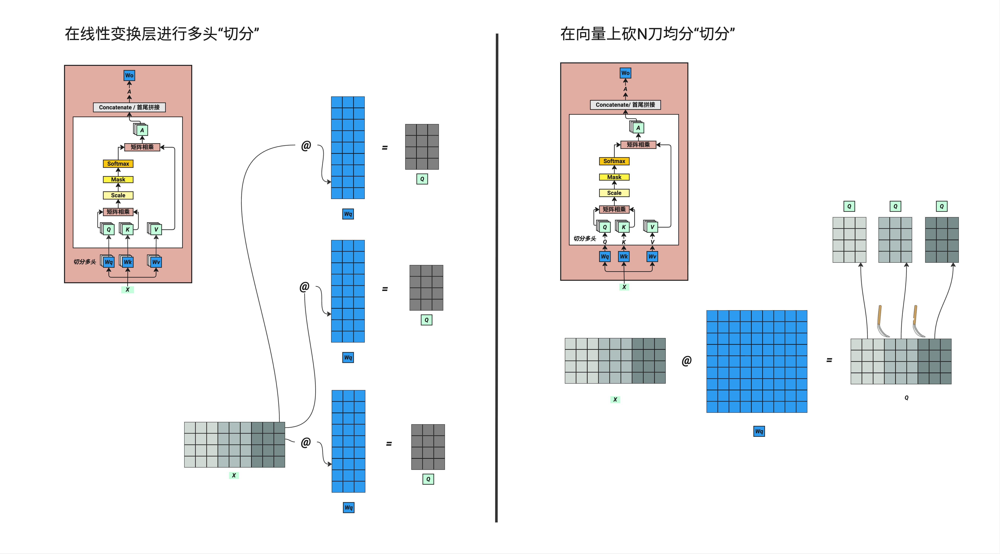

# 第 12 章：QKV 输出的本质

> **一句话总结**：QKV 的本质不是在"预测"什么，而是在不断调整每个 Token 的嵌入向量，让它们在语境中变得更有意义。

---

## 12.1 今天这一章非常轻松

今天这一章非常轻松，也是 Attention 机制的收尾章节。上一章我们已经得出了 Attention 的核心输出 **A**，大家已经非常清晰了它是怎么得出来的。

那么这一章其实很简单，还有两步我们就可以完整理解多头注意力机制了。

**本章要讲的三个核心概念**：
1. **Concatenate**：把多个头的结果合并回来
2. **线性变换 WO**：最后一次矩阵乘法
3. **训练的本质**：QKV 到底在调整什么

了解了这些之后，我们接下来讲 Layer Normalization 和残差连接就更好理解了。

---

## 12.2 A 的形状：四维矩阵不可怕

### 12.2.1 QKV 注意力可视化



上图展示了 Attention 机制的核心过程：

- **Q（Query）**：当前 token "成" 的查询向量
- **K（Key）**：所有历史 token "中华人民共和国 中华人民共和国" 的键矩阵
- **V（Value）**：所有历史 token 的值矩阵

Q 会和 K 中的每一行计算相似度（点积），得到注意力权重，然后用这些权重对 V 进行加权求和。这就是"注意力"的本质：**用 Q 去查询 K，找到相关的 V，然后融合信息**。

### 12.2.2 形状分析

首先回顾一下我们的 A 是什么形状。它是一个四维矩阵：

```
A 的形状：[4, 4, 16, 128]
           │  │  │   └── 每个头的维度 (d_head = 512/4 = 128)
           │  │  └────── Token 序列长度 (seq_len = 16)
           │  └───────── 头的数量 (num_heads = 4)
           └──────────── 批次大小 (batch_size = 4)
```

这四个维度分别代表：
- **第一个 4**：我们有 4 个样本（batch）
- **第二个 4**：把整体 512 维度切成了 4 份，每一份叫一个"头"
- **16**：每个样本有 16 个 Token（文字）
- **128**：每个头的维度是 128

> 看起来是四维矩阵，但别怕！我们实际处理的都是后面两维，也就是每一个"小片"。每个小片都是 **16×128** 的形状。

### 12.2.2 真实模型的形状

拿 **GPT-2** 来举例子，它有 1.5 亿参数：
- d_model = 768
- num_heads = 12
- d_head = 64

拿 **LLAMA-7B** 来举例子：
- d_model = 4096
- num_heads = 32
- d_head = 128

所以真实模型的 A 的形状会大得多，但原理是一样的。

### 12.2.3 图示理解

<!-- 插图位置：images/ch12-attention-shape.png -->
<!-- 建议插图：展示 4×4×16×128 的四维矩阵如何拆解成多个 16×128 的小片 -->

```
┌─────────────────────────────────────┐
│  Batch 1                            │
│  ┌─────┬─────┬─────┬─────┐          │
│  │Head1│Head2│Head3│Head4│ ← 4个头  │
│  │16×128│16×128│16×128│16×128│      │
│  └─────┴─────┴─────┴─────┘          │
├─────────────────────────────────────┤
│  Batch 2  (同样结构)                │
├─────────────────────────────────────┤
│  Batch 3  (同样结构)                │
├─────────────────────────────────────┤
│  Batch 4  (同样结构)                │
└─────────────────────────────────────┘
```

---

## 12.3 Concatenate：把头合并回来

### 12.3.1 合并操作

这一步叫做 **Concatenate**，也就是"合并"的意思。

它在做的事情很简单：把我们之前切开的 4 个头重新并在一起，回到原来的形状。

```
合并前：[4, 4, 16, 128]  →  4个头，每个128维
合并后：[4, 16, 512]     →  1个完整的512维
```

就是把后面两个维度 `[4, 16, 128]` 变回 `[16, 512]`。

### 12.3.2 为什么要这样做？

> 这个概念是很多人不清晰的，包括我第一次学的时候也不明白：为什么要先切开再合并？绕一圈有什么意义？

答案是：**多头的意义在于"多视角"**。

每个头关注的"角度"不同：
- 头 1 可能关注语法结构
- 头 2 可能关注语义相似度
- 头 3 可能关注位置关系
- 头 4 可能关注主题相关性

切开是为了让每个头独立学习，合并是为了把多个视角的信息融合起来。

> **权衡思维**：多头带来更丰富的表示能力，但也意味着更多的参数和计算量。头数不是越多越好，需要在表达能力和计算效率之间找平衡。

---

## 12.4 最后一步：线性变换 WO

### 12.4.1 WO 是什么

合并回来之后，又有一个矩阵叫 **WO**（Output 的线性变换）。

```
形状：WO 是 512×512 的矩阵
操作：A × WO → 最终输出
```

这个 WO 和我们之前的 WQ、WK、WV 是一样的：
- 都是 **512×512** 维度
- 都是**随机初始化**的矩阵
- 都是**可训练的权重**（图中蓝色的部分）

### 12.4.2 权重共享的规则

> 这个概念是很多人不清晰的：这个 W 怎么用？每次是不是用同样的？我来解释一下。

**同一个 Transformer Block 内**：
- 所有头共用同一个 WQ
- 所有头共用同一个 WK
- 所有头共用同一个 WV
- 输出只有一个 WO

**不同 Transformer Block 之间**：
- 每个 Block 有**自己独立的一套** WQ、WK、WV、WO
- 原论文用了 12 个 Block，所以有 12 套不同的权重

```
Block 1: WQ₁, WK₁, WV₁, WO₁  ← 第1套权重
Block 2: WQ₂, WK₂, WV₂, WO₂  ← 第2套权重
...
Block 12: WQ₁₂, WK₁₂, WV₁₂, WO₁₂  ← 第12套权重
```

每个 Block 学习到自己这一层的权重，然后存起来。进入下一个 Block 时，这些值又更新了，又存起来。

### 12.4.3 在 PyTorch 里怎么写

在 PyTorch 的 `nn.MultiheadAttention` 里，这些权重是封装好的：

```python
# PyTorch 封装
self.attn = nn.MultiheadAttention(embed_dim=512, num_heads=4)

# 内部其实就是这些权重矩阵
# self.attn.in_proj_weight  →  包含 WQ, WK, WV
# self.attn.out_proj.weight →  就是 WO
```

如果你用 Hugging Face 的 transformers 库，这些都是自动处理的。

---

## 12.5 核心理解：Q×K 到底在干什么？

### 12.5.1 形状回顾

我们来回顾一下 Q 乘以 K 出来的是什么。

把第一批次的第一个头拿出来看：Q×K 的结果是一个 **16×16** 的方阵。

```
      Token1 Token2 Token3 ... Token16
Token1  0.2   0.1    0.05  ...  0.01
Token2  0.15  0.3    0.1   ...  0.02
Token3  0.08  0.12   0.25  ...  0.03
...
Token16 0.01  0.02   0.01  ...  0.4
```

### 12.5.2 几何理解

这个矩阵怎么理解？

- **每一行**：代表一个文字的 Token
- **每一列**：也代表一个文字的 Token
- **每个格子**：就是这两个文字之间的"关注度"

经过 Softmax 之后，每一行的数值都变成了**百分比形式**，加起来等于 100%。

> 所以 Q×K 在做的事情就是：**求每一个文字对应其他文字关注度的百分比**。

把它组成矩阵形式，正好是一个正方形，方便一一对应每一个文字的关系。

### 12.5.3 真实场景理解

想象你在用 ChatGPT 翻译一段话："The cat sat on the mat"。

当模型处理到 "sat" 这个词的时候，Attention 机制在做的事情就是：
- "sat" 应该关注 "cat" 多少？（主语）→ 可能 30%
- "sat" 应该关注 "on" 多少？（介词）→ 可能 20%
- "sat" 应该关注 "mat" 多少？（宾语）→ 可能 25%
- ...

这些百分比就是 Q×K 计算出来的。

---

## 12.6 V 的作用：把关注度应用到原始数据

### 12.6.1 V 是什么

Q×K 得出的关注度矩阵只是一个"计算符号"，我们要把它应用到原始数据中去。

V 是什么呢？就是我们最初的训练样本文字：
- 16 个 Token
- 每个 Token 有 128 维（因为是单头的切片）

### 12.6.2 乘法的含义

把 (Q×K) 和 V 相乘，结果形状还是 16×128，不变。

它在做的事情是什么？

我们最初初始化的每个文字 Token 信息，在不同维度下这些初始化的数字是**没有什么意义的**——都是随机数。

我们要通过学习，让这些数字变得更有意义。

> **核心洞察**：(Q×K) × V 实际上就是把每个小格的数字给它**更新**了。

简单来说：

```
我们在做的事情 = 把原始的 X（也就是 V）的初始化数值调准一些
```

干的其实就是这件事情。

---

## 12.7 训练的本质：不断调准

### 12.7.1 一次循环调一点点

我们一次训练循环，调准一点点。
下一次循环，再调准一点点。
通过不断的循环，最终把每个 Token 对应的数字调得非常准。

### 12.7.2 一个具体例子

> 这里有个非常重要的概念是很多人忽略的，包括我第一次学的时候也没搞清楚。

有个例子：假设我们训练语料里有"小沈阳"这三个字。

**第一次训练**：
- "小"字的 Token 初始化时数字是随机的，没什么意义
- 经过一次训练后，这些数字有了一些意义，大小做了一些变动

**第二次训练**：
- 再遇到"小"字的时候
- 我们就用**上一次更新过的**向量来代表它
- 然后继续更新

**第三次、第四次...**：
- 每次遇到"小"字，都用之前更新过的 Token Embedding
- 再继续做运算和更新

```
初始化的"小" → 第1次更新 → 第2次更新 → ... → 最终的"小"
[随机数字]      [有点意义]   [更有意义]       [语义丰富]
```

这就是为什么叫"嵌入向量"（Embedding）——每个词都被嵌入到一个有意义的向量空间中。

---

## 12.8 QKV Attention 的两大作用

### 12.8.1 总结

所以说，QKV Attention 的作用**两部分**：

**第一部分：更新 Token Embedding**
- 非常明显的作用
- 我们在更新初始化的 Token 对应的向量表
- 把它们的值调得非常准确
- 让每个 Token 在各自的语境下变得有意义

**第二部分：更新权重矩阵**
- 同时在更新蓝色的权重（WQ、WK、WV、WO）
- 这些线性变换的权重矩阵也通过每次计算更新一下

这两个部分**相互作用**：
- Token Embedding 在变
- 权重矩阵也在变
- 它们共同让最终的 Attention 结果在不同语义下学习得越来越准确

---

## 12.9 放回整体架构理解

### 12.9.1 多头注意力在做什么

回到整体的 Transformer 架构：

红色的多头注意力机制在做的事情就是：
1. **调整 Token 初始化值**：每次经过这个模块，都调整一下嵌入向量
2. **调整权重矩阵**：蓝色的线性变换部分也在学习

所以我们有**两方面的参数**：
- Token Embedding 表（词汇表每个词对应的向量）
- 权重矩阵（WQ、WK、WV、WO × 层数）

### 12.9.2 参数量计算

> 如何计算参数量呢？可以这么去算：

以 12 层的模型为例：
- 每一层有 4 个权重矩阵（WQ、WK、WV、WO）
- 每个矩阵是 512×512 = 262,144 个参数
- 4 × 262,144 × 12 = 约 1260 万参数（仅 Attention 部分）
- 还有 Token Embedding、FFN 等其他部分

整体循环几万次甚至十几万次训练之后，模型就会形成一个几千亿参数的大模型文件。

### 12.9.3 真实模型对比

| 模型 | 层数 | d_model | 参数量 |
|-----|-----|---------|-------|
| GPT-2 Small | 12 | 768 | 117M |
| GPT-2 Medium | 24 | 1024 | 345M |
| GPT-2 Large | 36 | 1280 | 774M |
| LLAMA-7B | 32 | 4096 | 7B |
| LLAMA-70B | 80 | 8192 | 70B |

<!-- 插图位置：images/ch12-transformer-block.png -->
<!-- 建议插图：完整的 Transformer Block 结构图，标注哪些是可训练参数 -->

---

## 本章要点回顾

- [x] A 的形状是 `[batch, heads, seq_len, d_head]`，四维但别怕
- [x] Concatenate 把多头结果合并回 `[batch, seq_len, d_model]`
- [x] WO 是最后一个线性变换，和 WQ/WK/WV 一样是可训练权重
- [x] 每个 Transformer Block 有自己独立的一套权重
- [x] Q×K 的本质是计算"关注度百分比"
- [x] (Q×K)×V 的本质是用关注度去更新 Token 向量
- [x] 训练 = 不断调准 Token Embedding + 不断调准权重矩阵

---

## 插图清单

本章建议配图：

| 图片文件名 | 内容描述 |
|-----------|---------|
| `ch12-attention-shape.png` | 4×4×16×128 四维矩阵的拆解示意图 |
| `ch12-attention-matrix.png` | 16×16 注意力矩阵热力图 |
| `ch12-concatenate.png` | 多头合并过程示意图 |
| `ch12-transformer-block.png` | 完整 Transformer Block 结构图 |
| `ch12-training-update.png` | Token Embedding 更新过程示意图 |

---

## 下一章预告

了解了 QKV 的完整流程之后，我们接下来要讲比较重要的——**残差连接**和 **Layer Normalization**。

这块也很简单，但非常重要。它们解决了深度网络训练中的两个大问题：
- **残差连接**：解决梯度消失，让信息能跳过某些层直接传递
- **Layer Norm**：解决内部协变量偏移，稳定训练过程

好了，这一章就到这里，拜拜。
