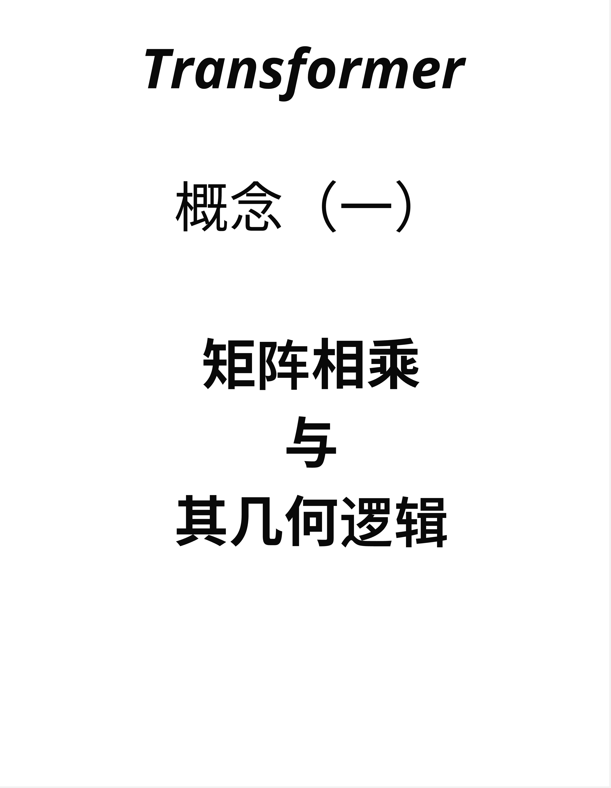
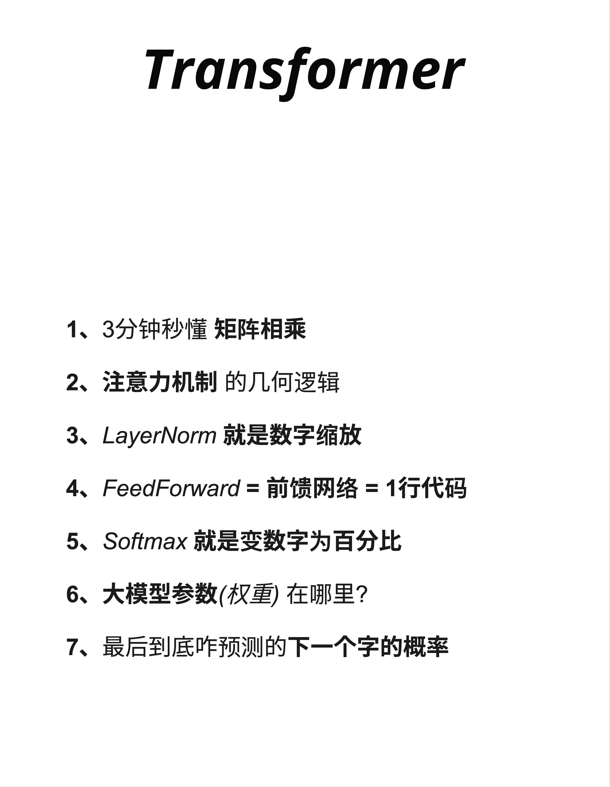
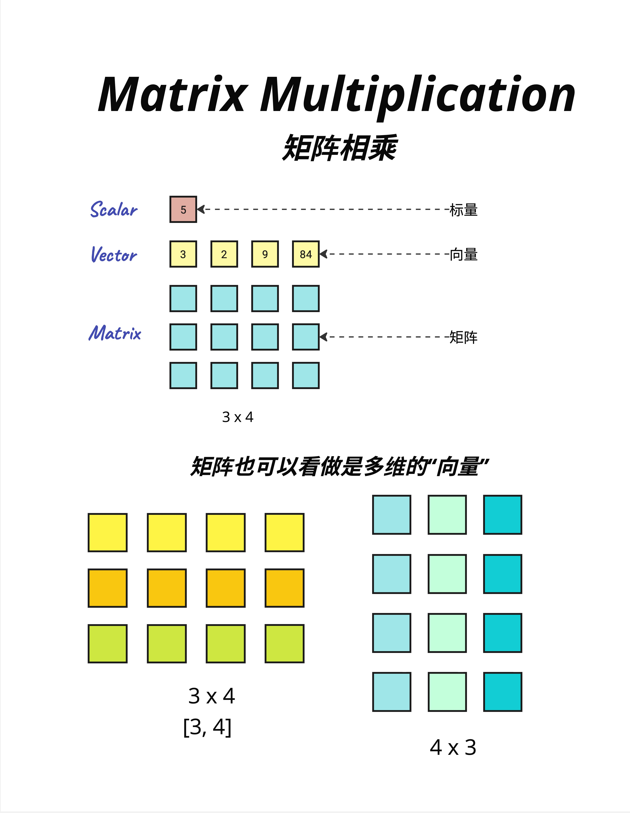
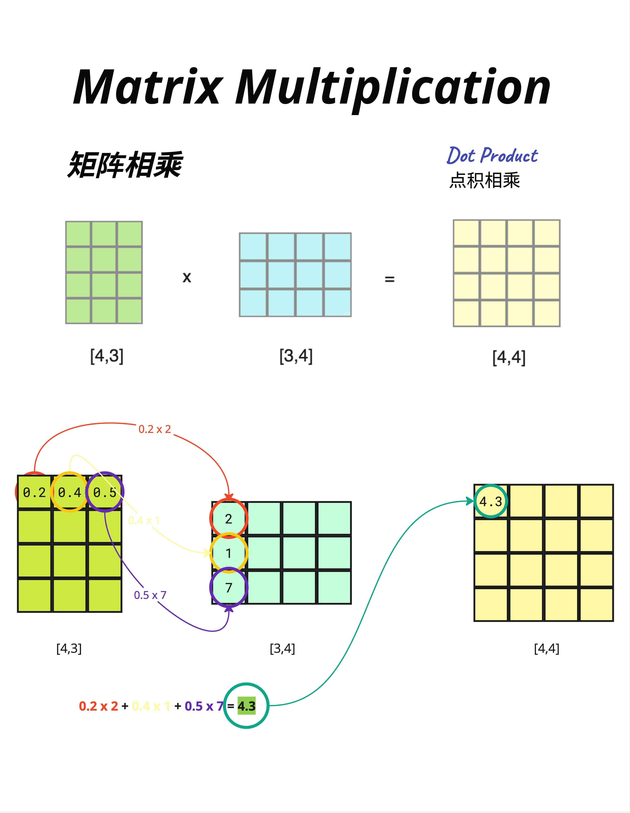
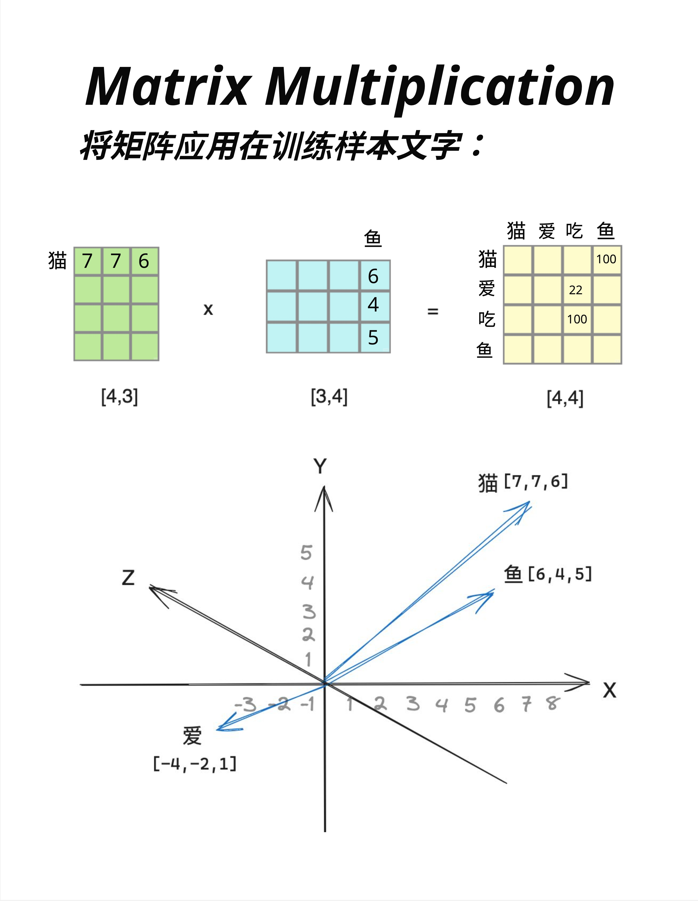
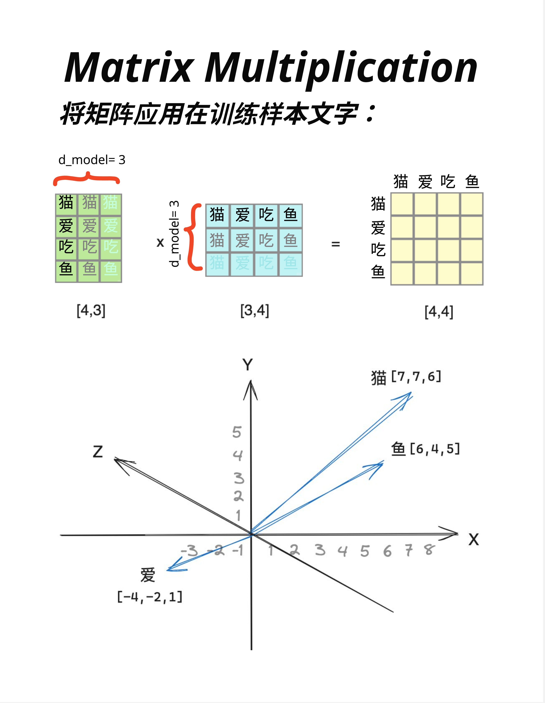
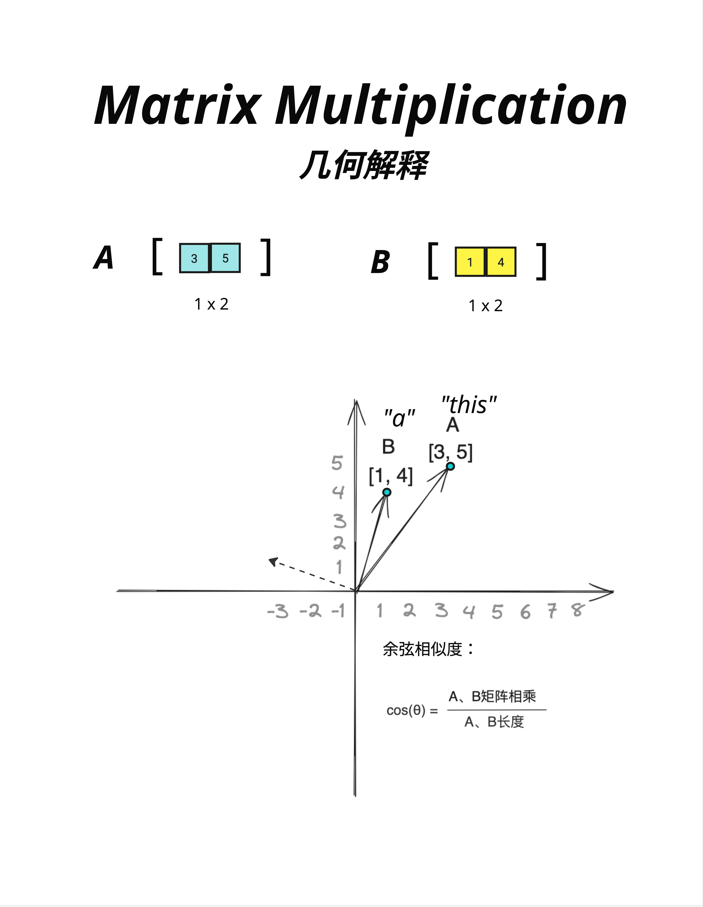
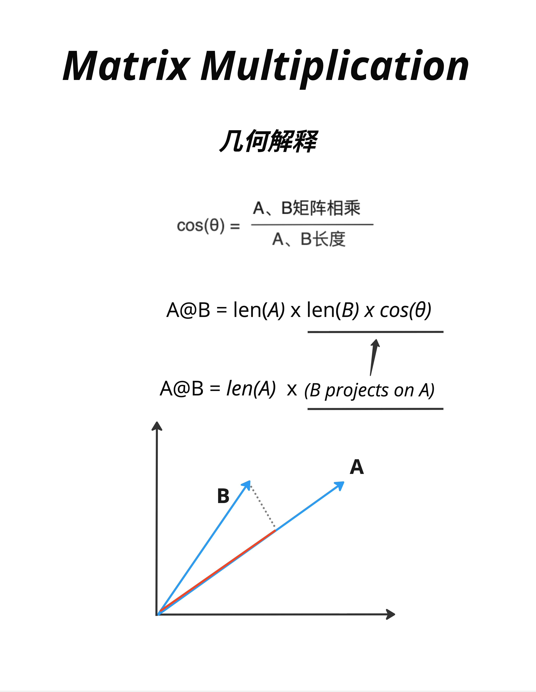

# 第 8 章：线性变换的几何意义 - 矩阵乘法的本质

> **一句话总结**：矩阵乘法不只是数字运算，它的几何本质是"投影"——把一个向量投射到另一个向量上。理解这一点，是理解 Attention 机制的关键。

---

## 8.1 为什么要学矩阵？



在进入 Attention 机制之前，我们需要先搞清楚一个数学基础：**矩阵乘法**。

你可能会问：我又不是要当数学家，为什么要学这个？

答案很简单：**Transformer 里到处都是矩阵乘法**。



看这张图，Transformer 的核心概念：
1. 3分钟秒懂**矩阵相乘**
2. **注意力机制**的几何逻辑
3. LayerNorm 就是数字缩放
4. FeedForward = 前馈网络 = 1行代码
5. Softmax 就是变数字为百分比
6. 大模型参数(权重)在哪里？
7. 最后到底咋预测的下一个字的概率

**矩阵相乘**排在第一位，因为它是理解后面所有内容的基础。

这一章，我们会用最直观的方式，让你"看懂"矩阵乘法在做什么。

---

## 8.2 基础概念：标量、向量、矩阵



在开始之前，让我们统一一下术语。

### 8.2.1 标量（Scalar）

**标量就是一个数字**。

```
5
```

就这么简单。温度、价格、年龄，都是标量。

### 8.2.2 向量（Vector）

**向量是一组有序的数字**。

```
[3, 2, 9, 84]
```

向量可以表示很多东西：
- 位置：[x, y, z] = [3, 5, 2]
- 颜色：[R, G, B] = [255, 128, 0]
- 词向量：一个词的语义表示

### 8.2.3 矩阵（Matrix）

**矩阵是二维的数字表格**。

```
3 × 4 的矩阵：
┌─────────────┐
│ □ □ □ □ │
│ □ □ □ □ │
│ □ □ □ □ │
└─────────────┘
```

矩阵可以看作是"多个向量的堆叠"：
- 3×4 的矩阵 = 3 个长度为 4 的行向量
- 或者 = 4 个长度为 3 的列向量

### 8.2.4 在 Transformer 中

- **标量**：学习率、温度参数
- **向量**：一个 token 的 embedding
- **矩阵**：一批 token 的 embedding、权重矩阵

---

## 8.3 矩阵乘法：计算过程

### 8.3.1 维度规则

矩阵乘法的维度规则：

```
[A, B] × [B, C] = [A, C]
```

中间的维度必须相同（都是 B），结果取两边的维度。

### 8.3.2 手算示例



让我们看一个具体例子：

```
[4,3] × [3,4] = [4,4]
```

计算过程（以结果矩阵的第一个元素 4.3 为例）：

```
第一行 × 第一列：
[0.2, 0.4, 0.5] · [2, 1, 7]ᵀ
= 0.2×2 + 0.4×1 + 0.5×7
= 0.4 + 0.4 + 3.5
= 4.3
```

**核心操作就是"点积"（Dot Product）**：对应位置相乘，然后求和。

### 8.3.3 为什么叫"点积"？

因为数学上用一个点（·）来表示这个操作：

```
A · B = a₁b₁ + a₂b₂ + a₃b₃ + ...
```

在 Python/NumPy 中用 `@` 符号：

```python
C = A @ B  # 矩阵乘法
```

---

## 8.4 矩阵乘法 vs 线性变换


### 8.4.1 两种视角

同样的矩阵乘法，可以从两个角度理解：

**视角一：矩阵相乘（Dot Product）**

```
[4,3] × [3,4] = [4,4]
```

两个矩阵相乘，得到一个新矩阵。

**视角二：线性变换（Linear Transformation）**

```
[4,3] × [3,1] = [4,1]
```

用一个矩阵"变换"一个向量，得到一个新向量。

### 8.4.2 线性变换的直觉

"线性变换"这个名字听起来很数学，但本质很简单：

> **用矩阵乘以向量，把向量从一个空间"变换"到另一个空间。**

比如：
- 输入：3 维向量
- 权重矩阵：[4,3]
- 输出：4 维向量

向量的维度从 3 变成了 4——这就是"变换"。

在 Transformer 中：
- Embedding 把 token ID 变换成 d_model 维向量
- Attention 的 Wq、Wk、Wv 把向量变换到不同的"空间"
- FFN 把向量变换到更高维再变回来

**到处都是线性变换！**

---

## 8.5 几何意义：向量空间可视化

现在让我们进入最精彩的部分——理解矩阵乘法的**几何意义**。

### 8.5.1 词向量的3D可视化



假设我们有一个简化的词向量空间，每个词用 3 维向量表示：

```
猫 = [7, 7, 6]
鱼 = [6, 4, 5]
爱 = [-4, -2, 1]
```

把它们画在 3D 坐标系中：
- **猫**和**鱼**的向量方向相近（都在第一象限）
- **爱**的向量指向完全不同的方向

这反映了语义关系：猫和鱼（名词、具体事物）比较相近，而爱（动词、抽象概念）很不同。

### 8.5.2 矩阵乘法生成相似度矩阵

看图中上方的矩阵乘法：

```
词向量矩阵 [4,3] × 鱼向量 [3,4] = 相似度矩阵 [4,4]
```

结果矩阵的每个元素，表示两个词的"相似程度"：
- 猫-鱼：100（很相似）
- 爱-鱼：22（不太相似）
- 吃-鱼：100（很相似，因为猫爱吃鱼！）

**矩阵乘法天然就能计算"相似度"！** 这就是为什么 Attention 机制用矩阵乘法来计算注意力权重。

### 8.5.3 d_model 的含义



在这张图中，我们标注了 `d_model = 3`：
- 每个词用 3 维向量表示
- 矩阵的列数 = d_model

在真实的 Transformer 中：
- GPT-2 Small：d_model = 768
- GPT-3：d_model = 12288
- LLaMA-7B：d_model = 4096

维度越高，表达能力越强，但计算量也越大。

---

## 8.6 点积的几何解释：余弦相似度

### 8.6.1 两个向量的夹角



当两个向量做点积时，结果和它们的**夹角**有关：

```
cos(θ) = (A · B) / (|A| × |B|)
```

也就是说：

```
A · B = |A| × |B| × cos(θ)
```

其中：
- `|A|` 是向量 A 的长度
- `|B|` 是向量 B 的长度
- `θ` 是两个向量的夹角

### 8.6.2 几何直觉

看图中的例子：

```
A = "this" = [3, 5]
B = "a" = [1, 4]
```

两个向量在 2D 平面上，它们之间有一个夹角 θ。

- **夹角小**（cos(θ) 接近 1）→ 点积大 → 很相似
- **夹角大**（cos(θ) 接近 0）→ 点积小 → 不太相似
- **垂直**（cos(θ) = 0）→ 点积为 0 → 完全不相关
- **相反方向**（cos(θ) = -1）→ 点积为负 → 相反/对立

### 8.6.3 这就是 Attention 的核心！

在 Attention 机制中：
- Query 向量和 Key 向量做点积
- 点积越大，说明它们越"相似"
- 越相似的位置，获得越高的注意力权重

**Attention 本质上就是在用点积计算"相似度"！**

---

## 8.7 投影：另一种几何解释

### 8.7.1 投影的概念



点积还有另一种几何解释：**投影**。

```
A @ B = |A| × (B 在 A 方向上的投影长度)
```

或者写成：

```
A @ B = len(A) × (B projects on A)
```

### 8.7.2 可视化

看图中的示意：
- 向量 A（红色）
- 向量 B（蓝色）
- B 在 A 方向上的投影（虚线）

点积的结果 = A 的长度 × 投影的长度

### 8.7.3 投影的直觉

"投影"可以理解为："B 有多少成分在 A 的方向上"。

在 NLP 中：
- 如果"国王"和"皇室"的投影很大，说明它们在"皇室"这个维度上很相关
- 如果"国王"和"苹果"的投影很小，说明它们没什么关系

---

## 8.8 总结：为什么这对 Attention 很重要

### 8.8.1 Attention 的核心计算

Attention 的公式：

```
Attention(Q, K, V) = softmax(QKᵀ / √d) × V
```

其中 `QKᵀ` 就是 **Query 和 Key 的矩阵乘法**。

现在你知道了：
- 这个矩阵乘法计算的是 Query 和 Key 的**相似度**
- 相似度高的位置会获得更高的注意力权重
- 几何上，这是在计算两个向量的**夹角余弦**或**投影**

### 8.8.2 核心洞察

| 数学操作 | 几何意义 | 在 Attention 中的作用 |
|---------|---------|---------------------|
| 点积 A·B | 相似度 / 投影 | 计算 Q 和 K 的相关程度 |
| 矩阵乘法 | 批量点积 | 一次计算所有位置的相似度 |
| Softmax | 归一化 | 把相似度变成概率分布 |

### 8.8.3 记住这句话

> **矩阵乘法的几何本质是"投影"——计算一个向量在另一个向量方向上有多少成分。Attention 就是利用这个原理，找出哪些位置和当前位置最"相关"。**

---

## 8.9 本章总结

### 8.9.1 核心概念

| 概念 | 解释 |
|------|------|
| **标量** | 单个数字 |
| **向量** | 一组有序的数字 |
| **矩阵** | 二维数字表格 |
| **点积** | 对应相乘再求和 |
| **线性变换** | 用矩阵变换向量的维度 |
| **余弦相似度** | 两向量夹角的余弦值 |
| **投影** | 一个向量在另一个方向上的分量 |

### 8.9.2 关键公式

**点积**：
```
A · B = a₁b₁ + a₂b₂ + ... + aₙbₙ
```

**余弦相似度**：
```
cos(θ) = (A · B) / (|A| × |B|)
```

**投影**：
```
A · B = |A| × |B| × cos(θ)
```

### 8.9.3 核心认知

> **矩阵乘法不是抽象的数学运算，它有直观的几何意义：计算相似度、做投影。理解这一点，Attention 机制就不再神秘了——它就是在用矩阵乘法找"相关的内容"。**

---

## 本章交付物

学完这一章，你应该能够：

- [ ] 说出矩阵乘法的维度规则 `[A,B] × [B,C] = [A,C]`
- [ ] 手算简单的点积（对应相乘再求和）
- [ ] 解释点积的几何意义（余弦相似度、投影）
- [ ] 理解为什么 Attention 用矩阵乘法计算相似度

---

## 下一章预告

有了矩阵乘法的几何直觉，下一章我们正式进入 **Attention 机制**。

我们会回答这些问题：
- 为什么要用点积计算注意力？
- Query、Key、Value 到底是什么？
- Attention 的计算流程是怎样的？

准备好了吗？让我们揭开 Transformer 最核心部分的面纱！
