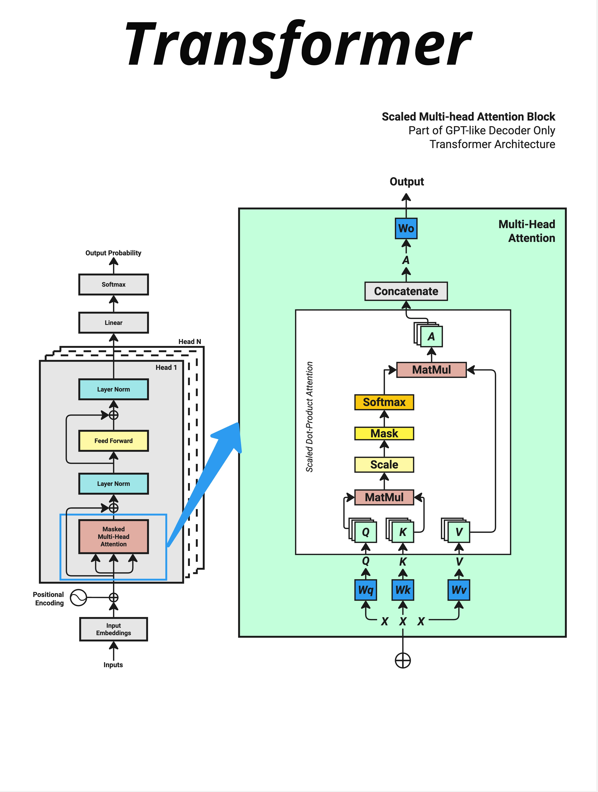
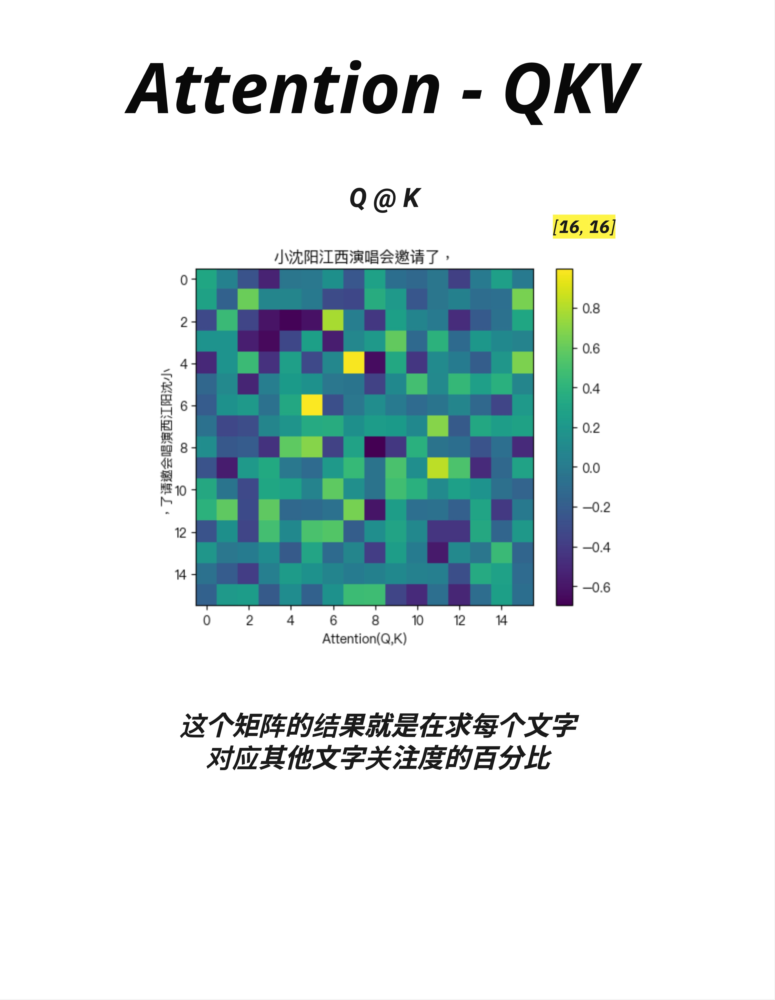

# 第 9 章：Attention 的几何逻辑 - 为什么是点积

> **一句话总结**：Attention 机制的核心是用点积计算"相似度"——找出句子中哪些词和当前词最相关，然后把注意力集中在那里。这就是 Transformer 理解语言的秘密武器。

---

## 9.1 回顾：我们已经知道什么

在进入 Attention 之前，让我们回顾一下前面学到的内容：

| 章节 | 学到的概念 | 核心作用 |
|------|-----------|---------|
| 第4章 | Tokenization + Embedding | 文字 → Token ID → 向量 |
| 第5章 | Positional Encoding | 给向量添加位置信息 |
| 第6章 | LayerNorm + Softmax | 数字缩放 + 数字变概率 |
| 第7章 | 神经网络层（FFN） | 处理和存储知识 |
| 第8章 | 线性变换 | 矩阵乘法 = 计算相似度/投影 |

现在，我们终于要进入 Transformer 最核心的部分：**Attention（注意力机制）**。

---

## 9.2 Attention 在架构中的位置



看这张图，左边是完整的 Transformer 架构，右边是 **Multi-Head Attention** 的内部结构。

### 9.2.1 Transformer Block 的结构

每个 Transformer Block 包含两个主要部分：

```
输入
  ↓
Layer Norm
  ↓
Masked Multi-Head Attention  ← 这就是我们要学的！
  ↓
残差连接 + Dropout
  ↓
Layer Norm
  ↓
Feed Forward（FFN）
  ↓
残差连接 + Dropout
  ↓
输出
```

**Attention 是每个 Block 的第一个核心组件**，它负责让模型"理解"词与词之间的关系。

### 9.2.2 Attention 的内部流程

右边的绿色框展示了 **Scaled Dot-Product Attention** 的完整流程：

```
输入 X
  ↓
生成 Q, K, V（通过 Wq, Wk, Wv 三个权重矩阵）
  ↓
MatMul（Q @ K^T，计算相似度）
  ↓
Scale（除以 √d_key，缩放）
  ↓
Mask（遮挡未来信息，仅在 Decoder 中使用）
  ↓
Softmax（转换为概率分布）
  ↓
MatMul（与 V 相乘，加权求和）
  ↓
Concatenate（多头合并）
  ↓
Wo（输出投影）
  ↓
输出
```

这一章，我们先建立 Attention 的**几何直觉**，理解为什么要用点积。下一章再详细讲 Q、K、V 是什么。

---

## 9.3 为什么需要 Attention？

### 9.3.1 语言理解的核心问题

考虑这个句子：

> "小沈阳江西演唱会邀请了，"

当模型要预测下一个词时，它需要理解：
- "邀请了"后面应该跟什么？
- 是"谁"被邀请？还是"邀请了谁"？
- "小沈阳"和"邀请"有什么关系？
- "江西演唱会"是地点还是事件？

**每个词的含义，都依赖于它和其他词的关系。**

### 9.3.2 传统方法的局限

在 Transformer 之前，处理序列的主流方法是 RNN（循环神经网络）：

```
词1 → 词2 → 词3 → 词4 → 词5 → ...
      ↘    ↘    ↘    ↘
      隐状态传递
```

RNN 的问题：
1. **顺序处理**：必须一个词一个词地处理，无法并行
2. **长距离依赖**：信息在传递过程中会衰减，很难记住很远的词
3. **计算效率低**：序列越长，计算时间越长

### 9.3.3 Attention 的解决方案

Attention 的核心思想是：**让每个词都能直接"看到"所有其他词**。

```
        词1  词2  词3  词4  词5
词1      ↔    ↔    ↔    ↔    ↔
词2      ↔    ↔    ↔    ↔    ↔
词3      ↔    ↔    ↔    ↔    ↔
词4      ↔    ↔    ↔    ↔    ↔
词5      ↔    ↔    ↔    ↔    ↔
```

每个词都可以和所有其他词建立联系，不需要通过中间状态传递。

这就像一个班级讨论：
- **RNN 模式**：传话游戏，信息从第一个人传到最后一个人
- **Attention 模式**：圆桌会议，每个人都能直接听到所有人的发言

---

## 9.4 点积：计算"相似度"的工具

### 9.4.1 回顾第8章的核心结论

在第8章，我们学到了点积的几何意义：

> **点积 = 余弦相似度 × 向量长度**
>
> 两个向量的点积越大，说明它们的方向越接近，越"相似"。

这正是 Attention 需要的！

### 9.4.2 用点积找"相关的词"

假设每个词都有一个向量表示：

```
小    = [0.2, 0.8, 0.3, ...]
沈    = [0.3, 0.7, 0.4, ...]
阳    = [0.1, 0.9, 0.2, ...]
邀请  = [0.8, 0.2, 0.7, ...]
```

当我们想知道"邀请"和哪个词最相关时，可以计算点积：

```
邀请 · 小 = 0.8×0.2 + 0.2×0.8 + 0.7×0.3 = 0.53
邀请 · 沈 = 0.8×0.3 + 0.2×0.7 + 0.7×0.4 = 0.66
邀请 · 阳 = 0.8×0.1 + 0.2×0.9 + 0.7×0.2 = 0.40
```

结果显示"邀请"和"沈"的相似度最高（0.66），其次是"小"（0.53），最后是"阳"（0.40）。

### 9.4.3 矩阵乘法：批量计算所有相似度

如果要计算所有词两两之间的相似度，一个个算太慢了。

用矩阵乘法，一次搞定！

```
词向量矩阵 [n, d] @ 词向量矩阵转置 [d, n] = 相似度矩阵 [n, n]
```

结果是一个 n×n 的矩阵，其中位置 (i, j) 表示第 i 个词和第 j 个词的相似度。

---

## 9.5 Attention 热力图：可视化理解

### 9.5.1 Q @ K 的结果



这张图展示了 **Q @ K** 的计算结果——一个 16×16 的注意力矩阵。

输入句子是："小沈阳江西演唱会邀请了，"（16 个 token）

### 9.5.2 如何解读热力图

- **横轴（X轴）**：Query（查询），表示"谁在问"
- **纵轴（Y轴）**：Key（键），表示"谁被问"
- **颜色深浅**：表示相似度/注意力权重
  - 黄色（亮）= 高相似度，高注意力
  - 深蓝色（暗）= 低相似度，低注意力

### 9.5.3 从热力图中能看出什么

观察这张热力图：

1. **对角线较亮**：每个词对自己的注意力较高（这很自然）

2. **某些位置特别亮**：比如第 4-5 列（对应"阳"附近）有几个亮点，说明多个词都在"关注"这个位置

3. **注意力分布不均匀**：不是每个词都平等地关注所有词，而是有选择性地聚焦

> **核心洞察**：这个矩阵的结果就是在求**每个文字对应其他文字关注度的百分比**。

### 9.5.4 这就是"注意力"的含义

Attention 的本质：
- 不是平等对待所有词
- 而是**有选择地关注**最相关的词
- 把"注意力"集中在重要的地方

就像你阅读时，眼睛不是均匀扫过每个字，而是在关键词上停留更久。

---

## 9.6 从相似度到注意力权重

### 9.6.1 问题：原始点积的值范围不确定

直接用点积有一个问题：结果的范围不固定。

```
点积结果：[3.5, -2.1, 8.7, 0.3, ...]
```

这些数字：
- 可正可负
- 大小不一
- 无法直接解释为"百分比"

### 9.6.2 解决方案：Softmax

还记得第6章的 Softmax 吗？它可以把任意数字转换成概率分布！

```
Softmax([3.5, -2.1, 8.7, 0.3]) = [0.05, 0.00, 0.94, 0.01]
```

现在结果变成了：
- 每个值都在 0-1 之间
- 所有值加起来 = 1（100%）
- 可以解释为"注意力分配的比例"

### 9.6.3 Scale：为什么要除以 √d

在 Softmax 之前，还有一个 **Scale（缩放）** 步骤：

```
Attention(Q, K, V) = softmax(QK^T / √d_key) × V
```

为什么要除以 √d_key？

**原因：防止点积结果太大**

当向量维度很高时（比如 d=512），点积的结果会很大：
- 512 个数相乘再相加
- 结果可能是几百甚至几千

这会导致 Softmax 的输出变得极端：
- 最大值接近 1
- 其他值接近 0
- 梯度消失，难以训练

除以 √d_key（比如 √512 ≈ 22.6）可以把结果缩放到合理范围。

---

## 9.7 完整的 Attention 公式

### 9.7.1 公式

$$
\text{Attention}(Q, K, V) = \text{softmax}\left(\frac{QK^T}{\sqrt{d_{key}}}\right) V
$$

### 9.7.2 拆解理解

让我们一步步理解这个公式：

**第一步：Q @ K^T**
- 计算 Query 和 Key 的相似度
- 结果是一个 [seq_len, seq_len] 的矩阵
- 每个位置 (i, j) 表示：第 i 个 token 对第 j 个 token 的"关注程度"

**第二步：/ √d_key**
- 缩放，防止数值太大
- d_key 是 Key 向量的维度

**第三步：Softmax**
- 把相似度变成概率分布
- 每一行加起来等于 1

**第四步：× V**
- 用注意力权重对 Value 进行加权求和
- 结果是"根据注意力分配重新组合"的新表示

### 9.7.3 一个直观的类比

想象你在图书馆找书：

1. **Query（Q）**：你心里想找的内容（"我想找关于机器学习的书"）
2. **Key（K）**：每本书的标签/关键词（"Python", "机器学习", "烹饪", ...）
3. **相似度（Q @ K）**：你的需求和每本书的匹配程度
4. **Softmax**：根据匹配程度分配注意力
5. **Value（V）**：每本书的实际内容
6. **输出（Attention × V）**：你获取的信息，更多来自匹配度高的书

---

## 9.8 为什么点积是最佳选择？

### 9.8.1 计算效率

点积可以用矩阵乘法高效实现：

```python
# 一行代码计算所有相似度
attention_scores = Q @ K.transpose(-2, -1)
```

GPU 对矩阵乘法有极致优化，这让 Attention 能够并行处理所有位置。

### 9.8.2 几何意义清晰

点积 = 余弦相似度 × 向量长度

这给了我们直观的理解：
- 向量方向相近 → 点积大 → 注意力高
- 向量方向相反 → 点积负 → 注意力低（Softmax 后接近 0）

### 9.8.3 可学习的灵活性

虽然点积本身是固定的操作，但 Q、K、V 是通过可学习的权重矩阵（Wq、Wk、Wv）生成的。

这意味着模型可以学习：
- 什么样的 Query 能找到相关的 Key
- 如何把原始向量转换成有意义的 Q、K、V

---

## 9.9 Self-Attention vs Cross-Attention

### 9.9.1 Self-Attention（自注意力）

在 GPT 这样的 Decoder-only 模型中，Q、K、V 都来自同一个序列：

```
输入："小沈阳江西演唱会邀请了，"
Q = 输入 @ Wq
K = 输入 @ Wk
V = 输入 @ Wv
```

每个词关注的是**同一句话中的其他词**——这叫 **Self-Attention（自注意力）**。

### 9.9.2 Cross-Attention（交叉注意力）

在 Encoder-Decoder 模型（如原始 Transformer、翻译模型）中，Q 来自一个序列，K、V 来自另一个序列：

```
Encoder 输入："Hello World"
Decoder 输入："你好"

Q = Decoder 输入 @ Wq
K = Encoder 输出 @ Wk
V = Encoder 输出 @ Wv
```

Decoder 的每个词关注的是 **Encoder 中的词**——这叫 **Cross-Attention（交叉注意力）**。

### 9.9.3 GPT 只用 Self-Attention

GPT 是 Decoder-only 架构，只使用 Self-Attention：
- 只有一个输入序列
- 每个词关注自己和之前的词
- 通过 Mask 防止"偷看"未来的词

---

## 9.10 本章总结

### 9.10.1 核心概念

| 概念 | 解释 |
|------|------|
| **Attention** | 让每个词能直接关注所有其他词 |
| **点积** | 计算两个向量相似度的工具 |
| **Q @ K** | 计算所有词两两之间的相似度矩阵 |
| **Scale** | 除以 √d_key，防止数值过大 |
| **Softmax** | 把相似度变成注意力权重（概率分布） |
| **Self-Attention** | Q、K、V 来自同一序列 |

### 9.10.2 Attention 公式

```
Attention(Q, K, V) = softmax(QK^T / √d_key) × V
```

### 9.10.3 核心认知

> **Attention 的几何本质是用点积计算"相似度"。通过 Q @ K 找出哪些词和当前词最相关，用 Softmax 把相似度变成注意力权重，最后用这些权重对 V 进行加权求和。这让模型能够动态地把注意力集中在最重要的位置。**

---

## 本章交付物

学完这一章，你应该能够：

- [ ] 解释为什么 Attention 比 RNN 更适合处理序列
- [ ] 说出点积在 Attention 中的作用（计算相似度）
- [ ] 理解 Attention 热力图的含义
- [ ] 解释为什么要 Scale（除以 √d_key）
- [ ] 区分 Self-Attention 和 Cross-Attention

---

## 下一章预告

现在我们理解了 Attention 的几何逻辑——用点积计算相似度。

但还有一个关键问题没回答：**Q、K、V 到底是什么？它们是怎么来的？**

下一章，我们来详细拆解 **Q、K、V 的生成过程**，以及它们各自的含义。这是真正理解 Attention 的关键！
