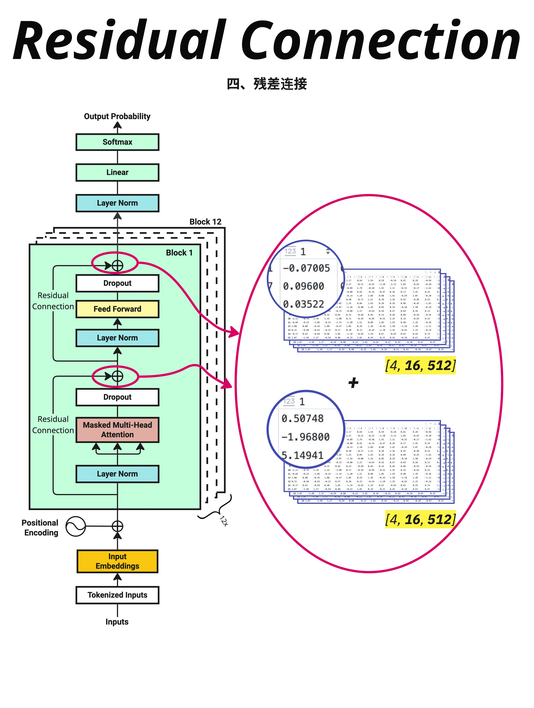
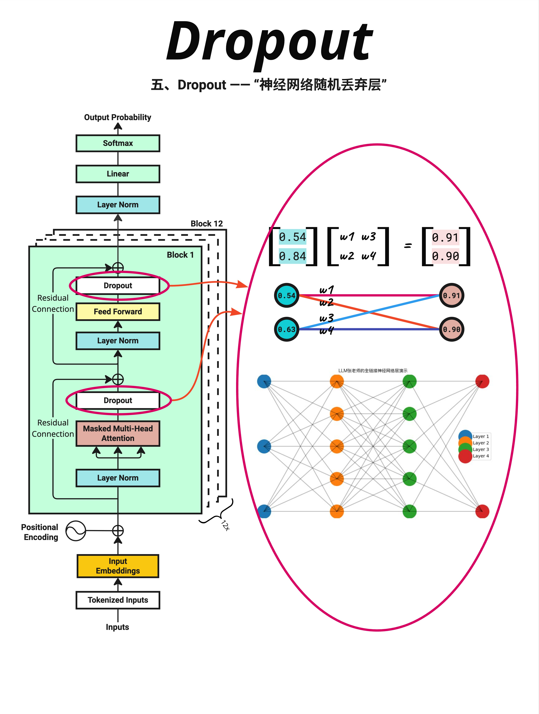

# 第 13 章：残差连接与 Dropout - 训练稳定的秘密

> **一句话总结**：残差连接让信息可以"走捷径"直接传到后面的层，解决深度网络的梯度消失问题；Dropout 在训练时随机"丢弃"一些神经元，防止模型过拟合。这两个技术是 Transformer 能够稳定训练的关键。

---

## 13.1 回顾：Transformer Block 的结构

在深入残差连接和 Dropout 之前，让我们回顾一下 Transformer Block 的完整结构：

```
输入 X
    ↓
Layer Norm
    ↓
Masked Multi-Head Attention
    ↓
Dropout
    ↓
残差连接（+ X）  ← 第一个残差连接
    ↓
Layer Norm
    ↓
Feed Forward (FFN)
    ↓
Dropout
    ↓
残差连接（+ 上一步输出）  ← 第二个残差连接
    ↓
输出
```

每个 Block 中有**两个残差连接**和**两个 Dropout**。这一章我们来理解它们的作用。

---

## 13.2 残差连接：信息的"高速公路"

### 13.2.1 深度网络的问题



随着神经网络越来越深，一个严重的问题出现了：**梯度消失**。

想象信息从第 1 层传到第 12 层：
```
Layer 1 → Layer 2 → Layer 3 → ... → Layer 12
```

每经过一层，信息都会被"处理"一次。经过 12 层后：
- 原始信息可能被严重扭曲
- 梯度在反向传播时会逐层衰减
- 前面的层几乎学不到东西

### 13.2.2 残差连接的解决方案

残差连接的核心思想非常简单：**让输入可以直接"跳过"某些层**。

```
输入 X ─────────────────────┐
    ↓                       │
  Layer                     │（跳跃连接）
    ↓                       │
  输出 ←────────────────────┘ + X
```

公式表示：
```
输出 = Layer(X) + X
```

不是只输出 Layer(X)，而是**加上原始输入 X**。

### 13.2.3 图解残差连接

看图中右侧的数值示例：

**Attention 输出**（经过 Dropout 后）：
```
[4, 16, 512] 的张量
第一个值：-0.07005, 0.09600, 0.03522, ...
```

**原始输入 X**：
```
[4, 16, 512] 的张量
第一个值：0.50748, -1.96800, 5.14941, ...
```

**残差连接后**：
```
输出 = Attention输出 + X
     = [-0.07005 + 0.50748, 0.09600 + (-1.96800), ...]
     = [0.43743, -1.87200, ...]
```

就是简单的**逐元素相加**！

### 13.2.4 为什么残差连接有效？

**1. 梯度直通**

在反向传播时，梯度可以通过残差连接直接传回去：
```
∂Loss/∂X = ∂Loss/∂输出 × (∂Layer(X)/∂X + 1)
```

即使 `∂Layer(X)/∂X` 很小，还有一个 **+1**，保证梯度不会消失。

**2. 恒等映射**

如果某一层"不知道该学什么"，它可以学习成恒等映射：
```
Layer(X) ≈ 0
输出 = 0 + X = X
```

相当于这一层"什么都不做"，信息原封不动传过去。这比学习一个完美的恒等变换容易多了。

**3. 信息保留**

原始信息总是被保留的。即使经过很多层，输入的信息也不会完全丢失。

### 13.2.5 在 Transformer 中的位置

图中左侧的架构图清楚地标注了两个残差连接的位置：

**第一个残差连接**：在 Attention 之后
```
X → LayerNorm → Attention → Dropout → (+X) → 输出1
```

**第二个残差连接**：在 FFN 之后
```
输出1 → LayerNorm → FFN → Dropout → (+输出1) → 输出2
```

### 13.2.6 PyTorch 实现

```python
# 代码示例
class TransformerBlock(nn.Module):
    def __init__(self, d_model, num_heads, d_ff, dropout=0.1):
        super().__init__()
        self.attention = MultiHeadAttention(d_model, num_heads)
        self.ffn = FeedForward(d_model, d_ff)
        self.norm1 = nn.LayerNorm(d_model)
        self.norm2 = nn.LayerNorm(d_model)
        self.dropout = nn.Dropout(dropout)

    def forward(self, x, mask=None):
        # 第一个残差连接
        attn_output = self.attention(self.norm1(x), mask)
        x = x + self.dropout(attn_output)  # 残差连接！

        # 第二个残差连接
        ffn_output = self.ffn(self.norm2(x))
        x = x + self.dropout(ffn_output)   # 残差连接！

        return x
```

核心就是那两行 `x = x + ...`。

---

## 13.3 Dropout：随机"丢弃"防过拟合

### 13.3.1 过拟合问题



神经网络有一个常见问题：**过拟合**。

过拟合是指模型在训练数据上表现很好，但在新数据上表现很差。就像一个学生：
- 把所有考试题都背下来了（训练数据）
- 但遇到新题就不会做（测试数据）

模型"记住"了训练数据的细节，而不是学到了通用的规律。

### 13.3.2 Dropout 的解决方案

Dropout 的想法很有趣：**训练时随机"关闭"一些神经元**。

看图中右侧的神经网络：
- 正常情况：所有连接都是激活的
- Dropout：某些连接被随机断开（图中灰色的线）

每次训练时，随机选择一部分神经元"不工作"。

### 13.3.3 Dropout 的直觉

为什么随机丢弃神经元能防止过拟合？

**类比：团队协作**

想象一个公司：
- 没有 Dropout：某个员工特别能干，所有工作都依赖他
- 有 Dropout：每天随机让一些员工休假

结果：
- 没有 Dropout：如果那个能干的员工离职，公司就瘫痪了
- 有 Dropout：每个员工都学会了多种技能，团队更健壮

**在神经网络中**：
- Dropout 迫使网络不能过度依赖某些特定的神经元
- 每个神经元都必须学会"独立工作"
- 网络变得更加鲁棒

### 13.3.4 Dropout 的数学

Dropout 的操作很简单：

**训练时**：
```
mask = random([0, 1], p=dropout_rate)  # 随机生成 0/1 掩码
output = input * mask / (1 - dropout_rate)  # 应用掩码并缩放
```

例如，dropout_rate = 0.1（丢弃 10%）：
```
input = [0.5, 0.3, 0.8, 0.2, 0.6]
mask  = [1,   1,   0,   1,   1  ]  # 随机生成，0.8 被丢弃
output = [0.5, 0.3, 0, 0.2, 0.6] / 0.9
       = [0.56, 0.33, 0, 0.22, 0.67]
```

**推理时**：
```
output = input  # 不做任何丢弃
```

### 13.3.5 为什么要缩放？

你可能注意到训练时有个 `/ (1 - dropout_rate)` 的缩放。

原因：保持期望值不变。

假设 dropout_rate = 0.1：
- 训练时：90% 的神经元工作，每个神经元的输出被放大 1/0.9 ≈ 1.11
- 推理时：100% 的神经元工作，不缩放

这样训练和推理时的期望输出值是一致的。

### 13.3.6 在 Transformer 中的位置

图中左侧标注了 Dropout 的位置：

1. **Attention 之后**：`Attention → Dropout → 残差连接`
2. **FFN 之后**：`FFN → Dropout → 残差连接`

Dropout 总是在残差连接**之前**应用。

### 13.3.7 PyTorch 实现

```python
# 代码示例
import torch.nn as nn

# 创建 Dropout 层
dropout = nn.Dropout(p=0.1)  # 10% 的概率丢弃

# 训练模式
model.train()
output = dropout(input)  # 会随机丢弃

# 推理模式
model.eval()
output = dropout(input)  # 不会丢弃，直接输出
```

注意：PyTorch 的 Dropout 会自动处理训练/推理模式的切换。

---

## 13.4 Pre-Norm vs Post-Norm

### 13.4.1 两种 LayerNorm 位置

图中展示了 GPT-2 和 GPT-1 的架构对比，其中一个重要区别是 **LayerNorm 的位置**：

**Post-Norm（GPT-1）**：
```
X → Attention → Add(+X) → LayerNorm → FFN → Add → LayerNorm → 输出
```
LayerNorm 在残差连接**之后**。

**Pre-Norm（GPT-2+）**：
```
X → LayerNorm → Attention → Add(+X) → LayerNorm → FFN → Add → 输出
```
LayerNorm 在残差连接**之前**（在每个子层的输入处）。

### 13.4.2 为什么 Pre-Norm 更好？

研究发现 Pre-Norm 的训练更稳定：

1. **梯度更稳定**：LayerNorm 在前面，可以在 Attention/FFN 之前稳定输入
2. **残差路径更干净**：残差连接直接相加，没有 LayerNorm 干扰
3. **更容易收敛**：特别是对于深层网络

现代的大模型（GPT-2、GPT-3、LLaMA 等）都使用 Pre-Norm。

---

## 13.5 残差连接 + Dropout 的协同作用

### 13.5.1 完整的数据流

让我们追踪一次完整的数据流：

```
输入 X [4, 16, 512]
        ↓
LayerNorm(X)                    # 标准化
        ↓
Attention(LayerNorm(X))         # 注意力计算
        ↓
Dropout(Attention(...))         # 随机丢弃（训练时）
        ↓
X + Dropout(...)                # 残差连接
        ↓
输出 [4, 16, 512]               # 形状不变
```

### 13.5.2 为什么这个组合有效？

| 技术 | 解决的问题 | 机制 |
|------|-----------|------|
| **残差连接** | 梯度消失 | 让梯度可以直接传播 |
| **Dropout** | 过拟合 | 随机丢弃防止过度依赖 |
| **LayerNorm** | 数值不稳定 | 标准化到合理范围 |

三者配合：
1. LayerNorm 稳定输入
2. Attention/FFN 学习特征
3. Dropout 增加正则化
4. 残差连接保留原始信息

---

## 13.6 实际训练中的参数

### 13.6.1 常见的 Dropout 率

| 模型 | Dropout 率 | 备注 |
|------|-----------|------|
| GPT-2 | 0.1 | 标准配置 |
| GPT-3 | 0.0 - 0.1 | 大模型倾向于更低 |
| BERT | 0.1 | 标准配置 |
| LLaMA | 0.0 | 不使用 Dropout |

有趣的趋势：**模型越大，Dropout 率越低，甚至不用**。

原因：大模型的参数量已经足够大，过拟合风险降低。而且大数据集本身就提供了足够的正则化。

### 13.6.2 残差连接的变体

有些模型会在残差连接上做一些变化：

**缩放残差**：
```python
x = x + 0.1 * sublayer(x)  # 缩小残差的贡献
```

**门控残差**：
```python
gate = sigmoid(linear(x))
x = x + gate * sublayer(x)  # 学习残差的权重
```

但标准的 Transformer 使用最简单的相加。

---

## 13.7 本章总结

### 13.7.1 核心概念

| 概念 | 作用 | 公式 |
|------|------|------|
| **残差连接** | 防止梯度消失，保留原始信息 | `output = layer(x) + x` |
| **Dropout** | 防止过拟合，增加鲁棒性 | 训练时随机置零 |
| **Pre-Norm** | 更稳定的训练 | LayerNorm 在子层之前 |

### 13.7.2 在 Transformer Block 中的位置

```
输入 X
    ↓
LayerNorm ──→ Attention ──→ Dropout ──→ (+X) ──→ 输出1
                                         ↑
                                    残差连接

输出1
    ↓
LayerNorm ──→ FFN ──→ Dropout ──→ (+输出1) ──→ 输出2
                                     ↑
                                残差连接
```

### 13.7.3 核心认知

> **残差连接和 Dropout 是 Transformer 能够稳定训练的关键技术。残差连接让信息可以"走捷径"直接传到深层，解决梯度消失问题；Dropout 通过随机丢弃神经元来防止过拟合。两者配合 LayerNorm，确保了深层 Transformer 的训练稳定性。**

---

## 本章交付物

学完这一章，你应该能够：

- [ ] 解释残差连接的作用（梯度直通、信息保留）
- [ ] 理解 Dropout 如何防止过拟合
- [ ] 说出残差连接和 Dropout 在 Transformer Block 中的位置
- [ ] 区分 Pre-Norm 和 Post-Norm 的区别

---

## 下一章预告

残差连接把 Attention 的输出和**原始输入**相加。但原始输入是什么？它包含了 **词嵌入（Embedding）** 和 **位置编码（Positional Encoding）**。

下一章，我们来深入理解词嵌入和位置信息是如何结合的，以及这种设计背后的深层逻辑。
