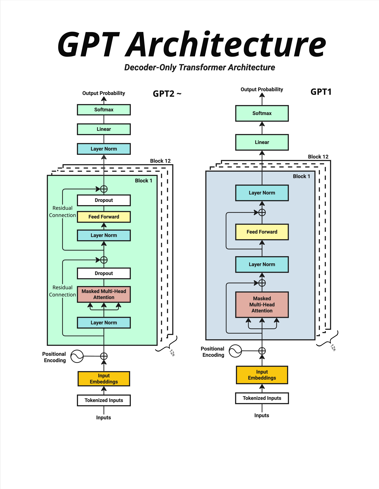
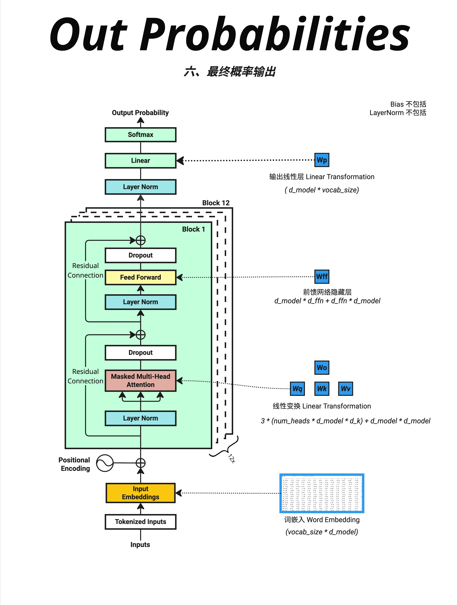
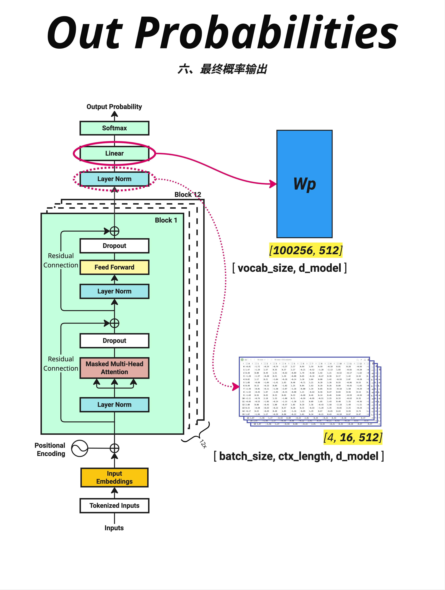
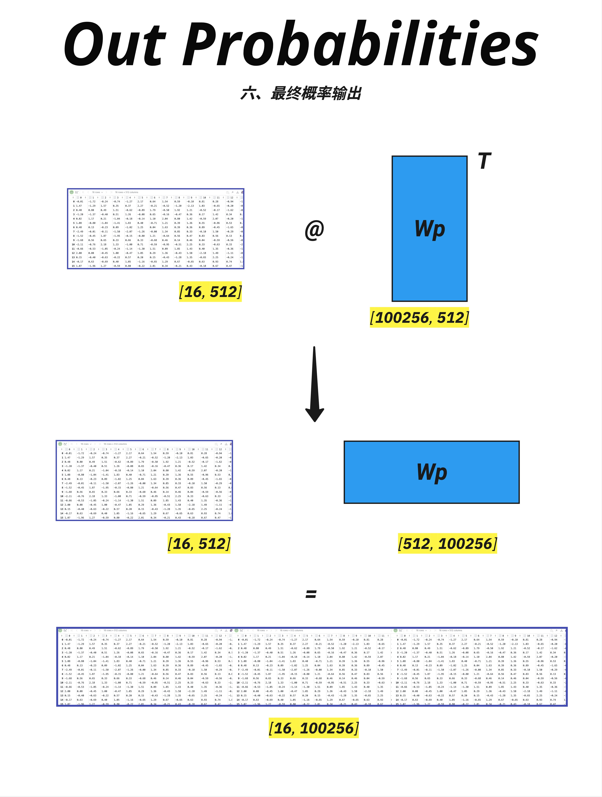
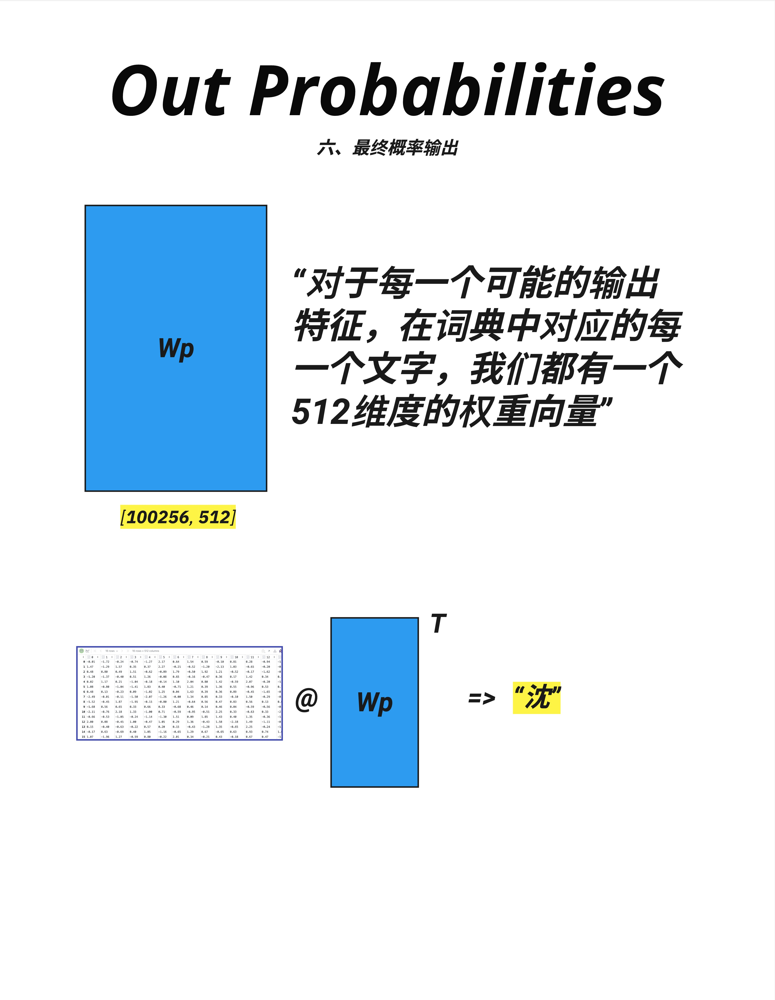
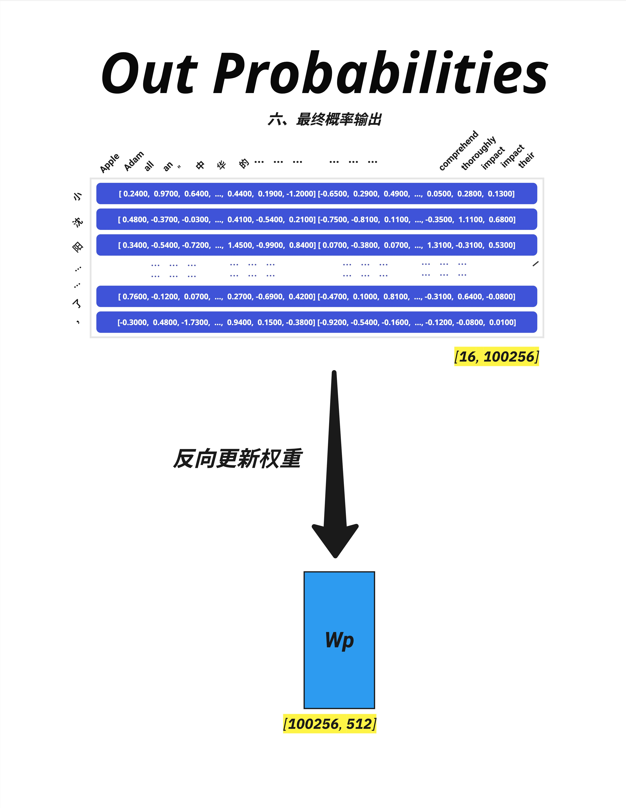

# 第 15 章：Transformer 完整前向传播 - 从输入到输出

> **一句话总结**：Transformer 的前向传播就是：文字 → Token → Embedding+位置 → N层Block（Attention+FFN）→ Linear映射到词表 → Softmax得概率 → 输出预测词。理解这个完整流程，就理解了 GPT 如何"思考"。

---

## 15.1 全景图：Decoder-Only 架构

### 15.1.1 GPT 系列都是 Decoder-Only


GPT、LLaMA、Claude 等现代语言模型都采用 **Decoder-Only** 架构。与原始 Transformer 的 Encoder-Decoder 结构不同，Decoder-Only 只保留了解码器部分，专注于**自回归生成**任务。

### 15.1.2 GPT-2 vs GPT-1 架构对比



这张图对比了 GPT-2 和 GPT-1 的架构。它们都是 **Decoder-Only** 架构，主要区别是 LayerNorm 的位置：

| | GPT-1 (Post-Norm) | GPT-2 (Pre-Norm) |
|---|------------------|------------------|
| LayerNorm 位置 | Attention/FFN 之后 | Attention/FFN 之前 |
| 训练稳定性 | 较差 | 更稳定 |
| 现代模型 | - | LLaMA、GPT-3 都用 Pre-Norm |

让我们以 GPT-2 的架构为例，从下往上追踪完整的数据流。

### 15.1.3 完整流程概览

```
输入文字："小沈阳江西演唱会邀请了"
         ↓
    Step 1: Tokenization（分词）
         ↓
    Step 2: Word Embeddings（词嵌入）
         ↓
    Step 3: Positional Encoding（位置编码）
         ↓
    Step 4-6: N × Transformer Block（GPT-2 Pre-Norm 风格）
              (LayerNorm → Attention → Residual → LayerNorm → FFN → Residual)
         ↓
    Step 7: Final Layer Norm
         ↓
    Step 8: Linear → Softmax → Output Probability
         ↓
    输出预测："沈"（概率最高的词）
```

---

## 15.2 Step 1-3：输入处理

### 15.2.1 Step 1: Tokenization

文字转数字。使用 tiktoken（GPT 系列使用的分词器）：

```
输入："小沈阳江西演唱会邀请了"

Token IDs: [31809, 31106, 230, 83175, 70277, 61786, ...]
长度：16 个 token
```

每个字符或子词被映射到一个唯一的整数 ID。

### 15.2.2 Step 2: Word Embeddings

Token ID 通过**查表**变成向量：

```
Token IDs [16]
    ↓ Embedding 查表（vocab_size × d_model 的矩阵）
Token Embeddings [16, 512]
```

每个 token 变成一个 512 维的向量，包含了词的**语义信息**。

### 15.2.3 Step 3: Positional Encoding


Transformer 本身不知道词的顺序，需要额外添加**位置信息**：

```
Token Embeddings [16, 512]
    ↓ + Positional Encoding [16, 512]
Input Vectors [16, 512]
```

位置编码的两种实现方式：
- **原始 Transformer**：使用正弦/余弦函数生成（固定）
- **GPT 系列**：使用可学习的位置嵌入（训练得到）

无论哪种方式，都保证每个位置有唯一的编码，相邻位置的编码相似。

输出：每个 token 变成一个 512 维向量，**同时包含语义和位置信息**。

---

## 15.3 Step 4: Transformer Block 内部

### 15.3.1 Block 整体结构


每个 Transformer Block 包含两个子层：

```
输入 X [16, 512]
    ↓
┌─────────────────────────────┐
│  Layer Norm                 │
│      ↓                      │
│  Multi-Head Attention       │  ← 理解词之间的关系
│      ↓                      │
│  Dropout → + X (残差连接)    │
└─────────────────────────────┘
    ↓
┌─────────────────────────────┐
│  Layer Norm                 │
│      ↓                      │
│  Feed Forward Network       │  ← 特征变换
│      ↓                      │
│  Dropout → + X (残差连接)    │
└─────────────────────────────┘
    ↓
输出 [16, 512]
```

**关键点**：输入 [16, 512]，输出还是 [16, 512]——维度不变！

### 15.3.2 Multi-Head Attention 详解


Attention 是 Transformer 的核心。让我们一步步拆解：

**Step 4.1: 生成 Q、K、V**

```
输入 X [16, 512]
    ↓ × Wq, Wk, Wv (三个权重矩阵)
Q, K, V 各 [16, 512]
    ↓ 切分成多头
每个头: Q, K, V 各 [16, 64]  (假设 8 头)
```

**Step 4.2: 计算注意力分数**


```
Attention Score = Q × K^T / √d_k
```

Q 和 K 的点积表示**相似度**——两个词有多相关。

**Step 4.3: 可视化注意力矩阵**


上图是原始的 Q×K^T 结果：
- 16×16 矩阵（16 个位置两两计算相似度）
- 颜色越深 = 相似度越高

**Step 4.4: 应用 Causal Mask**


应用下三角 Mask 后：
- 上三角变成 -inf（Softmax 后变成 0）
- 每个位置只能"看到"它之前的位置
- 这就是 **Causal**（因果）Mask

**Step 4.5: Softmax 和加权求和**

```
Attention Weights = Softmax(Masked Scores)
Output = Attention Weights × V
```

每个位置的输出是所有 V 的**加权平均**，权重由注意力分数决定。

### 15.3.3 Feed Forward Network

FFN 是一个简单的两层网络：

```
输入 [16, 512]
    ↓ Linear: 512 → 2048 (扩展 4 倍)
    ↓ ReLU 激活
    ↓ Linear: 2048 → 512 (缩回原维度)
输出 [16, 512]
```

FFN 存储了模型的大部分"知识"，占了将近一半的参数！

---

## 15.4 Step 5-6: 残差连接与 LayerNorm

### 15.4.1 为什么需要残差连接？

每个子层都有残差连接：

```python
output = x + sublayer(x)  # 而不是 output = sublayer(x)
```

好处：
- 梯度可以直接流过，不会消失
- 让网络可以堆叠很多层
- 如果某层学不好，至少还有原始输入

### 15.4.2 LayerNorm 的位置

GPT-2 使用 **Pre-Norm**：

```python
# Pre-Norm (GPT-2)
output = x + attention(layernorm(x))

# Post-Norm (原始 Transformer)
output = layernorm(x + attention(x))
```

Pre-Norm 训练更稳定，是现代模型的标配。

---

## 15.5 Step 7: 堆叠多个 Block

### 15.5.1 重复 N 次

GPT-2 有 12-48 个 Block：

```
Block 1 [16, 512] → Block 2 [16, 512] → ... → Block 12 [16, 512]
```

每经过一层 Block：
- 维度保持不变
- 信息被进一步"理解"和"融合"
- 模型学到越来越抽象的特征

### 15.5.2 所有参数的位置



这张图标注了所有参数的位置：

| 组件 | 参数公式 | 示例（d_model=512, vocab=100256） |
|------|----------|----------------------------------|
| Word Embedding | vocab × d_model | 5130万 |
| Attention (×12) | 4 × d_model² × 12 | 1258万 |
| FFN (×12) | 8 × d_model² × 12 | 2516万 |
| Output Linear | d_model × vocab | 5130万 |

---

## 15.6 Step 8: 输出映射

### 15.6.1 最后的 Layer Norm

所有 Block 处理完后，还有一个 Layer Norm：

```
Block 12 输出 [16, 512]
    ↓ Layer Norm
标准化输出 [16, 512]
```

### 15.6.2 Linear 层：映射到词表



关键步骤：把 512 维向量映射到 100256 维（词表大小）。

```
输入 [batch, seq, d_model] = [4, 16, 512]
    ↓ @ Wp [d_model, vocab_size]
输出 [batch, seq, vocab_size] = [4, 16, 100256]
```

### 15.6.3 Wp 矩阵的含义



Wp 矩阵可以理解为：**词表中每个词都有一个 d_model 维的"特征向量"**。

输出 logits = 输入向量和每个词的特征向量的**点积（相似度）**。



### 15.6.4 Softmax 得到概率


```
logits [16, 100256]
    ↓ Softmax（对最后一维）
probs [16, 100256]
```

现在每个位置都有一个概率分布：
- 所有词的概率加起来 = 1
- 概率最高的词就是模型的"预测"

---

## 15.7 维度变化完整追踪

### 15.7.1 从输入到输出

```
输入 token_ids:           [batch=4, seq=16]

Step 1-2: Embedding:      [4, 16, 512]
Step 3: + Position:       [4, 16, 512]

Step 4-6: Block 1~12:     [4, 16, 512]  ← 维度始终不变！

Step 7: Final LayerNorm:  [4, 16, 512]

Step 8: Linear:           [4, 16, 100256]
        Softmax:          [4, 16, 100256]  ← 变成概率

取最后位置:                [4, 100256]
argmax:                   [4]  ← 预测的 token ID
```

### 15.7.2 关键维度参数

| 参数 | 含义 | GPT-2 Small | GPT-2 Large |
|------|------|-------------|-------------|
| d_model | 模型维度 | 768 | 1280 |
| n_layers | Block 层数 | 12 | 36 |
| n_heads | 注意力头数 | 12 | 20 |
| d_ff | FFN 隐藏层 | 3072 | 5120 |
| vocab_size | 词表大小 | 50257 | 50257 |

---

## 15.8 参数量统计

### 15.8.1 各组件参数量

以 GPT-2 Small 为例（d_model=768, n_layers=12, vocab_size=50257）：

| 组件 | 公式 | 参数量 |
|------|------|--------|
| Token Embedding | vocab × d_model | 3860万 |
| Position Embedding | max_len × d_model | 79万 |
| Attention (×12) | 4 × d_model² × 12 | 2831万 |
| FFN (×12) | 2 × d_model × d_ff × 12 | 5662万 |
| LayerNorm (×25) | 2 × d_model × 25 | 4万 |
| Output Projection | 共享 Token Embedding | 0* |

*Output Projection 通常和 Token Embedding **共享权重**（weight tying）

**总计：约 1.24 亿参数**

### 15.8.2 参数分布

```
Embedding:  ~31%  ████████
Attention:  ~23%  ██████
FFN:        ~46%  ████████████
LayerNorm:  <1%
```

**FFN 占了将近一半的参数！** 这也是为什么有人说 FFN 存储了模型的"知识"。

---

## 15.9 训练时的反向传播

### 15.9.1 损失函数



训练时，我们有正确答案（下一个词），可以计算**交叉熵损失**：

```
Loss = CrossEntropy(predicted_probs, target_token)
```

### 15.9.2 梯度流动

损失从输出流回输入，更新所有参数：

```
Loss
 ↓
Output Projection (Wp) ← 更新
 ↓
Layer Norm ← 更新
 ↓
Block 12 (Attention, FFN) ← 更新
 ↓
...
 ↓
Block 1 ← 更新
 ↓
Embeddings ← 更新
```

**残差连接**确保梯度可以顺畅流动，不会消失。

---

## 15.10 本章总结

### 15.10.1 前向传播 8 步流程

| Step | 操作 | 输入 → 输出 |
|------|------|-------------|
| 1 | Tokenization | 文字 → Token IDs |
| 2 | Embedding | IDs → 向量 [seq, d_model] |
| 3 | + Position | 加位置信息 |
| 4 | Attention | 理解词间关系 |
| 5 | Residual + Norm | 稳定训练 |
| 6 | FFN | 特征变换 |
| 7 | × N Blocks | 重复 4-6 |
| 8 | Linear + Softmax | 输出概率 |

### 15.10.2 参数分布

| 组件 | 参数量占比 | 作用 |
|------|-----------|------|
| Embedding | ~30% | 词的语义表示 |
| Attention | ~25% | 捕捉词间关系 |
| FFN | ~45% | 存储知识、特征变换 |

### 15.10.3 核心认知

> **Transformer 的前向传播是一个优雅的流水线：输入的文字被转换成向量，经过多层 Block 的处理（每层都包含 Attention 理解上下文、FFN 提取特征），最后映射到词表得到概率分布。整个过程中，维度在 Block 中保持不变（都是 d_model），只在最后映射时从 d_model 变成 vocab_size。**

---

## 本章交付物

学完这一章，你应该能够：

- [ ] 描述 Transformer 前向传播的 8 个步骤
- [ ] 追踪各组件的输入输出维度
- [ ] 理解 Attention 矩阵的可视化含义
- [ ] 估算模型各部分的参数量占比

---

## 代码实现

本章介绍的完整前向传播流程，在 **Part 5（第 18-20 章）** 中有详细的代码实现。

如果你想看代码，请参考：
- 第 18 章：Model.py - 模型定义
- 第 19 章：Train.py - 训练循环
- 第 20 章：Inference.py - 推理逻辑

---

## 下一章预告

这一章我们追踪了前向传播的流程。但训练和推理时，这个流程有什么不同？

下一章，我们来对比**训练（Training）和推理（Inference）**的异同，理解为什么推理时需要自回归生成，以及 KV Cache 等优化技术的由来。
