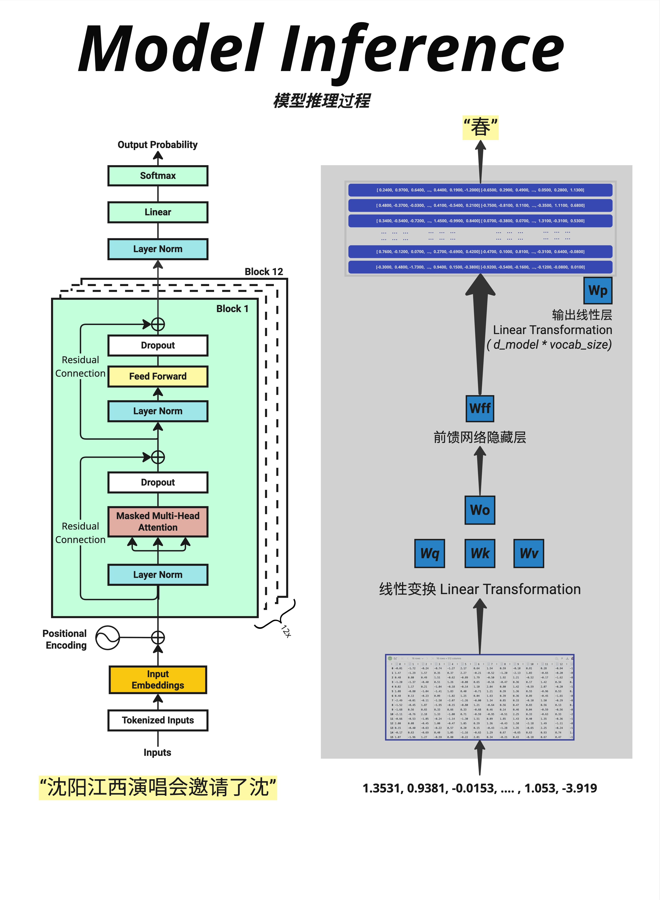
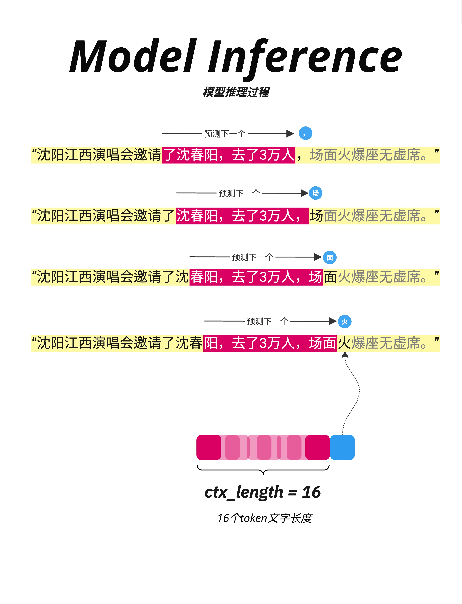
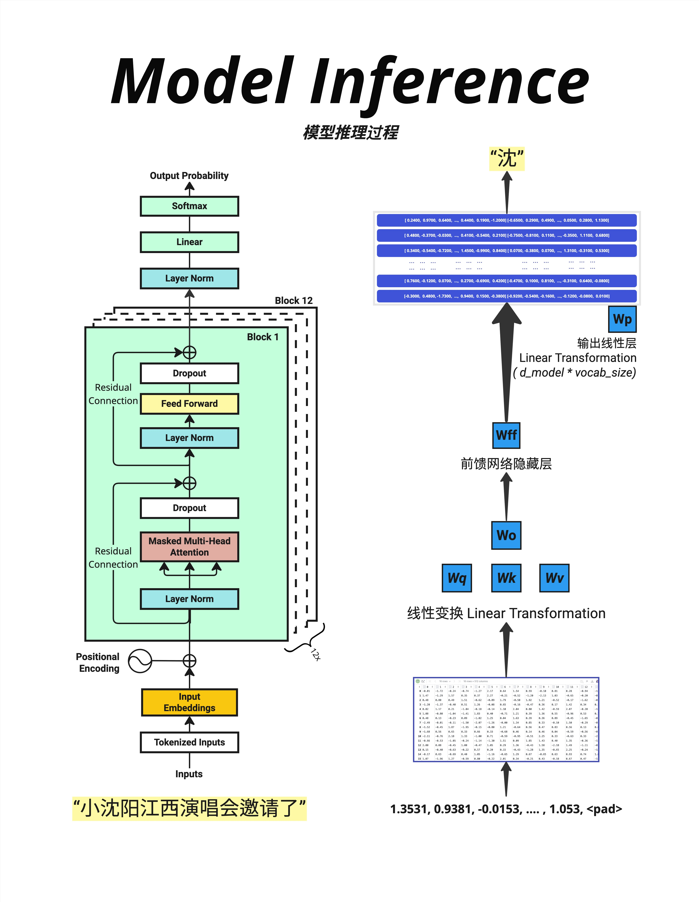

# 第 16 章：训练与推理的异同 - 为什么推理要一个字一个字生成

> **一句话总结**：训练时可以并行处理整个序列（因为知道所有答案），推理时必须一个词一个词生成（因为下一个词依赖上一个词的结果）。这种"自回归"的特性是 GPT 能够生成连贯文本的关键。

---

## 16.1 训练 vs 推理：核心区别

### 16.1.1 一句话对比

| | 训练（Training） | 推理（Inference） |
|---|-----------------|------------------|
| **目的** | 学习参数 | 生成文本 |
| **输入** | 完整的文本 | 初始提示（prompt） |
| **答案** | 已知（下一个词） | 未知（需要预测） |
| **处理方式** | 并行（一次处理整个序列） | 串行（一个词一个词生成） |
| **是否更新参数** | 是 | 否 |

### 16.1.2 为什么有这个区别？

**训练时**：
- 我们有完整的训练文本："小沈阳江西演唱会邀请了沈春阳"
- 知道每个位置的"正确答案"
- 可以一次性计算所有位置的损失

**推理时**：
- 我们只有开头："小沈阳江西演唱会邀请了"
- 不知道下一个词是什么
- 必须先预测一个词，才能预测下一个词

---

## 16.2 训练过程详解

### 16.2.1 Teacher Forcing

训练时使用一种叫 **Teacher Forcing** 的技术：

```
输入：小 沈 阳 江 西 演 唱 会 邀 请 了
目标：沈 阳 江 西 演 唱 会 邀 请 了 沈
```

**输入是原文**，**目标是原文右移一位**。

每个位置都在预测"下一个词"：
- 位置 0（"小"）→ 预测"沈"
- 位置 1（"沈"）→ 预测"阳"
- ...
- 位置 10（"了"）→ 预测"沈"

### 16.2.2 并行计算

因为我们知道所有的输入和目标，可以**一次性**计算：

```python
# 训练代码示例
def train_step(model, input_ids, target_ids):
    # 前向传播（一次处理整个序列）
    logits = model(input_ids)  # [batch, seq_len, vocab_size]

    # 计算损失（所有位置一起）
    loss = F.cross_entropy(
        logits.view(-1, vocab_size),
        target_ids.view(-1)
    )

    # 反向传播
    loss.backward()
    optimizer.step()
```

**一次前向传播**就处理了整个序列！

### 16.2.3 Causal Mask 的作用

虽然训练时输入整个序列，但每个位置只能看到**之前**的词，不能看到**之后**的词。

这是通过 **Causal Mask（因果掩码）** 实现的：

```
位置 0 看到：[小, -, -, -, -, ...]
位置 1 看到：[小, 沈, -, -, -, ...]
位置 2 看到：[小, 沈, 阳, -, -, ...]
...
```

这模拟了推理时的情况：每个位置只能基于已知的前文来预测。

---

## 16.3 推理过程详解

### 16.3.1 自回归生成



推理时，模型必须**一个词一个词**地生成：

```
输入："沈阳江西演唱会邀请了沈"
         ↓
      模型预测
         ↓
输出概率：[春=30%, 阳=25%, 的=10%, ...]
         ↓
      选择 "春"
         ↓
新输入："沈阳江西演唱会邀请了沈春"
         ↓
      模型预测
         ↓
输出概率：[阳=60%, 秋=15%, ...]
         ↓
      选择 "阳"
```

这叫做 **自回归（Autoregressive）** 生成：每一步的输出成为下一步的输入。

### 16.3.2 逐步生成示例



看这张图，展示了生成过程：

**第 1 步**：
```
输入："沈阳江西演唱会邀请了"
预测：","（逗号）
```

**第 2 步**：
```
输入："沈阳江西演唱会邀请了，"（加上逗号）
预测："沈"
```

**第 3 步**：
```
输入："沈阳江西演唱会邀请了，沈"
预测："春"
```

**第 4 步**：
```
输入："沈阳江西演唱会邀请了，沈春"
预测："阳"
```

以此类推，直到生成结束标记或达到最大长度。

### 16.3.3 Context Length 的滑动

图中下方展示了一个重要概念：**ctx_length = 16**

如果输入超过 16 个 token，需要使用滑动窗口：
- 保留最近的 16 个 token
- 丢弃更早的 token

这就是为什么 GPT 有"上下文长度限制"。

---

## 16.4 推理代码实现

### 16.4.1 基本推理循环

```python
# 推理代码示例
def generate(model, prompt_ids, max_new_tokens=50):
    """
    自回归生成文本

    Args:
        model: GPT 模型
        prompt_ids: 初始 prompt 的 token IDs [1, seq_len]
        max_new_tokens: 最多生成多少个新 token
    """
    model.eval()  # 切换到推理模式（关闭 Dropout）

    generated = prompt_ids.clone()

    for _ in range(max_new_tokens):
        # 如果超过最大长度，截断
        input_ids = generated[:, -max_len:]

        # 前向传播
        with torch.no_grad():  # 不计算梯度
            logits = model(input_ids)

        # 只取最后一个位置的 logits
        next_token_logits = logits[:, -1, :]  # [1, vocab_size]

        # 选择下一个 token（这里用 greedy，取概率最高的）
        next_token = torch.argmax(next_token_logits, dim=-1, keepdim=True)

        # 拼接到已生成的序列
        generated = torch.cat([generated, next_token], dim=1)

        # 如果生成了结束标记，停止
        if next_token.item() == eos_token_id:
            break

    return generated
```

### 16.4.2 关键点解释

1. **`model.eval()`**：切换到推理模式，关闭 Dropout
2. **`torch.no_grad()`**：不计算梯度，节省内存
3. **只取最后位置**：`logits[:, -1, :]`，因为只有最后位置是新预测的
4. **循环生成**：每次生成一个 token，加到输入末尾

---

## 16.5 Padding 和批量推理

### 16.5.1 什么是 Padding？



当批量处理不同长度的句子时，需要**填充（Padding）**到相同长度：

```
句子1："小沈阳江西演唱会邀请了"（15 tokens）
句子2："LLM张老师"（6 tokens）

填充后：
句子1："小沈阳江西演唱会邀请了"
句子2："LLM张老师<pad><pad><pad><pad><pad>"
```

### 16.5.2 Padding 的处理

在计算时，需要**忽略 padding 位置**：

```python
# Attention mask：1 表示真实 token，0 表示 padding
attention_mask = (input_ids != pad_token_id).long()

# 在 Attention 计算中使用 mask
# padding 位置的注意力权重会被设为 0
```

### 16.5.3 图中的示例

图中显示：
- 输入："小沈阳江西演唱会邀请了"
- 经过模型处理
- 最后一个真实位置（不是 \<pad\>）预测下一个词："沈"

---

## 16.6 训练与推理的对比

### 16.6.1 数据流对比

**训练时**：
```
完整序列 [seq_len]
    ↓ 一次前向传播
所有位置的预测 [seq_len, vocab]
    ↓ 与目标比较
损失值
    ↓ 反向传播
更新参数
```

**推理时**：
```
Prompt [n]
    ↓ 前向传播
预测位置 n+1
    ↓ 选择 token
新序列 [n+1]
    ↓ 前向传播
预测位置 n+2
    ↓ 选择 token
...（循环直到结束）
```

### 16.6.2 计算效率对比

| | 训练 | 推理 |
|---|-----|-----|
| **前向传播次数** | 1 次 / 序列 | N 次 / 序列（N=生成长度） |
| **并行度** | 高（所有位置并行） | 低（必须串行） |
| **瓶颈** | 内存（存储梯度） | 时间（反复前向传播） |

这就是为什么推理需要各种优化技术（如 KV Cache，我们将在第 22 章详细讨论）。

### 16.6.3 Dropout 的行为

| | 训练 | 推理 |
|---|-----|-----|
| **Dropout** | 激活（随机丢弃） | 关闭（不丢弃） |
| **原因** | 防止过拟合 | 保持输出稳定 |

```python
model.train()  # Dropout 激活
model.eval()   # Dropout 关闭
```

---

## 16.7 解码策略

### 16.7.1 不同的选择方式

推理时，拿到概率分布后，如何选择下一个词？

**Greedy Decoding（贪心解码）**：
```python
next_token = torch.argmax(probs, dim=-1)  # 选概率最高的
```
- 优点：确定性，速度快
- 缺点：可能生成重复、无聊的文本

**Sampling（采样）**：
```python
next_token = torch.multinomial(probs, num_samples=1)  # 按概率采样
```
- 优点：更有创造性
- 缺点：可能不连贯

**Top-K Sampling**：
```python
# 只从概率最高的 K 个词中采样
top_k_probs, top_k_indices = torch.topk(probs, k=50)
next_token = top_k_indices[torch.multinomial(top_k_probs, 1)]
```

**Top-P (Nucleus) Sampling**：
```python
# 只从累积概率达到 P 的词中采样
sorted_probs, sorted_indices = torch.sort(probs, descending=True)
cumsum = torch.cumsum(sorted_probs, dim=-1)
mask = cumsum <= 0.9  # P=0.9
# 在 mask 内的词中采样
```

### 16.7.2 Temperature 的作用

回顾第 6 章：Temperature 控制概率分布的"锐度"：

```python
probs = F.softmax(logits / temperature, dim=-1)
```

- **T < 1**：更确定（概率更集中）
- **T = 1**：标准
- **T > 1**：更随机（概率更均匀）

---

## 16.8 为什么要自回归？

### 16.8.1 语言的本质

语言是**有序的**。"我爱你"和"你爱我"意思完全不同。

自回归生成保证了：
- 每个词的生成都基于前面的所有词
- 生成的文本是连贯的
- 符合语言的自然顺序

### 16.8.2 其他生成方式

有一些非自回归模型尝试**并行生成**所有词，但效果通常不如自回归模型好。

原因：
- 词与词之间有很强的依赖关系
- 并行生成难以捕捉这种依赖
- 需要多轮迭代才能收敛

目前最好的语言模型（GPT-4、Claude、LLaMA）都是自回归的。

---

## 16.9 本章总结

### 16.9.1 核心对比

| 方面 | 训练 | 推理 |
|------|------|------|
| **知道答案？** | 是 | 否 |
| **处理方式** | 并行 | 串行 |
| **前向传播** | 1 次/序列 | N 次/序列 |
| **Dropout** | 开启 | 关闭 |
| **更新参数** | 是 | 否 |

### 16.9.2 自回归生成

```
Prompt → 预测词1 → 加入序列 → 预测词2 → 加入序列 → ...
```

每一步都依赖前面所有的词，保证生成的连贯性。

### 16.9.3 核心认知

> **训练时因为知道所有答案，可以并行处理整个序列；推理时因为答案未知，必须一个词一个词地自回归生成。这种串行生成是推理效率的主要瓶颈，也是为什么需要 KV Cache 等优化技术的原因。**

---

## 本章交付物

学完这一章，你应该能够：

- [ ] 解释训练和推理的核心区别
- [ ] 理解自回归生成的过程
- [ ] 知道为什么推理比训练慢
- [ ] 了解基本的解码策略（Greedy、Sampling、Top-K）

---

## 下一章预告

自回归生成需要反复做前向传播，效率很低。有没有办法加速？这就是 KV Cache 等推理优化技术的用武之地（详见第 22 章）。

但在深入优化之前，我们先来理解训练过程中另一个关键因素——**学习率**。学习率太大会导致训练震荡，太小又会收敛太慢。下一章，我们来深入理解学习率的作用。
