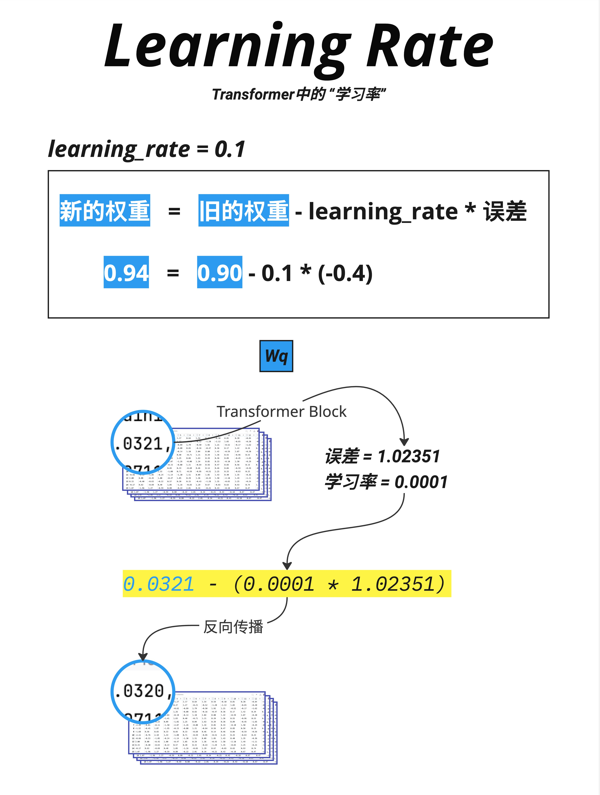
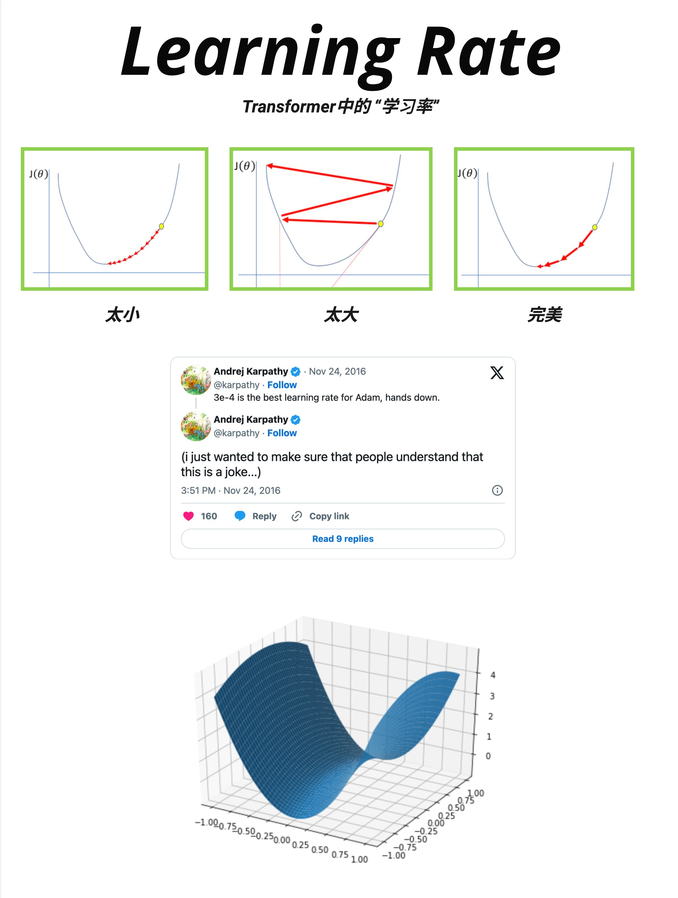
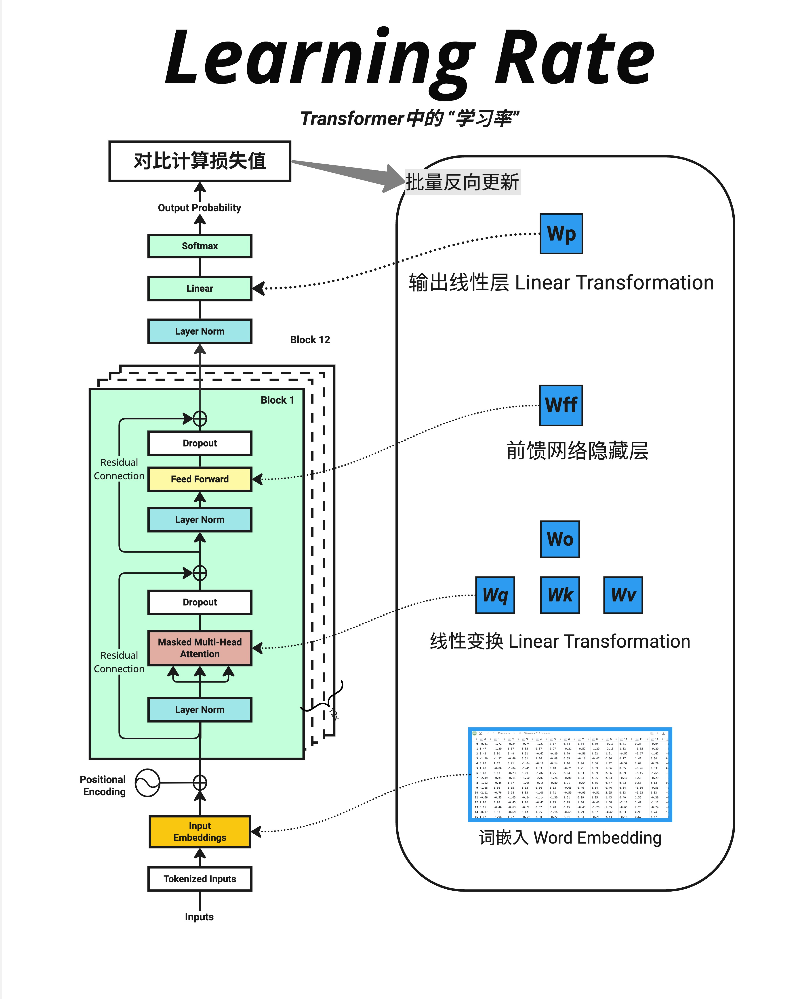
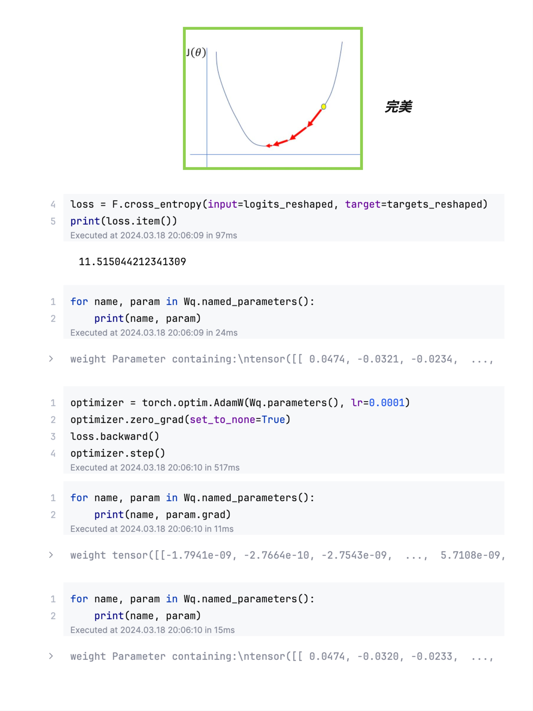

# 第 17 章：学习率的理解 - 训练稳定的关键

> **一句话总结**：学习率决定了每次更新参数时"走多大一步"。太大会震荡发散，太小会收敛太慢，只有合适的学习率才能让模型稳定地学到知识。

---

## 17.1 什么是学习率？

### 17.1.1 参数更新的基本公式



神经网络训练的核心是**梯度下降**：根据损失函数的梯度来更新参数。

基本公式：

```
新的权重 = 旧的权重 - learning_rate × 误差梯度
```

或者用数学符号：

```
θ_new = θ_old - lr × ∂Loss/∂θ
```

### 17.1.2 图中的具体例子

图中展示了一个简单的例子：

```
learning_rate = 0.1
旧权重 = 0.90
误差梯度 = -0.4

新权重 = 0.90 - 0.1 × (-0.4)
       = 0.90 + 0.04
       = 0.94
```

因为梯度是负的（-0.4），说明增大这个权重可以减小损失，所以权重从 0.90 增加到 0.94。

### 17.1.3 学习率的作用

**学习率**（learning_rate，简称 lr）决定了每次更新的"步长"：

- **lr = 0.1**：每次走梯度的 10%
- **lr = 0.01**：每次走梯度的 1%
- **lr = 0.001**：每次走梯度的 0.1%

---

## 17.2 学习率的三种情况

### 17.2.1 可视化理解



这张图展示了三种学习率的效果：

**太小（左图）**：
- 每一步都很小
- 需要很多步才能到达最低点
- 训练时间很长
- 可能卡在局部最优

**太大（中图）**：
- 每一步都很大
- 会在最低点附近来回震荡
- 可能跳过最低点
- 甚至可能发散（越来越差）

**完美（右图）**：
- 步长适中
- 稳定地下降到最低点
- 收敛快且稳定

### 17.2.2 Andrej Karpathy 的玩笑

图中还引用了 Andrej Karpathy 的推特：

> "3e-4 is the best learning rate for Adam, hands down."
>
> "(i just wanted to make sure that people understand that this is a joke...)"

这个"玩笑"反映了一个有趣的现实：**3×10⁻⁴ (0.0003) 确实是一个常用的起始学习率**，在很多情况下效果不错。

但当然，最佳学习率取决于具体任务、模型大小、批次大小等因素。

### 17.2.3 损失景观（Loss Landscape）

图中下方展示了一个 3D 的损失景观：
- X、Y 轴：两个参数的值
- Z 轴：损失值

这个曲面有山有谷，训练的目标是找到最低点（全局最优）。

学习率决定了我们在这个曲面上"走"的速度。

---

## 17.3 哪些参数会被更新？

### 17.3.1 Transformer 中的可学习参数



这张图展示了 Transformer 中所有可学习参数的位置：

**1. 词嵌入 Word Embedding**
- 每个词的向量表示
- 参数量：`vocab_size × d_model`

**2. Attention 层的权重**
- Wq、Wk、Wv：生成 Q、K、V 的矩阵
- Wo：输出投影矩阵
- 每层参数量：`4 × d_model²`

**3. FFN 层的权重**
- Wff：前馈网络的权重
- 每层参数量：`2 × d_model × d_ff`

**4. 输出线性层 Wp**
- 映射到词表
- 参数量：`d_model × vocab_size`

### 17.3.2 批量反向更新

图中标注了"批量反向更新"的流程：

```
计算损失值（对比预测和真实）
         ↓
    反向传播
         ↓
计算每个参数的梯度
         ↓
    批量更新所有参数
```

所有参数在**同一时间**被更新，使用各自的梯度和**相同的学习率**。

---

## 17.4 PyTorch 实现

### 17.4.1 代码示例



这张图展示了 PyTorch 中的训练代码：

```python
# 代码示例
import torch
import torch.nn.functional as F

# 1. 计算损失
loss = F.cross_entropy(input=logits_reshaped, target=targets_reshaped)
print(loss.item())  # 输出：11.515044212341309

# 2. 查看更新前的参数
for name, param in Wq.named_parameters():
    print(name, param)
# weight Parameter containing:
# tensor([[ 0.0474, -0.0321, -0.0234, ...

# 3. 创建优化器并执行一步更新
optimizer = torch.optim.AdamW(Wq.parameters(), lr=0.0001)
optimizer.zero_grad()     # 清空之前的梯度
loss.backward()           # 计算梯度
optimizer.step()          # 更新参数

# 4. 查看梯度
for name, param in Wq.named_parameters():
    print(name, param.grad)
# weight tensor([[-1.7941e-09, -2.7664e-10, -2.7543e-09, ...

# 5. 查看更新后的参数
for name, param in Wq.named_parameters():
    print(name, param)
# weight Parameter containing:
# tensor([[ 0.0474, -0.0320, -0.0233, ...
```

### 17.4.2 关键步骤解释

1. **`loss.backward()`**：计算所有参数的梯度
2. **`optimizer.zero_grad()`**：清空梯度（否则会累加）
3. **`optimizer.step()`**：根据梯度和学习率更新参数

### 17.4.3 参数变化观察

图中可以看到参数的微小变化：

```
更新前：0.0474, -0.0321, -0.0234, ...
更新后：0.0474, -0.0320, -0.0233, ...
```

变化非常微小（第四位小数），因为：
- 学习率很小（0.0001）
- 梯度也很小（~10⁻⁹）

但经过成千上万次更新，这些微小的变化会累积成显著的学习效果。

---

## 17.5 常用的优化器

### 17.5.1 SGD（随机梯度下降）

最基本的优化器：

```python
optimizer = torch.optim.SGD(model.parameters(), lr=0.01)
```

更新公式：
```
θ = θ - lr × gradient
```

### 17.5.2 Adam

最常用的优化器，自适应调整每个参数的学习率：

```python
optimizer = torch.optim.Adam(model.parameters(), lr=0.001)
```

特点：
- 维护梯度的一阶矩（均值）和二阶矩（方差）
- 自动为每个参数调整学习率
- 对稀疏梯度效果好

### 17.5.3 AdamW

Adam 的改进版，修复了权重衰减的问题：

```python
optimizer = torch.optim.AdamW(model.parameters(), lr=0.0001, weight_decay=0.01)
```

**大模型训练的首选优化器**。

### 17.5.4 常见配置

| 模型 | 优化器 | 初始学习率 | Weight Decay |
|------|--------|-----------|--------------|
| GPT-2 | Adam | 2.5e-4 | 0.01 |
| GPT-3 | Adam | 6e-5 ~ 2e-4 | 0.1 |
| LLaMA | AdamW | 3e-4 | 0.1 |

---

## 17.6 学习率调度

### 17.6.1 为什么需要调度？

一个固定的学习率往往不是最优的：
- 训练初期：需要较大的学习率快速下降
- 训练后期：需要较小的学习率精细调整

### 17.6.2 常见的调度策略

**Warmup + Cosine Decay**（最常用）：

```
学习率
  ↑
  |    /\
  |   /  \__
  |  /      \___
  | /           \____
  +------------------------→ 训练步数
    ↑        ↑
  warmup   cosine decay
```

1. **Warmup 阶段**：学习率从很小逐渐增加到目标值
2. **Decay 阶段**：学习率按余弦函数逐渐减小

### 17.6.3 PyTorch 实现

```python
# 代码示例
from torch.optim.lr_scheduler import CosineAnnealingLR, LinearLR, SequentialLR

# 基础优化器
optimizer = torch.optim.AdamW(model.parameters(), lr=3e-4)

# Warmup：前 1000 步线性增加
warmup_scheduler = LinearLR(
    optimizer,
    start_factor=0.1,  # 从 lr×0.1 开始
    total_iters=1000
)

# Cosine decay：之后余弦衰减
cosine_scheduler = CosineAnnealingLR(
    optimizer,
    T_max=100000,  # 总步数
    eta_min=1e-5   # 最小学习率
)

# 组合
scheduler = SequentialLR(
    optimizer,
    schedulers=[warmup_scheduler, cosine_scheduler],
    milestones=[1000]
)

# 训练循环中
for step in range(total_steps):
    loss = train_step(...)
    optimizer.step()
    scheduler.step()  # 更新学习率
```

### 17.6.4 为什么要 Warmup？

训练初期：
- 参数是随机初始化的
- 梯度方向可能不准确
- 大学习率容易导致不稳定

Warmup 让模型先"热身"：
- 从小学习率开始
- 逐渐增加到目标值
- 给模型时间找到正确的方向

---

## 17.7 学习率与其他超参数的关系

### 17.7.1 批次大小（Batch Size）

**更大的批次 → 可以用更大的学习率**

经验法则（Linear Scaling Rule）：
```
如果批次大小翻倍，学习率也可以翻倍
```

原因：更大的批次意味着梯度估计更准确，可以走更大的步。

### 17.7.2 模型大小

**更大的模型 → 通常需要更小的学习率**

| 模型规模 | 参数量 | 典型学习率 |
|---------|--------|-----------|
| Small | ~100M | 3e-4 ~ 1e-3 |
| Medium | ~1B | 1e-4 ~ 3e-4 |
| Large | ~10B | 3e-5 ~ 1e-4 |
| XL | ~100B+ | 1e-5 ~ 3e-5 |

### 17.7.3 Weight Decay

Weight Decay（权重衰减）是一种正则化技术：

```
θ = θ - lr × (gradient + weight_decay × θ)
```

它倾向于让权重变小，防止过拟合。

常见值：0.01 ~ 0.1

---

## 17.8 实践建议

### 17.8.1 如何选择学习率？

1. **从常用值开始**：
   - Adam/AdamW：3e-4 是个好起点
   - 大模型：1e-4 或更小

2. **观察训练曲线**：
   - 损失平稳下降 → 学习率合适
   - 损失震荡 → 学习率太大
   - 损失下降太慢 → 学习率太小

3. **使用学习率查找器**：
   - 从很小的学习率开始
   - 逐渐增大，观察损失
   - 选择损失下降最快的区域

### 17.8.2 常见问题诊断

| 现象 | 可能原因 | 解决方案 |
|------|---------|---------|
| 损失不下降 | 学习率太小 | 增大学习率 |
| 损失剧烈震荡 | 学习率太大 | 减小学习率 |
| 损失突然变 NaN | 学习率过大 / 数值溢出 | 减小学习率，检查数据 |
| 损失下降后又上升 | 过拟合 / 学习率未衰减 | 加入衰减，增加正则化 |

### 17.8.3 我的推荐配置

```python
# 推荐的训练配置
optimizer = torch.optim.AdamW(
    model.parameters(),
    lr=3e-4,              # 初始学习率
    betas=(0.9, 0.95),    # Adam 的动量参数
    weight_decay=0.1      # 权重衰减
)

# Warmup + Cosine Decay
total_steps = 100000
warmup_steps = 2000

scheduler = get_cosine_schedule_with_warmup(
    optimizer,
    num_warmup_steps=warmup_steps,
    num_training_steps=total_steps
)
```

---

## 17.9 本章总结

### 17.9.1 核心公式

```
新权重 = 旧权重 - 学习率 × 梯度
θ_new = θ_old - lr × ∂Loss/∂θ
```

### 17.9.2 学习率的影响

| 学习率 | 效果 |
|--------|------|
| **太大** | 震荡、发散 |
| **太小** | 收敛慢、卡住 |
| **合适** | 稳定收敛 |

### 17.9.3 常用配置

| 组件 | 推荐值 |
|------|--------|
| 优化器 | AdamW |
| 初始学习率 | 1e-4 ~ 3e-4 |
| Weight Decay | 0.01 ~ 0.1 |
| 调度 | Warmup + Cosine Decay |
| Warmup 步数 | 总步数的 1-5% |

### 17.9.4 核心认知

> **学习率是训练神经网络最重要的超参数之一。它决定了每次更新的步长：太大会震荡发散，太小会收敛太慢。配合 Warmup 和 Cosine Decay 等调度策略，可以让训练更加稳定高效。对于大模型，常用 AdamW 优化器，配合 3e-4 左右的学习率和 0.1 左右的 weight decay。**

---

## 本章交付物

学完这一章，你应该能够：

- [ ] 解释学习率在参数更新中的作用
- [ ] 理解学习率太大/太小的影响
- [ ] 知道常用的优化器（SGD、Adam、AdamW）
- [ ] 了解学习率调度的必要性（Warmup + Decay）

---

## Part 4 总结

恭喜你完成了 **Part 4：完整架构**！

让我们回顾这五章学到的内容：

| 章节 | 主题 | 核心内容 |
|------|------|---------|
| 第 13 章 | 残差连接与 Dropout | 梯度直通、防过拟合 |
| 第 14 章 | 词嵌入+位置信息 | 相加而非拼接的设计 |
| 第 15 章 | 完整前向传播 | 从输入到输出的完整流程 |
| 第 16 章 | 训练 vs 推理 | 并行训练、串行推理 |
| 第 17 章 | 学习率 | 步长控制与调度策略 |

现在你已经理解了 Transformer 的**完整工作原理**！从输入的文字，到最终输出的预测，每一步都清清楚楚。

---

## 下一章预告

Part 5 将进入**代码实现**阶段：

- 第 18 章：手写 Model.py - 模型定义
- 第 19 章：手写 Train.py - 训练循环
- 第 20 章：手写 Inference.py - 推理逻辑

我们将从零开始，一行一行地实现一个完整的 GPT 模型！
