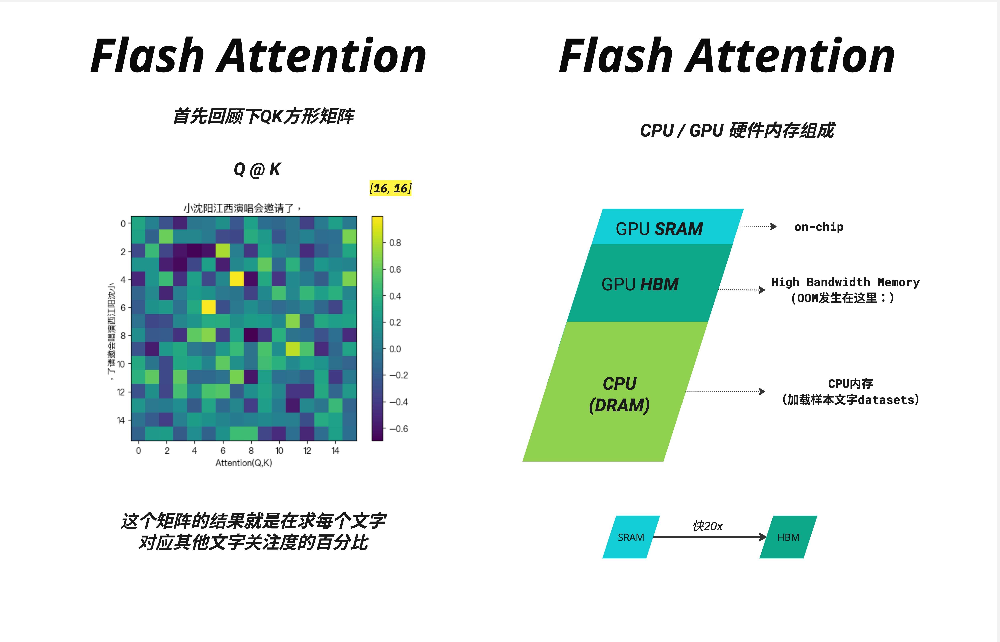
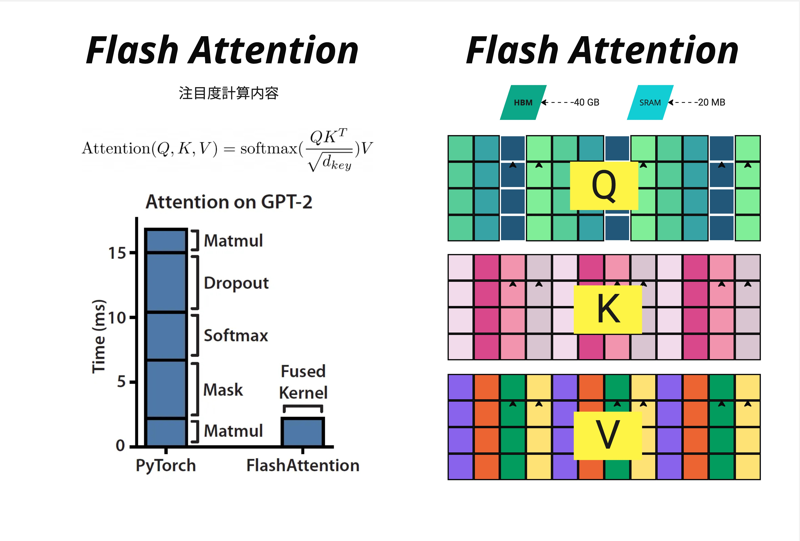
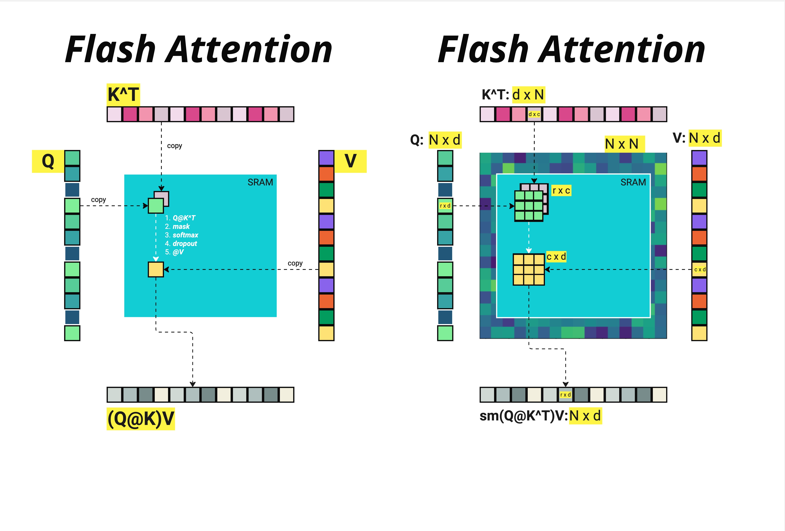
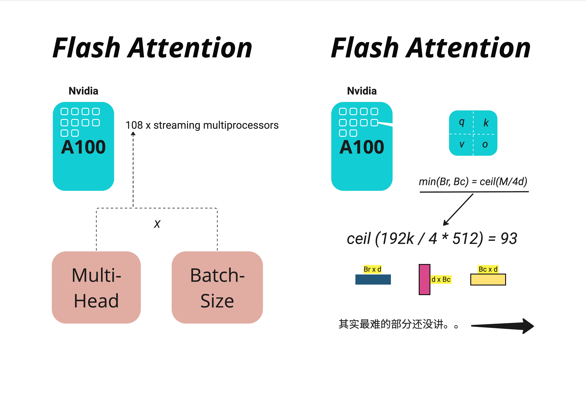
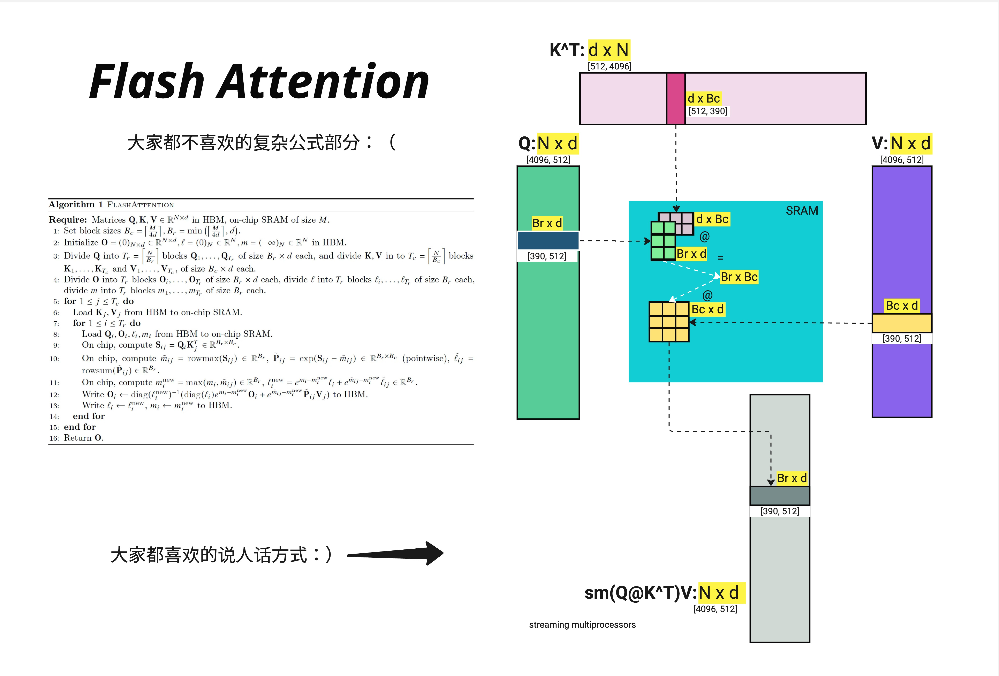
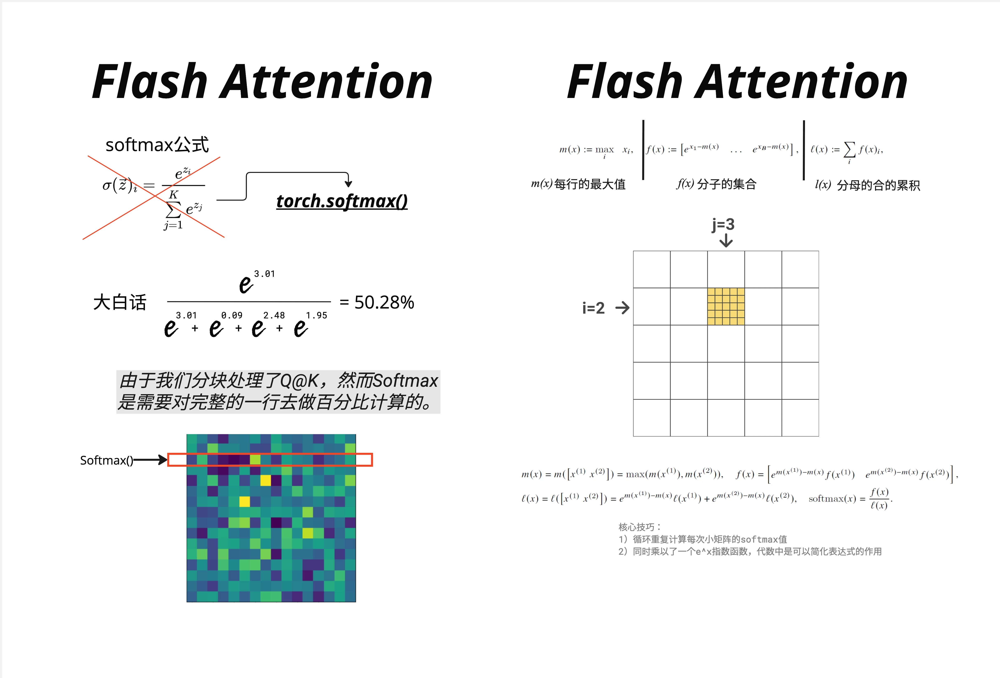
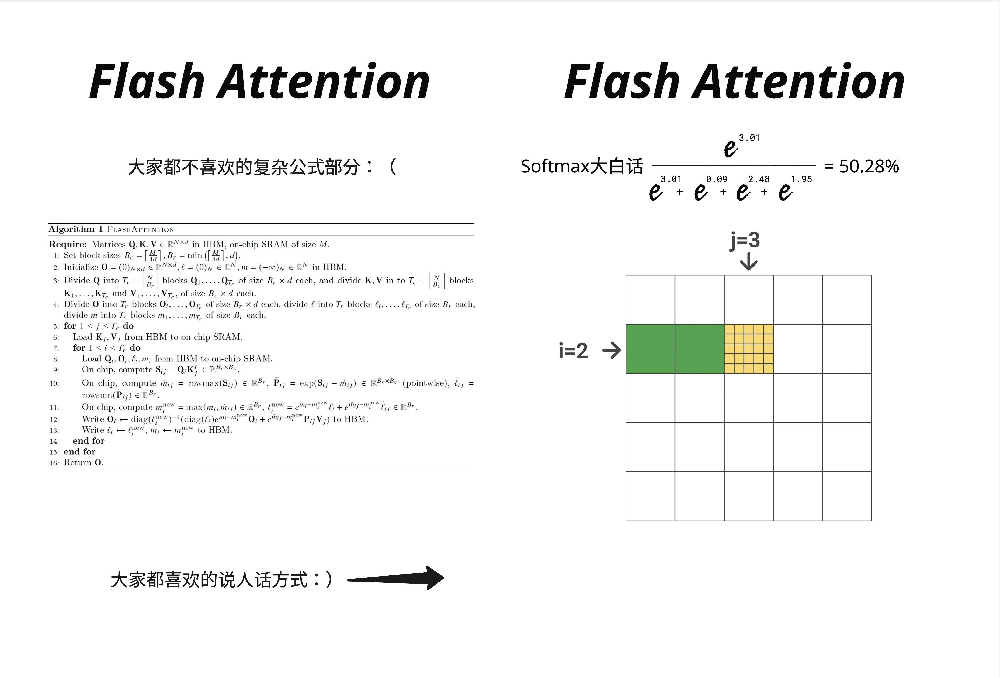
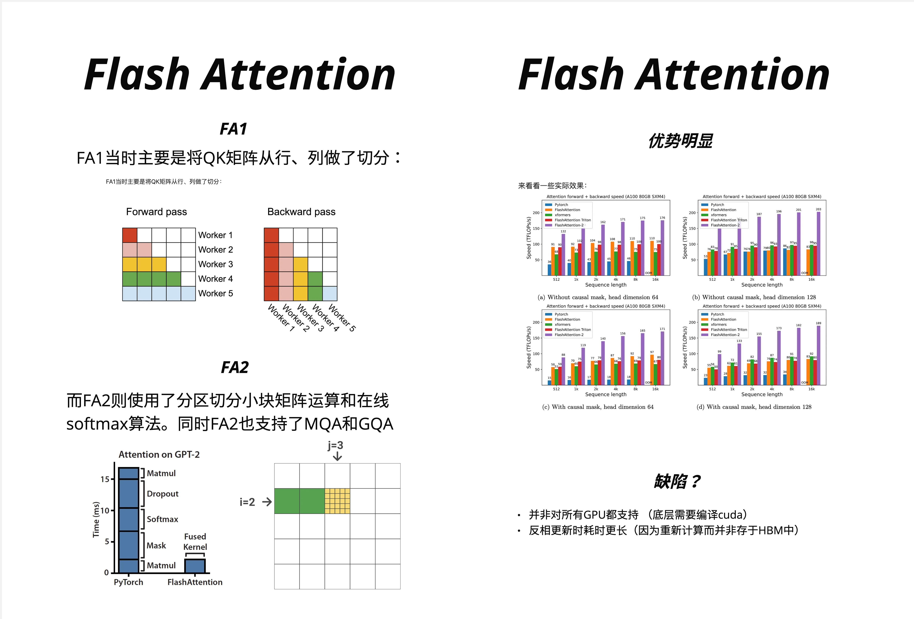

# 第 21 章：Flash Attention - 内存优化原理

> **Flash Attention 的核心洞察：GPU 的计算速度远快于内存读写速度，通过巧妙的分块策略和在线算法，我们可以用"多算一点"换取"少读写很多"，最终实现 2-4 倍的端到端加速。**

---

## 21.1 为什么需要 Flash Attention

### 21.1.1 一个令人困惑的现象

假设你正在训练一个 Transformer 模型，使用的是顶级的 NVIDIA A100 GPU，理论算力高达 312 TFLOPS（FP16）。按理说，这么强大的计算能力应该能让训练飞快进行。但实际情况是：**当序列长度增加时，训练速度急剧下降，而且经常出现 OOM（Out of Memory）错误**。

更诡异的是，即使 GPU 显存还有剩余，即使 GPU 利用率看起来很高，Attention 计算仍然成为瓶颈。这是为什么？

答案藏在一个被大多数人忽视的地方：**内存带宽**。

### 21.1.2 Attention 的内存困境

让我们回顾一下标准 Attention 的计算公式：

$$\text{Attention}(Q, K, V) = \text{softmax}\left(\frac{QK^T}{\sqrt{d_k}}\right)V$$

这个公式看起来很简洁，但隐藏着一个巨大的问题。假设序列长度为 $N$，每个 token 的维度为 $d$：

- $Q$ 的形状是 $[N, d]$
- $K$ 的形状是 $[N, d]$
- $QK^T$ 的形状是 $[N, N]$

当 $N = 4096$（这在现代 LLM 中很常见），$QK^T$ 矩阵的大小是 $4096 \times 4096 = 16,777,216$ 个元素。如果使用 FP16，这需要约 32MB 的内存。

这还只是单个 Attention 头、单个样本的情况。考虑到：
- 多头注意力（比如 32 个头）
- Batch size（比如 8）
- 需要存储中间结果用于反向传播

内存需求会爆炸式增长：$32 \times 8 \times 32\text{MB} = 8\text{GB}$，仅仅是存储 Attention 矩阵就需要这么多！



上图左侧展示了 $Q @ K$ 矩阵的可视化——这是一个 $16 \times 16$ 的小例子，每个格子的值代表了一个 token 对其他 token 的关注程度。而右侧展示了 GPU 的内存层级结构，这是理解 Flash Attention 的关键。

### 21.1.3 GPU 内存层级：速度与容量的权衡

GPU 的内存并不是一个统一的整体，而是分为多个层级：

| 层级 | 名称 | 容量 | 速度 | 说明 |
|------|------|------|------|------|
| 片上 | **SRAM**（共享内存/L1/L2缓存） | ~20 MB | ~19 TB/s | 极快但极小 |
| 显存 | **HBM**（高带宽内存） | ~40-80 GB | ~1.5-3 TB/s | GPU 主内存 |
| 主机 | **CPU DRAM** | ~1 TB | ~12.8 GB/s | 更大更慢 |

> **关键洞察**：SRAM 比 HBM 快大约 **20 倍**！

这就像你的书桌（SRAM）和书架（HBM）的关系：
- 书桌上放不了几本书，但取用极快
- 书架能放很多书，但每次去取都要站起来走过去

传统的 Attention 实现是这样工作的：

1. 从 HBM 读取 $Q, K$ → 计算 $QK^T$ → 写回 HBM
2. 从 HBM 读取 $QK^T$ → 做 softmax → 写回 HBM
3. 从 HBM 读取 softmax 结果和 $V$ → 计算最终输出 → 写回 HBM

每一步都涉及大量的 HBM 读写！这就是瓶颈所在。

---

## 21.2 传统实现 vs Flash Attention

### 21.2.1 PyTorch 标准实现的问题

让我们看看 PyTorch 中标准 Attention 的计算过程：

```python
# 标准 Attention 实现
def standard_attention(Q, K, V):
    # 步骤 1: 计算 QK^T，结果存入 HBM
    scores = torch.matmul(Q, K.transpose(-2, -1)) / math.sqrt(d_k)

    # 步骤 2: 从 HBM 读取 scores，计算 softmax，结果存回 HBM
    attention_weights = torch.softmax(scores, dim=-1)

    # 步骤 3: 应用 dropout（可选），又是一次 HBM 读写
    attention_weights = dropout(attention_weights)

    # 步骤 4: 从 HBM 读取权重和 V，计算输出
    output = torch.matmul(attention_weights, V)

    return output
```



上图左侧的柱状图清楚地展示了问题所在。在 GPT-2 的 Attention 计算中：
- **PyTorch 实现**：需要约 15ms，其中大部分时间花在 Matmul、Dropout、Softmax、Mask 等操作上
- **Flash Attention**：仅需约 3ms，因为它将所有操作融合成一个 **Fused Kernel**

性能提升了 **5 倍**！而且这还只是时间上的提升，内存占用的减少更加显著。

### 21.2.2 内存占用对比

右图展示了 Q、K、V 矩阵在 HBM（~40GB）和 SRAM（~20MB）之间的存储情况。传统方法需要将完整的 $N \times N$ Attention 矩阵存储在 HBM 中，而 Flash Attention 只需要在 SRAM 中处理小块数据。

内存复杂度对比：
- **标准 Attention**：$O(N^2)$ —— 需要存储完整的 Attention 矩阵
- **Flash Attention**：$O(N)$ —— 只需要存储输入和输出，不需要存储中间的大矩阵

这意味着：
- 序列长度 2048 时，Flash Attention 节省约 **2048 倍**的中间内存（$O(N^2)$ vs $O(N)$）
- 序列长度 4096 时，节省约 **4096 倍**

> **注**：实际节省倍数约等于序列长度 N，因为从 $O(N^2)$ 降到 $O(N)$。

---

## 21.3 Flash Attention 的核心思想：Tiling（分块）

### 21.3.1 分块策略的直觉

Flash Attention 的核心思想可以用一个简单的类比来理解：

想象你要计算一个很大的乘法表（比如 100x100）。传统方法是：
1. 先算出整个乘法表，写在一张大纸上
2. 然后对每一行做处理（softmax）
3. 最后用处理后的结果继续计算

Flash Attention 的方法是：
1. 把大表分成小块（比如 10x10 的小块）
2. 每次只处理一个小块，在小纸条（SRAM）上完成所有计算
3. 边算边更新最终结果，不需要存储整个大表



上图清晰地展示了这个过程：
- 左侧：将 $K^T$、$Q$、$V$ 的小块复制到 SRAM 中
- 在 SRAM 内完成：1. $Q@K^T$ → 2. mask → 3. softmax → 4. dropout → 5. $@V$
- 将结果 $(Q@K)V$ 写回 HBM

右侧展示了矩阵维度的对应关系：
- $Q$: $N \times d$（例如 4096 x 512）
- $K^T$: $d \times N$
- 中间结果 $QK^T$: $N \times N$（这个巨大的矩阵我们不再完整存储！）
- 输出: $N \times d$

### 21.3.2 分块大小的计算

在 NVIDIA A100 GPU 上，SRAM 大小约为 192KB。我们需要在 SRAM 中同时存放：
- $Q$ 的一个块：$B_r \times d$
- $K$ 的一个块：$B_c \times d$
- $V$ 的一个块：$B_c \times d$
- 输出块：$B_r \times d$



根据上图，A100 有 108 个 Streaming Multiprocessors（SM），每个 SM 都有自己的 SRAM。分块大小的计算公式是：

$$\min(B_r, B_c) = \text{ceil}\left(\frac{M}{4d}\right)$$

其中 $M$ 是 SRAM 大小（192KB），$d$ 是 head dimension（通常是 64 或 128）。

例如，当 $M = 192\text{KB} = 192 \times 1024$ 字节，$d = 512$ 时：

$$\text{ceil}\left(\frac{192 \times 1024}{4 \times 512}\right) = \text{ceil}(96) = 96$$

但实际实现中，为了对齐和效率，通常会选择 $B_r = B_c = 64$ 或 $128$。

### 21.3.3 分块计算的详细流程



上图展示了 Flash Attention 的完整算法和对应的可视化。让我们用更直观的方式来理解：

**输入**：
- $Q$: $[4096, 512]$ —— 存储在 HBM 中
- $K^T$: $[512, 4096]$ —— 存储在 HBM 中
- $V$: $[4096, 512]$ —— 存储在 HBM 中

**分块**：
- 将 $Q$ 分成 $T_r = \lceil N/B_r \rceil$ 个块，每块大小 $[B_r, d]$，即 $[390, 512]$
- 将 $K, V$ 分成 $T_c = \lceil N/B_c \rceil$ 个块，每块大小 $[B_c, d]$

**核心循环**（伪代码）：

```
for j = 1 to T_c:  # 外层循环：遍历 K, V 的块
    将 K_j, V_j 从 HBM 加载到 SRAM

    for i = 1 to T_r:  # 内层循环：遍历 Q 的块
        将 Q_i 从 HBM 加载到 SRAM

        # 在 SRAM 中完成所有计算
        S_ij = Q_i @ K_j^T          # 小块矩阵乘法
        P_ij = softmax(S_ij)        # 分块 softmax（需要特殊处理！）
        O_i = O_i + P_ij @ V_j      # 累加输出

        将更新后的 O_i 写回 HBM
```

等等，这里有一个问题：**Softmax 是对整行做的，但我们只有一小块数据，怎么办？**

这就需要引入 Flash Attention 最巧妙的部分：**Online Softmax**。

---

## 21.4 Online Softmax：分块计算 Softmax 的魔法

### 21.4.1 标准 Softmax 的问题

先回顾一下 Softmax 公式：

$$\text{softmax}(x)_i = \frac{e^{x_i}}{\sum_{j=1}^{K} e^{x_j}}$$



上图左侧展示了标准 Softmax 的计算方式。举个具体例子：

假设一行的值是 $[3.01, 0.09, 2.48, 1.95]$，计算第一个元素的 softmax：

$$\text{softmax}(3.01) = \frac{e^{3.01}}{e^{3.01} + e^{0.09} + e^{2.48} + e^{1.95}} = 50.28\%$$

问题在于：**分母需要所有元素的和**。但在分块计算时，我们一次只能看到部分元素！

### 21.4.2 Online Softmax 的核心技巧

Online Softmax 的关键洞察是：**我们可以边看边更新，而不需要一次性看到所有数据**。

为了实现这一点，我们需要维护三个量：
- $m(x)$：当前已见元素的最大值
- $f(x)$：分子的集合（调整后的指数值）
- $l(x)$：分母的累积和

当新的数据块到来时，我们可以用以下公式更新：

**合并两个块的规则**：

假设我们已经处理了第一块 $x^{(1)}$，现在来了第二块 $x^{(2)}$：

1. **更新最大值**：$m(x) = \max(m(x^{(1)}), m(x^{(2)}))$

2. **更新分子**：
   $$f(x) = \left[e^{m(x^{(1)}) - m(x)} \cdot f(x^{(1)}), \quad e^{m(x^{(2)}) - m(x)} \cdot f(x^{(2)})\right]$$

3. **更新分母**：
   $$l(x) = e^{m(x^{(1)}) - m(x)} \cdot l(x^{(1)}) + e^{m(x^{(2)}) - m(x)} \cdot l(x^{(2)})$$

4. **最终 softmax**：$\text{softmax}(x) = \frac{f(x)}{l(x)}$

### 21.4.3 为什么需要跟踪最大值？

你可能注意到了，公式中反复出现 $e^{m(x^{(1)}) - m(x)}$ 这样的项。这是为了**数值稳定性**。

直接计算 $e^{x}$ 当 $x$ 很大时会溢出。标准做法是先减去最大值：

$$\text{softmax}(x)_i = \frac{e^{x_i - \max(x)}}{\sum_{j} e^{x_j - \max(x)}}$$

在 Online Softmax 中，由于我们分块处理，每个块有自己的局部最大值。当遇到新块时，全局最大值可能会更新，我们需要用 $e^{m_{old} - m_{new}}$ 来"修正"之前的计算结果。



上图右侧展示了分块处理的过程。绿色块表示已经处理完的部分，黄色块表示当前正在处理的块（例如 $i=2, j=3$ 的位置）。

### 21.4.4 手算示例

让我们用一个小例子来验证 Online Softmax 的正确性。

假设完整的一行是 $[3.01, 0.09, 2.48, 1.95]$，我们分成两块处理：
- 第一块 $x^{(1)} = [3.01, 0.09]$
- 第二块 $x^{(2)} = [2.48, 1.95]$

**处理第一块**：
- $m^{(1)} = 3.01$
- $f^{(1)} = [e^{3.01-3.01}, e^{0.09-3.01}] = [1, 0.053]$
- $l^{(1)} = 1 + 0.053 = 1.053$

**处理第二块并合并**：
- $m^{(2)} = 2.48$
- $m = \max(3.01, 2.48) = 3.01$（最大值没变）
- 修正因子：$e^{3.01-3.01} = 1$，$e^{2.48-3.01} = 0.59$
- $f = [1 \times 1, 1 \times 0.053, 0.59 \times e^{0}, 0.59 \times e^{-0.53}]$
- $l = 1 \times 1.053 + 0.59 \times (1 + e^{-0.53}) = 1.053 + 0.59 \times 1.59 = 1.99$

**计算第一个元素的 softmax**：
$$\text{softmax}(3.01) = \frac{1}{1.99} \approx 50.25\%$$

这与直接计算的 50.28% 非常接近（差异来自我们简化的计算）！

---

## 21.5 Flash Attention 完整算法

### 21.5.1 算法伪代码

现在我们可以理解完整的 Flash Attention 算法了：

```
Algorithm: FLASHATTENTION

Input: Q, K, V ∈ R^{N×d} in HBM, on-chip SRAM of size M

1. 设置块大小 B_c = ceil(M / 4d), B_r = min(ceil(M / 4d), d)
2. 初始化 O = 0, l = 0, m = -∞ in HBM

3. 将 Q 分成 T_r = ceil(N / B_r) 个块 Q_1, ..., Q_{T_r}
4. 将 K, V 分成 T_c = ceil(N / B_c) 个块 K_1, ..., K_{T_c} 和 V_1, ..., V_{T_c}

5. for j = 1 to T_c do:
6.     从 HBM 加载 K_j, V_j 到 SRAM
7.     for i = 1 to T_r do:
8.         从 HBM 加载 Q_i, O_i, l_i, m_i 到 SRAM
9.         在 SRAM 中计算 S_ij = Q_i @ K_j^T
10.        计算 m̃_ij = rowmax(S_ij), P̃_ij = exp(S_ij - m̃_ij), l̃_ij = rowsum(P̃_ij)
11.        计算 m_i^new = max(m_i, m̃_ij)
12.        计算 l_i^new = e^{m_i - m_i^new} × l_i + e^{m̃_ij - m_i^new} × l̃_ij
13.        更新 O_i ← diag(l_i^new)^{-1} × (diag(l_i) × e^{m_i - m_i^new} × O_i + e^{m̃_ij - m_i^new} × P̃_ij × V_j)
14.        将 O_i, l_i^new, m_i^new 写回 HBM
15.    end for
16. end for
17. Return O
```

### 21.5.2 IO 复杂度分析

Flash Attention 的巧妙之处在于大大减少了 HBM 访问次数。

**标准 Attention 的 IO 复杂度**：
- 读取 $Q, K$：$O(Nd)$
- 写入 $S = QK^T$：$O(N^2)$
- 读取 $S$ 做 softmax：$O(N^2)$
- 写入 softmax 结果：$O(N^2)$
- 读取 softmax 结果和 $V$：$O(N^2 + Nd)$
- 写入输出：$O(Nd)$
- **总计**：$O(Nd + N^2)$

**Flash Attention 的 IO 复杂度**：
- 外层循环读取 $K_j, V_j$：$T_c$ 次，每次 $O(B_c d)$
- 内层循环读写 $Q_i, O_i$：$T_r \times T_c$ 次，每次 $O(B_r d)$
- **总计**：$O\left(\frac{N^2 d^2}{M}\right)$

当 SRAM 大小 $M$ 足够大时（通常 $M \gg d$），Flash Attention 的 IO 复杂度接近 $O(N^2 d / M)$，比标准实现的 $O(N^2)$ 好很多！

---

## 21.6 Flash Attention 1 vs Flash Attention 2

### 21.6.1 FA1 的局限性



Flash Attention 1（2022 年发布）虽然已经实现了巨大的性能提升，但还有优化空间。

上图左侧展示了 FA1 的工作方式：
- **按行、列切分 QK 矩阵**
- Forward pass 和 Backward pass 分别由多个 Worker 并行处理
- 但 Worker 之间需要同步，造成了一些等待时间

### 21.6.2 FA2 的改进

Flash Attention 2（2023 年发布）做了几个关键改进：

1. **更好的并行策略**：
   - FA2 使用了分区切分小块矩阵运算
   - 减少了 Worker 之间的同步开销
   - 更充分地利用 GPU 的 Streaming Multiprocessors

2. **支持 MQA 和 GQA**：
   - Multi-Query Attention（MQA）
   - Grouped-Query Attention（GQA）
   - 这些变体在推理时特别有用，FA2 原生支持

3. **更高效的 Online Softmax 实现**：
   - 优化了数值计算的精度和效率
   - 减少了寄存器使用

上图右侧展示了性能对比：
- 在 A100 80GB SXM4 GPU 上测试
- 不同序列长度（512 到 16k）和 head dimension（64 和 128）
- **FlashAttention-2 consistently 达到最高吞吐量**，通常比 FA1 快 1.5-2 倍

### 21.6.3 性能数据

根据官方 benchmark：

| 配置 | PyTorch | FA1 | FA2 |
|------|---------|-----|-----|
| Seq 2k, head_dim 64 | ~50 TFLOPS | ~120 TFLOPS | ~175 TFLOPS |
| Seq 4k, head_dim 64 | ~45 TFLOPS | ~110 TFLOPS | ~170 TFLOPS |
| Seq 8k, head_dim 128 | ~40 TFLOPS | ~100 TFLOPS | ~165 TFLOPS |

FA2 能够达到 A100 理论峰值（312 TFLOPS）的约 **50-70%**，这对于一个 memory-bound 的操作来说已经非常优秀了。

---

## 21.7 Flash Attention 的局限性

尽管 Flash Attention 非常强大，但也有一些局限性需要了解：

### 21.7.1 硬件兼容性

- **需要特定 GPU 架构**：Flash Attention 底层使用 CUDA 实现，需要较新的 NVIDIA GPU（Ampere 架构及以上效果最好）
- **需要编译 CUDA 代码**：安装过程可能遇到编译问题
- **不支持所有 GPU**：老旧的 GPU 或非 NVIDIA GPU 无法使用

### 21.7.2 反向传播的开销

由于 Flash Attention 不存储完整的 Attention 矩阵，在反向传播时需要**重新计算**这些值。这意味着：

- **反向传播耗时更长**：相比标准实现，反向传播需要额外的计算
- **总体仍然更快**：因为节省的内存带宽远超额外的计算开销

### 21.7.3 特定功能支持

某些 Attention 变体可能需要特殊处理：
- Sliding Window Attention
- Sparse Attention patterns
- 自定义的 Attention mask

好消息是，Flash Attention 2 已经支持了大部分常见的变体。

---

## 21.8 实际使用：代码示例

### 21.8.1 安装 Flash Attention

```bash
# 推荐使用 pip 安装
pip install flash-attn --no-build-isolation

# 或者从源码安装（需要 CUDA toolkit）
git clone https://github.com/Dao-AILab/flash-attention.git
cd flash-attention
pip install .
```

### 21.8.2 基本使用

```python
import torch
from flash_attn import flash_attn_func

# 准备输入
batch_size = 2
seq_len = 4096
num_heads = 32
head_dim = 128

# Q, K, V 形状: [batch, seq_len, num_heads, head_dim]
q = torch.randn(batch_size, seq_len, num_heads, head_dim,
                dtype=torch.float16, device='cuda')
k = torch.randn(batch_size, seq_len, num_heads, head_dim,
                dtype=torch.float16, device='cuda')
v = torch.randn(batch_size, seq_len, num_heads, head_dim,
                dtype=torch.float16, device='cuda')

# 调用 Flash Attention
output = flash_attn_func(q, k, v, causal=True)  # causal=True 用于自回归模型
```

### 21.8.3 与 PyTorch 集成

PyTorch 2.0+ 已经内置了 Flash Attention 支持：

```python
import torch
import torch.nn.functional as F

# 使用 scaled_dot_product_attention（会自动选择最佳实现）
output = F.scaled_dot_product_attention(
    query, key, value,
    attn_mask=None,
    dropout_p=0.0,
    is_causal=True,
    scale=None
)

# PyTorch 会自动判断是否使用 Flash Attention、Memory Efficient Attention 或标准实现
```

### 21.8.4 在 Hugging Face Transformers 中使用

```python
from transformers import AutoModelForCausalLM

# 加载模型时启用 Flash Attention 2
model = AutoModelForCausalLM.from_pretrained(
    "meta-llama/Llama-2-7b-hf",
    torch_dtype=torch.float16,
    attn_implementation="flash_attention_2"  # 关键参数
)
```

---

## 21.9 本章要点回顾

1. **GPU 内存瓶颈**：现代 GPU 的计算速度远快于内存带宽，Attention 计算的瓶颈在于 HBM 读写，而非算力

2. **内存层级**：
   - SRAM：~20MB，极快（~19 TB/s）
   - HBM：~40GB，相对慢（~1.5 TB/s）
   - SRAM 比 HBM 快约 20 倍

3. **Tiling 分块策略**：
   - 将大矩阵分成小块，在 SRAM 中完成所有计算
   - 避免将 $N \times N$ 的 Attention 矩阵写入 HBM
   - 内存复杂度从 $O(N^2)$ 降到 $O(N)$

4. **Online Softmax**：
   - 维护 $m(x)$（最大值）、$f(x)$（分子）、$l(x)$（分母）
   - 边处理边更新，不需要看到完整的一行
   - 保证数值稳定性

5. **FA1 vs FA2**：
   - FA2 有更好的并行策略
   - FA2 支持 MQA/GQA
   - FA2 比 FA1 快 1.5-2 倍

6. **实际效果**：
   - 端到端训练速度提升 2-4 倍
   - 内存占用大幅降低
   - 支持更长的序列长度

---

## 21.10 延伸阅读

- **Flash Attention 论文**：
  - [FlashAttention: Fast and Memory-Efficient Exact Attention with IO-Awareness](https://arxiv.org/abs/2205.14135)（2022）
  - [FlashAttention-2: Faster Attention with Better Parallelism and Work Partitioning](https://arxiv.org/abs/2307.08691)（2023）

- **官方实现**：
  - [GitHub: Dao-AILab/flash-attention](https://github.com/Dao-AILab/flash-attention)

- **相关技术**：
  - Memory Efficient Attention（xFormers）
  - PagedAttention（vLLM）
  - Flash Decoding

---

## 21.11 下一章预告

在下一章《KV Cache：推理加速的关键》中，我们将探讨另一个重要的优化技术。KV Cache 解决的是推理阶段的重复计算问题：在自回归生成时，每生成一个新 token 都需要对之前所有 token 做 Attention，如果不缓存 K、V 矩阵，计算量会随着序列增长而急剧增加。

KV Cache 和 Flash Attention 是互补的技术：
- **Flash Attention**：优化单次 Attention 计算的内存效率
- **KV Cache**：避免推理时的重复计算

两者结合使用（如 Flash Decoding），可以实现更快的推理速度。
