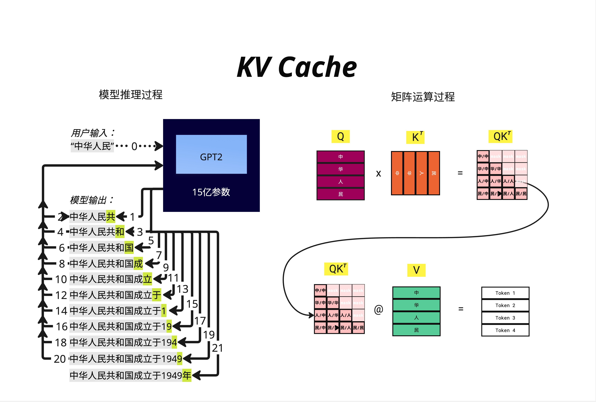
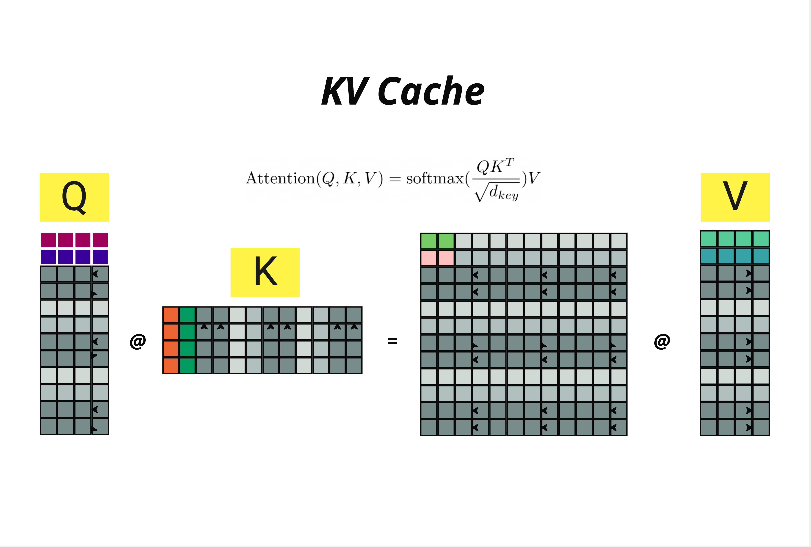
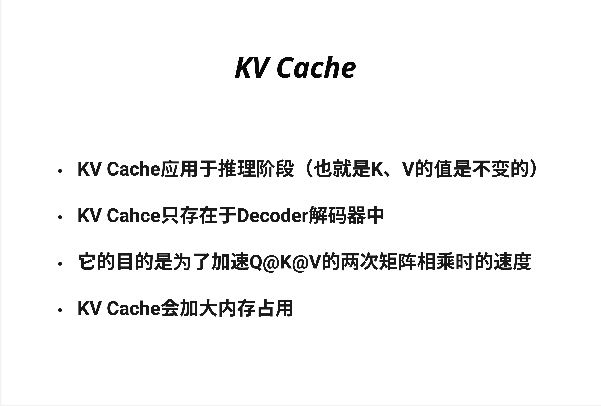
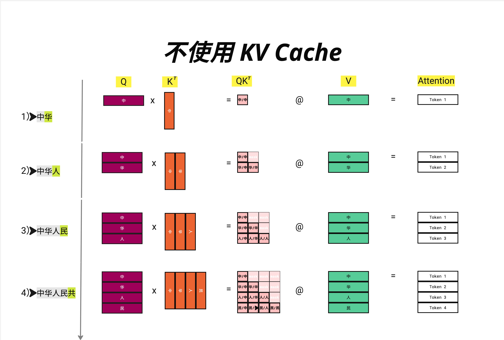
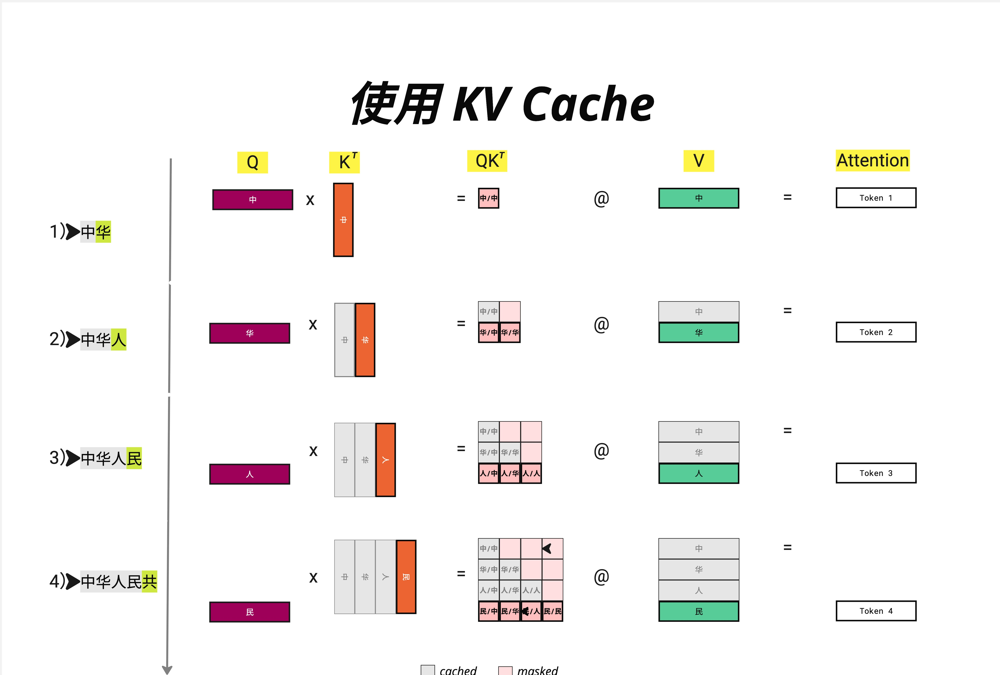
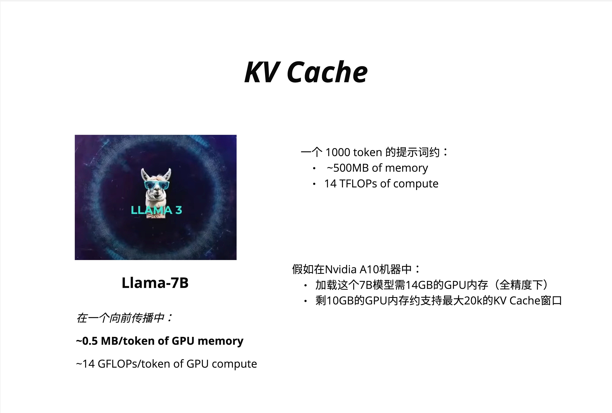
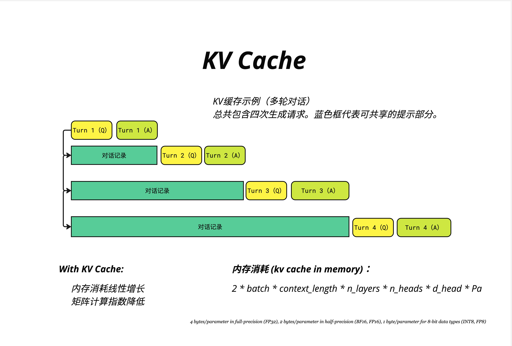
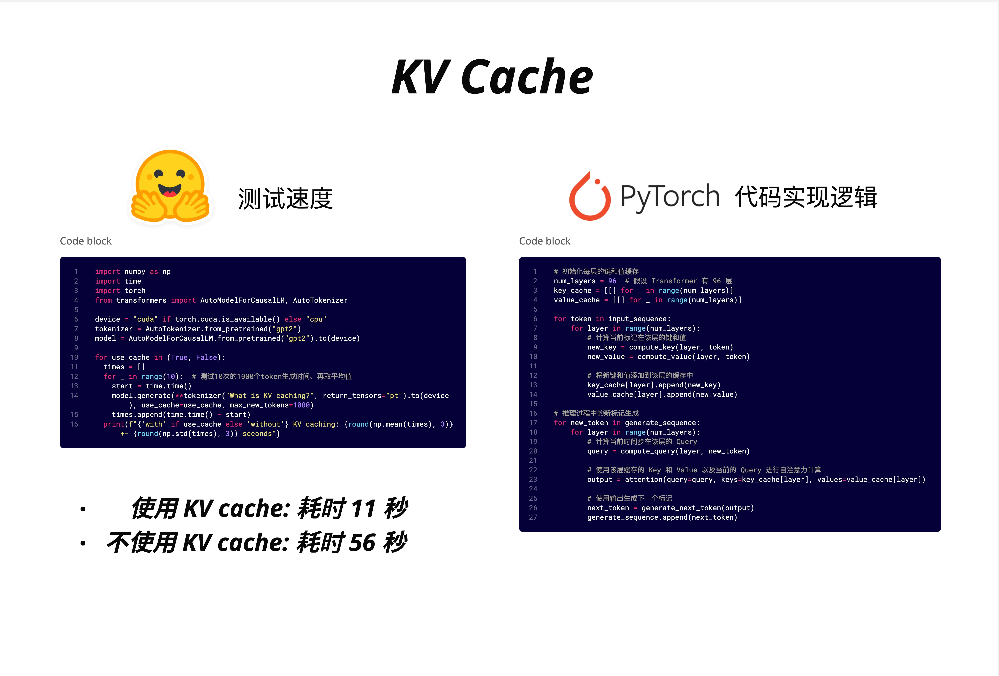

# 第 22 章：KV Cache - 推理加速

> **一句话总结**：KV Cache 通过缓存已计算过的 Key 和 Value，避免自回归生成时的重复计算，将推理速度提升 5 倍以上——这是所有生产级 LLM 的标配优化。

---

## 22.1 为什么需要 KV Cache？

### 22.1.1 自回归生成的计算浪费

在第 20 章，我们学习了推理的核心逻辑：**自回归生成**。模型一个词一个词地生成，每生成一个新词，都要把整个序列重新送入模型计算一遍。

让我们用一个具体例子来理解这个问题：



假设用户输入 "中华人民"，模型通过 GPT2 的 15 亿参数进行推理：

```
用户输入："中华人民"

模型输出过程：
步骤 1：中华人民 → 共
步骤 2：中华人民共 → 和
步骤 3：中华人民共和 → 国
步骤 4：中华人民共和国 → 成
步骤 5：中华人民共和国成 → 立
...
步骤 20：中华人民共和国成立于1949 → 年
```

看起来很简单，但问题在于：**每一步都要重新计算整个序列的 Attention！**

### 22.1.2 Attention 计算的本质

回顾 Attention 公式：

$$\text{Attention}(Q, K, V) = \text{softmax}\left(\frac{QK^T}{\sqrt{d_{key}}}\right)V$$

这个公式涉及两次矩阵乘法：
1. **Q @ K^T**：计算注意力分数
2. **分数 @ V**：加权求和得到输出



**关键洞察**：
- Q (Query) 矩阵随着序列增长
- K (Key) 矩阵随着序列增长
- V (Value) 矩阵随着序列增长

每次生成新 token，Q、K、V 都要全部重新计算——但其实**之前 token 对应的 K 和 V 根本没变**！

### 22.1.3 重复计算有多严重？

让我们手算一下生成 "中华人民共和国" 的计算量：

| 步骤 | 当前序列 | Q 大小 | K 大小 | 矩阵乘法次数 |
|-----|---------|--------|--------|-------------|
| 1 | 中 | 1 | 1 | 2 |
| 2 | 中华 | 2 | 2 | 2 |
| 3 | 中华人 | 3 | 3 | 2 |
| 4 | 中华人民 | 4 | 4 | 2 |
| 5 | 中华人民共 | 5 | 5 | 2 |
| 6 | 中华人民共和 | 6 | 6 | 2 |
| 7 | 中华人民共和国 | 7 | 7 | 2 |

**总计算量** = 1 + 4 + 9 + 16 + 25 + 36 + 49 = **140 次**（假设乘法次数与矩阵大小平方成正比）

这是 **O(n^2)** 的复杂度！当序列长度 n 达到几千甚至几万时，计算量会爆炸式增长。

---

## 22.2 KV Cache 的核心思想

### 22.2.1 四个关键点



1. **KV Cache 应用于推理阶段**（也就是 K、V 的值是不变的）
2. **KV Cache 只存在于 Decoder 解码器中**
3. **它的目的是为了加速 Q@K@V 的两次矩阵相乘时的速度**
4. **KV Cache 会加大内存占用**

### 22.2.2 为什么只缓存 K 和 V，不缓存 Q？

这是一个非常好的问题！答案藏在自回归生成的机制里：

**在推理时，我们只关心最后一个位置的输出。**

- 当生成第 n+1 个 token 时，我们只需要计算位置 n+1 的 Query
- 但这个 Query 需要和**所有**位置的 Key 做点积
- 然后用注意力分数对**所有**位置的 Value 加权

所以：
- **Q**：只需要最新 token 的，不用缓存
- **K 和 V**：需要所有历史 token 的，应该缓存

> **直觉理解**：Query 是"提问"，每次生成只需要一个新问题；Key 和 Value 是"知识库"，需要保留所有历史信息供查询。

---

## 22.3 有无 KV Cache 的对比

### 22.3.1 不使用 KV Cache



让我们详细看看生成 "中华人民共" 的过程：

**第 1 步**：输入 "中" → 输出 "华"
```
Q = [中]           大小: 1×d
K = [中]           大小: 1×d
V = [中]           大小: 1×d
QK^T = [中/中]     大小: 1×1
Output = Token 1
```

**第 2 步**：输入 "中华" → 输出 "人"
```
Q = [中, 华]       大小: 2×d  ← 重新计算！
K = [中, 华]       大小: 2×d  ← 重新计算！
V = [中, 华]       大小: 2×d  ← 重新计算！
QK^T = 2×2 矩阵
Output = Token 1, Token 2
```

**第 3 步**：输入 "中华人" → 输出 "民"
```
Q = [中, 华, 人]   大小: 3×d  ← 重新计算！
K = [中, 华, 人]   大小: 3×d  ← 重新计算！
V = [中, 华, 人]   大小: 3×d  ← 重新计算！
QK^T = 3×3 矩阵
Output = Token 1, Token 2, Token 3
```

**第 4 步**：输入 "中华人民" → 输出 "共"
```
Q = [中, 华, 人, 民]   大小: 4×d  ← 重新计算！
K = [中, 华, 人, 民]   大小: 4×d  ← 重新计算！
V = [中, 华, 人, 民]   大小: 4×d  ← 重新计算！
QK^T = 4×4 矩阵
Output = Token 1, Token 2, Token 3, Token 4
```

**问题一目了然**：每一步都要重新计算所有 token 的 K 和 V，但实际上我们只需要最后一行的输出！

### 22.3.2 使用 KV Cache



现在看看使用 KV Cache 后的变化：

**第 1 步**：输入 "中" → 输出 "华"
```
Q = [中]           大小: 1×d
K = [中]           大小: 1×d  → 缓存！
V = [中]           大小: 1×d  → 缓存！
QK^T = [中/中]     大小: 1×1
Output = Token 1
```

**第 2 步**：输入 "华" → 输出 "人"
```
Q = [华]           大小: 1×d  ← 只计算新 token！
K = [中, 华]       大小: 2×d  ← 从缓存读取 [中]，只计算 [华]
V = [中, 华]       大小: 2×d  ← 从缓存读取 [中]，只计算 [华]
QK^T = 只算最后一行  大小: 1×2
Output = Token 2   ← 只输出新 token！
```

**第 3 步**：输入 "人" → 输出 "民"
```
Q = [人]           大小: 1×d  ← 只计算新 token！
K = [中, 华, 人]   大小: 3×d  ← 从缓存读取，追加新的
V = [中, 华, 人]   大小: 3×d  ← 从缓存读取，追加新的
QK^T = 只算最后一行  大小: 1×3
Output = Token 3
```

**第 4 步**：输入 "民" → 输出 "共"
```
Q = [民]           大小: 1×d
K = [中, 华, 人, 民] 大小: 4×d  ← 缓存 + 新增
V = [中, 华, 人, 民] 大小: 4×d  ← 缓存 + 新增
QK^T = 只算最后一行  大小: 1×4
Output = Token 4
```

注意图中的颜色标记：
- **灰色格子**：cached（从缓存读取）
- **橙色格子**：新计算的 K
- **绿色格子**：新计算的 V
- **粉色格子**：masked（因果掩码遮蔽的部分）

### 22.3.3 计算量对比

| 步骤 | 无 KV Cache | 有 KV Cache | 节省 |
|-----|------------|-------------|------|
| 1 | 1×1 | 1×1 | 0% |
| 2 | 2×2 = 4 | 1×2 = 2 | 50% |
| 3 | 3×3 = 9 | 1×3 = 3 | 67% |
| 4 | 4×4 = 16 | 1×4 = 4 | 75% |
| n | n² | n | (n-1)/n |

当 n=1000 时，节省 **99.9%** 的计算量！

> **本质理解**：没有 KV Cache 时，计算量是 O(n^2)；有了 KV Cache 后，**每一步**的计算量变成 O(n)，总计算量从 O(n^3) 降到 O(n^2)。

---

## 22.4 KV Cache 的内存占用

### 22.4.1 空间换时间

KV Cache 是典型的"空间换时间"策略。我们节省了计算，但需要额外的 GPU 内存来存储 K 和 V。



### 22.4.2 以 Llama-7B 为例

**Llama-7B 的配置**：
- 在一个向前传播中：
  - ~0.5 MB/token of GPU memory
  - ~14 GFLOPs/token of GPU compute

**一个 1000 token 的提示词约需**：
- ~500MB of memory（KV Cache）
- 14 TFLOPs of compute

### 22.4.3 实际部署的约束

假设在 Nvidia A10 机器中部署 Llama-7B：
- A10 有 24GB GPU 内存
- 加载 7B 模型需 14GB（全精度 FP32）
- 剩余 10GB 用于 KV Cache
- 剩 10GB 的 GPU 内存约支持最大 **20k** 的 KV Cache 窗口

这意味着：
- 如果上下文长度是 4096，每个请求需要约 2GB KV Cache
- A10 最多同时处理 5 个并发请求

> **生产洞察**：KV Cache 内存占用往往是限制并发量的瓶颈，而不是模型参数本身。这就是为什么后来出现了 MQA、GQA 等优化技术（见第 23 章）。

### 22.4.4 KV Cache 内存计算公式

```
KV Cache 内存 = 2 × batch × context_length × n_layers × n_heads × d_head × precision_bytes
```

各参数含义：
- **2**：K 和 V 各一份
- **batch**：批处理大小
- **context_length**：上下文长度
- **n_layers**：Transformer 层数
- **n_heads**：注意力头数
- **d_head**：每个头的维度
- **precision_bytes**：
  - FP32 = 4 bytes
  - BF16/FP16 = 2 bytes
  - INT8/FP8 = 1 byte

**手算 Llama-7B**：
- n_layers = 32
- n_heads = 32
- d_head = 128
- 使用 FP16（2 bytes）
- context_length = 4096
- batch = 1

```
KV Cache = 2 × 1 × 4096 × 32 × 32 × 128 × 2 bytes
         = 2 × 1 × 4096 × 32 × 32 × 128 × 2
         = 2,147,483,648 bytes
         ≈ 2 GB
```

---

## 22.5 多轮对话中的 KV Cache

### 22.5.1 对话场景的特殊性

在聊天应用中，用户和模型进行多轮对话。如果每轮对话都重新计算，浪费更加严重。



### 22.5.2 四轮对话示例

```
第 1 轮：
[Turn 1 (Q)] [Turn 1 (A)]
└── 全部需要计算

第 2 轮：
[对话记录] [Turn 2 (Q)] [Turn 2 (A)]
└── 缓存   └── 新计算

第 3 轮：
[对话记录] [Turn 3 (Q)] [Turn 3 (A)]
└── 缓存   └── 新计算

第 4 轮：
[对话记录] [Turn 4 (Q)] [Turn 4 (A)]
└── 缓存   └── 新计算
```

蓝色框代表可共享的提示部分（已缓存的对话历史）。

### 22.5.3 With KV Cache 的优势

1. **内存消耗线性增长**：每轮只增加新 token 的 KV
2. **矩阵计算指数降低**：只需计算新增部分

> **实际应用**：ChatGPT 的流式响应之所以能做到"打字机效果"，部分原因就是 KV Cache 让每个新 token 的生成非常快。

---

## 22.6 代码实现

### 22.6.1 速度测试对比



实测结果：
- **使用 KV Cache**：11 秒
- **不使用 KV Cache**：56 秒
- **加速比**：约 **5 倍**

### 22.6.2 测试代码

```python
# 测试速度
import numpy as np
import time
import torch
from transformers import AutoModelForCausalLM, AutoTokenizer

device = "cuda" if torch.cuda.is_available() else "cpu"
tokenizer = AutoTokenizer.from_pretrained("gpt2")
model = AutoModelForCausalLM.from_pretrained("gpt2").to(device)

for use_cache in (True, False):
    times = []
    for _ in range(10):  # 测试10次的1000个token生成时间，再取平均值
        start = time.time()
        model.generate(
            **tokenizer("What is KV caching?", return_tensors="pt").to(device),
            use_cache=use_cache,
            max_new_tokens=1000
        )
        times.append(time.time() - start)
    print(f"{'with' if use_cache else 'without'} KV caching: {round(np.mean(times), 3)} "
          f"+- {round(np.std(times), 3)} seconds")
```

输出：
```
with KV caching: 11.xxx +- x.xxx seconds
without KV caching: 56.xxx +- x.xxx seconds
```

### 22.6.3 KV Cache 实现逻辑

```python
# PyTorch 代码实现逻辑

# 初始化每层的键和值缓存
num_layers = 96  # 假设 Transformer 有 96 层
key_cache = [[] for _ in range(num_layers)]
value_cache = [[] for _ in range(num_layers)]

for token in input_sequence:
    for layer in range(num_layers):
        # 计算当前标记在该层的键和值
        new_key = compute_key(layer, token)
        new_value = compute_value(layer, token)

        # 将新键和值添加到该层的缓存中
        key_cache[layer].append(new_key)
        value_cache[layer].append(new_value)

# 推理过程中的新标记生成
for new_token in generate_sequence:
    for layer in range(num_layers):
        # 计算当前时间步在该层的 Query
        query = compute_query(layer, new_token)

        # 使用该层缓存的 Key 和 Value 以及当前的 Query 进行自注意力计算
        output = attention(query=query, keys=key_cache[layer], values=value_cache[layer])

    # 使用输出生成下一个标记
    next_token = generate_next_token(output)
    generate_sequence.append(next_token)
```

### 22.6.4 关键代码解读

**初始化缓存**：
```python
key_cache = [[] for _ in range(num_layers)]
value_cache = [[] for _ in range(num_layers)]
```
- 每一层有独立的 K、V 缓存
- 因为每层的权重不同，K、V 的值也不同

**处理输入序列（Prefill 阶段）**：
```python
for token in input_sequence:
    for layer in range(num_layers):
        new_key = compute_key(layer, token)
        new_value = compute_value(layer, token)
        key_cache[layer].append(new_key)
        value_cache[layer].append(new_value)
```
- 首先处理用户的完整输入
- 计算并缓存所有 token 的 K、V

**生成新 token（Decode 阶段）**：
```python
for new_token in generate_sequence:
    query = compute_query(layer, new_token)
    output = attention(query=query, keys=key_cache[layer], values=value_cache[layer])
```
- 每次只计算新 token 的 Query
- 但使用**所有**历史的 Key 和 Value

---

## 22.7 KV Cache 与推理的两个阶段

### 22.7.1 Prefill vs Decode

现代 LLM 推理分为两个阶段：

| 阶段 | Prefill（预填充） | Decode（解码） |
|-----|-----------------|---------------|
| **输入** | 用户的完整 prompt | 上一步生成的 token |
| **计算** | 并行处理所有 token | 串行生成每个 token |
| **KV Cache** | 初始化缓存 | 追加新的 K、V |
| **瓶颈** | 计算密集 | 内存带宽密集 |

### 22.7.2 为什么 Decode 阶段是瓶颈？

Prefill 阶段虽然 token 多，但可以**并行计算**，充分利用 GPU 的计算能力。

Decode 阶段：
- 每次只处理 1 个 token
- GPU 大量算力空闲
- 主要时间花在从显存读取 KV Cache

这就是为什么 Decode 阶段是"**Memory Bound**"（内存带宽受限）的。

> **优化方向**：这解释了为什么后续章节要学习 MQA/GQA（减少 KV 数量）和量化（减少 KV 精度）。

---

## 22.8 常见问题与陷阱

### 22.8.1 KV Cache 会导致上下文长度限制吗？

**会，但主要是内存限制。**

计算本身没有上下文长度限制，但 KV Cache 随上下文线性增长：
- 4K 上下文 ≈ 2GB（Llama-7B）
- 32K 上下文 ≈ 16GB
- 128K 上下文 ≈ 64GB

这就是为什么长上下文模型需要更大的 GPU 内存。

### 22.8.2 训练时用 KV Cache 吗？

**不用！**

训练时：
- 有完整的目标序列
- 可以并行计算所有位置的 loss
- 没有"自回归生成"的过程

KV Cache 只在**推理的自回归生成**阶段有意义。

### 22.8.3 所有模型都支持 KV Cache 吗？

几乎所有 Decoder-only 和 Encoder-Decoder 模型都支持：
- GPT 系列
- LLaMA
- Mistral
- Gemma

Encoder-only 模型（如 BERT）不需要 KV Cache，因为它不做自回归生成。

### 22.8.4 KV Cache 有什么缺点？

1. **内存占用大**：长上下文时可能比模型参数还大
2. **限制并发**：每个请求都需要独立的 KV Cache
3. **首 token 延迟**：Prefill 阶段无法加速

---

## 22.9 KV Cache 优化技术预览

KV Cache 虽然强大，但内存占用是个大问题。业界发展出多种优化技术：

### 22.9.1 减少 KV 数量

- **MQA (Multi-Query Attention)**：所有 Query head 共享一组 K、V
- **GQA (Grouped-Query Attention)**：多个 Query head 共享一组 K、V

这些将在**第 23 章**详细讲解。

### 22.9.2 减少 KV 精度

- **KV Cache 量化**：用 INT8 或 FP8 存储 K、V
- 内存减半，精度损失微小

### 22.9.3 压缩/淘汰 KV

- **Sliding Window Attention**：只保留最近 N 个 token 的 KV
- **StreamingLLM**：保留"attention sink" + 最近 token
- **PagedAttention (vLLM)**：像操作系统管理内存一样管理 KV

---

## 22.10 本章总结

### 22.10.1 核心概念

| 概念 | 说明 |
|-----|------|
| **为什么需要 KV Cache** | 自回归生成时避免重复计算历史 token 的 K、V |
| **只缓存 K、V** | Query 每次只需要最新 token，不用缓存 |
| **计算节省** | 从 O(n^2) 降到 O(n)，生成 1000 token 节省 99.9% |
| **内存代价** | KV Cache 随上下文线性增长，可能成为瓶颈 |

### 22.10.2 关键公式

**KV Cache 内存计算**：
```
内存 = 2 × batch × seq_len × n_layers × n_heads × d_head × precision_bytes
```

**计算复杂度对比**：
- 无 KV Cache：每步 O(n^2)，总 O(n^3)
- 有 KV Cache：每步 O(n)，总 O(n^2)

### 22.10.3 实战要点

1. **Hugging Face 默认开启 KV Cache**：`use_cache=True`
2. **实测加速 5 倍以上**：11 秒 vs 56 秒
3. **多轮对话更有效**：历史 KV 可复用
4. **注意内存规划**：KV Cache 可能比模型参数还大

> **核心认知**：KV Cache 是 LLM 推理的"必选项"，不是"优化选项"。所有生产级部署都会开启它。理解 KV Cache 是理解 LLM 系统优化的基础——接下来的 MQA、GQA、PagedAttention 等技术，都是在 KV Cache 基础上的进一步优化。

---

## 本章交付物

学完这一章，你应该能够：

- [ ] 解释为什么自回归生成会有重复计算
- [ ] 理解为什么只缓存 K 和 V，不缓存 Q
- [ ] 手算有无 KV Cache 的计算量差异
- [ ] 估算特定模型的 KV Cache 内存占用
- [ ] 使用 Hugging Face 的 `use_cache` 参数

---

## 延伸阅读

- [Efficient Transformers: A Survey](https://arxiv.org/abs/2009.06732) - 全面综述 Transformer 效率优化
- [vLLM: Easy, Fast, and Cheap LLM Serving](https://github.com/vllm-project/vllm) - PagedAttention 的实现
- [FlashAttention-2](https://arxiv.org/abs/2307.08691) - 结合 KV Cache 的高效实现

---

## 下一章预告

KV Cache 的内存占用随 n_heads 线性增长。如果有 32 个 attention head，就需要存储 32 组 K 和 32 组 V。能不能让多个 head 共享 K、V 呢？

下一章，我们学习 **MQA/GQA/MHA** 三种注意力变体，理解它们如何在保持模型质量的同时，大幅减少 KV Cache 的内存占用！
