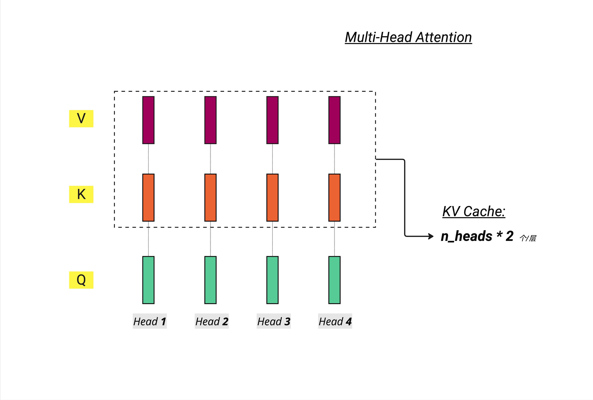
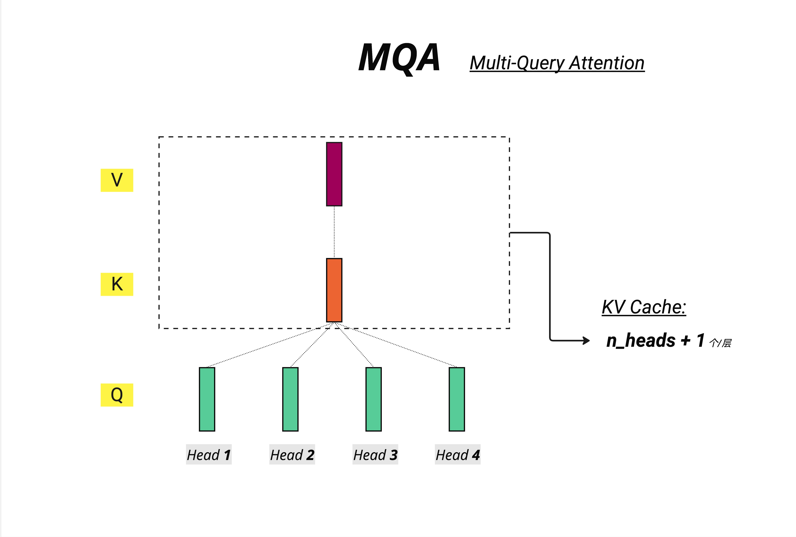
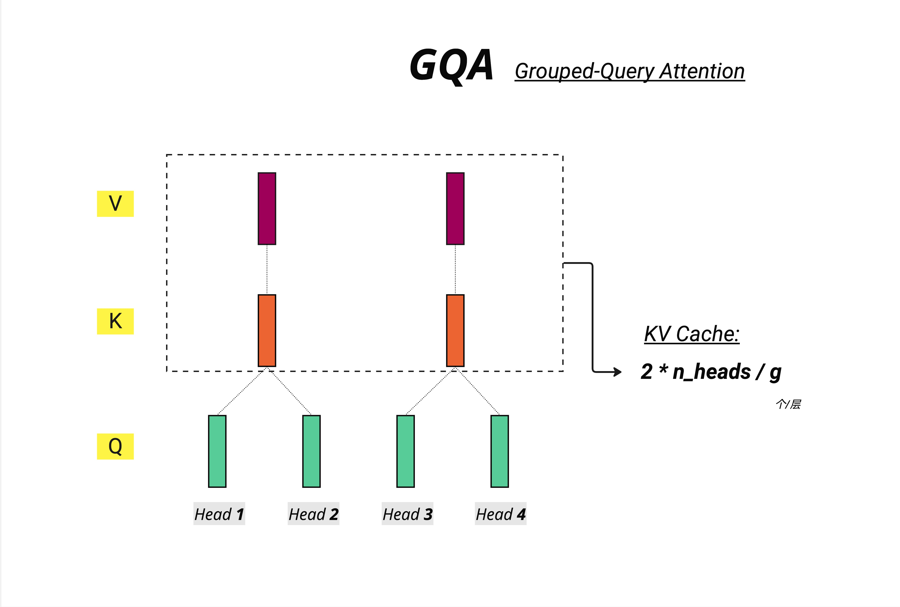
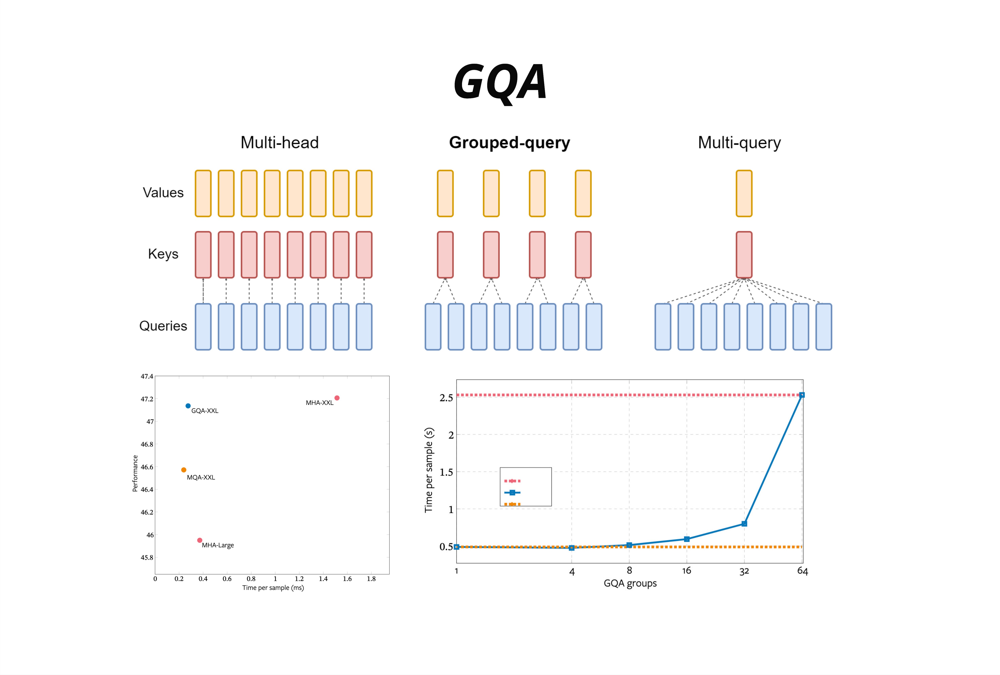
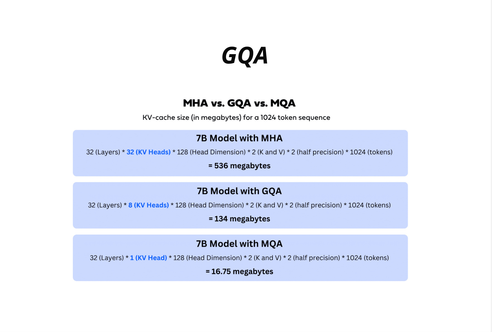
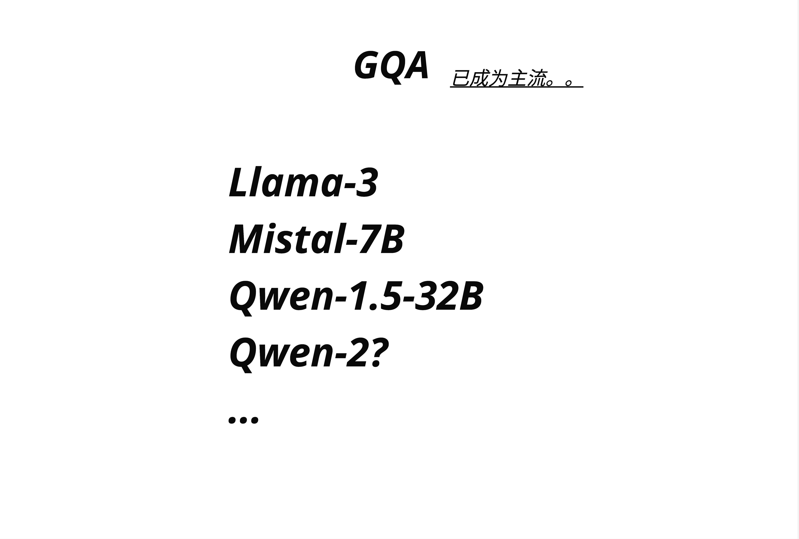

# 第 23 章：MHA 到 MQA 到 GQA 演进

> **一句话总结**：MHA 让每个注意力头都有独立的 K、V，表达能力最强但内存开销巨大；MQA 让所有头共享同一组 K、V，内存最省但质量下降；GQA 是折中方案，分组共享 K、V，在内存效率和模型质量之间找到了最佳平衡点，已成为 Llama-3、Mistral、Qwen 等主流模型的标配。

---

## 23.1 为什么需要改进 MHA？

### 23.1.1 KV Cache 的内存困境

在第 21 章和第 22 章，我们深入讨论了 KV Cache。它的核心思想是：**推理时缓存已计算的 K、V，避免重复计算**。

但这带来一个严重的问题：**内存爆炸**。

让我们算一笔账。对于一个典型的 7B 参数模型：

```
KV Cache 大小 = 层数 × KV头数 × 2(K和V) × 序列长度 × 每个头维度 × 精度
```

假设：
- 32 层
- 32 个注意力头
- 序列长度 1024
- 每个头维度 128
- 使用 FP16（2 bytes）

```
32 × 32 × 2 × 1024 × 128 × 2 bytes = 536 MB
```

**536 MB**，这只是一个用户的一次对话！

如果你要同时服务 100 个用户，每个用户对话 4096 tokens？

```
536 MB × 4（4096/1024）× 100 用户 ≈ 200 GB
```

这就是 **~200 GB** 的 KV Cache！这就是为什么 KV Cache 优化如此重要。

### 23.1.2 问题的本质

MHA（Multi-Head Attention）的设计理念是：**让每个头都能学习不同的表示**。

这意味着每个头都有独立的：
- Query 投影矩阵 $W_Q$
- Key 投影矩阵 $W_K$
- Value 投影矩阵 $W_V$

在训练时，这没问题——计算完就丢掉。

但在推理时，为了实现 KV Cache，我们必须**保存**每一层、每个头的 K 和 V。

> **核心矛盾**：MHA 的设计初衷是追求表达能力，但在部署阶段，这种"奢侈"的设计导致了严重的内存瓶颈。

### 23.1.3 本章要解决的问题

我们将探讨三种注意力机制：

| 机制 | 全称 | 核心思想 |
|------|------|---------|
| MHA | Multi-Head Attention | 每个头独立的 K、V |
| MQA | Multi-Query Attention | 所有头共享一组 K、V |
| GQA | Grouped-Query Attention | 分组共享 K、V |

---

## 23.2 MHA：标准多头注意力回顾

### 23.2.1 MHA 的结构

MHA 是原始 Transformer 论文《Attention Is All You Need》提出的标准结构。



如图所示，在 MHA 中：
- **每个头都有独立的 Q、K、V**
- 如果有 n_heads 个头，就有 n_heads 套 K 和 n_heads 套 V
- KV Cache 需要存储 **n_heads * 2** 个张量（每层）

### 23.2.2 MHA 的优点

**表达能力强**：每个头可以学习完全不同的 attention pattern。

比如，在处理句子 "The cat sat on the mat because it was tired" 时：
- Head 1 可能专注于主语-谓语关系（cat -> sat）
- Head 2 可能专注于代词指代（it -> cat）
- Head 3 可能专注于空间关系（sat -> on -> mat）
- Head 4 可能专注于因果关系（sat -> because -> tired）

不同的 K、V 投影让每个头可以构建完全不同的"关注视角"。

### 23.2.3 MHA 的问题

**内存开销巨大**，尤其在推理阶段。

我们再看一次 KV Cache 的公式：

```python
# MHA 的 KV Cache 大小（每层）
kv_cache_size = n_heads * 2 * seq_len * head_dim * bytes_per_element
```

对于 32 个头的模型，每层要存储 **64 个张量**（32 个 K + 32 个 V）。

这在以下场景会成为严重瓶颈：
- **长上下文**：处理 100K tokens 的文档
- **高并发**：同时服务数百个用户
- **端侧部署**：手机/边缘设备的内存有限

### 23.2.4 MHA 代码示例

```python
# 标准 MHA：每个头独立的 K、V
class MultiHeadAttention(nn.Module):
    def __init__(self, d_model, n_heads):
        super().__init__()
        self.n_heads = n_heads
        self.head_dim = d_model // n_heads

        # 每个头都有独立的 Q、K、V 投影
        self.W_q = nn.Linear(d_model, d_model)  # 包含所有头的 Q
        self.W_k = nn.Linear(d_model, d_model)  # 包含所有头的 K
        self.W_v = nn.Linear(d_model, d_model)  # 包含所有头的 V
        self.W_o = nn.Linear(d_model, d_model)

    def forward(self, x, kv_cache=None):
        B, T, C = x.shape

        # Q: [B, T, n_heads, head_dim]
        q = self.W_q(x).view(B, T, self.n_heads, self.head_dim)
        # K: [B, T, n_heads, head_dim] - 每个头独立的 K
        k = self.W_k(x).view(B, T, self.n_heads, self.head_dim)
        # V: [B, T, n_heads, head_dim] - 每个头独立的 V
        v = self.W_v(x).view(B, T, self.n_heads, self.head_dim)

        # KV Cache 需要存储 n_heads 套 K 和 V
        # ...
```

---

## 23.3 MQA：多查询注意力

### 23.3.1 MQA 的核心思想

2019 年，Google 在论文《Fast Transformer Decoding: One Write-Head is All You Need》中提出了 MQA。

核心思想极其简单：**所有的 Query 头共享同一组 Key 和 Value**。



如图所示：
- Q 仍然有多个头（图中 Head 1-4 的绿色方块）
- 但 K 和 V **只有一个**（共享）
- KV Cache 只需要存储 **n_heads + 1** 个张量（n 个 Q + 1 个 K + 1 个 V，实际是 2 个张量因为 Q 不需要缓存）

等等，图上写的是 "n_heads + 1"，这里需要澄清：

实际上 KV Cache 只存储 K 和 V，不存储 Q（Q 每次都要重新计算）。所以：
- MHA 的 KV Cache：n_heads 个 K + n_heads 个 V = **2 * n_heads**
- MQA 的 KV Cache：1 个 K + 1 个 V = **2**

### 23.3.2 MQA 的直觉理解

想象你是一位老师（模型），面对一个教室的学生（tokens）。

**MHA** 是这样的：
- 你有 8 个分身（8 个头）
- 每个分身都带着自己的笔记本（独立的 K、V）
- 每个分身用自己的方式记录每个学生的特点

**MQA** 是这样的：
- 你有 8 个分身（8 个头）
- 但所有分身共用一本笔记本（共享的 K、V）
- 每个分身可以提不同的问题（独立的 Q）
- 但他们查阅的是同一份资料

### 23.3.3 MQA 的优势

**内存节省惊人**！

回到我们之前的 7B 模型例子：

```
MHA KV Cache = 32 层 × 32 头 × 2 × 1024 × 128 × 2 = 536 MB
MQA KV Cache = 32 层 × 1 头 × 2 × 1024 × 128 × 2 = 16.75 MB
```

**从 536 MB 降到 16.75 MB，减少了 97%！**

这意味着：
- 同样的 GPU 内存可以支持 32 倍的并发用户
- 或者支持 32 倍长的上下文
- 或者在内存受限的设备上运行

### 23.3.4 MQA 的代价

天下没有免费的午餐。MQA 的代价是**模型质量下降**。

为什么？因为所有头被迫使用相同的 K、V。

回到我们的例子 "The cat sat on the mat because it was tired"：
- Head 1 想关注 cat -> sat 关系
- Head 2 想关注 it -> cat 关系
- Head 3 想关注 sat -> mat 关系

但在 MQA 中，它们必须查阅同一份 K、V"参考资料"。这限制了每个头捕捉不同模式的能力。

### 23.3.5 MQA 代码示例

```python
# MQA：所有头共享 K、V
class MultiQueryAttention(nn.Module):
    def __init__(self, d_model, n_heads):
        super().__init__()
        self.n_heads = n_heads
        self.head_dim = d_model // n_heads

        # Q 仍然是完整的 d_model 维度（包含所有头）
        self.W_q = nn.Linear(d_model, d_model)
        # K、V 只有一个头的维度！
        self.W_k = nn.Linear(d_model, self.head_dim)  # 只有 head_dim
        self.W_v = nn.Linear(d_model, self.head_dim)  # 只有 head_dim
        self.W_o = nn.Linear(d_model, d_model)

    def forward(self, x, kv_cache=None):
        B, T, C = x.shape

        # Q: [B, T, n_heads, head_dim] - 每个头独立
        q = self.W_q(x).view(B, T, self.n_heads, self.head_dim)

        # K, V: [B, T, 1, head_dim] - 只有一份！
        k = self.W_k(x).view(B, T, 1, self.head_dim)
        v = self.W_v(x).view(B, T, 1, self.head_dim)

        # 计算 attention 时，K、V 会广播到所有头
        # k: [B, T, 1, head_dim] -> broadcast to [B, T, n_heads, head_dim]
        # ...
```

### 23.3.6 MQA 的实际应用

Google 的 PaLM（Pathways Language Model）系列采用了 MQA。

但业界发现：**对于追求最高质量的模型，MQA 的质量损失难以接受**。

于是，GQA 应运而生。

---

## 23.4 GQA：分组查询注意力

### 23.4.1 GQA 的核心思想

GQA（Grouped-Query Attention）是 Google 在 2023 年论文《GQA: Training Generalized Multi-Query Transformer Models from Multi-Head Checkpoints》中提出的。

核心思想：**把 Q 头分成若干组，每组共享一套 K、V**。



如图所示：
- Q 仍然有多个头（Head 1-4）
- 但 K、V 不再是每个头独立，也不是全部共享
- 而是**分组共享**：Head 1-2 共享一组 K、V，Head 3-4 共享另一组
- KV Cache 需要存储 **2 * n_heads / g** 个张量（g 是组数）

### 23.4.2 GQA 的数学表达

设：
- n_heads = Q 头的数量
- n_kv_heads = KV 组的数量
- g = n_heads / n_kv_heads（每组包含的 Q 头数量）

则：
- **MHA**：n_kv_heads = n_heads（每个 Q 头一组 KV）
- **MQA**：n_kv_heads = 1（所有 Q 头共享一组 KV）
- **GQA**：1 < n_kv_heads < n_heads（折中方案）

常见配置：
- Llama-2 70B：n_heads=64, n_kv_heads=8（每 8 个 Q 头共享一组 KV）
- Llama-3 8B：n_heads=32, n_kv_heads=8（每 4 个 Q 头共享一组 KV）
- Mistral 7B：n_heads=32, n_kv_heads=8（每 4 个 Q 头共享一组 KV）

### 23.4.3 GQA 的直觉理解

继续用老师和教室的比喻：

**GQA** 是这样的：
- 你有 8 个分身（8 个头）
- 分身被分成 2 组，每组 4 人
- 每组共用一本笔记本（组内共享 K、V）
- 组与组之间的笔记本不同

这样：
- 同一组内的分身可以协作（共享信息）
- 不同组之间仍有差异（不同的参考资料）
- 内存开销大大减少（只需要 2 本笔记本，而不是 8 本）

### 23.4.4 三种机制对比



上图完美展示了三种机制的对比：

**架构对比**（上半部分）：
- Multi-head：8 个 Q 头配 8 个 K 头配 8 个 V 头
- Grouped-query：8 个 Q 头配 2 个 K 头配 2 个 V 头
- Multi-query：8 个 Q 头配 1 个 K 头配 1 个 V 头

**性能对比**（左下图）：
- 横轴是推理时间（Time per sample）
- 纵轴是模型性能（Performance）
- GQA-XXL 在性能上接近 MHA-XXL
- 但推理时间接近 MQA-XXL

**组数影响**（右下图）：
- 横轴是 GQA 的组数
- 组数越多（接近 MHA），推理越慢
- 组数越少（接近 MQA），推理越快
- 8 组是一个甜点

> **GQA 的核心价值**：用接近 MQA 的推理效率，获得接近 MHA 的模型质量。

### 23.4.5 KV Cache 内存对比



让我们用具体数字来说话。对于一个 7B 模型，1024 tokens 序列：

**MHA**（32 个 KV 头）：
```
32 层 × 32 KV头 × 128 head_dim × 2(K和V) × 2(FP16) × 1024 tokens
= 536 MB
```

**GQA**（8 个 KV 头）：
```
32 层 × 8 KV头 × 128 head_dim × 2(K和V) × 2(FP16) × 1024 tokens
= 134 MB
```

**MQA**（1 个 KV 头）：
```
32 层 × 1 KV头 × 128 head_dim × 2(K和V) × 2(FP16) × 1024 tokens
= 16.75 MB
```

| 机制 | KV 头数 | KV Cache 大小 | 相对 MHA |
|------|---------|--------------|---------|
| MHA | 32 | 536 MB | 100% |
| GQA | 8 | 134 MB | 25% |
| MQA | 1 | 16.75 MB | 3.1% |

**GQA 将内存降低了 75%，同时保持了接近 MHA 的质量！**

### 23.4.6 GQA 代码示例

```python
# GQA：分组共享 K、V
class GroupedQueryAttention(nn.Module):
    def __init__(self, d_model, n_heads, n_kv_heads):
        super().__init__()
        self.n_heads = n_heads        # Q 头数量
        self.n_kv_heads = n_kv_heads  # KV 组数量
        self.n_rep = n_heads // n_kv_heads  # 每组包含的 Q 头数
        self.head_dim = d_model // n_heads

        # Q 有完整的 n_heads 个头
        self.W_q = nn.Linear(d_model, n_heads * self.head_dim)
        # K、V 只有 n_kv_heads 个头
        self.W_k = nn.Linear(d_model, n_kv_heads * self.head_dim)
        self.W_v = nn.Linear(d_model, n_kv_heads * self.head_dim)
        self.W_o = nn.Linear(d_model, d_model)

    def forward(self, x, kv_cache=None):
        B, T, C = x.shape

        # Q: [B, T, n_heads, head_dim]
        q = self.W_q(x).view(B, T, self.n_heads, self.head_dim)

        # K, V: [B, T, n_kv_heads, head_dim]
        k = self.W_k(x).view(B, T, self.n_kv_heads, self.head_dim)
        v = self.W_v(x).view(B, T, self.n_kv_heads, self.head_dim)

        # 关键：将 K、V 扩展以匹配 Q 的头数
        # 方法是重复 n_rep 次
        k = self.repeat_kv(k)  # [B, T, n_heads, head_dim]
        v = self.repeat_kv(v)  # [B, T, n_heads, head_dim]

        # 后面的 attention 计算与标准 MHA 相同
        # ...

    def repeat_kv(self, x):
        """将 KV 头重复以匹配 Q 头数量"""
        B, T, n_kv_heads, head_dim = x.shape
        if self.n_rep == 1:
            return x
        # [B, T, n_kv_heads, head_dim] -> [B, T, n_kv_heads, n_rep, head_dim]
        x = x.unsqueeze(3).expand(B, T, n_kv_heads, self.n_rep, head_dim)
        # -> [B, T, n_heads, head_dim]
        return x.reshape(B, T, self.n_heads, head_dim)
```

### 23.4.7 repeat_kv 的几何理解

`repeat_kv` 函数是 GQA 的核心操作。让我们用一个具体例子理解它：

假设 n_heads=8, n_kv_heads=2（每 4 个 Q 头共享一组 KV）：

```
原始 K/V 形状: [B, T, 2, head_dim]
           ↓
     K/V 组 0    K/V 组 1
       ↓           ↓

扩展后形状: [B, T, 8, head_dim]
           ↓
   Q头0  Q头1  Q头2  Q头3  Q头4  Q头5  Q头6  Q头7
     ↓    ↓    ↓    ↓    ↓    ↓    ↓    ↓
   KV0   KV0  KV0  KV0   KV1  KV1  KV1  KV1
```

Q 头 0-3 使用 KV 组 0，Q 头 4-7 使用 KV 组 1。

---

## 23.5 三种机制的性能权衡

### 23.5.1 质量 vs 效率的帕累托前沿

在机器学习中，我们经常面临质量和效率的权衡。理想情况是找到帕累托最优点——在不牺牲一方的前提下无法改善另一方。

| 机制 | 模型质量 | 推理速度 | 内存占用 | 适用场景 |
|------|---------|---------|---------|---------|
| MHA | 最高 | 最慢 | 最大 | 训练、研究、不计成本的部署 |
| MQA | 有损失 | 最快 | 最小 | 端侧部署、极致效率需求 |
| GQA | 接近 MHA | 接近 MQA | 较小 | 生产部署、平衡需求 |

### 23.5.2 为什么 GQA 质量损失小？

一个有趣的研究发现：**在 MHA 中，不同头的 K、V 表示存在高度相似性**。

换句话说，虽然每个头理论上可以学习完全不同的表示，但实际上：
- 很多头学到了相似的模式
- K、V 的多样性不如 Q 那么重要
- 共享 K、V 并不会导致严重的信息损失

这就是为什么 GQA 可以在大幅减少 KV 头的同时，保持接近 MHA 的质量。

### 23.5.3 训练 vs 推理的考量

有一个关键点需要理解：

**训练阶段**：
- 不使用 KV Cache（因为要计算所有位置）
- MHA、MQA、GQA 的计算成本差异不大
- 参数量：GQA < MHA（K、V 投影矩阵更小）

**推理阶段**：
- 必须使用 KV Cache（否则效率太低）
- MHA 的内存瓶颈凸显
- GQA 的优势充分发挥

这就是为什么 GQA 成为了**部署友好型架构**的首选。

---

## 23.6 主流模型的选择

### 23.6.1 GQA 已成为主流



如图所示，GQA 已经成为现代大模型的主流选择：

- **Llama-3**（Meta）
- **Mistral-7B**（Mistral AI）
- **Qwen-1.5-32B / Qwen-2**（阿里）
- 以及更多...

### 23.6.2 各模型的具体配置

| 模型 | 参数量 | Q 头数 | KV 头数 | 组大小 |
|------|-------|--------|--------|--------|
| Llama-2 7B | 7B | 32 | 32 | 1 (MHA) |
| Llama-2 70B | 70B | 64 | 8 | 8 |
| Llama-3 8B | 8B | 32 | 8 | 4 |
| Llama-3 70B | 70B | 64 | 8 | 8 |
| Mistral 7B | 7B | 32 | 8 | 4 |
| Qwen-1.5 7B | 7B | 32 | 32 | 1 (MHA) |
| Qwen-1.5 32B | 32B | 40 | 8 | 5 |
| Qwen-2 7B | 7B | 28 | 4 | 7 |

有趣的观察：
- 小模型（7B）有时仍使用 MHA（如 Llama-2 7B、Qwen-1.5 7B）
- 大模型几乎都使用 GQA
- KV 头数通常是 8，这是一个经验上的甜点

### 23.6.3 为什么 8 个 KV 头？

研究表明，KV 头数从 1 增加到 8 时，模型质量显著提升；但从 8 增加到更多时，边际收益递减。

同时，8 这个数字对 GPU 的张量并行（Tensor Parallelism）也很友好——可以均匀分配到 2、4、8 个 GPU 上。

---

## 23.7 从 MHA 转换到 GQA

### 23.7.1 Uptraining 技术

一个实用的问题：如果已经有一个训练好的 MHA 模型，如何转换成 GQA？

Google 的 GQA 论文提出了 **Uptraining** 方法：

1. **权重平均**：将需要合并的 K、V 头的权重取平均
2. **继续训练**：用原始数据的一小部分（如 5%）继续训练
3. **恢复质量**：模型快速适应新的结构

```python
def convert_mha_to_gqa(mha_weights, n_heads, n_kv_heads):
    """将 MHA 权重转换为 GQA 权重"""
    group_size = n_heads // n_kv_heads

    # 原始 K 权重: [d_model, n_heads * head_dim]
    # 重塑为: [d_model, n_heads, head_dim]
    k_weights = mha_weights['W_k'].reshape(d_model, n_heads, head_dim)

    # 分组平均: [d_model, n_kv_heads, head_dim]
    k_grouped = k_weights.reshape(d_model, n_kv_heads, group_size, head_dim)
    k_gqa = k_grouped.mean(dim=2)  # 组内平均

    # V 权重同理
    # ...

    return gqa_weights
```

### 23.7.2 为什么 Uptraining 有效？

回到我们之前的发现：MHA 中不同头的 K、V 表示存在相似性。

这意味着取平均后：
- 保留了共同的重要信息
- 丢失的主要是头间的细微差异
- 少量的继续训练可以快速弥补

---

## 23.8 实现细节与优化

### 23.8.1 Flash Attention 与 GQA

Flash Attention（我们在第 21 章讨论过）与 GQA 是完美搭档：

- Flash Attention 优化计算效率
- GQA 优化内存效率

现代框架（如 vLLM、TensorRT-LLM）都同时支持这两种优化。

### 23.8.2 张量并行中的 GQA

在多 GPU 推理中，GQA 有额外的好处：

**MHA**：
```
GPU 0: Q 头 0-7,  K 头 0-7,  V 头 0-7
GPU 1: Q 头 8-15, K 头 8-15, V 头 8-15
...
```

**GQA**（n_heads=32, n_kv_heads=8）：
```
GPU 0: Q 头 0-7,  K 头 0-1, V 头 0-1
GPU 1: Q 头 8-15, K 头 2-3, V 头 2-3
...
```

每个 GPU 需要存储的 KV Cache 减少了 4 倍！

### 23.8.3 Prefill vs Decode 的影响

回顾 LLM 推理的两个阶段：

**Prefill**（首次处理 prompt）：
- 计算密集型
- GQA 减少的参数量 → 略微加速

**Decode**（逐个生成 token）：
- 内存带宽密集型
- GQA 减少的 KV Cache → 显著加速

GQA 在 Decode 阶段的收益更大。

---

## 23.9 常见误区

### 23.9.1 误区一：GQA 就是 MQA 加了几个头

**错误理解**：GQA 只是 MQA 的简单扩展。

**正确理解**：GQA 是一种**参数化的设计**，n_kv_heads 是可调的超参数。MHA 和 MQA 是 GQA 的两个极端情况。

### 23.9.2 误区二：KV 头越少越好

**错误理解**：既然减少 KV 头可以省内存，那就用最少的。

**正确理解**：KV 头数与模型质量存在权衡。过少的 KV 头会导致显著的质量下降。8 是一个经验上的良好选择。

### 23.9.3 误区三：GQA 只影响推理

**错误理解**：GQA 只是推理优化，与训练无关。

**正确理解**：GQA 减少了 K、V 投影矩阵的参数量，会影响训练。但由于训练不使用 KV Cache，影响较小。

### 23.9.4 误区四：所有模型都应该用 GQA

**错误理解**：GQA 全面优于 MHA。

**正确理解**：对于小模型（如 7B 以下），MHA 的内存开销可能可以接受，而其更强的表达能力可能更重要。选择取决于具体的部署约束。

---

## 23.10 本章要点回顾

### 23.10.1 三种机制一览

```
MHA (Multi-Head Attention)
    每个头独立的 Q、K、V
    KV Cache: n_heads * 2 个张量/层
    质量最高，内存最大

MQA (Multi-Query Attention)
    所有头共享 K、V，Q 独立
    KV Cache: 2 个张量/层
    内存最小，质量有损

GQA (Grouped-Query Attention)
    Q 头分组，组内共享 K、V
    KV Cache: n_kv_heads * 2 个张量/层
    平衡质量与效率
```

### 23.10.2 选择指南

| 场景 | 推荐 | 原因 |
|------|------|------|
| 研究/训练 | MHA | 最大表达能力 |
| 大规模部署 | GQA | 平衡质量与效率 |
| 端侧/极致效率 | MQA | 最小内存占用 |
| 不确定 | GQA (8 KV 头) | 稳妥的默认选择 |

### 23.10.3 核心认知

> **从 MHA 到 MQA 到 GQA 的演进，体现了深度学习工程化的一个核心主题：在模型质量和部署效率之间寻找最佳平衡。GQA 通过分组共享 K、V，用 25% 的内存换取接近 100% 的质量，成为了现代大模型的主流选择。**

---

## 本章交付物

学完这一章，你应该能够：

- [ ] 解释 MHA、MQA、GQA 的核心区别
- [ ] 计算三种机制的 KV Cache 大小
- [ ] 理解 GQA 为什么能在质量和效率间取得平衡
- [ ] 知道主流模型（Llama-3、Mistral、Qwen）的 GQA 配置
- [ ] 实现 GQA 的 repeat_kv 操作

---

## 延伸阅读

1. **Fast Transformer Decoding: One Write-Head is All You Need**（MQA 原论文，2019）
2. **GQA: Training Generalized Multi-Query Transformer Models from Multi-Head Checkpoints**（GQA 原论文，2023）
3. **Llama 2: Open Foundation and Fine-Tuned Chat Models**（Meta，2023）

---

## 下一章预告

我们已经了解了如何通过共享 K、V 来优化内存。但还有另一个角度：**稀疏注意力（Sparse Attention）**。

不是让所有 token 都关注所有其他 token，而是有选择地关注——这不仅节省内存，还能处理超长序列。

下一章，我们来探索 Sparse Attention 的各种变体：Sliding Window、Dilated、Longformer 等。
