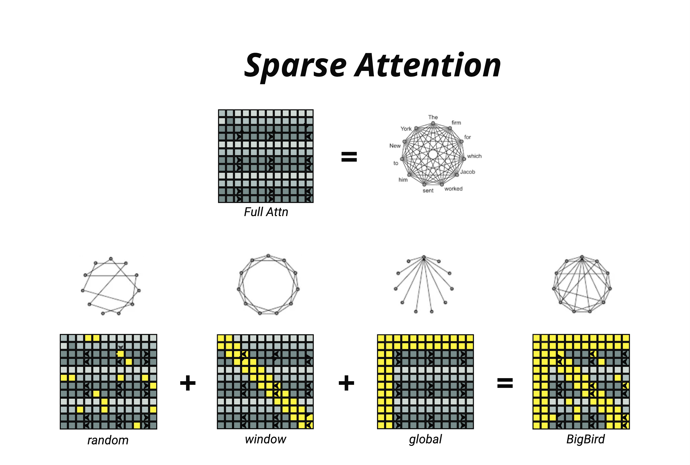
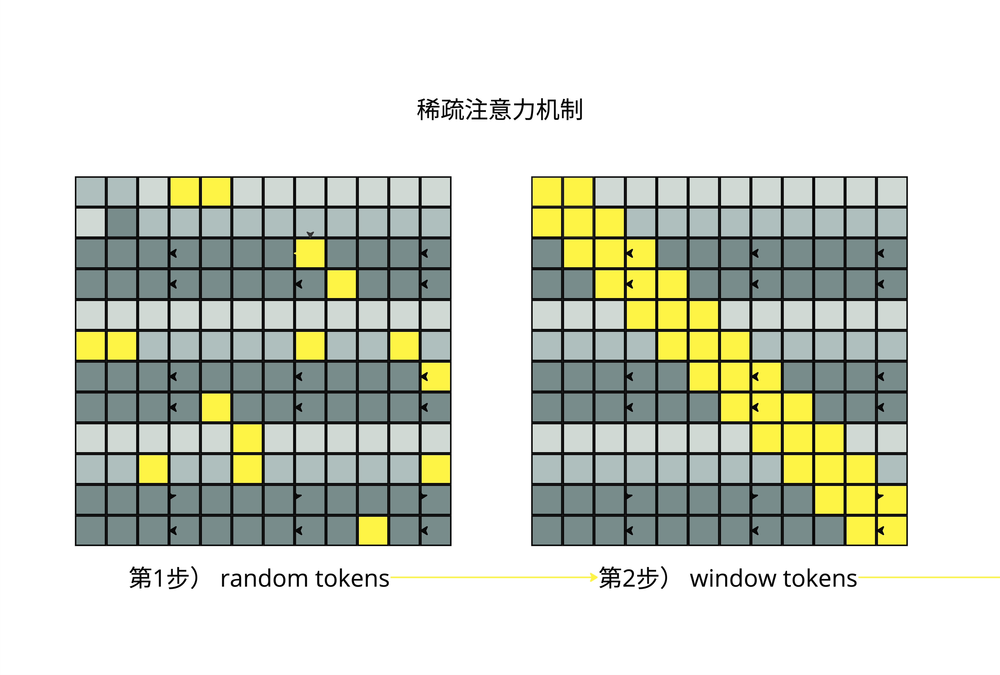
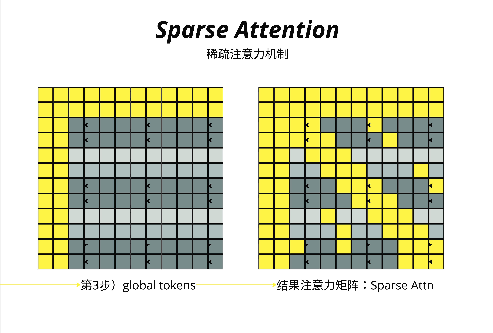
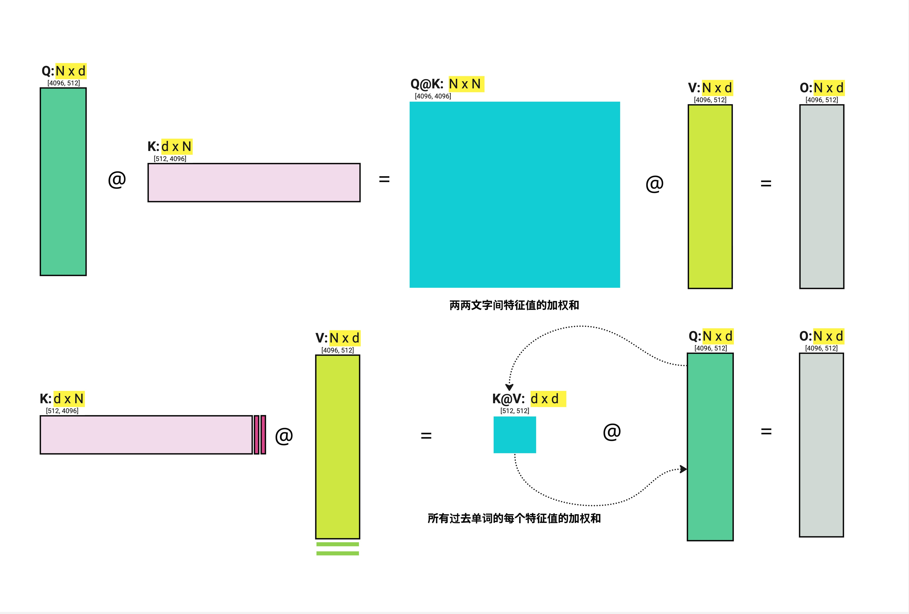
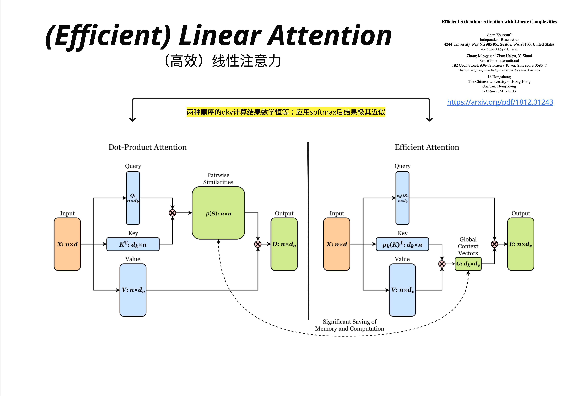
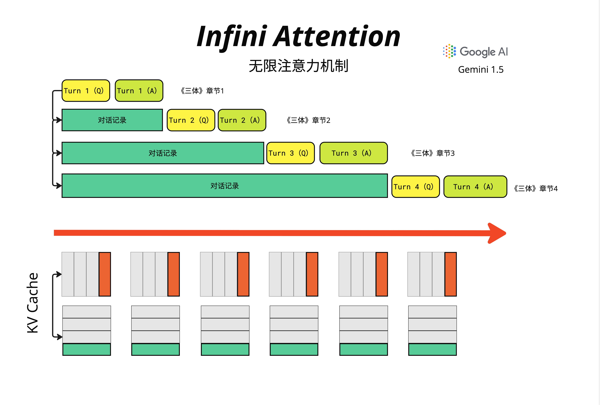
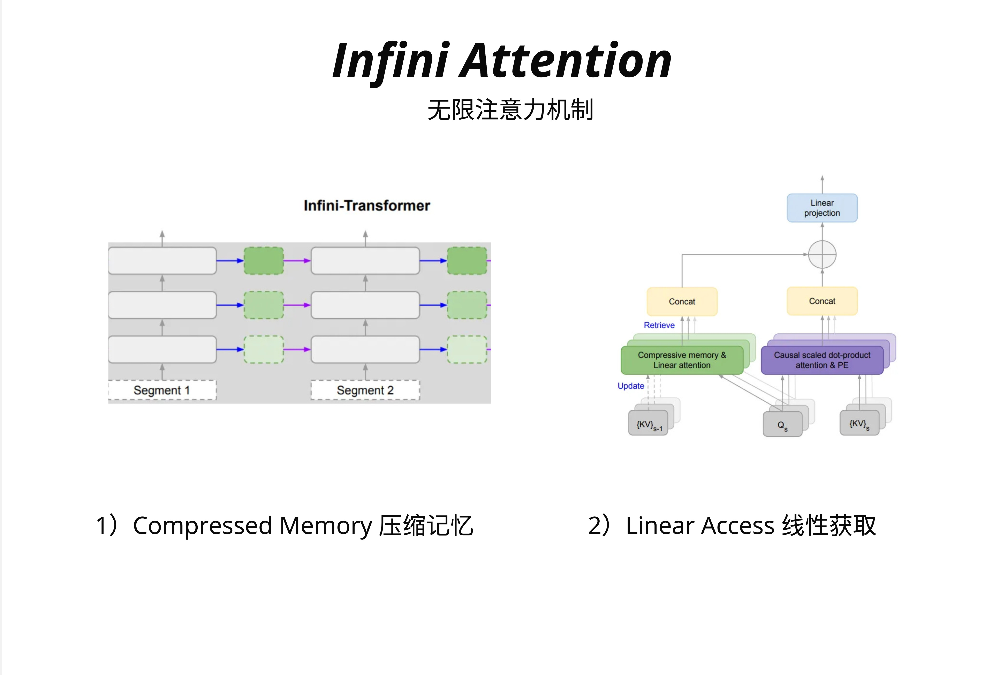
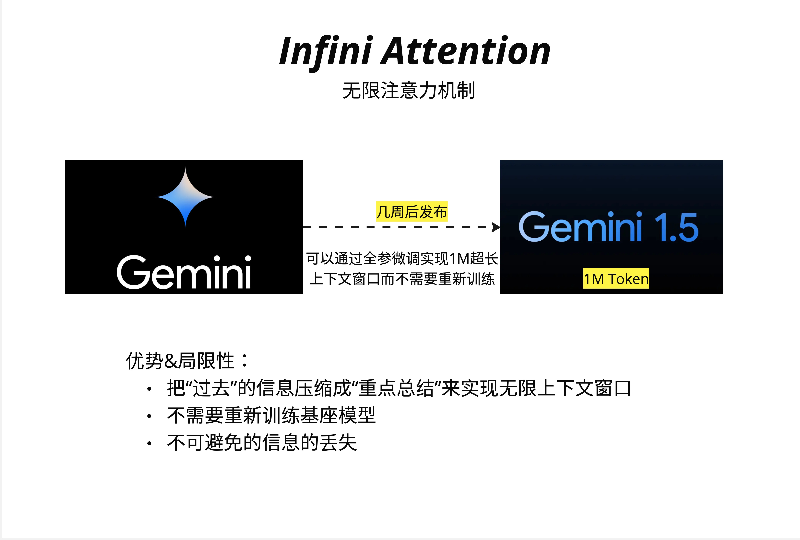
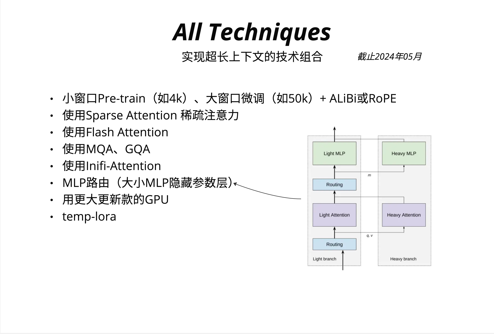

# 第 24 章：Sparse 与 Infinite Attention

> **当序列长度从千级跃升到百万级，O(n^2) 的 Full Attention 成为不可逾越的瓶颈。Sparse Attention 通过"选择性关注"降低复杂度，而 Infini Attention 则用压缩记忆实现理论上无限的上下文窗口。**

---

## 24.1 Full Attention 的瓶颈：为什么 n^2 是致命的？

### 24.1.1 从数字看问题

让我们先直观感受一下 Full Attention 的计算量。标准的 Self-Attention 需要计算一个 N x N 的注意力矩阵，其中 N 是序列长度：


看看这些数字：
- N = 1,000 时：需要计算 1,000,000 个注意力分数
- N = 4,096 时：需要计算约 1,600 万个注意力分数
- N = 8,192 时：需要计算约 6,700 万个注意力分数
- N = 100,000 时：需要计算 100 亿个注意力分数
- N = 1,000,000 时：需要计算 1 万亿个注意力分数

这就是 O(n^2) 的可怕之处：当序列长度增加 10 倍，计算量增加 100 倍。

### 24.1.2 内存才是真正的杀手

计算量还不是最致命的问题。真正的瓶颈在于**显存**。

在 Attention 计算中，我们需要存储完整的 N x N 注意力矩阵。假设使用 FP16（每个数占 2 字节）：

| 序列长度 | 注意力矩阵大小 | 单层显存占用 |
|---------|--------------|-------------|
| 4,096   | 4096 x 4096  | 32 MB       |
| 8,192   | 8192 x 8192  | 128 MB      |
| 32,768  | 32768 x 32768| 2 GB        |
| 131,072 | 131072 x 131072 | 32 GB    |

一个 32 层的模型，光注意力矩阵就可能吃掉整块 GPU 的显存！

### 24.1.3 现实需求 vs 技术瓶颈

但现实世界的需求却在不断推动上下文窗口的扩展：
- **长文档理解**：一本书可能有 50 万字，约 100 万 tokens
- **代码分析**：一个完整的代码仓库可能有数万行代码
- **多轮对话**：长时间的对话历史需要被记住
- **视频理解**：一小时视频可能产生数十万个 token

这就引出了本章的核心问题：**如何在不牺牲太多性能的前提下，突破 O(n^2) 的限制？**

---

## 24.2 Sparse Attention：不是所有 token 都值得关注

### 24.2.1 核心直觉

想象你在阅读一本小说。当你读到第 500 页的某个句子时，你真的需要同时关注第 1 页到第 499 页的每一个词吗？

显然不需要。你可能只需要关注：
1. **最近读过的内容**（局部上下文）
2. **章节开头的关键句**（全局锚点）
3. **之前提到的重要人物和地点**（关键信息）

Sparse Attention 的核心思想就是：**让每个 token 只关注"真正重要"的其他 token，而不是所有 token。**

### 24.2.2 从 Full Attention 到 Sparse Attention

Full Attention 就像一个完全连接的图——每个节点都与其他所有节点相连：



图中上方展示了 Full Attention：一个 N x N 的稠密矩阵，对应一个全连接图。每个词（如 "The", "firm", "for", "York" 等）都与其他所有词有连接。

而 Sparse Attention 则是一个稀疏连接的图——只保留"重要"的连接，大大减少计算量。

### 24.2.3 三种基本稀疏模式

Sparse Attention 的关键在于如何选择"重要"的连接。业界发展出三种主要的稀疏模式：

**1. Random Attention（随机注意力）**

随机选择一些 token 进行关注。虽然看起来很粗暴，但理论上可以保证信息在图中的传播。

**2. Window/Sliding Window Attention（滑动窗口注意力）**

每个 token 只关注其周围固定窗口内的 token。这基于一个假设：局部上下文通常最重要。

**3. Global Attention（全局注意力）**

指定某些特殊 token（如 [CLS] 或句首词）与所有其他 token 相连。这些"枢纽"token 负责收集和分发全局信息。

---

## 24.3 Longformer 与 BigBird：稀疏模式的组合艺术

### 24.3.1 构建稀疏注意力矩阵

让我们逐步看看如何构建一个有效的 Sparse Attention 矩阵：



**第 1 步：Random Tokens**

首先，随机选择一些位置进行关注（图中黄色格子）。这保证了即使相距很远的 token 也有机会直接交换信息。

**第 2 步：Window Tokens**

在随机注意力的基础上，添加滑动窗口。每个 token 都关注其左右邻居（图中对角线附近的黄色区域）。



**第 3 步：Global Tokens**

选择某些特殊位置作为"全局枢纽"。图中可以看到，某些行和列被完全填充为黄色——这些位置的 token 可以看到所有其他 token，同时也被所有其他 token 看到。

**最终结果：Sparse Attention 矩阵**

将三种模式叠加，得到最终的稀疏注意力矩阵。黄色区域是需要计算注意力的位置，灰色区域直接跳过。

### 24.3.2 BigBird：Random + Window + Global = 强大

BigBird（由 Google 提出）是 Sparse Attention 的经典实现，它组合了三种稀疏模式：

```
BigBird Attention = Random + Window + Global
```


从图中可以清晰看到：
- **Random**（左下）：稀疏的随机连接，用图论的话说就是"随机边"
- **Window**（中下）：环形的邻居连接，每个节点连接其相邻节点
- **Global**（右下）：星形的全局连接，中心节点连接所有其他节点
- **BigBird**（最右）：三者的组合，形成一个既有局部性又有全局性的连接图

### 24.3.3 复杂度分析

假设：
- 序列长度为 n
- 滑动窗口大小为 w
- 全局 token 数量为 g
- 随机连接数量为 r

则 BigBird 的复杂度为：

```
O(n × (w + g + r))
```

当 w, g, r 都是常数时，复杂度降为 **O(n)**，相比 Full Attention 的 O(n^2) 是质的飞跃！

### 24.3.4 Longformer vs BigBird

| 特性 | Longformer | BigBird |
|-----|-----------|---------|
| 滑动窗口 | 有 | 有 |
| 全局注意力 | 任务相关的 token | 固定位置 + 随机 |
| 随机注意力 | 无 | 有 |
| 主要应用 | 长文档理解 | 通用 NLP |
| 复杂度 | O(n) | O(n) |

Longformer 更简洁，BigBird 通过随机注意力提供了理论保证：任意两个 token 之间的最短路径是 O(1) 的。

---

## 24.4 Sliding Window Attention：局部性假设

### 24.4.1 为什么局部性假设成立？

语言具有强烈的局部性：
- **语法依赖**：主语和谓语通常相距不远
- **指代消解**：代词通常指代最近出现的名词
- **语义连贯**：相邻的句子通常在讨论同一个话题

这意味着，对于大多数 token，其最相关的信息就在附近。

### 24.4.2 Sliding Window 的工作原理

```python
# 伪代码：Sliding Window Attention
def sliding_window_attention(Q, K, V, window_size):
    n = Q.shape[0]
    output = []

    for i in range(n):
        # 只关注窗口内的 token
        start = max(0, i - window_size // 2)
        end = min(n, i + window_size // 2 + 1)

        # 计算局部注意力
        local_K = K[start:end]
        local_V = V[start:end]

        scores = Q[i] @ local_K.T / sqrt(d_k)
        weights = softmax(scores)
        output.append(weights @ local_V)

    return stack(output)
```

### 24.4.3 层叠增加感受野

单层 Sliding Window 的感受野很有限。但如果我们堆叠多层呢？

假设窗口大小为 w=5：
- 第 1 层后：每个 token 能"看到" 5 个 token
- 第 2 层后：每个 token 能"看到" 9 个 token
- 第 L 层后：每个 token 能"看到" 1 + L×(w-1) 个 token

12 层 Transformer 配合 w=512 的窗口，理论感受野可达 6000+ tokens！

### 24.4.4 Mistral 的 Sliding Window 实践

Mistral 7B 使用了 Sliding Window Attention，窗口大小为 4096。结合 32 层的深度，实际感受野足够处理大多数任务。

关键技巧：**Rolling Buffer KV Cache**
```
传统 KV Cache：存储所有历史 token 的 K, V
Rolling Buffer：只存储最近 window_size 个 token 的 K, V
```

这使得推理时的显存占用恒定，不随对话长度增长！

---

## 24.5 Linear Attention：从 O(n^2) 到 O(n)

### 24.5.1 标准 Attention 的数学

回顾标准 Attention 的计算：

```
Attention(Q, K, V) = softmax(Q @ K^T / sqrt(d_k)) @ V
```

计算顺序是：
1. Q @ K^T → N x N 矩阵（这是 O(n^2) 的来源）
2. softmax → N x N 矩阵
3. 结果 @ V → N x d 矩阵

### 24.5.2 矩阵乘法的结合律

这里有一个关键观察：矩阵乘法满足结合律！

```
(Q @ K^T) @ V = Q @ (K^T @ V)
```

如果我们能**先计算 K^T @ V**，就能避免生成 N x N 的中间矩阵：
- K^T @ V → d x d 矩阵
- Q @ 结果 → N x d 矩阵

复杂度从 O(n^2 × d) 降到 O(n × d^2)！



图中上半部分展示了标准的 Dot-Product Attention：
- Q (N x d) @ K^T (d x N) = N x N 矩阵（青色大方块，代表"两两文字间特征值的加权和"）
- 结果 @ V = 输出

图中下半部分展示了 Linear Attention：
- K^T (d x N) @ V (N x d) = d x d 矩阵（青色小方块，代表"所有过去单词的每个特征值的加权和"）
- Q @ 结果 = 输出

关键区别：中间矩阵从 N x N 变成了 d x d。当 N >> d 时，这是巨大的节省！

### 24.5.3 Softmax 的问题

但这里有个问题：标准 Attention 中间有个 softmax，它破坏了结合律。

```
softmax(Q @ K^T) @ V ≠ Q @ softmax(K^T) @ V
```

Linear Attention 的解决方案：**用核函数（Kernel Function）替代 softmax**。



Efficient Attention 论文（arXiv: 1812.01243）提出：

```
标准 Attention: softmax(Q @ K^T) @ V
Linear Attention: φ(Q) @ φ(K)^T @ V = φ(Q) @ (φ(K)^T @ V)
```

其中 φ 是一个特征映射函数。论文指出："两种顺序的 QKV 计算结果数学恒等；应用 softmax 后结果极其近似"。

### 24.5.4 Linear Attention 的实现

```python
# 伪代码：Linear Attention
def linear_attention(Q, K, V, feature_map):
    """
    Q, K, V: [batch, seq_len, d_model]
    feature_map: 特征映射函数，如 elu(x) + 1
    """
    # 应用特征映射
    Q_prime = feature_map(Q)  # [batch, seq_len, d_model]
    K_prime = feature_map(K)  # [batch, seq_len, d_model]

    # 先计算 K^T @ V（关键！）
    KV = einsum('bnd,bnm->bdm', K_prime, V)  # [batch, d_model, d_model]

    # 再计算 Q @ (K^T @ V)
    output = einsum('bnd,bdm->bnm', Q_prime, KV)  # [batch, seq_len, d_model]

    # 归一化
    Z = einsum('bnd,bd->bn', Q_prime, K_prime.sum(dim=1))
    output = output / Z.unsqueeze(-1)

    return output
```

### 24.5.5 Linear Attention 的局限

Linear Attention 并非完美：
1. **表达能力下降**：去掉 softmax 后，注意力分布的"尖锐度"降低
2. **训练不稳定**：某些核函数会导致数值问题
3. **实际效果**：在很多任务上不如标准 Attention

这也是为什么 Linear Attention 并未成为主流的原因。但它的思想——**改变计算顺序来降低复杂度**——启发了后续很多工作。

---

## 24.6 Infini Attention：无限上下文的终极方案

### 24.6.1 问题：KV Cache 的线性增长

即使使用了 Sliding Window，传统方法在处理超长上下文时仍有问题：



图中展示了一个阅读《三体》的场景：
- Turn 1：读《三体》章节 1
- Turn 2：之前的对话成为"对话记录"，继续读章节 2
- Turn 3：对话记录更长了，继续读章节 3
- Turn 4：对话记录越来越长...

传统的 KV Cache（图下方）会线性增长——每一轮对话都要缓存更多的 K 和 V。当对话持续很久或者需要处理整本书时，显存会爆炸。

### 24.6.2 Infini Attention 的核心思想

Google 在 2024 年提出的 Infini Attention 给出了一个优雅的解决方案：

> **用固定大小的"压缩记忆"来存储无限长的历史信息。**

核心架构如下：



Infini-Transformer 有两个关键组件：

**1. Compressed Memory（压缩记忆）**

左侧展示了整体架构：输入被分成多个 Segment，每个 Segment 处理后，其信息被**压缩**并传递给下一个 Segment。绿色虚线框表示压缩后的记忆，它的大小是**固定的**，不随历史长度增长。

**2. Linear Access（线性访问）**

右侧展示了单个 Attention 层的内部结构：
- 当前 Segment 的 Q、K、V 进入系统
- 同时，前一个 Segment 的压缩记忆 {KV}_{s-1} 也参与计算
- 通过 "Compressive memory & Linear attention" 模块，从压缩记忆中检索（Retrieve）信息
- 通过 "Causal scaled dot-product attention" 处理当前 Segment 的局部信息
- 两者 Concat 后，通过 Linear projection 输出
- 同时，当前 Segment 的信息被压缩（Update）到记忆中，供下一个 Segment 使用

### 24.6.3 压缩记忆的数学原理

Infini Attention 使用了 Linear Attention 的思想来实现压缩记忆。

回忆 Linear Attention：
```
Output = Q @ (K^T @ V) / (Q @ K^T @ 1)
```

这里 K^T @ V 是一个 d x d 的矩阵，它**压缩**了所有历史 token 的信息！

Infini Attention 的关键洞察：**我们可以增量更新这个压缩矩阵**：

```python
# 伪代码：Infini Attention 的记忆更新
class InfiniAttention:
    def __init__(self, d_model):
        # 压缩记忆：固定大小的 d x d 矩阵
        self.memory = zeros(d_model, d_model)
        self.normalizer = zeros(d_model)

    def forward(self, Q, K, V):
        # 1. 从压缩记忆中检索（使用 Linear Attention）
        memory_output = Q @ self.memory / (Q @ self.normalizer + eps)

        # 2. 当前 segment 的局部注意力（标准 Attention）
        local_output = standard_attention(Q, K, V)

        # 3. 融合两者
        beta = sigmoid(learned_gate)  # 可学习的门控
        output = beta * memory_output + (1 - beta) * local_output

        # 4. 更新压缩记忆（增量式）
        self.memory = self.memory + K.T @ V
        self.normalizer = self.normalizer + K.sum(dim=0)

        return output
```

### 24.6.4 为什么这能实现"无限"？

关键在于：**压缩记忆的大小是固定的（d x d），与历史长度无关**。

无论你处理了 1 万、10 万还是 100 万个 token，memory 矩阵的大小始终是 d_model x d_model。

这就像人类的记忆：我们不可能记住生活中的每一个细节，但我们会不断**压缩和更新**我们的记忆，保留最重要的信息。

### 24.6.5 Gemini 1.5：Infini Attention 的实战验证



Google 在 Gemini 发布几周后就推出了支持 **1M Token** 上下文的 Gemini 1.5，被认为使用了 Infini Attention 技术。

图中列出了 Infini Attention 的优势与局限性：

**优势**：
- 把"过去"的信息压缩成"重点总结"来实现无限上下文窗口
- 不需要重新训练基座模型（可以通过微调实现）

**局限性**：
- 不可避免的信息丢失（压缩必然伴随信息损失）

### 24.6.6 Infini Attention vs 其他方法

| 方法 | 复杂度 | 显存占用 | 信息损失 | 实现难度 |
|-----|-------|---------|---------|---------|
| Full Attention | O(n^2) | O(n^2) | 无 | 简单 |
| Sparse Attention | O(n) | O(n) | 轻微 | 中等 |
| Linear Attention | O(n) | O(n) | 中等 | 中等 |
| Infini Attention | O(1)* | O(1)* | 有压缩损失 | 复杂 |

*注：O(1) 是指相对于历史长度；每个 segment 内部仍有计算开销。

---

## 24.7 技术组合：实现超长上下文的完整方案

### 24.7.1 不是非此即彼

在实际应用中，这些技术往往是**组合使用**的：



截至 2024 年 5 月，实现超长上下文的主流技术组合包括：

1. **小窗口 Pre-train + 大窗口微调 + ALiBi/RoPE**
   - 预训练时使用较小窗口（如 4k）
   - 微调时扩展到更大窗口（如 50k）
   - 使用可外推的位置编码（ALiBi 或 RoPE）

2. **使用 Sparse Attention 稀疏注意力**
   - BigBird 风格的组合稀疏模式
   - 或 Longformer 风格的窗口 + 全局注意力

3. **使用 Flash Attention**
   - 不改变数学计算，但大幅降低显存占用
   - 几乎是现代 LLM 的标配

4. **使用 MQA、GQA**
   - 减少 KV Cache 的显存占用
   - 详见第 23 章

5. **使用 Infini-Attention**
   - 实现理论上无限的上下文窗口

6. **MLP 路由（大小 MLP 隐藏参数层）**
   - 图中右侧展示了 Light/Heavy branch 的路由架构
   - 简单 token 走 Light Attention + Light MLP
   - 复杂 token 走 Heavy Attention + Heavy MLP

7. **用更大更新款的 GPU**
   - 最直接但最昂贵的方案

8. **temp-lora**
   - 临时性的 LoRA 适配器

### 24.7.2 选择建议

根据你的具体需求选择合适的技术组合：

**场景 1：处理长文档（10k-50k tokens）**
```
推荐：Flash Attention + GQA + Sliding Window
原因：成熟稳定，效果好
```

**场景 2：超长文档（50k-200k tokens）**
```
推荐：Flash Attention + Sparse Attention + RoPE/ALiBi
原因：需要更激进的稀疏化
```

**场景 3：极长上下文（200k+ tokens）或持续对话**
```
推荐：Infini Attention + Flash Attention
原因：只有压缩记忆才能 handle 无限增长
```

---

## 24.8 手算示例：理解稀疏模式的效果

### 24.8.1 Full Attention 计算量

假设序列长度 N = 8，维度 d = 4。

Full Attention 需要计算：
- Q @ K^T：(8×4) @ (4×8) → 64 个输出元素，每个需要 4 次乘法 = **256 次乘法**
- 结果 @ V：(8×8) @ (8×4) → 32 个输出元素，每个需要 8 次乘法 = **256 次乘法**
- 总计约 **512 次乘法**

### 24.8.2 Sliding Window（w=3）计算量

每个位置只看 3 个邻居：
- 每个位置 Q @ K^T：3 个 key，每个需要 4 次乘法 = 12 次
- 8 个位置：8 × 12 = **96 次乘法**
- V 的加权和：8 个位置 × 3 个 value × 4 维 = **96 次乘法**
- 总计约 **192 次乘法**

**节省了 62%！**（192 vs 512）

### 24.8.3 Linear Attention 计算量

先算 K^T @ V：4 x 8 @ 8 x 4 = 128 次乘法
再算 Q @ 结果：8 x 4 @ 4 x 4 = 128 次乘法
总计约 256 次乘法

看起来节省不多？因为 N=8 太小了。当 N=1000, d=64 时：
- Full Attention：约 1000 x 1000 x 64 = 6400 万次乘法
- Linear Attention：约 1000 x 64 x 64 x 2 = 800 万次乘法

**节省了 87.5%！**

---

## 24.9 常见误区

### 误区 1：Sparse Attention 会丢失重要信息

**澄清**：设计良好的稀疏模式（如 BigBird）通过全局 token 和随机连接，确保信息可以在整个序列中传播。实验表明，在大多数 NLP 任务上，Sparse Attention 的性能与 Full Attention 相当。

### 误区 2：Linear Attention 完全等价于 Standard Attention

**澄清**：Linear Attention 去掉了 softmax，这意味着注意力分布不再是真正的概率分布。在某些需要"尖锐"注意力的任务上，Linear Attention 表现会下降。

### 误区 3：Infini Attention 可以无损记住所有历史

**澄清**：压缩必然伴随信息损失。Infini Attention 的压缩记忆更像是"摘要"而非"完整备份"。对于需要精确回忆早期细节的任务，可能不如直接存储。

### 误区 4：这些技术互相排斥

**澄清**：这些技术是可以组合的！Flash Attention（优化实现）+ Sparse Attention（减少计算量）+ Infini Attention（处理无限历史）可以叠加使用。

---

## 24.10 本章要点回顾

1. **Full Attention 的 O(n^2) 瓶颈**：序列长度增加 10 倍，计算量增加 100 倍，显存是更大的瓶颈

2. **Sparse Attention 的三种模式**：
   - Random：随机连接，保证信息传播
   - Window：局部连接，捕捉局部依赖
   - Global：全局枢纽，收集分发全局信息

3. **BigBird = Random + Window + Global**：组合三种模式，复杂度降为 O(n)

4. **Linear Attention 的核心技巧**：改变计算顺序，先算 K^T @ V，用核函数替代 softmax

5. **Infini Attention 的创新**：
   - 固定大小的压缩记忆
   - 增量更新
   - 融合局部注意力和记忆检索

6. **实践建议**：根据上下文长度需求选择合适的技术组合

---

## 24.11 延伸阅读

1. **Longformer**: "Longformer: The Long-Document Transformer" (Beltagy et al., 2020)
2. **BigBird**: "Big Bird: Transformers for Longer Sequences" (Zaheer et al., 2020)
3. **Linear Attention**: "Efficient Attention: Attention with Linear Complexities" (Shen et al., 2018)
4. **Infini Attention**: "Leave No Context Behind: Efficient Infinite Context Transformers with Infini-attention" (Google, 2024)
5. **Flash Attention**: 见第 21 章
6. **Mistral Sliding Window**: Mistral 7B Technical Report

---

## 24.12 下一章预告

我们已经讨论了如何处理长序列。下一章，我们将深入探讨**位置编码的革新**——从绝对位置编码到相对位置编码（RoPE、ALiBi），这些技术如何让模型在更长的序列上保持良好的外推能力。
