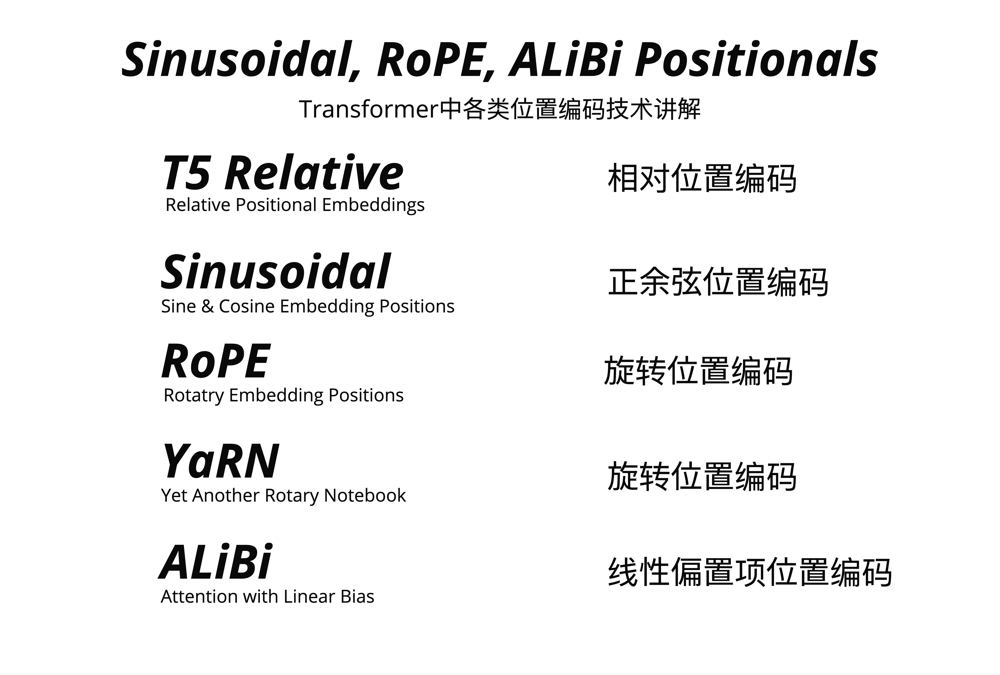
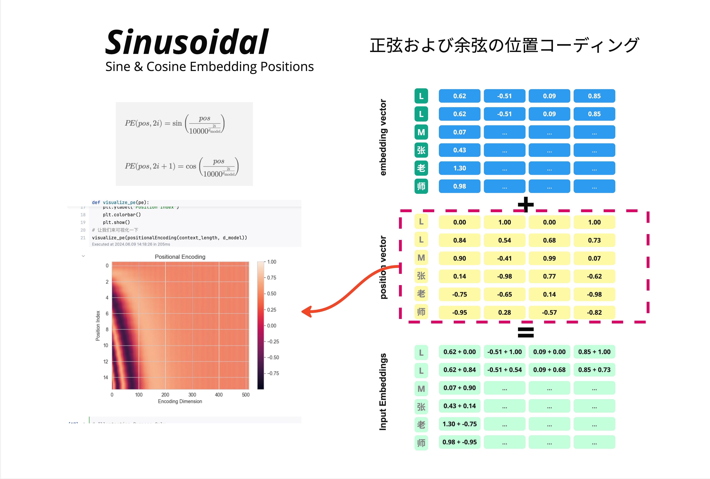
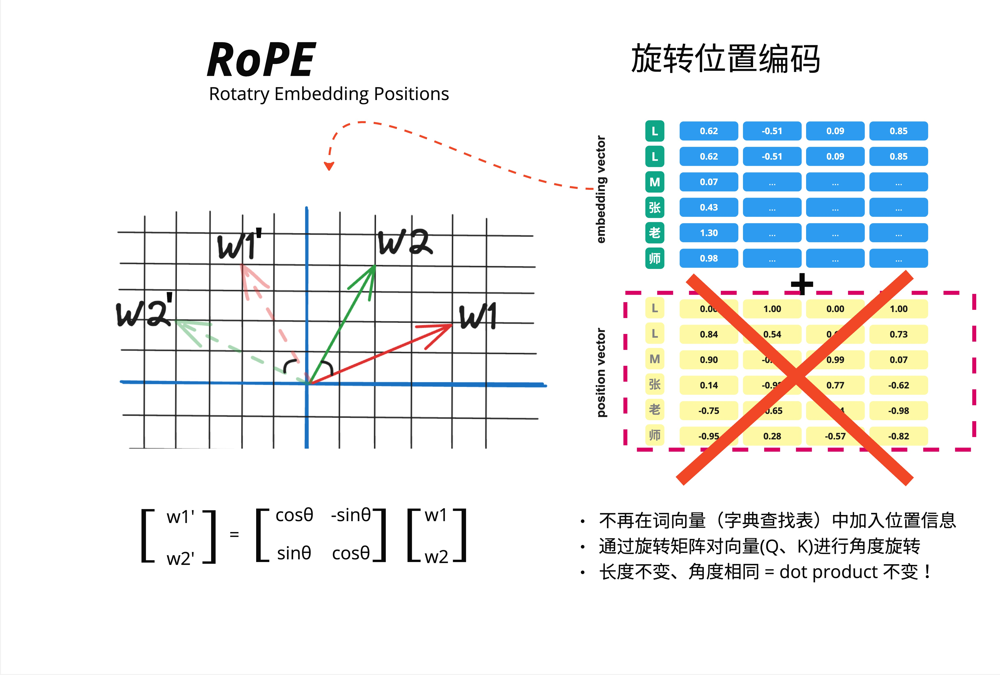
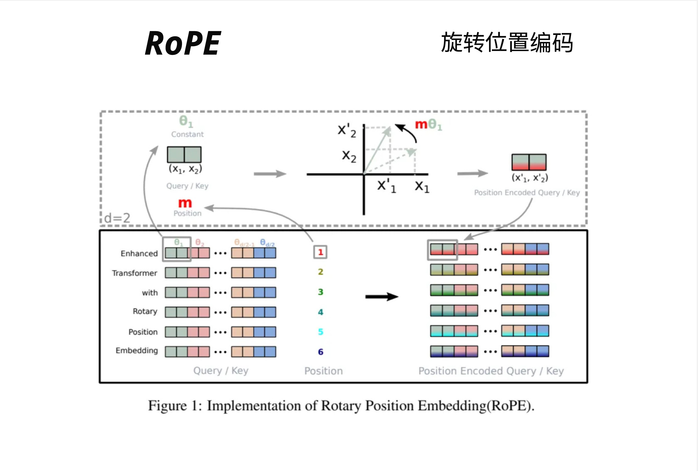
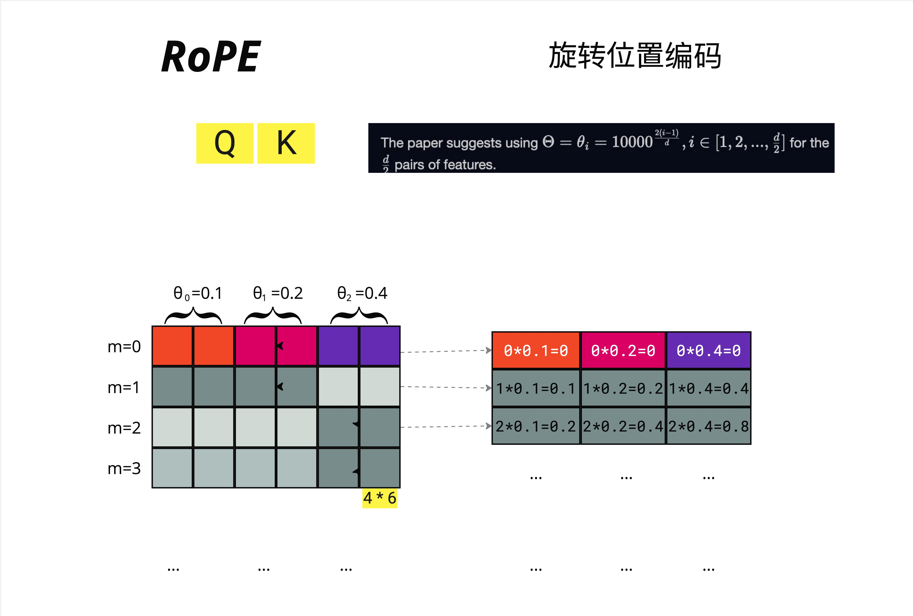
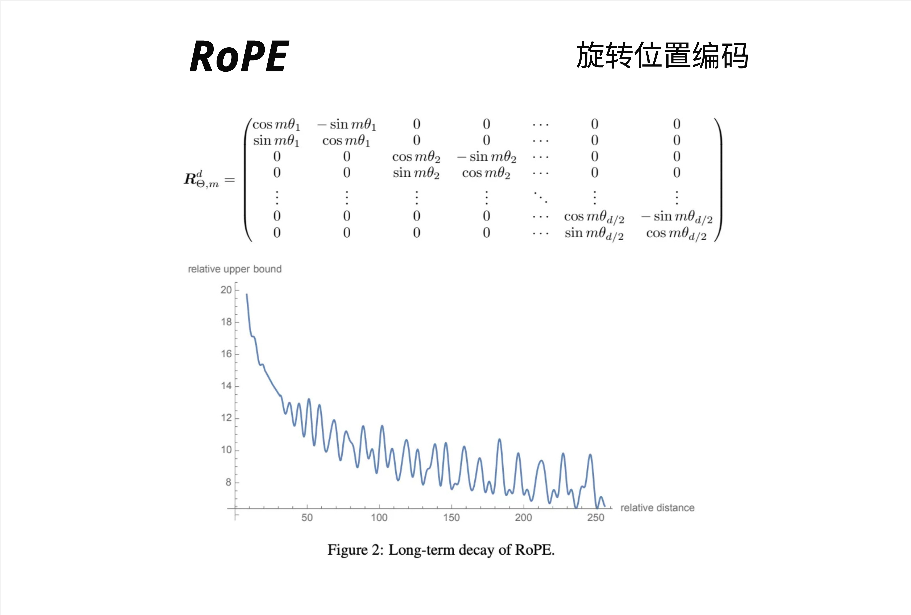
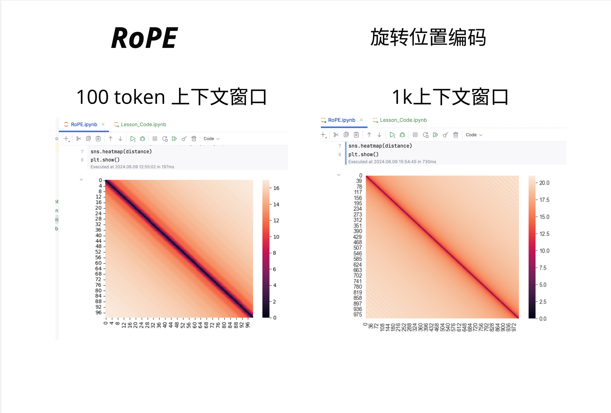
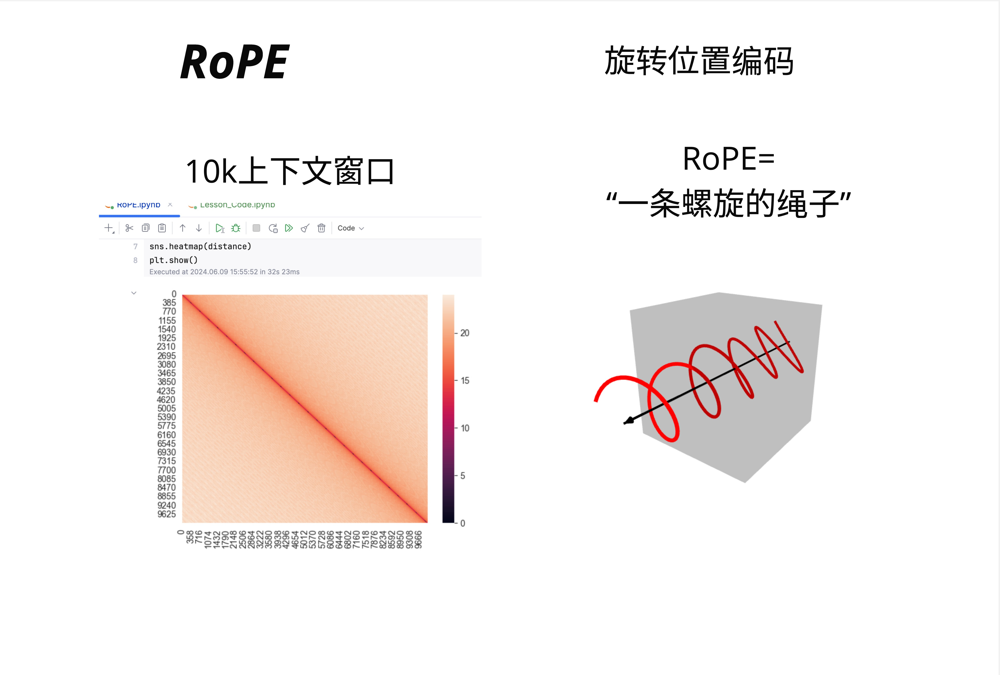
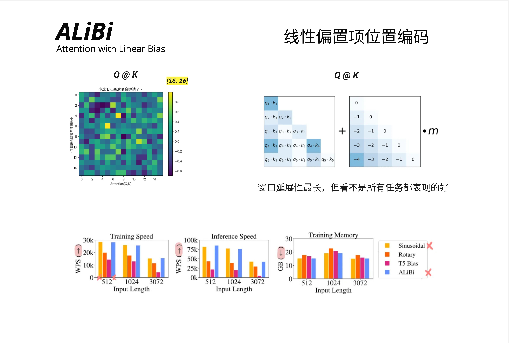
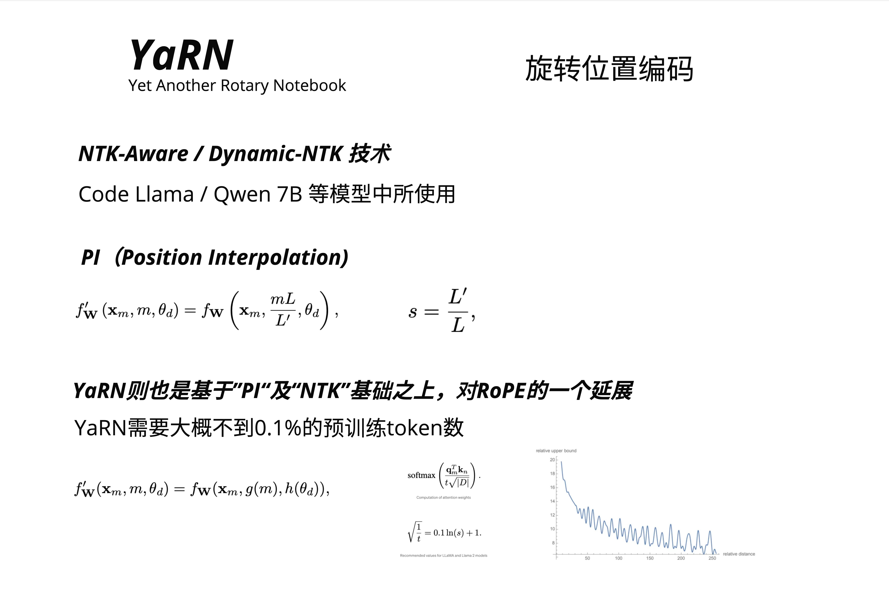

# 第 25 章：位置编码演进 - Sinusoidal 到 RoPE 到 ALiBi

> **一句话总结**：位置编码从"固定加法"演进到"旋转乘法"再到"注意力偏置"，RoPE 用旋转矩阵让相对位置自然涌现，ALiBi 用线性惩罚让远距离 token 自动衰减，而 YaRN 则让模型突破训练时的上下文长度限制。

---

## 25.1 位置编码的演进全景

在第 5 章，我们学习了 Transformer 原始的 Sinusoidal 位置编码。那是 2017 年的方案。六年过去了，位置编码领域发生了翻天覆地的变化。



### 25.1.1 为什么需要更好的位置编码？

让我们先回顾一下 Sinusoidal 的局限性：

**绝对位置编码的问题**：
- 优势：计算速度较快
- 劣势：
  - 文字间相对位置信息不明显
  - 推理窗口受训练长度限制

**传统相对位置编码（如 T5）的问题**：
- 优势：可学习文字间相对信息
- 劣势：
  - 计算量增大
  - 部分实现方式与 KV Cache 不兼容

> **注意**：RoPE 也是一种相对位置编码，但它的设计允许 KV Cache 正常工作——这正是 LLaMA 选择 RoPE 的原因之一。

这就引出了一个核心问题：**我们能否设计一种位置编码，既能捕获相对位置信息，又能高效推理？**

### 25.1.2 五种主流方案

目前主流的位置编码方案有五种：

| 方案 | 英文全称 | 中文名 | 代表模型 |
|-----|---------|--------|---------|
| T5 Relative | Relative Positional Embeddings | 相对位置编码 | T5 |
| Sinusoidal | Sine & Cosine Embedding Positions | 正余弦位置编码 | 原始 Transformer |
| **RoPE** | Rotary Position Embedding | 旋转位置编码 | LLaMA, GPT-NeoX |
| **YaRN** | Yet another RoPE extensioN | RoPE 扩展 | Code Llama, Qwen |
| **ALiBi** | Attention with Linear Bias | 线性偏置项位置编码 | BLOOM, MPT |

本章我们将深入讲解 RoPE、ALiBi 和 YaRN 这三种现代方案。

---

## 25.2 Sinusoidal 回顾：加法的局限

在深入新方案之前，让我们快速回顾 Sinusoidal 的工作方式。



### 25.2.1 Sinusoidal 的核心思想

Sinusoidal 位置编码的公式：

```
PE(pos, 2i) = sin(pos / 10000^(2i/d_model))
PE(pos, 2i+1) = cos(pos / 10000^(2i/d_model))
```

工作方式很简单：**把位置向量加到词向量上**。

以"LLM张老师"为例：

**Embedding 向量**（语义信息）：
| 字 | 维度1 | 维度2 | 维度3 | 维度4 |
|---|------|------|------|------|
| L | 0.62 | -0.51 | 0.09 | 0.85 |
| L | 0.62 | -0.51 | 0.09 | 0.85 |
| M | 0.07 | ... | ... | ... |

**Position 向量**（位置信息）：
| 位置 | 维度1 | 维度2 | 维度3 | 维度4 |
|-----|------|------|------|------|
| 1 | 0.00 | 1.00 | 0.00 | 1.00 |
| 2 | 0.84 | 0.54 | 0.68 | 0.73 |
| 3 | 0.90 | -0.41 | 0.99 | 0.07 |

**Input Embeddings** = Embedding + Position

### 25.2.2 为什么"加法"有局限？

关键问题在于：**加法操作发生在进入 Attention 之前**。

当我们计算 Q 和 K 的点积时：

```
Q = (x + PE_m) * W_Q
K = (x + PE_n) * W_K
Q · K = ?
```

展开后会得到四项交叉项，位置信息和语义信息混在一起，很难解耦。

更严重的问题是：**Sinusoidal 编码的是绝对位置**。模型学到的是"位置 5"的模式，而不是"相距 3 个位置"的模式。当推理长度超过训练长度时，模型会遇到从未见过的绝对位置，性能急剧下降。

> 这就是为什么早期的 GPT 模型有严格的上下文长度限制：训练多长，就只能用多长。

---

## 25.3 RoPE：旋转位置编码

2021 年，苏剑林提出了 RoPE（Rotary Position Embedding），彻底改变了位置编码的范式。



### 25.3.1 核心直觉：从加法到乘法

RoPE 的革命性想法：**不再把位置信息加到词向量上，而是用旋转矩阵对 Q、K 向量进行旋转**。

看图中的对比：

**Sinusoidal（加法）**：
- embedding vector + position vector = input embeddings

**RoPE（旋转）**：
- 不再在词向量（字典查找表）中加入位置信息
- 通过旋转矩阵对向量（Q、K）进行角度旋转
- 长度不变、角度相同 = dot product 不变！

这个"长度不变、角度相同"是什么意思？让我们用 2D 来理解。

### 25.3.2 2D 旋转的几何直觉

想象在二维平面上有两个向量 w1 和 w2：

```
     w1'    w2
      \    /
       \  /
  w2'   \/   w1
   \    /
    \  /
```

如果我们把 w1 和 w2 都旋转相同的角度 theta：
- w1 变成 w1'
- w2 变成 w2'

关键观察：**w1 和 w2 之间的夹角没有变！**

既然夹角没变，那么它们的点积（dot product）也没变：

```
w1 · w2 = |w1| |w2| cos(angle)
w1' · w2' = |w1'| |w2'| cos(angle)  # 相同！
```

这就是 RoPE 的核心洞察：**如果我们把位置信息编码成旋转角度，那么相对位置自然就体现在两个向量的相对旋转角度中**。

### 25.3.3 旋转矩阵

2D 旋转矩阵的形式是：

```
[w1']   [cos(theta)  -sin(theta)] [w1]
[w2'] = [sin(theta)   cos(theta)] [w2]
```

对于位置 m 的 token，旋转角度是 m * theta。

### 25.3.4 高维度的处理



真实的词向量不是 2D 的，而是 768D 或 4096D。RoPE 的处理方式是：**把高维向量拆成多个 2D 子空间，每个子空间独立旋转**。

假设 d=6（6 维向量），会被拆成 d/2=3 对：
- 第 1-2 维：用角度 theta_1 旋转
- 第 3-4 维：用角度 theta_2 旋转
- 第 5-6 维：用角度 theta_d/2 旋转

每对维度使用不同的基础频率，类似于 Sinusoidal 中不同维度有不同频率的思想。

图中展示了完整的流程：
1. Query/Key 向量（左侧彩色方块）
2. 结合位置 m（1, 2, 3, 4, 5, 6...）
3. 在 2D 平面上旋转 m * theta
4. 得到 Position Encoded Query/Key（右侧彩色方块）

### 25.3.5 完整的旋转矩阵



对于 d 维向量，完整的旋转矩阵是一个分块对角矩阵：

```
         [cos(m*theta_1)  -sin(m*theta_1)    0              0          ...    0              0         ]
         [sin(m*theta_1)   cos(m*theta_1)    0              0          ...    0              0         ]
R_m =    [    0                0          cos(m*theta_2) -sin(m*theta_2) ...    0              0         ]
         [    0                0          sin(m*theta_2)  cos(m*theta_2) ...    0              0         ]
         [   ...              ...            ...            ...        ...   ...            ...        ]
         [    0                0              0              0          ... cos(m*theta_d/2) -sin(m*theta_d/2)]
         [    0                0              0              0          ... sin(m*theta_d/2)  cos(m*theta_d/2)]
```

每个 2x2 块是一个独立的旋转矩阵。

### 25.3.6 频率的选择

论文建议使用：

```
theta_i = 10000^(-2(i-1)/d), i = 1, 2, ..., d/2
```

例如，对于 d=6 的向量：
- theta_0 = 0.1
- theta_1 = 0.2
- theta_2 = 0.4

位置 m 对应的旋转角度：
| 位置 m | 第 1 对 | 第 2 对 | 第 3 对 |
|-------|--------|--------|--------|
| m=0 | 0*0.1=0 | 0*0.2=0 | 0*0.4=0 |
| m=1 | 1*0.1=0.1 | 1*0.2=0.2 | 1*0.4=0.4 |
| m=2 | 2*0.1=0.2 | 2*0.2=0.4 | 2*0.4=0.8 |
| m=3 | ... | ... | ... |

### 25.3.7 为什么 RoPE 能编码相对位置？

这是 RoPE 最精妙的地方。

假设位置 m 的 Query 是 q_m，位置 n 的 Key 是 k_n。

应用 RoPE 后：
- q_m' = R_m * q_m（旋转 m * theta）
- k_n' = R_n * k_n（旋转 n * theta）

计算注意力分数时：
```
q_m' · k_n' = (R_m * q_m)^T * (R_n * k_n)
            = q_m^T * R_m^T * R_n * k_n
            = q_m^T * R_(n-m) * k_n
```

关键来了：**R_m^T * R_n = R_(n-m)**，这是旋转矩阵的性质！

所以最终的注意力分数**只依赖于相对位置 (n-m)**，而不是绝对位置 m 和 n！

> 这就是 RoPE 的魔法：通过旋转操作，相对位置信息自然涌现，无需显式计算。

### 25.3.8 RoPE 的长期衰减特性



图中展示了 RoPE 的一个重要特性：**随着相对距离增加，注意力分数的上界会衰减**。

这意味着：
- 相邻的 token 可以获得更高的注意力
- 距离很远的 token 注意力会自然减弱

这符合语言的局部性原理：相邻的词通常关系更密切。

### 25.3.9 RoPE 可视化：热力图



图中展示了不同上下文长度下的 RoPE 距离热力图：
- 100 token 上下文窗口
- 1k 上下文窗口
- 10k 上下文窗口

可以看到：
- 对角线附近颜色深（相对距离小，注意力高）
- 远离对角线颜色浅（相对距离大，注意力低）
- 随着上下文变长，整体模式保持一致

### 25.3.10 RoPE 的直观类比



一个形象的类比：**RoPE 就像一条螺旋的绳子**。

- 每个位置对应绳子上的一个点
- 位置越远，旋转的角度越大
- 相邻的点之间角度差是固定的

这就是为什么 RoPE 能编码相对位置：你只需要知道两个点之间转了多少圈，就知道它们相距多远。

---

## 25.4 ALiBi：线性偏置的简洁之美

2021 年，Press 等人提出了另一种完全不同的方案：ALiBi（Attention with Linear Biases）。



### 25.4.1 核心思想：惩罚远距离

ALiBi 的想法非常简洁：**不修改 embedding，而是在注意力分数上加一个线性惩罚**。

距离越远，惩罚越大。就这么简单。

### 25.4.2 数学形式

标准的注意力计算是：

```
Attention(Q, K, V) = softmax(Q * K^T / sqrt(d)) * V
```

ALiBi 修改为：

```
Attention(Q, K, V) = softmax(Q * K^T / sqrt(d) + m * bias) * V
```

其中 bias 是一个距离矩阵：

```
bias = [ 0   ]                    (position 1)
       [-1  0 ]                   (position 2)
       [-2 -1  0]                 (position 3)
       [-3 -2 -1  0]              (position 4)
       [-4 -3 -2 -1  0]           (position 5)
```

m 是一个超参数（每个注意力头不同）。

### 25.4.3 直觉理解

假设当前 token 在位置 5，它要计算与位置 1-5 的注意力：

| 目标位置 | 相对距离 | 偏置（m=1）| 效果 |
|---------|---------|-----------|------|
| 位置 1 | 4 | -4 | 大幅降低注意力 |
| 位置 2 | 3 | -3 | 显著降低注意力 |
| 位置 3 | 2 | -2 | 中等降低注意力 |
| 位置 4 | 1 | -1 | 轻微降低注意力 |
| 位置 5 | 0 | 0 | 不变 |

经过 softmax 后，近处的 token 自然获得更高的注意力权重。

### 25.4.4 为什么 ALiBi 能外推？

ALiBi 最大的优势是**零样本外推能力**。

原因很简单：bias 矩阵是确定性的，不需要学习。无论上下文多长，计算方式都一样。

实验表明，用 1024 长度训练的 ALiBi 模型，可以直接外推到 2048 甚至更长，几乎没有性能损失。

### 25.4.5 ALiBi 的优缺点

**优点**：
- 实现极简（几行代码）
- 训练高效（不引入额外参数）
- 外推能力强

**缺点**：
- 不是所有任务都表现好
- 简单的线性惩罚可能过于粗暴
- 在某些需要精确位置信息的任务上表现较差

图中的性能对比显示：
- Training Speed：ALiBi（蓝色）与其他方案相当
- Inference Speed：ALiBi 稍有优势
- Training Memory：ALiBi 内存占用较低

---

## 25.5 YaRN：扩展 RoPE 的上下文长度

RoPE 虽然优秀，但有一个问题：**当推理长度超过训练长度时，性能会下降**。

YaRN（Yet another RoPE extensioN）就是为了解决这个问题而生。



### 25.5.1 问题：外推的困境

假设模型用 4k 上下文训练，推理时遇到 8k 的输入：

- 位置 1-4000：见过，没问题
- 位置 4001-8000：从未见过的旋转角度，模型困惑

直接外推会导致注意力模式崩溃。

### 25.5.2 Position Interpolation（PI）

最简单的解决方案是**位置插值**：把 8k 的位置压缩到 4k 的范围内。

```
f'_W(x_m, m, theta_d) = f_W(x_m, m*L/L', theta_d)
```

其中：
- L 是原始训练长度（4k）
- L' 是目标长度（8k）
- s = L'/L = 2（缩放因子）

位置 8000 被映射到位置 4000，模型就能理解了。

**问题**：高频信息丢失。相邻 token 的位置差异被压缩，精度下降。

### 25.5.3 NTK-Aware Interpolation

NTK-Aware 是一种更聪明的插值方式，被 Code Llama、Qwen 7B 等模型使用。

核心思想：**对不同频率的维度使用不同的缩放因子**。

- 低频维度：大幅缩放（它们编码长程位置信息）
- 高频维度：少量缩放（它们编码局部位置信息，需要保持精度）

### 25.5.4 YaRN 的完整方案

YaRN 在 PI 和 NTK 的基础上更进一步：

```
f'_W(x_m, m, theta_d) = f_W(x_m, g(m), h(theta_d))
```

关键改进：
1. 位置变换函数 g(m)
2. 频率变换函数 h(theta_d)
3. 注意力温度调整

YaRN 的一大优势：**只需要不到 0.1% 的预训练 token 数进行微调**，就能扩展上下文长度。

例如：
- 原始模型：4k 上下文，用 1T token 训练
- YaRN 微调：32k 上下文，只需 ~1B token 微调

### 25.5.5 温度调整

YaRN 还引入了注意力温度调整：

```
softmax(Q_m^T * K_n / (t * sqrt(d)))
```

其中：
```
sqrt(1/t) = 0.1 * ln(s) + 1
```

s 是缩放因子。这个调整让长序列的注意力分布更加平滑。

---

## 25.6 各方案对比

### 25.6.1 技术对比

| 特性 | Sinusoidal | RoPE | ALiBi | YaRN |
|-----|-----------|------|-------|------|
| 位置信息注入 | 加到 embedding | 旋转 Q/K | 偏置注意力 | 旋转 Q/K |
| 编码类型 | 绝对位置 | 相对位置 | 相对位置 | 相对位置 |
| 外推能力 | 差 | 中等 | 强 | 强 |
| KV Cache 兼容 | 是 | 是 | 是 | 是 |
| 额外参数 | 无 | 无 | 无 | 无 |
| 计算开销 | 低 | 中 | 低 | 中 |

### 25.6.2 主流模型的选择

| 模型 | 位置编码 | 上下文长度 |
|-----|---------|----------|
| GPT-3 | 学习式位置编码 | 2048 |
| LLaMA 1 | RoPE | 2048 |
| LLaMA 2 | RoPE | 4096 |
| Code Llama | RoPE + YaRN | 16384 |
| Mistral | RoPE | 8192 |
| BLOOM | ALiBi | 2048 |
| MPT | ALiBi | 65536 |
| Qwen | RoPE + Dynamic NTK | 8192-32768 |
| Claude | 未公开 | 100k+ |
| GPT-4 | 未公开 | 128k |

### 25.6.3 如何选择？

**选择 RoPE 如果**：
- 需要精确的位置信息
- 上下文长度适中（4k-8k）
- 想用 LLaMA 生态

**选择 ALiBi 如果**：
- 需要强外推能力
- 实现要简单
- 内存/计算资源有限

**选择 YaRN 如果**：
- 需要超长上下文（16k+）
- 已有 RoPE 模型，想扩展
- 有少量微调预算

---

## 25.7 实现细节

### 25.7.1 RoPE 的高效实现

直接用旋转矩阵乘法效率不高。实际实现使用复数形式：

```python
def apply_rope(x, freqs):
    # x: [batch, seq_len, n_heads, head_dim]
    # freqs: [seq_len, head_dim // 2]

    # 把实数向量转成复数
    x_complex = torch.view_as_complex(x.reshape(*x.shape[:-1], -1, 2))

    # 频率转成复数形式 e^(i * theta)
    freqs_complex = torch.polar(torch.ones_like(freqs), freqs)

    # 复数乘法 = 旋转
    x_rotated = x_complex * freqs_complex

    # 转回实数
    return torch.view_as_real(x_rotated).flatten(-2)
```

复数乘法 `(a + bi) * (c + di)` 等价于 2D 旋转，但计算更高效。

### 25.7.2 ALiBi 的实现

```python
def alibi_bias(n_heads, seq_len):
    # 每个头的斜率
    slopes = 2 ** (-8 / n_heads * torch.arange(1, n_heads + 1))

    # 距离矩阵
    positions = torch.arange(seq_len)
    distances = positions.unsqueeze(0) - positions.unsqueeze(1)  # [seq, seq]

    # 偏置 = 斜率 * 距离
    bias = slopes.view(-1, 1, 1) * distances.unsqueeze(0)  # [heads, seq, seq]

    return bias
```

就这么简单。

---

## 25.8 本章要点回顾

### 25.8.1 核心概念

| 概念 | 解释 |
|------|------|
| **RoPE** | 用旋转矩阵编码位置，相对位置自然涌现 |
| **ALiBi** | 在注意力分数上加线性距离惩罚 |
| **YaRN** | RoPE 的扩展，支持超长上下文 |
| **绝对位置 vs 相对位置** | Sinusoidal 是绝对的，RoPE/ALiBi 是相对的 |
| **外推能力** | 推理长度超过训练长度时的性能保持 |

### 25.8.2 技术演进脉络

```
2017: Sinusoidal (原始 Transformer)
  |
  | 问题：绝对位置，外推差
  v
2021: RoPE (苏剑林)
  |
  | 问题：超长上下文
  v
2021: ALiBi (Press et al.)
  |
  | 简洁但粗暴
  v
2023: YaRN (扩展 RoPE)
  |
  | 支持 100k+ 上下文
  v
未来: ?
```

### 25.8.3 核心认知

> **位置编码的本质是让模型理解"谁在谁前面"。Sinusoidal 用加法告诉模型绝对位置，RoPE 用旋转让相对位置自然涌现，ALiBi 用惩罚让远距离 token 说话声音变小。没有完美的方案，只有合适的选择。**

---

## 本章交付物

学完这一章，你应该能够：

- [ ] 解释 Sinusoidal 位置编码的局限性
- [ ] 用几何直觉理解 RoPE 的旋转思想
- [ ] 说明 RoPE 如何自然编码相对位置
- [ ] 理解 ALiBi 的线性惩罚机制
- [ ] 解释为什么 ALiBi 外推能力强
- [ ] 理解 YaRN 如何扩展上下文长度
- [ ] 为不同场景选择合适的位置编码方案

---

## 延伸阅读

1. **RoPE 原始论文**：RoFormer: Enhanced Transformer with Rotary Position Embedding (Su et al., 2021)
2. **ALiBi 论文**：Train Short, Test Long: Attention with Linear Biases Enables Input Length Extrapolation (Press et al., 2021)
3. **YaRN 论文**：YaRN: Efficient Context Window Extension of Large Language Models (Peng et al., 2023)
4. **苏剑林博客**：关于 RoPE 的系列文章，提供了详细的数学推导

---

## 下一章预告

位置编码让模型知道"谁在谁前面"。下一章，我们将进入部署与微调的世界，学习如何用 LoRA/QLoRA 高效微调大模型，以及各种量化技术如何让模型跑在消费级硬件上。
