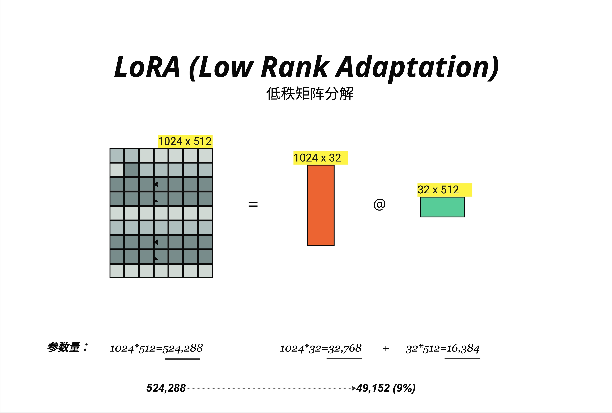
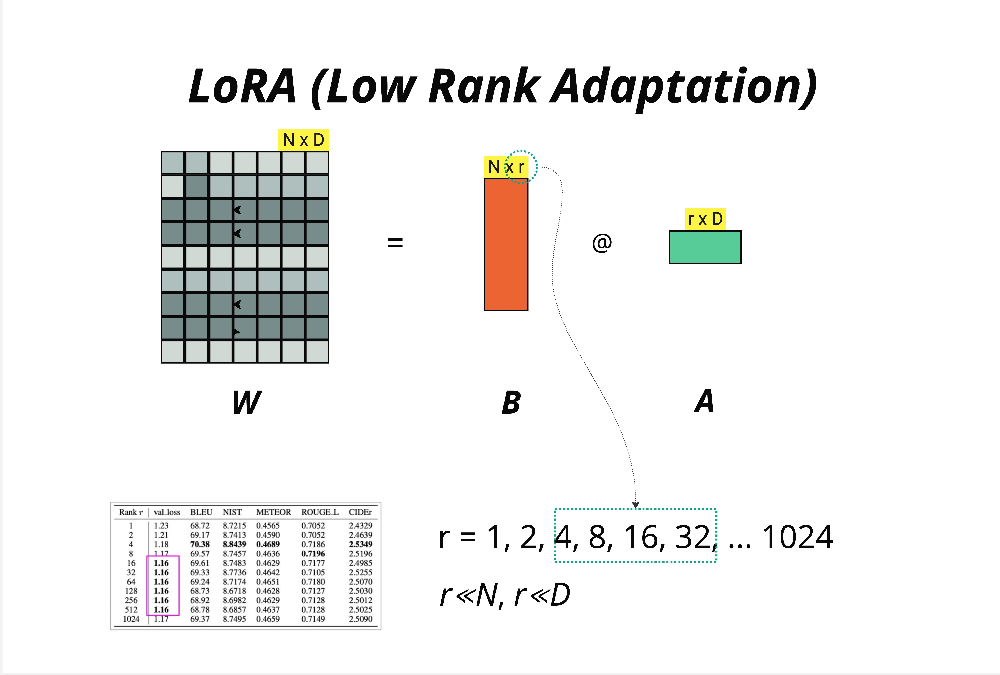
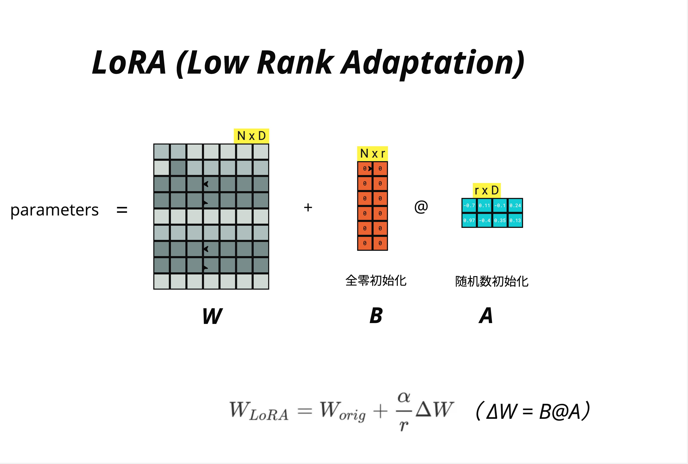
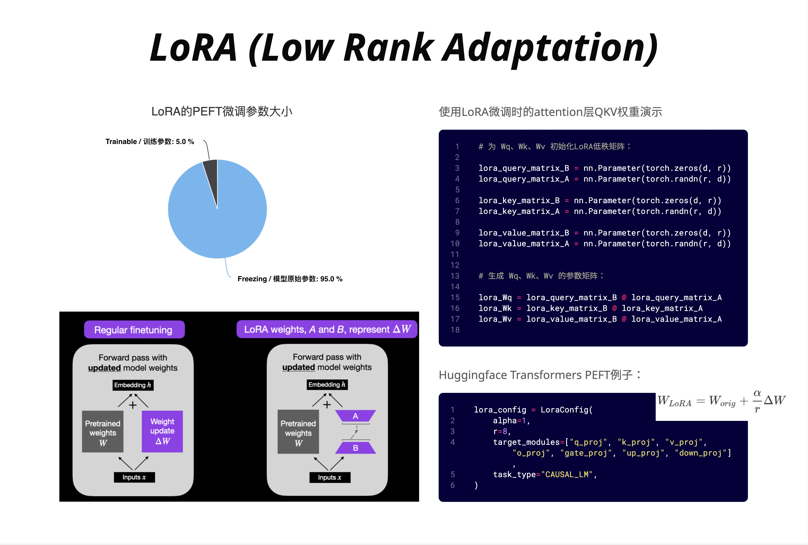
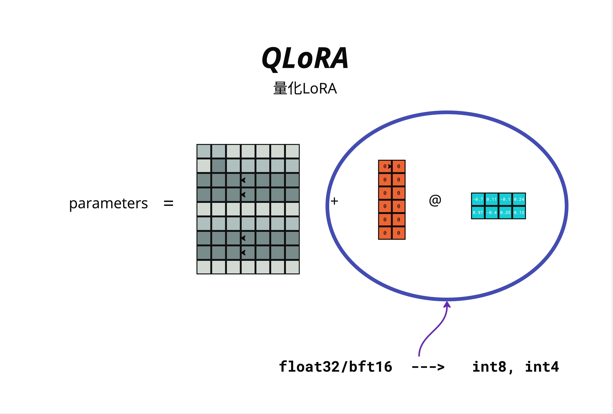
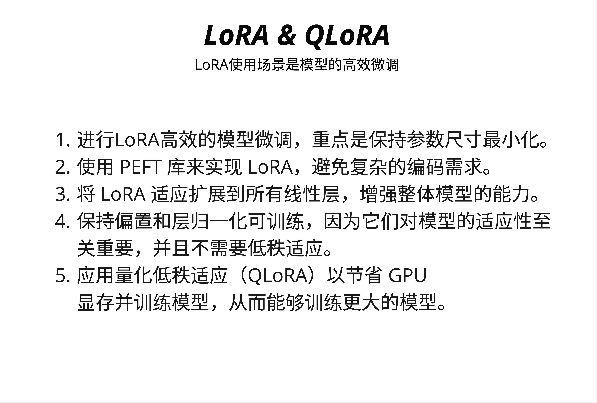

# 第 26 章：LoRA 与 QLoRA - 高效微调

> **一句话总结**：LoRA 通过低秩矩阵分解，只训练原始权重的一小部分参数（通常 0.1%-1%），就能达到接近全参数微调的效果；QLoRA 在此基础上将模型量化到 4-bit，让你在消费级显卡上也能微调 7B 甚至 13B 的大模型。

---

## 26.1 为什么需要高效微调？

### 26.1.1 全参数微调的困境

假设你想把 LLaMA-7B 微调成一个专业的法律助手。最直接的方法是**全参数微调（Full Fine-tuning）**：更新模型的所有 70 亿个参数。

听起来很合理，但问题来了：

**1. 显存需求惊人**

全参数微调需要存储：
- 模型参数本身（7B x 2 bytes = 14GB，用 fp16）
- 梯度（和参数一样大，14GB）
- 优化器状态（Adam 需要 2 倍参数量，28GB）

仅这三项就需要 **56GB 显存**！而且还没算激活值、batch 数据等。

实际上，全参数微调一个 7B 模型，你可能需要 **80GB+ 的 A100**。

**2. 存储和分发成本**

每个微调任务都产生一套完整的模型参数：
- 法律助手：7B 参数（14GB）
- 医疗助手：7B 参数（14GB）
- 代码助手：7B 参数（14GB）

三个任务就是 42GB。如果你有 100 个不同的任务呢？

**3. 训练时间长**

更新 70 亿个参数，需要大量的计算。即使有足够的显卡，训练时间也很长。

### 26.1.2 一个直觉：大模型真的需要更新所有参数吗？

研究者们发现了一个有趣的现象：**预训练模型已经学到了绝大部分通用知识**。

微调只是让模型"适应"特定任务，而不是从头学习。这种"适应"可能只需要调整一小部分参数。

> **核心洞察**：微调时权重的变化量 ΔW 是**低秩的**（low-rank）。也就是说，ΔW 可以用两个更小的矩阵相乘来近似。

这就是 LoRA 的理论基础。

---

## 26.2 LoRA 的核心思想：低秩分解

### 26.2.1 什么是低秩矩阵分解？



看图中的例子：

**原始权重矩阵 W**：
- 维度：1024 x 512
- 参数量：1024 × 512 = **524,288**

**低秩分解后**：
- 矩阵 B：1024 x 32（参数量：32,768）
- 矩阵 A：32 x 512（参数量：16,384）
- 总参数量：32,768 + 16,384 = **49,152**

参数量从 524,288 降到 49,152，只有原来的 **9%**！

这里的 32 就是**秩（rank）**，记作 r。r 越小，参数越少，但表达能力也越弱。

### 26.2.2 低秩分解的数学原理

任何矩阵都可以用两个低秩矩阵的乘积来**近似**：

```
ΔW (N×D) ≈ B (N×r) @ A (r×D)
```

其中 r 远小于 N 和 D。LoRA 的关键洞察是：**权重更新 ΔW 往往是低秩的**，因此可以用小矩阵高效表示。

**直觉理解**：
- 原始矩阵 W 有 N×D 个"自由度"
- 低秩矩阵只有 N×r + r×D = r×(N+D) 个"自由度"
- 当 r << min(N, D) 时，参数量大幅减少

**例子**：
- N = 1024, D = 512, r = 32
- 原始：1024 × 512 = 524,288
- 低秩：32 × (1024 + 512) = 49,152
- 压缩比：49,152 / 524,288 ≈ 9.4%

### 26.2.3 LoRA 的关键设计

LoRA 的核心想法是：**不修改原始权重 W，而是学习一个低秩的增量 ΔW**。

```
W_new = W_original + ΔW
      = W_original + B @ A
```

**训练时**：
- W_original **冻结**（不更新）
- 只训练 B 和 A（参数量很小）

**推理时**：
- 可以把 B @ A 合并到 W_original 中
- 推理速度和原模型完全一样！

这是 LoRA 相比其他方法的巨大优势：**推理时没有额外开销**。

---

## 26.3 Rank 的选择

### 26.3.1 Rank 参数详解



Rank（秩）r 是 LoRA 最重要的超参数：

```
r = 1, 2, 4, 8, 16, 32, ... 1024
```

- r 越小：参数越少，训练越快，但表达能力越弱
- r 越大：参数越多，表达能力越强，但可能过拟合

**约束条件**：
```
r << N, r << D
```

r 必须远小于原始矩阵的维度，否则就失去了"低秩"的意义。

### 26.3.2 实验数据：r 值如何影响性能？

图中的表格展示了不同 r 值在各种指标上的表现：

| Rank r | val_loss | BLEU | NIST | METEOR | ROUGE-L | CIDEr |
|--------|----------|------|------|--------|---------|-------|
| 1 | 1.23 | 68.72 | 8.7215 | 0.4565 | 0.7052 | 2.4329 |
| 2 | 1.21 | 69.17 | 8.7413 | 0.4590 | 0.7052 | 2.4639 |
| 4 | 1.18 | **70.38** | **8.8439** | **0.4689** | 0.7186 | **2.5349** |
| 8 | 1.17 | 69.57 | 8.7457 | 0.4636 | **0.7196** | 2.5196 |
| 16 | **1.16** | 69.61 | 8.7483 | 0.4629 | 0.7177 | 2.4985 |
| 32 | **1.16** | 69.33 | 8.7736 | 0.4642 | 0.7105 | 2.5255 |
| 64 | **1.16** | 69.24 | 8.7174 | 0.4651 | 0.7180 | 2.5070 |
| 128 | **1.16** | 68.73 | 8.6718 | 0.4628 | 0.7127 | 2.5030 |
| 256 | **1.16** | 68.92 | 8.6982 | 0.4629 | 0.7128 | 2.5012 |
| 512 | **1.16** | 68.78 | 8.6857 | 0.4637 | 0.7128 | 2.5025 |
| 1024 | 1.17 | 69.37 | 8.7495 | 0.4659 | 0.7149 | 2.5090 |

**关键发现**：

1. **r = 4 就能达到很好的效果**：在多个指标上都是最优或接近最优
2. **r 增大后效果反而下降**：r = 128, 256, 512 的表现不如 r = 4
3. **val_loss 在 r >= 16 后趋于稳定**：继续增加 r 没有明显收益

### 26.3.3 实践建议

| 场景 | 推荐 rank | 理由 |
|------|----------|------|
| 简单任务（情感分类、简单问答） | 4 - 8 | 任务简单，低秩足够 |
| 中等任务（摘要、翻译） | 8 - 16 | 平衡效果和效率 |
| 复杂任务（代码生成、复杂推理） | 16 - 64 | 需要更强的表达能力 |
| 不确定时 | 8 | 社区最常用的默认值 |

> **经验法则**：从 r = 8 开始，如果效果不好再尝试 r = 16 或 r = 32。很少需要超过 64。

---

## 26.4 LoRA 公式详解

### 26.4.1 完整的 LoRA 公式



LoRA 的完整公式：

```
W_LoRA = W_orig + (α/r) × ΔW
       = W_orig + (α/r) × B @ A
```

其中：
- **W_orig**：原始预训练权重，维度 N × D，**冻结不训练**
- **B**：低秩矩阵，维度 N × r，**全零初始化**
- **A**：低秩矩阵，维度 r × D，**随机初始化**
- **r**：秩（rank），超参数
- **α**：缩放因子，超参数

### 26.4.2 初始化策略

图中清楚地标注了初始化方式：

**矩阵 B：全零初始化**
```
B = zeros(N, r)
```

**矩阵 A：随机数初始化**
```
A = randn(r, D)  # 或使用 Kaiming 初始化
```

**为什么这样初始化？**

训练开始时：
```
ΔW = B @ A = zeros @ randn = 0
```

所以 `W_LoRA = W_orig + 0 = W_orig`。

这意味着**训练开始时，模型的行为和原始模型完全一样**！这是一个非常聪明的设计：
- 保证了训练的稳定性
- 模型从一个"好"的起点开始
- 避免了随机初始化带来的震荡

### 26.4.3 缩放因子 α

公式中的 α/r 是一个缩放因子：

```
W_LoRA = W_orig + (α/r) × B @ A
```

**为什么需要 α？**

随着 r 的增大，B @ A 的值会变大（更多参数相乘累加）。α/r 用来保持不同 r 值时的**学习动态一致**。

**常见设置**：
- 很多实现中令 α = r，这样 α/r = 1
- 或者令 α = 2r，让 LoRA 的贡献更大
- HuggingFace PEFT 默认 α = 8

> **实践建议**：α 通常设为 r 的 1-2 倍，或者直接使用默认值。不需要花太多时间调这个参数。

### 26.4.4 前向传播

使用 LoRA 时的前向传播：

**传统方式**：
```
y = W @ x
```

**LoRA 方式**：
```
y = W @ x + (α/r) × (B @ A) @ x
  = W @ x + (α/r) × B @ (A @ x)
```

第二种写法更高效：先算 A @ x（降维），再算 B @ 结果（升维）。

**推理时合并**：
```
W_merged = W + (α/r) × B @ A
y = W_merged @ x
```

合并后推理和原模型一样快！

---

## 26.5 哪些层应用 LoRA？

### 26.5.1 Attention 层的 QKV 投影



图中右侧的代码展示了 LoRA 应用在 Attention 层的 Q、K、V 投影上：

```python
# 为 Wq、Wk、Wv 初始化 LoRA 低秩矩阵：

lora_query_matrix_B = nn.Parameter(torch.zeros(d, r))
lora_query_matrix_A = nn.Parameter(torch.randn(r, d))

lora_key_matrix_B = nn.Parameter(torch.zeros(d, r))
lora_key_matrix_A = nn.Parameter(torch.randn(r, d))

lora_value_matrix_B = nn.Parameter(torch.zeros(d, r))
lora_value_matrix_A = nn.Parameter(torch.randn(r, d))

# 生成 Wq、Wk、Wv 的参数矩阵：
lora_Wq = lora_query_matrix_B @ lora_query_matrix_A
lora_Wk = lora_key_matrix_B @ lora_key_matrix_A
lora_Wv = lora_value_matrix_B @ lora_value_matrix_A
```

### 26.5.2 常见的目标模块

不同模型的 LoRA 目标模块略有不同：

| 模型 | 目标模块 |
|------|---------|
| LLaMA / Mistral | q_proj, k_proj, v_proj, o_proj, gate_proj, up_proj, down_proj |
| GPT-2 | c_attn, c_proj, c_fc |
| BERT | query, key, value, dense |

**选择哪些模块？**

- **只用 QKV**：最常见，效果通常就不错
- **加上输出投影 O**：略微增加参数，效果可能更好
- **加上 FFN**：参数更多，适合复杂任务

HuggingFace PEFT 的配置示例：

```python
lora_config = LoraConfig(
    alpha=1,
    r=8,
    target_modules=["q_proj", "k_proj", "v_proj",
                   "o_proj", "gate_proj", "up_proj", "down_proj"],
    task_type="CAUSAL_LM",
)
```

### 26.5.3 参数量对比

图中左侧的饼图展示了 LoRA 的参数效率：

- **Trainable / 训练参数**：5.0%
- **Freezing / 冻结参数**：95.0%

这意味着，对于一个 7B 的模型：
- 冻结：70 亿 × 95% = 66.5 亿参数
- 训练：70 亿 × 5% = 3.5 亿参数

只需要为 3.5 亿参数计算梯度和更新优化器状态，显存需求大幅降低！

### 26.5.4 Regular Fine-tuning vs LoRA

图中下方对比了两种方式：

**Regular Fine-tuning（左）**：
```
Forward pass with updated model weights
Embedding h + Pretrained weights W → Weight update ΔW → Inputs x
```
所有权重都在更新。

**LoRA Fine-tuning（右）**：
```
Forward pass with updated model weights
Embedding h + Pretrained weights W (frozen) + A @ B → Inputs x
```
只有 A 和 B 在更新，W 保持不变。

---

## 26.6 QLoRA：在消费级显卡上微调大模型

### 26.6.1 LoRA 的显存瓶颈

虽然 LoRA 大幅减少了训练参数，但还有一个问题：**模型本身仍然需要加载到显存中**。

7B 模型用 fp16 存储需要 14GB。即使只训练 5% 的参数，你仍然需要 14GB 来存储模型本身。

**能不能把模型压缩得更小？**

这就是 QLoRA 的核心想法：**把模型量化到 4-bit，再应用 LoRA**。

### 26.6.2 QLoRA 的核心思想



QLoRA = **Quantized LoRA**（量化 LoRA）

图中展示了 QLoRA 的结构：

```
parameters = W (量化) + B @ A (LoRA)
```

- **W（原始权重）**：量化到 4-bit（int4），大幅减少显存
- **B @ A（LoRA 增量）**：保持 float32/bf16，正常训练

**量化过程**：
```
float32/bf16 ---> int8 ---> int4
   32位/16位        8位       4位
```

### 26.6.3 显存节省

| 方法 | 7B 模型显存 | 可用显卡 |
|------|------------|---------|
| 全参数微调 (fp16) | 80GB+ | A100 80GB |
| LoRA (fp16) | 16-20GB | A100 40GB, RTX 4090 |
| QLoRA (4-bit) | 6-8GB | RTX 3090, RTX 4080 |

QLoRA 让你在 **RTX 3090（24GB）** 上就能微调 7B 模型！甚至 **RTX 4080（16GB）** 也可以尝试。

### 26.6.4 QLoRA 的三个关键技术



图中总结了 LoRA 和 QLoRA 的使用场景和最佳实践：

**1. 进行 LoRA 高效的模型微调，重点是保持参数尺寸最小化**

选择合适的 rank（通常 8-16），只训练必要的层。

**2. 使用 PEFT 库来实现 LoRA，避免复杂的编码需求**

不需要自己实现低秩分解，HuggingFace PEFT 库提供了开箱即用的解决方案。

**3. 将 LoRA 适应扩展到所有线性层，增强整体模型的能力**

不只是 Attention 的 QKV，还可以包括 FFN 的线性层。

**4. 保持偏置和层归一化可训练，因为它们对模型的适应性至关重要，并且不需要低秩适应**

bias 和 LayerNorm 参数量很小，直接训练不会增加太多显存。

**5. 应用量化低秩适应（QLoRA）以节省 GPU 显存并训练模型，从而能够训练更大的模型**

QLoRA 是在显卡有限时的最佳选择。

---

## 26.7 PEFT 代码实践

### 26.7.1 安装依赖

```bash
pip install transformers peft accelerate bitsandbytes
```

### 26.7.2 使用 LoRA 微调

```python
# 代码示例：LoRA 微调

from transformers import AutoModelForCausalLM, AutoTokenizer
from peft import LoraConfig, get_peft_model, TaskType

# 1. 加载基础模型
model_name = "meta-llama/Llama-2-7b-hf"
model = AutoModelForCausalLM.from_pretrained(
    model_name,
    torch_dtype=torch.float16,
    device_map="auto"
)
tokenizer = AutoTokenizer.from_pretrained(model_name)

# 2. 配置 LoRA
lora_config = LoraConfig(
    r=8,                    # rank
    lora_alpha=16,          # 缩放因子 α
    target_modules=[        # 应用 LoRA 的层
        "q_proj", "k_proj", "v_proj", "o_proj",
        "gate_proj", "up_proj", "down_proj"
    ],
    lora_dropout=0.05,      # LoRA 层的 dropout
    bias="none",            # 不训练 bias
    task_type=TaskType.CAUSAL_LM
)

# 3. 应用 LoRA
model = get_peft_model(model, lora_config)

# 4. 查看可训练参数
model.print_trainable_parameters()
# 输出类似：trainable params: 4,194,304 || all params: 6,742,609,920 || trainable%: 0.06%
```

### 26.7.3 使用 QLoRA 微调

```python
# 代码示例：QLoRA 微调

from transformers import AutoModelForCausalLM, AutoTokenizer, BitsAndBytesConfig
from peft import LoraConfig, get_peft_model, prepare_model_for_kbit_training

# 1. 配置 4-bit 量化
bnb_config = BitsAndBytesConfig(
    load_in_4bit=True,                      # 加载 4-bit 模型
    bnb_4bit_quant_type="nf4",              # NF4 量化类型
    bnb_4bit_compute_dtype=torch.float16,   # 计算时用 fp16
    bnb_4bit_use_double_quant=True,         # 双重量化进一步压缩
)

# 2. 加载量化模型
model = AutoModelForCausalLM.from_pretrained(
    "meta-llama/Llama-2-7b-hf",
    quantization_config=bnb_config,
    device_map="auto"
)

# 3. 准备模型用于 k-bit 训练
model = prepare_model_for_kbit_training(model)

# 4. 配置 LoRA（和普通 LoRA 一样）
lora_config = LoraConfig(
    r=8,
    lora_alpha=16,
    target_modules=["q_proj", "k_proj", "v_proj", "o_proj"],
    lora_dropout=0.05,
    bias="none",
    task_type="CAUSAL_LM"
)

# 5. 应用 LoRA
model = get_peft_model(model, lora_config)
```

### 26.7.4 训练循环

```python
# 代码示例：训练循环

from transformers import TrainingArguments, Trainer

training_args = TrainingArguments(
    output_dir="./lora-output",
    num_train_epochs=3,
    per_device_train_batch_size=4,
    gradient_accumulation_steps=4,
    learning_rate=2e-4,
    fp16=True,
    save_steps=100,
    logging_steps=10,
)

trainer = Trainer(
    model=model,
    args=training_args,
    train_dataset=train_dataset,
    tokenizer=tokenizer,
)

# 开始训练
trainer.train()

# 保存 LoRA 权重（只保存增量部分）
model.save_pretrained("./lora-weights")
```

### 26.7.5 加载和使用 LoRA 权重

```python
# 代码示例：加载 LoRA 权重

from peft import PeftModel

# 加载基础模型
base_model = AutoModelForCausalLM.from_pretrained(
    "meta-llama/Llama-2-7b-hf",
    torch_dtype=torch.float16,
    device_map="auto"
)

# 加载 LoRA 权重
model = PeftModel.from_pretrained(base_model, "./lora-weights")

# 可选：合并权重（推理更快）
model = model.merge_and_unload()
```

---

## 26.8 LoRA vs 全参数微调

### 26.8.1 效果对比

| 指标 | 全参数微调 | LoRA (r=8) | LoRA (r=16) |
|------|-----------|-----------|-------------|
| 效果 | 100% (baseline) | 95-98% | 97-99% |
| 训练参数 | 100% | ~0.1% | ~0.2% |
| 显存 | 高 | 低 | 低 |
| 训练速度 | 慢 | 快 | 快 |

LoRA 在大多数任务上都能达到全参数微调 95%+ 的效果！

### 26.8.2 什么时候用 LoRA？

**适合用 LoRA**：
- 显存有限（消费级显卡）
- 需要快速迭代（实验不同配置）
- 需要多个适配器（法律、医疗、代码等）
- 微调任务相对简单

**可能需要全参数微调**：
- 任务与预训练数据差异很大
- 追求极致效果
- 有充足的计算资源

### 26.8.3 LoRA 的优势总结

1. **显存高效**：只训练 0.1%-5% 的参数
2. **存储高效**：LoRA 权重通常只有几十 MB
3. **推理无损**：合并后和原模型一样快
4. **灵活切换**：一个基础模型 + 多个 LoRA 适配器
5. **训练稳定**：从预训练权重出发，不会"忘记"太多

---

## 26.9 常见问题与最佳实践

### 26.9.1 Rank 选多大？

- 从 r=8 开始
- 效果不好？尝试 r=16 或 r=32
- 不要盲目增大，r=4 在很多任务上就够了

### 26.9.2 Alpha 怎么设？

- 常见做法：α = r（比如 r=8, α=8）
- 或者 α = 2r（比如 r=8, α=16）
- 大多数情况用默认值就行

### 26.9.3 应用到哪些层？

- 保守选择：只用 Attention 的 Q、V
- 推荐选择：Q、K、V、O（输出投影）
- 激进选择：所有线性层（包括 FFN）

### 26.9.4 LoRA vs QLoRA 怎么选？

| 你的显卡 | 模型大小 | 推荐方法 |
|---------|---------|---------|
| 24GB (4090/3090) | 7B | QLoRA |
| 24GB | 13B | QLoRA |
| 40GB (A100) | 7B | LoRA |
| 40GB | 13B | QLoRA |
| 80GB (A100) | 7B-13B | LoRA |
| 80GB | 70B | QLoRA |

### 26.9.5 训练不稳定怎么办？

- 降低学习率（从 2e-4 降到 1e-4 或 5e-5）
- 增加 warmup steps
- 减小 batch size
- 检查数据质量

---

## 26.10 本章总结

### 26.10.1 核心概念

| 概念 | 说明 | 公式 |
|------|------|------|
| **LoRA** | 低秩适应，只训练增量 | W = W_orig + B @ A |
| **Rank (r)** | 低秩矩阵的秩 | r 通常取 4-64 |
| **Alpha (α)** | 缩放因子 | 常设为 r 或 2r |
| **QLoRA** | 量化 + LoRA | 模型 4-bit，LoRA 正常精度 |

### 26.10.2 参数量计算

对于维度为 N × D 的权重矩阵：
- 原始参数：N × D
- LoRA 参数：N × r + r × D = r × (N + D)
- 压缩比：r × (N + D) / (N × D)

### 26.10.3 初始化策略

- B 矩阵：**全零初始化**
- A 矩阵：**随机初始化**
- 训练开始时 ΔW = 0，模型行为不变

### 26.10.4 核心认知

> **LoRA 是大模型时代最重要的微调技术之一。它基于一个简单而深刻的洞察：微调时权重的变化是低秩的。通过只学习两个小矩阵 B 和 A，LoRA 能在保持 95%+ 效果的同时，将训练参数减少到原来的 0.1%。配合 QLoRA 的 4-bit 量化，即使在消费级显卡上也能微调 7B 甚至更大的模型。**

---

## 本章交付物

学完这一章，你应该能够：

- [ ] 解释为什么需要高效微调（全参数微调的问题）
- [ ] 理解 LoRA 的核心思想（低秩分解）
- [ ] 知道如何选择 rank 参数
- [ ] 理解 LoRA 的公式和初始化策略
- [ ] 解释 QLoRA 如何进一步节省显存
- [ ] 使用 PEFT 库实现 LoRA/QLoRA 微调

---

## 延伸阅读

- **LoRA 原论文**：[LoRA: Low-Rank Adaptation of Large Language Models](https://arxiv.org/abs/2106.09685)
- **QLoRA 原论文**：[QLoRA: Efficient Finetuning of Quantized LLMs](https://arxiv.org/abs/2305.14314)
- **HuggingFace PEFT**：[PEFT Documentation](https://huggingface.co/docs/peft)

---

## 下一章预告

LoRA 解决了微调的问题，但如果我们想在更便宜的硬件上**推理**大模型呢？

下一章，我们将深入**模型量化**技术，学习 GPTQ、AWQ、GGUF 等不同的量化方法，理解它们的原理和适用场景。
