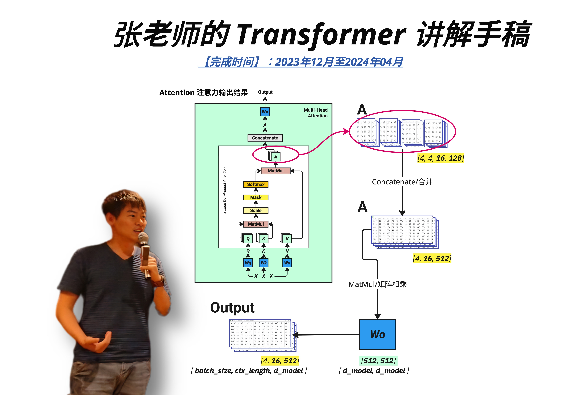

# Transformer 架构：从直觉到实现



> **从直觉到代码，彻底搞懂 GPT**

**作者**: Wayland Zhang（张老师）

基于 Bilibili 系列视频整理的完整技术书籍，涵盖 Transformer 架构的方方面面。

> **时间线**: 视频录制 2023年12月 - 2024年3月，文字整理 2026年1月

---

## 本书定位

**不是教你背公式，而是让你真正理解 Transformer 每一层在做什么。**

市面上的 Transformer 教程大多停留在：
- 贴一堆公式，看完更晕
- "Attention is All You Need" 论文复读
- 代码抄一遍，不知道为什么这么写

这些只是"知道"，不是"理解"。真正的理解需要：
- **几何直觉**：为什么 Q×K 是点积？因为在测量相似度
- **可视化思维**：矩阵乘法用格子图一步步拆解
- **类比记忆**：大模型就是两个文件，推理就像史努比铺铁轨
- **动手实现**：从零手写 Model.py、Train.py、Inference.py

---

## 内容概览

| Part | 主题 | 章节 |
|------|------|------|
| Part 1 | 建立直觉 | 第 1-3 章 |
| Part 2 | 核心组件 | 第 4-7 章 |
| Part 3 | Attention 机制 | 第 8-12 章 |
| Part 4 | 完整架构 | 第 13-17 章 |
| Part 5 | 代码实现 | 第 18-20 章 |
| Part 6 | 生产优化 | 第 21-22 章 |
| Part 7 | 架构变体 | 第 23-25 章 |
| Part 8 | 部署与微调 | 第 26-27 章 |
| Part 9 | 前沿进展 | 第 28-32 章 |
| 附录 | Scaling Law、解码策略、FAQ | 附录 A-C |

**共 32 章 + 3 附录，约 20 万字，469 页**

查看 [TABLE_OF_CONTENTS.md](./TABLE_OF_CONTENTS.md) 获取完整目录。

---

## 目标读者

| 读者类型 | 能获得什么 |
|---------|-----------|
| **ML 工程师** | 深入理解架构细节，优化实现能力 |
| **后端/全栈开发者** | 从零理解 LLM，具备 fine-tune 能力 |
| **产品经理/分析师** | 理解技术边界，更好地与工程协作 |
| **CS 学生** | 系统性知识结构，面试加分项 |

### 前置知识

- **必需**：Python 基础、线性代数基础（矩阵乘法）
- **有帮助**：PyTorch 基础、深度学习入门
- **不需要**：不需要看过 "Attention is All You Need" 论文

---

## 配套视频

- **概念篇**: [Bilibili 播放列表](https://space.bilibili.com/3546611527453161/lists/2386309?type=season) - 21 集
- **进阶篇**: [Bilibili 播放列表](https://space.bilibili.com/3546611527453161/lists/4721368?type=season) - 13 集

---

## 生成 PDF

需要安装依赖：
```bash
brew install pandoc typst
```

然后运行：
```bash
./build-book.sh
```

PDF 将生成在 `output/Transformer架构从直觉到实现.pdf`

---

## License

MIT License - 欢迎学习和分享

---

> *"The best way to learn is to teach."*
